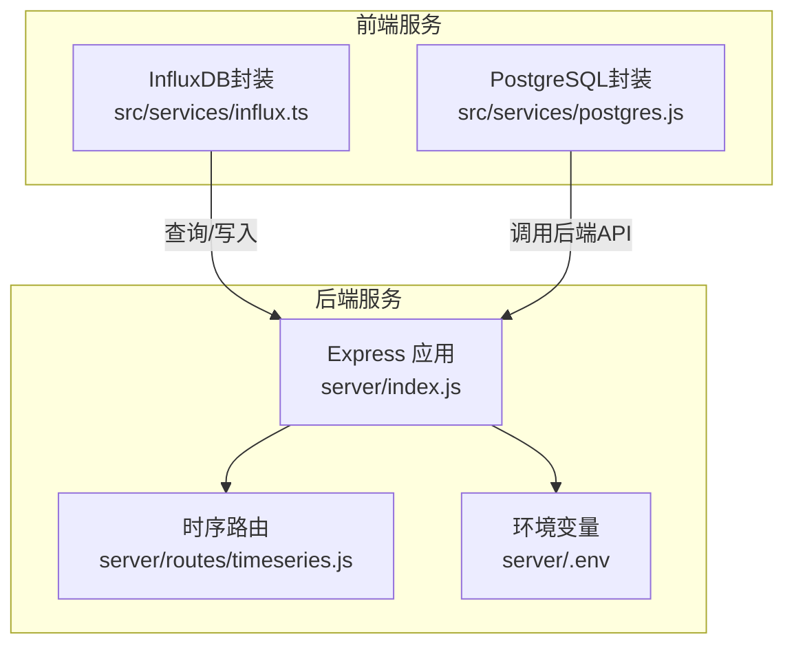
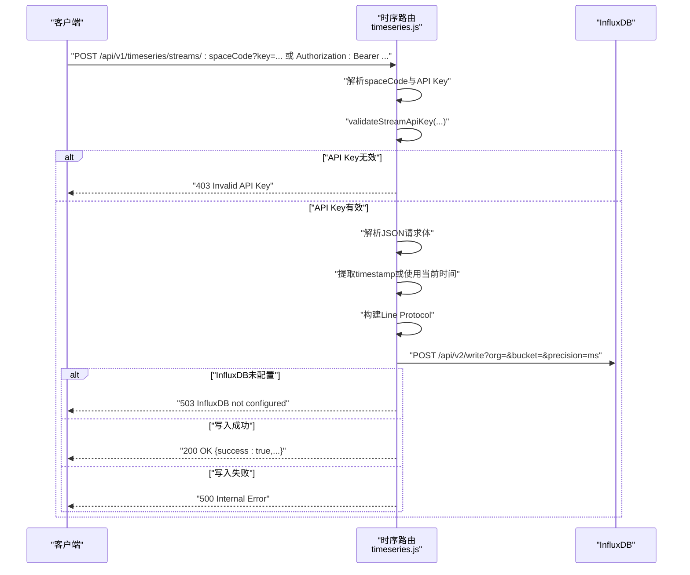
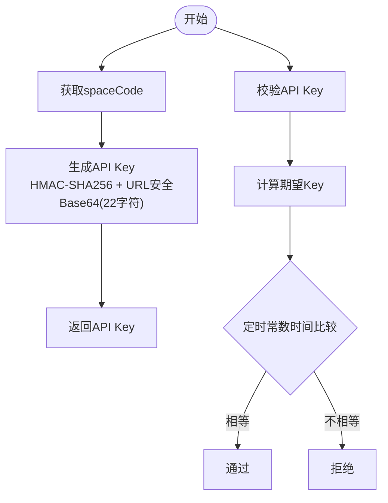
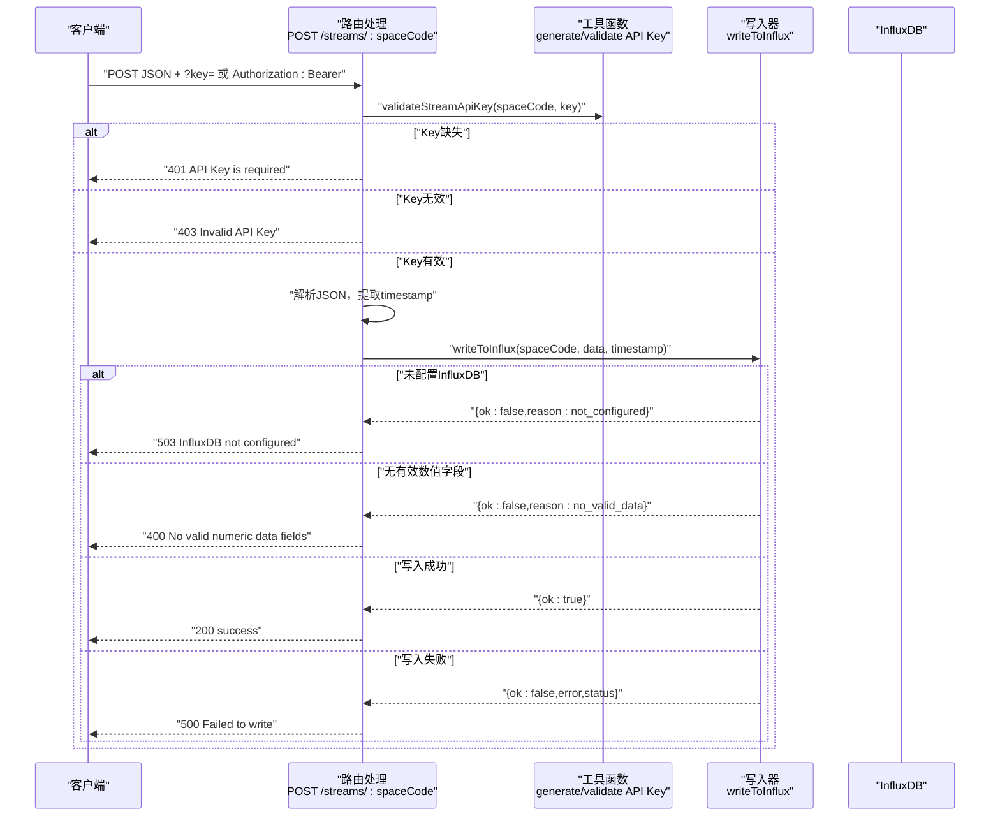
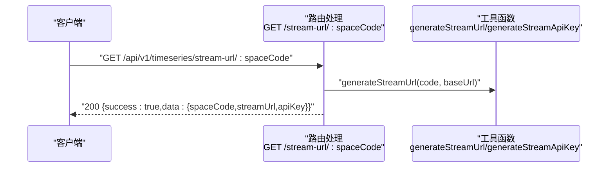
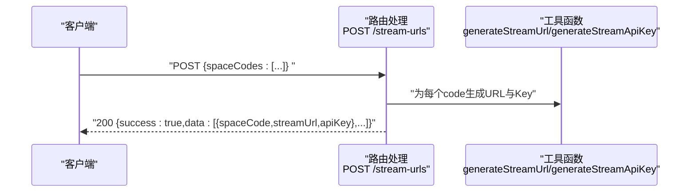
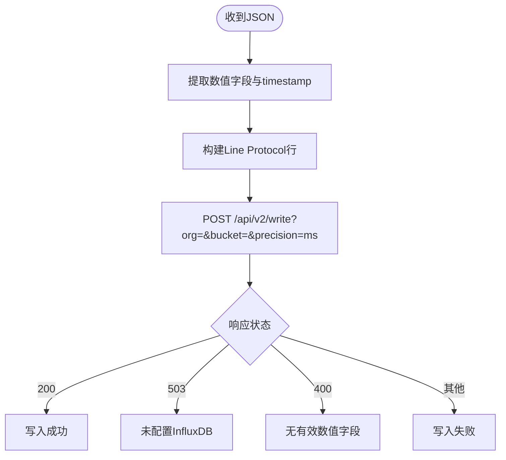
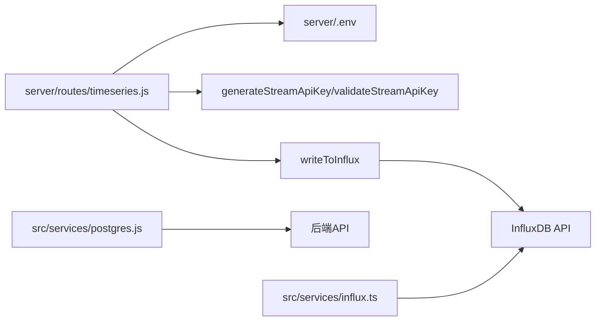

# 时序数据API

<cite>
**本文引用的文件**
- [server/index.js](file://server/index.js)
- [server/routes/timeseries.js](file://server/routes/timeseries.js)
- [server/.env](file://server/.env)
- [TIMESERIES_INGESTION.md](file://TIMESERIES_INGESTION.md)
- [src/services/influx.ts](file://src/services/influx.ts)
- [src/services/postgres.js](file://src/services/postgres.js)
</cite>

## 目录
1. [简介](#简介)
2. [项目结构](#项目结构)
3. [核心组件](#核心组件)
4. [架构总览](#架构总览)
5. [详细组件分析](#详细组件分析)
6. [依赖分析](#依赖分析)
7. [性能考虑](#性能考虑)
8. [故障排查指南](#故障排查指南)
9. [结论](#结论)
10. [附录](#附录)

## 简介
本文件面向“时序数据API”的使用者与维护者，聚焦以下目标：
- 详述与InfluxDB的集成方式与数据写入流程
- 说明基于HMAC-SHA256的API Key生成与校验机制
- 详解POST /api/v1/timeseries/streams/:spaceCode的请求与响应
- 说明JSON请求体格式、时间戳处理与Line Protocol转换规则
- 说明GET /api/v1/timeseries/stream-url/:spaceCode与POST /api/v1/timeseries/stream-urls的实现与用途
- 提供curl调用示例与常见错误处理（401未授权、403无效Key、503未配置InfluxDB等）

## 项目结构
后端采用Express服务，路由挂载在/api/v1/timeseries下；InfluxDB配置来自环境变量；前端通过src/services/influx.ts封装了查询与写入能力（用于UI侧图表展示），而本节重点的时序数据写入端点位于server/routes/timeseries.js。

**图表来源**
- [server/index.js](file://server/index.js#L44-L48)
- [server/routes/timeseries.js](file://server/routes/timeseries.js#L1-L263)
- [server/.env](file://server/.env#L1-L19)
- [src/services/influx.ts](file://src/services/influx.ts#L1-L136)
- [src/services/postgres.js](file://src/services/postgres.js#L1-L245)

**章节来源**
- [server/index.js](file://server/index.js#L44-L48)
- [server/routes/timeseries.js](file://server/routes/timeseries.js#L1-L263)
- [server/.env](file://server/.env#L1-L19)
- [src/services/influx.ts](file://src/services/influx.ts#L1-L136)
- [src/services/postgres.js](file://src/services/postgres.js#L1-L245)

## 核心组件
- API Key生成与校验
  - 生成函数：基于空间编码与服务器密钥生成HMAC-SHA256，返回URL安全Base64编码（22字符）
  - 校验函数：使用定时常数时间比较，避免时序攻击
- 数据写入InfluxDB
  - 将JSON中的数值字段转换为Line Protocol，写入指定组织与桶
  - 支持毫秒级时间戳，若未提供则使用当前时间
- URL生成
  - 单个空间：生成包含API Key的完整Stream URL
  - 批量空间：根据spaceCodes数组批量生成URL与API Key

**章节来源**
- [server/routes/timeseries.js](file://server/routes/timeseries.js#L23-L39)
- [server/routes/timeseries.js](file://server/routes/timeseries.js#L45-L49)
- [server/routes/timeseries.js](file://server/routes/timeseries.js#L54-L104)
- [server/routes/timeseries.js](file://server/routes/timeseries.js#L125-L206)
- [server/routes/timeseries.js](file://server/routes/timeseries.js#L212-L260)

## 架构总览
时序数据写入端点的调用链如下：客户端发起HTTP请求，后端路由解析参数与认证信息，校验API Key后解析JSON数据，转换为Line Protocol并写入InfluxDB，最终返回结构化响应。

**图表来源**
- [server/routes/timeseries.js](file://server/routes/timeseries.js#L125-L206)
- [server/routes/timeseries.js](file://server/routes/timeseries.js#L54-L104)
- [server/.env](file://server/.env#L11-L16)

## 详细组件分析

### API Key生成与校验
- 生成算法
  - 输入：空间编码
  - 过程：HMAC-SHA256(API_KEY_SECRET, spaceCode)，输出URL安全Base64编码，截取22字符
- 校验策略
  - 期望值：generateStreamApiKey(spaceCode)
  - 实际值：截取提供的Key前22字符
  - 使用定时常数时间比较，避免时序攻击
- 安全建议
  - 生产环境应替换默认API_KEY_SECRET
  - 建议使用HTTPS传输，防止中间人窃听

**图表来源**
- [server/routes/timeseries.js](file://server/routes/timeseries.js#L23-L39)

**章节来源**
- [server/routes/timeseries.js](file://server/routes/timeseries.js#L23-L39)
- [server/.env](file://server/.env#L17-L19)

### POST /api/v1/timeseries/streams/:spaceCode
- 功能
  - 接收JSON格式时序数据，写入InfluxDB
  - 支持两种认证方式：查询参数?key=... 或 Authorization: Bearer ...
- 请求
  - 方法：POST
  - 路径：/api/v1/timeseries/streams/:spaceCode
  - 认证：?key=xxx 或 Authorization: Bearer xxx
  - 请求体：JSON对象，数值型字段会被写入，可选timestamp（毫秒）
- 处理流程
  - 解析spaceCode与API Key
  - 校验API Key（401/403）
  - 解析JSON并过滤非数值字段
  - 生成Line Protocol（measurement=字段名，tag=room与code，field=value，timestamp）
  - 写入InfluxDB（503当未配置，400当无有效数值字段，500当写入异常）
- 响应
  - 成功：200，包含success、message、spaceCode、fieldsWritten
  - 未授权：401，提示需要API Key
  - 无效Key：403，提示无效Key
  - 无有效数据：400，提示无有效数值字段
  - 未配置InfluxDB：503
  - 其他错误：500

**图表来源**
- [server/routes/timeseries.js](file://server/routes/timeseries.js#L125-L206)
- [server/routes/timeseries.js](file://server/routes/timeseries.js#L54-L104)

**章节来源**
- [server/routes/timeseries.js](file://server/routes/timeseries.js#L125-L206)
- [server/routes/timeseries.js](file://server/routes/timeseries.js#L54-L104)
- [TIMESERIES_INGESTION.md](file://TIMESERIES_INGESTION.md#L16-L37)

### GET /api/v1/timeseries/stream-url/:spaceCode
- 功能
  - 生成单个空间的Stream URL与对应API Key
- 请求
  - 方法：GET
  - 路径：/api/v1/timeseries/stream-url/:spaceCode
- 响应
  - 包含success、data.spaceCode、data.streamUrl、data.apiKey

**图表来源**
- [server/routes/timeseries.js](file://server/routes/timeseries.js#L212-L229)
- [server/routes/timeseries.js](file://server/routes/timeseries.js#L45-L49)

**章节来源**
- [server/routes/timeseries.js](file://server/routes/timeseries.js#L212-L229)
- [server/routes/timeseries.js](file://server/routes/timeseries.js#L45-L49)

### POST /api/v1/timeseries/stream-urls
- 功能
  - 批量生成多个空间的Stream URL与API Key
- 请求
  - 方法：POST
  - 路径：/api/v1/timeseries/stream-urls
  - 请求体：{ spaceCodes: ["CODE1","CODE2",...] }
- 响应
  - 包含success与data数组，每项包含spaceCode、streamUrl、apiKey

**图表来源**
- [server/routes/timeseries.js](file://server/routes/timeseries.js#L237-L260)
- [server/routes/timeseries.js](file://server/routes/timeseries.js#L45-L49)

**章节来源**
- [server/routes/timeseries.js](file://server/routes/timeseries.js#L237-L260)
- [server/routes/timeseries.js](file://server/routes/timeseries.js#L45-L49)

### 数据写入InfluxDB（Line Protocol）
- 转换规则
  - measurement = JSON字段名
  - tag = room与code，值为转义后的spaceCode
  - field = value，值为数值
  - timestamp = 毫秒时间戳
- 写入行为
  - 若未配置INFLUX_TOKEN，返回503
  - 若无有效数值字段，返回400
  - 写入成功返回200，否则返回500并附带错误信息

**图表来源**
- [server/routes/timeseries.js](file://server/routes/timeseries.js#L54-L104)
- [server/.env](file://server/.env#L11-L16)

**章节来源**
- [server/routes/timeseries.js](file://server/routes/timeseries.js#L54-L104)
- [server/.env](file://server/.env#L11-L16)

### InfluxDB集成（前端封装）
- 前端通过src/services/influx.ts封装了写入与查询能力，便于UI侧图表展示
- 与后端时序写入端点互补：后端负责接收与入库，前端负责查询与可视化

**章节来源**
- [src/services/influx.ts](file://src/services/influx.ts#L1-L136)

## 依赖分析
- 时序路由依赖
  - 环境变量：INFLUX_URL、INFLUX_ORG、INFLUX_BUCKET、INFLUX_TOKEN、API_KEY_SECRET
  - 工具函数：generateStreamApiKey、validateStreamApiKey、generateStreamUrl
  - 写入器：writeToInflux
- 前后端交互
  - 前端通过src/services/postgres.js调用后端API（非时序写入）
  - 时序写入直接调用InfluxDB API

**图表来源**
- [server/routes/timeseries.js](file://server/routes/timeseries.js#L1-L263)
- [server/.env](file://server/.env#L11-L19)
- [src/services/postgres.js](file://src/services/postgres.js#L1-L245)
- [src/services/influx.ts](file://src/services/influx.ts#L1-L136)

**章节来源**
- [server/routes/timeseries.js](file://server/routes/timeseries.js#L1-L263)
- [server/.env](file://server/.env#L11-L19)
- [src/services/postgres.js](file://src/services/postgres.js#L1-L245)
- [src/services/influx.ts](file://src/services/influx.ts#L1-L136)

## 性能考虑
- 写入性能
  - 单次请求写入多字段时，Line Protocol合并为多行文本一次提交，减少网络往返
  - 时间戳精度为毫秒，避免额外转换开销
- 认证与校验
  - HMAC生成与校验均为常量时间操作，降低时序攻击风险
- 并发与限流
  - 建议在网关或反向代理层实施速率限制，防止滥用
- 数据清洗
  - 仅接受数值字段，非数值字段被忽略，减少无效写入

[本节为通用指导，无需具体文件引用]

## 故障排查指南
- 401 未授权
  - 缺少API Key（查询参数或Authorization头）
  - 检查是否正确传递?key=...或Authorization: Bearer ...
- 403 无效Key
  - Key长度或格式不符（仅前22字符参与比较）
  - 确认spaceCode与API_KEY_SECRET一致
- 400 无有效数值字段
  - 请求体为空或不含数值字段
  - 确保至少有一个数值字段，可选timestamp
- 503 未配置InfluxDB
  - INFLUX_TOKEN未设置
  - 检查server/.env中的INFLUX_*配置
- 500 写入失败
  - InfluxDB不可达或返回错误
  - 查看后端日志与InfluxDB返回的具体错误信息

**章节来源**
- [server/routes/timeseries.js](file://server/routes/timeseries.js#L138-L206)
- [server/.env](file://server/.env#L11-L16)

## 结论
本时序数据API通过HMAC-SHA256生成与校验API Key，保障了数据写入端点的安全性；将JSON数值字段转换为Line Protocol并写入InfluxDB，实现了高效、可查询的时序数据存储。配合Stream URL生成与批量生成接口，便于外部系统快速接入与复制使用。建议在生产环境强化密钥管理与传输安全，并在网关层实施必要的限流与监控。

[本节为总结，无需具体文件引用]

## 附录

### 端点清单与示例
- POST /api/v1/timeseries/streams/:spaceCode
  - 认证：?key=xxx 或 Authorization: Bearer xxx
  - 请求体：JSON对象，数值字段+可选timestamp
  - curl示例：参考文档中的示例命令
- GET /api/v1/timeseries/stream-url/:spaceCode
  - 响应：包含streamUrl与apiKey
- POST /api/v1/timeseries/stream-urls
  - 请求体：{ spaceCodes: [...] }
  - 响应：批量URL与Key

**章节来源**
- [TIMESERIES_INGESTION.md](file://TIMESERIES_INGESTION.md#L16-L66)
- [server/routes/timeseries.js](file://server/routes/timeseries.js#L125-L260)

### 配置说明
- InfluxDB配置（server/.env）
  - INFLUX_URL、INFLUX_ORG、INFLUX_BUCKET、INFLUX_TOKEN
- API Key密钥（server/.env）
  - API_KEY_SECRET（建议替换默认值）

**章节来源**
- [server/.env](file://server/.env#L11-L19)