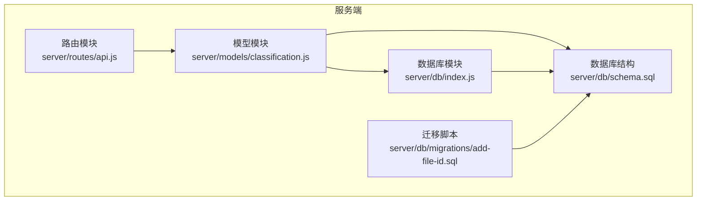
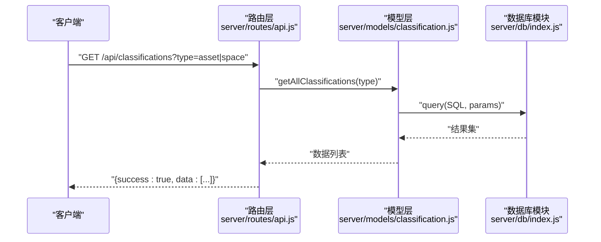
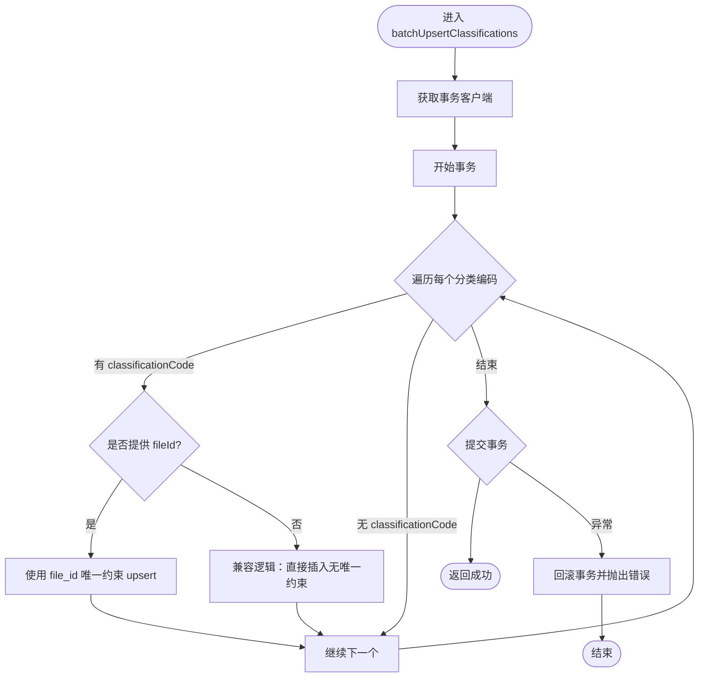
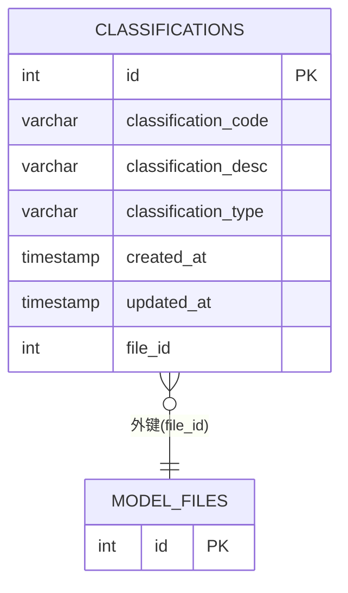
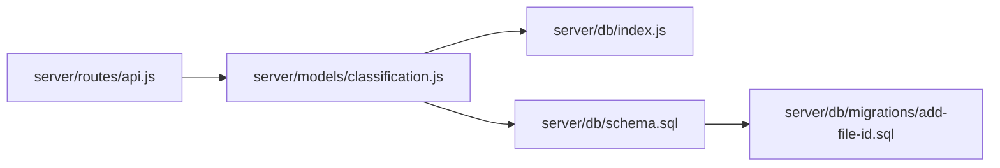

# 分类编码API

<cite>
**本文引用的文件**
- [server/routes/api.js](file://server/routes/api.js)
- [server/models/classification.js](file://server/models/classification.js)
- [server/db/schema.sql](file://server/db/schema.sql)
- [server/db/index.js](file://server/db/index.js)
- [server/db/migrations/add-file-id.sql](file://server/db/migrations/add-file-id.sql)
</cite>

## 目录
1. [简介](#简介)
2. [项目结构](#项目结构)
3. [核心组件](#核心组件)
4. [架构总览](#架构总览)
5. [详细组件分析](#详细组件分析)
6. [依赖分析](#依赖分析)
7. [性能考虑](#性能考虑)
8. [故障排查指南](#故障排查指南)
9. [结论](#结论)
10. [附录](#附录)

## 简介
本文件聚焦于分类编码API，详细说明以下两个端点：
- GET /api/classifications：获取所有分类编码，支持通过type查询参数进行过滤（值域为“asset”或“space”），返回响应结构包含成功标志与数据列表。
- POST /api/classifications/batch：批量导入分类编码，请求体需要包含数组字段classifications；后端模型层batchUpsertClassifications负责事务化插入/更新，并支持通过fileId关联到特定模型文件。

文档还结合代码示例路径，给出HTTP方法、请求路径、参数格式与响应结构说明，并提供curl调用示例。同时解释后端模型层batchUpsertClassifications如何处理数据插入和更新，包括fileId关联逻辑与错误处理机制。

## 项目结构
分类编码API位于服务端路由模块中，对应的数据访问由模型层实现，数据库结构在schema中定义，连接池与事务管理由数据库模块提供。

图表来源
- [server/routes/api.js](file://server/routes/api.js#L1-L60)
- [server/models/classification.js](file://server/models/classification.js#L1-L119)
- [server/db/schema.sql](file://server/db/schema.sql#L1-L160)
- [server/db/index.js](file://server/db/index.js#L1-L70)
- [server/db/migrations/add-file-id.sql](file://server/db/migrations/add-file-id.sql#L1-L51)

章节来源
- [server/routes/api.js](file://server/routes/api.js#L1-L60)
- [server/models/classification.js](file://server/models/classification.js#L1-L119)
- [server/db/schema.sql](file://server/db/schema.sql#L1-L160)
- [server/db/index.js](file://server/db/index.js#L1-L70)
- [server/db/migrations/add-file-id.sql](file://server/db/migrations/add-file-id.sql#L1-L51)

## 核心组件
- 路由层：提供GET /api/classifications与POST /api/classifications/batch两个端点，负责参数解析、请求体校验与响应封装。
- 模型层：提供批量插入/更新分类编码的方法，支持fileId关联与事务控制。
- 数据库层：提供连接池、事务客户端与SQL执行能力；schema定义了分类编码表及索引；迁移脚本为表添加file_id列并调整唯一约束。

章节来源
- [server/routes/api.js](file://server/routes/api.js#L1-L60)
- [server/models/classification.js](file://server/models/classification.js#L1-L119)
- [server/db/schema.sql](file://server/db/schema.sql#L1-L160)
- [server/db/index.js](file://server/db/index.js#L1-L70)
- [server/db/migrations/add-file-id.sql](file://server/db/migrations/add-file-id.sql#L1-L51)

## 架构总览
分类编码API的调用链路如下：
- 客户端发起HTTP请求至路由层
- 路由层解析参数/请求体，调用模型层方法
- 模型层通过数据库模块获取事务客户端，执行批量插入/更新
- 数据库模块执行SQL并返回结果，模型层提交事务或回滚
- 路由层将结果封装为统一响应格式返回

图表来源
- [server/routes/api.js](file://server/routes/api.js#L18-L31)
- [server/models/classification.js](file://server/models/classification.js#L83-L111)
- [server/db/index.js](file://server/db/index.js#L40-L51)

## 详细组件分析

### GET /api/classifications
- HTTP方法：GET
- 请求路径：/api/classifications
- 查询参数：
  - type：可选字符串，支持“asset”或“space”，用于过滤分类类型
- 请求示例（curl）
  - curl -i "http://localhost:3000/api/classifications?type=asset"
  - curl -i "http://localhost:3000/api/classifications?type=space"
  - curl -i "http://localhost:3000/api/classifications"
- 响应结构
  - 成功时返回：{ success: true, data: [ ... ] }
  - 失败时返回：{ success: false, error: "..." }
- 实现要点
  - 路由层读取type查询参数并传递给模型层
  - 模型层根据type动态拼接WHERE条件，最终按分类编码排序返回
  - 错误处理：捕获异常并返回500与错误信息

章节来源
- [server/routes/api.js](file://server/routes/api.js#L18-L31)
- [server/models/classification.js](file://server/models/classification.js#L83-L111)

### POST /api/classifications/batch
- HTTP方法：POST
- 请求路径：/api/classifications/batch
- 请求体格式
  - JSON对象，包含字段：classifications（数组）
  - 数组元素为分类编码对象，至少包含以下字段：
    - classificationCode：分类编码（字符串）
    - classificationDesc：分类描述（字符串，可为空）
    - classificationType：分类类型（字符串，值为“asset”或“space”）
  - 可选字段：fileId（数字，用于关联到特定模型文件）
- 请求示例（curl）
  - curl -X POST "http://localhost:3000/api/classifications/batch" -H "Content-Type: application/json" -d '{"classifications":[{"classificationCode":"12.34","classificationDesc":"示例描述","classificationType":"asset","fileId":1}]}'
- 响应结构
  - 成功时返回：{ success: true, message: "成功导入 N 条分类编码" }
  - 失败时返回：{ success: false, error: "..." }
- 参数验证
  - 路由层对请求体进行基础校验：必须存在classifications数组，否则返回400
- 事务处理机制
  - 模型层使用数据库事务包裹批量操作，逐条执行插入/更新，遇到异常自动回滚
  - 支持fileId关联：当提供fileId时，使用file_id唯一约束进行upsert；当未提供fileId时，采用兼容逻辑插入
- 错误处理
  - 路由层捕获异常并返回500
  - 模型层在事务内捕获异常并回滚，随后抛出错误供上层处理

章节来源
- [server/routes/api.js](file://server/routes/api.js#L32-L47)
- [server/models/classification.js](file://server/models/classification.js#L35-L81)
- [server/db/index.js](file://server/db/index.js#L40-L59)

### 后端模型层：batchUpsertClassifications
- 功能概述
  - 在单个事务中批量插入或更新分类编码记录
  - 支持两种模式：
    - 带fileId：使用(file_id, classification_code)唯一约束进行upsert
    - 不带fileId：兼容旧逻辑，直接插入（无唯一约束时可能产生重复数据，但不报错）
- 数据结构与复杂度
  - 输入：数组，长度为N
  - 时间复杂度：O(N)，逐条执行SQL
  - 空间复杂度：O(1)
- 依赖关系
  - 依赖数据库模块getClient获取事务客户端
  - 依赖schema定义的表结构与索引
- 事务与并发
  - 使用BEGIN/COMMIT包裹循环，异常则ROLLBACK
  - 通过唯一约束避免重复插入
- 错误处理
  - 捕获异常并回滚，随后抛出错误
  - 路由层捕获并返回500

图表来源
- [server/models/classification.js](file://server/models/classification.js#L35-L81)
- [server/db/schema.sql](file://server/db/schema.sql#L1-L160)
- [server/db/migrations/add-file-id.sql](file://server/db/migrations/add-file-id.sql#L1-L51)

章节来源
- [server/models/classification.js](file://server/models/classification.js#L35-L81)
- [server/db/schema.sql](file://server/db/schema.sql#L1-L160)
- [server/db/migrations/add-file-id.sql](file://server/db/migrations/add-file-id.sql#L1-L51)

### 数据模型与表结构
- 分类编码表（classifications）
  - 主键：id
  - 唯一性：(file_id, classification_code)（迁移后）
  - 字段：classification_code、classification_desc、classification_type、created_at、updated_at
  - 索引：按classification_code与classification_type建立索引
- 迁移影响
  - 为classifications添加file_id列并建立外键约束
  - 将唯一约束从(classification_code, classification_type)调整为(file_id, classification_code)
  - 新增file_id相关索引

图表来源
- [server/db/schema.sql](file://server/db/schema.sql#L1-L160)
- [server/db/migrations/add-file-id.sql](file://server/db/migrations/add-file-id.sql#L1-L51)

章节来源
- [server/db/schema.sql](file://server/db/schema.sql#L1-L160)
- [server/db/migrations/add-file-id.sql](file://server/db/migrations/add-file-id.sql#L1-L51)

## 依赖分析
- 路由层依赖模型层提供的方法
- 模型层依赖数据库模块的query与事务客户端
- 数据库模块依赖PostgreSQL连接池
- schema与迁移脚本定义了表结构与唯一约束，直接影响upsert行为

图表来源
- [server/routes/api.js](file://server/routes/api.js#L1-L60)
- [server/models/classification.js](file://server/models/classification.js#L1-L119)
- [server/db/index.js](file://server/db/index.js#L1-L70)
- [server/db/schema.sql](file://server/db/schema.sql#L1-L160)
- [server/db/migrations/add-file-id.sql](file://server/db/migrations/add-file-id.sql#L1-L51)

章节来源
- [server/routes/api.js](file://server/routes/api.js#L1-L60)
- [server/models/classification.js](file://server/models/classification.js#L1-L119)
- [server/db/index.js](file://server/db/index.js#L1-L70)
- [server/db/schema.sql](file://server/db/schema.sql#L1-L160)
- [server/db/migrations/add-file-id.sql](file://server/db/migrations/add-file-id.sql#L1-L51)

## 性能考虑
- 批量导入采用事务包裹，减少多次往返开销
- 使用ON CONFLICT upsert避免重复插入，提升写入效率
- 为分类编码表建立索引，优化查询与唯一约束检查
- 当未提供fileId时，兼容逻辑直接插入，避免额外查询；若后续需要严格去重，可在业务层增加预检或调整约束策略

## 故障排查指南
- GET /api/classifications
  - 若返回500，请检查数据库连接与查询语句
  - 确认type参数仅允许“asset”或“space”
- POST /api/classifications/batch
  - 若返回400，请确认请求体包含classifications数组
  - 若返回500，请查看服务器日志中的错误堆栈，定位具体SQL或约束冲突
  - 当提供fileId时，确认该file_id在model_files中存在且未被删除
- 事务相关
  - 若出现部分写入，检查是否有异常导致回滚
  - 确保数据库连接池配置合理，避免超时

章节来源
- [server/routes/api.js](file://server/routes/api.js#L18-L47)
- [server/models/classification.js](file://server/models/classification.js#L35-L81)
- [server/db/index.js](file://server/db/index.js#L1-L70)

## 结论
分类编码API提供了两类关键能力：按类型筛选的查询与批量导入。模型层通过事务与唯一约束保障数据一致性，迁移脚本使分类编码具备按文件维度的关联能力。建议在生产环境中：
- 对请求体进行严格的字段校验与边界检查
- 在批量导入前对输入数据进行去重与合法性预检
- 结合监控与日志，及时发现并处理异常

## 附录
- curl调用示例（不含具体代码内容）
  - 获取全部分类编码：curl -i "http://localhost:3000/api/classifications"
  - 按类型过滤：curl -i "http://localhost:3000/api/classifications?type=asset"
  - 批量导入：curl -X POST "http://localhost:3000/api/classifications/batch" -H "Content-Type: application/json" -d '{"classifications":[{"classificationCode":"12.34","classificationDesc":"示例描述","classificationType":"asset","fileId":1}]}'