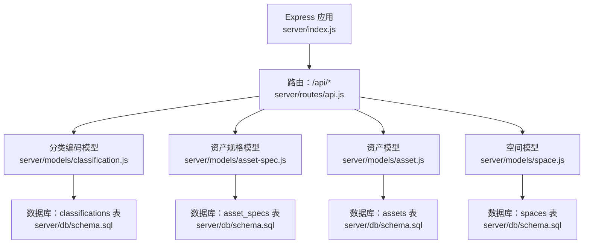
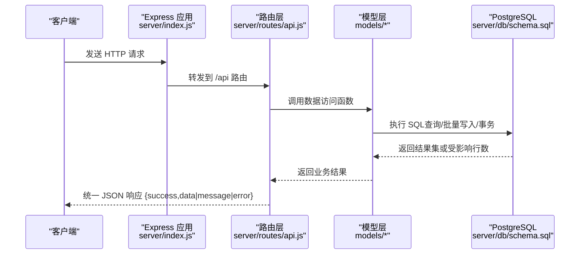
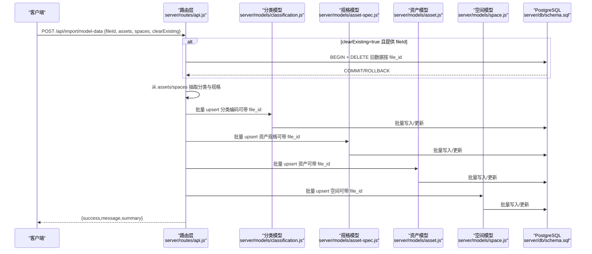
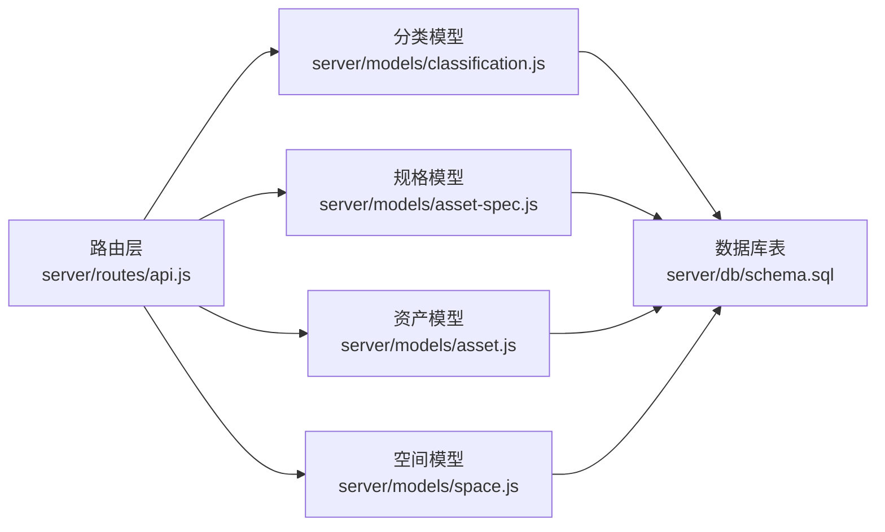

# 核心数据API

<cite>
**本文引用的文件**
- [server/index.js](file://server/index.js)
- [server/routes/api.js](file://server/routes/api.js)
- [server/models/classification.js](file://server/models/classification.js)
- [server/models/asset-spec.js](file://server/models/asset-spec.js)
- [server/models/asset.js](file://server/models/asset.js)
- [server/models/space.js](file://server/models/space.js)
- [server/db/schema.sql](file://server/db/schema.sql)
- [server/scripts/test-backend-api.js](file://server/scripts/test-backend-api.js)
</cite>

## 目录
1. [简介](#简介)
2. [项目结构](#项目结构)
3. [核心组件](#核心组件)
4. [架构总览](#架构总览)
5. [详细组件分析](#详细组件分析)
6. [依赖分析](#依赖分析)
7. [性能考虑](#性能考虑)
8. [故障排查指南](#故障排查指南)
9. [结论](#结论)
10. [附录](#附录)

## 简介
本文件面向后端与前端开发者，系统化梳理核心数据API，覆盖以下主题：
- 分类编码：GET /api/classifications 的 type 过滤、POST /api/classifications/batch 批量导入
- 资产规格：GET /api/asset-specs、GET /api/asset-specs/:code、POST /api/asset-specs/batch
- 资产：GET /api/assets、GET /api/assets/:code、GET /api/assets/floor/:floor、GET /api/assets/room/:room、PATCH /api/assets/:code、POST /api/assets/batch
- 空间：GET /api/spaces、GET /api/spaces/:code、GET /api/spaces/floor/:floor、PATCH /api/spaces/:code、POST /api/spaces/batch
- 综合导入：POST /api/import/model-data 的模型数据批量导入流程

同时提供各端点的 HTTP 方法、请求路径、参数格式、响应结构与 curl 示例，帮助快速集成与调试。

## 项目结构
后端采用 Express + PostgreSQL，API 路由集中在 routes/api.js，数据访问层在 models 下，数据库表结构在 db/schema.sql 中定义。

图表来源
- [server/index.js](file://server/index.js#L43-L49)
- [server/routes/api.js](file://server/routes/api.js#L1-L517)
- [server/models/classification.js](file://server/models/classification.js#L1-L119)
- [server/models/asset-spec.js](file://server/models/asset-spec.js#L1-L166)
- [server/models/asset.js](file://server/models/asset.js#L1-L253)
- [server/models/space.js](file://server/models/space.js#L1-L220)
- [server/db/schema.sql](file://server/db/schema.sql#L1-L160)

章节来源
- [server/index.js](file://server/index.js#L43-L49)
- [server/routes/api.js](file://server/routes/api.js#L1-L517)
- [server/db/schema.sql](file://server/db/schema.sql#L1-L160)

## 核心组件
- 路由层：集中定义 /api 下所有核心数据接口，统一返回 { success, data|message|error } 结构
- 模型层：封装 SQL 查询、批量写入、事务控制与唯一性约束处理
- 数据层：classifications、asset_specs、assets、spaces 四张表，含索引与更新时间触发器

章节来源
- [server/routes/api.js](file://server/routes/api.js#L1-L517)
- [server/models/classification.js](file://server/models/classification.js#L1-L119)
- [server/models/asset-spec.js](file://server/models/asset-spec.js#L1-L166)
- [server/models/asset.js](file://server/models/asset.js#L1-L253)
- [server/models/space.js](file://server/models/space.js#L1-L220)
- [server/db/schema.sql](file://server/db/schema.sql#L1-L160)

## 架构总览
后端通过 Express 提供 RESTful 接口，路由层负责参数解析与错误处理，模型层负责数据库交互，数据库层采用 PostgreSQL 并建立必要索引提升查询性能。

图表来源
- [server/index.js](file://server/index.js#L43-L49)
- [server/routes/api.js](file://server/routes/api.js#L1-L517)
- [server/models/classification.js](file://server/models/classification.js#L1-L119)
- [server/models/asset-spec.js](file://server/models/asset-spec.js#L1-L166)
- [server/models/asset.js](file://server/models/asset.js#L1-L253)
- [server/models/space.js](file://server/models/space.js#L1-L220)
- [server/db/schema.sql](file://server/db/schema.sql#L1-L160)

## 详细组件分析

### 分类编码 API
- GET /api/classifications
  - 功能：获取所有分类编码，支持按 type 过滤（可选值：asset、space）
  - 查询参数：type（字符串，可选）
  - 响应：{ success: true, data: [分类记录...] }
  - 实现要点：模型层按 type 条件查询并排序
- POST /api/classifications/batch
  - 功能：批量导入分类编码
  - 请求体：{ classifications: [ { classificationCode, classificationDesc, classificationType }, ... ] }
  - 响应：{ success: true, message: "成功导入 N 条分类编码" }
  - 实现要点：模型层批量 upsert，支持 file_id 关联（当导入来自模型文件时）

章节来源
- [server/routes/api.js](file://server/routes/api.js#L18-L47)
- [server/models/classification.js](file://server/models/classification.js#L31-L119)
- [server/db/schema.sql](file://server/db/schema.sql#L6-L16)

### 资产规格 API
- GET /api/asset-specs
  - 功能：获取所有资产规格
  - 响应：{ success: true, data: [规格记录...] }
- GET /api/asset-specs/:code
  - 功能：根据规格编码查询单个规格
  - 路径参数：:code（规格编码）
  - 响应：{ success: true, data: 规格记录 }；若不存在返回 404
- POST /api/asset-specs/batch
  - 功能：批量导入资产规格
  - 请求体：{ specs: [ { specCode, specName, classificationCode, classificationDesc, category, family, type, manufacturer, address, phone }, ... ] }
  - 响应：{ success: true, message: "成功导入 N 条资产规格" }

章节来源
- [server/routes/api.js](file://server/routes/api.js#L53-L97)
- [server/models/asset-spec.js](file://server/models/asset-spec.js#L1-L166)
- [server/db/schema.sql](file://server/db/schema.sql#L18-L36)

### 资产 API
- GET /api/assets
  - 功能：获取所有资产（自动左连接资产规格）
  - 响应：{ success: true, data: [资产记录...] }
- GET /api/assets/:code
  - 功能：根据资产编码查询单个资产
  - 路径参数：:code（资产编码）
  - 响应：{ success: true, data: 资产记录 }；若不存在返回 404
- GET /api/assets/floor/:floor
  - 功能：按楼层查询资产
  - 路径参数：:floor（楼层）
  - 响应：{ success: true, data: [资产记录...] }
- GET /api/assets/room/:room
  - 功能：按房间查询资产
  - 路径参数：:room（房间）
  - 响应：{ success: true, data: [资产记录...] }
- PATCH /api/assets/:code
  - 功能：更新资产属性
  - 允许字段：spec_code、name、floor、room
  - 响应：{ success: true, message: "资产更新成功" }
- POST /api/assets/batch
  - 功能：批量导入资产
  - 请求体：{ assets: [ { assetCode, specCode, name, floor, room, dbId }, ... ] }
  - 响应：{ success: true, message: "成功导入 N 条资产" }

章节来源
- [server/routes/api.js](file://server/routes/api.js#L103-L201)
- [server/models/asset.js](file://server/models/asset.js#L1-L253)
- [server/db/schema.sql](file://server/db/schema.sql#L38-L52)

### 空间 API
- GET /api/spaces
  - 功能：获取所有空间
  - 响应：{ success: true, data: [空间记录...] }
- GET /api/spaces/:code
  - 功能：根据空间编码查询单个空间
  - 路径参数：:code（空间编码）
  - 响应：{ success: true, data: 空间记录 }；若不存在返回 404
- GET /api/spaces/floor/:floor
  - 功能：按楼层查询空间
  - 路径参数：:floor（楼层）
  - 响应：{ success: true, data: [空间记录...] }
- PATCH /api/spaces/:code
  - 功能：更新空间属性
  - 允许字段：name、classificationCode、classificationDesc、floor、area、perimeter
  - 响应：{ success: true, message: "空间更新成功" }
- POST /api/spaces/batch
  - 功能：批量导入空间
  - 请求体：{ spaces: [ { spaceCode, name, classificationCode, classificationDesc, floor, area, perimeter, dbId }, ... ] }
  - 响应：{ success: true, message: "成功导入 N 条空间" }

章节来源
- [server/routes/api.js](file://server/routes/api.js#L207-L291)
- [server/models/space.js](file://server/models/space.js#L1-L220)
- [server/db/schema.sql](file://server/db/schema.sql#L54-L70)

### 综合导入 API：POST /api/import/model-data
- 功能：从模型提取的数据进行综合批量导入，自动处理分类编码、资产规格、资产与空间
- 请求体：
  - fileId: number（可选，用于关联到特定模型文件）
  - assets: 对象数组（从模型提取的资产数据）
  - spaces: 对象数组（从模型提取的空间数据）
  - clearExisting: boolean（可选，true 时按 fileId 清理旧数据）
- 处理流程：
  1) 若 clearExisting=true 且提供 fileId：按 fileId 清理旧数据（assets、spaces、asset_specs、classifications）
  2) 从 assets 提取分类编码与资产规格（去重），从 spaces 提取分类编码
  3) 批量保存分类编码（支持 file_id 关联）
  4) 批量保存资产规格（支持 file_id 关联）
  5) 批量保存资产（支持 file_id 关联）
  6) 批量保存空间（支持 file_id 关联）
  7) 返回成功响应与导入统计摘要
- 响应：{ success: true, message: "数据导入成功", summary: { classifications, specs, assets, spaces } }

图表来源
- [server/routes/api.js](file://server/routes/api.js#L297-L464)
- [server/models/classification.js](file://server/models/classification.js#L31-L81)
- [server/models/asset-spec.js](file://server/models/asset-spec.js#L104-L156)
- [server/models/asset.js](file://server/models/asset.js#L160-L200)
- [server/models/space.js](file://server/models/space.js#L127-L168)
- [server/db/schema.sql](file://server/db/schema.sql#L6-L16)

章节来源
- [server/routes/api.js](file://server/routes/api.js#L297-L464)

## 依赖分析
- 路由层依赖模型层，模型层依赖数据库连接与事务管理
- 资产与资产规格存在外键关系（assets.spec_code -> asset_specs.spec_code）
- 空间与资产规格无直接外键，但可通过 file_id 关联模型文件
- 数据表具备索引以优化常见查询（如 floor、room、classification_code 等）

图表来源
- [server/routes/api.js](file://server/routes/api.js#L1-L517)
- [server/models/classification.js](file://server/models/classification.js#L1-L119)
- [server/models/asset-spec.js](file://server/models/asset-spec.js#L1-L166)
- [server/models/asset.js](file://server/models/asset.js#L1-L253)
- [server/models/space.js](file://server/models/space.js#L1-L220)
- [server/db/schema.sql](file://server/db/schema.sql#L1-L160)

章节来源
- [server/db/schema.sql](file://server/db/schema.sql#L72-L96)

## 性能考虑
- 批量导入使用事务包裹，减少多次往返与锁竞争
- 建立了多处索引（如资产 floor、room，空间 classification、floor 等），建议在高频查询场景下继续评估复合索引
- 导入流程中对资产规格进行去重（按类型注释），避免重复写入
- 对于大规模导入，建议分批提交并监控内存占用

[本节为通用性能建议，无需具体文件引用]

## 故障排查指南
- 通用错误响应
  - 路由层统一返回 { success: false, error: "..." }，状态码依据错误类型设置
  - 常见错误：参数缺失（如批量导入缺少数组）、资源不存在（404）、数据库异常（500）
- 常见问题定位
  - 参数校验失败：检查请求体结构是否符合预期
  - 资源不存在：确认编码是否正确，或是否已导入
  - 批量导入失败：查看事务回滚日志，确认唯一性约束与外键关系
- 快速验证
  - 使用内置脚本进行基础 API 测试，观察返回数据长度与结构
  - 使用 curl 手动调用关键端点，逐步缩小问题范围

章节来源
- [server/routes/api.js](file://server/routes/api.js#L22-L30)
- [server/scripts/test-backend-api.js](file://server/scripts/test-backend-api.js#L1-L58)

## 结论
本核心数据API围绕“分类编码、资产规格、资产、空间”四大实体构建，提供完善的增删改查与批量导入能力。通过统一的路由层与模型层抽象，配合数据库索引与事务控制，能够满足中大型项目的集成需求。建议在生产环境中结合监控与日志，持续优化导入批大小与查询索引策略。

[本节为总结性内容，无需具体文件引用]

## 附录

### API 端点一览与示例
- 分类编码
  - GET /api/classifications?type=asset|space
  - POST /api/classifications/batch
    - 请求体：{ classifications: [ { classificationCode, classificationDesc, classificationType }, ... ] }
- 资产规格
  - GET /api/asset-specs
  - GET /api/asset-specs/:code
  - POST /api/asset-specs/batch
    - 请求体：{ specs: [ { specCode, specName, classificationCode, classificationDesc, category, family, type, manufacturer, address, phone }, ... ] }
- 资产
  - GET /api/assets
  - GET /api/assets/:code
  - GET /api/assets/floor/:floor
  - GET /api/assets/room/:room
  - PATCH /api/assets/:code
    - 请求体：{ spec_code?, name?, floor?, room? }
  - POST /api/assets/batch
    - 请求体：{ assets: [ { assetCode, specCode, name, floor, room, dbId }, ... ] }
- 空间
  - GET /api/spaces
  - GET /api/spaces/:code
  - GET /api/spaces/floor/:floor
  - PATCH /api/spaces/:code
    - 请求体：{ name?, classificationCode?, classificationDesc?, floor?, area?, perimeter? }
  - POST /api/spaces/batch
    - 请求体：{ spaces: [ { spaceCode, name, classificationCode, classificationDesc, floor, area, perimeter, dbId }, ... ] }
- 综合导入
  - POST /api/import/model-data
    - 请求体：{ fileId?, assets: [...], spaces: [...], clearExisting? }

### curl 调用示例
- 获取所有资产
  - curl -i http://localhost:3001/api/assets
- 根据资产编码查询
  - curl -i http://localhost:3001/api/assets/ASSET-CODE
- 按楼层查询资产
  - curl -i http://localhost:3001/api/assets/floor/FLOOR-NAME
- 按房间查询资产
  - curl -i http://localhost:3001/api/assets/room/ROOM-NAME
- 更新资产属性
  - curl -i -X PATCH http://localhost:3001/api/assets/ASSET-CODE -H "Content-Type: application/json" -d '{"floor":"2F","room":"201"}'
- 批量导入资产
  - curl -i -X POST http://localhost:3001/api/assets/batch -H "Content-Type: application/json" -d '{"assets":[{"assetCode":"ASSET-001","specCode":"SPEC-A","name":"设备A","floor":"1F","room":"101","dbId":123}]}'
- 获取所有空间
  - curl -i http://localhost:3001/api/spaces
- 根据空间编码查询
  - curl -i http://localhost:3001/api/spaces/SPACE-CODE
- 按楼层查询空间
  - curl -i http://localhost:3001/api/spaces/floor/FLOOR-NAME
- 更新空间属性
  - curl -i -X PATCH http://localhost:3001/api/spaces/SPACE-CODE -H "Content-Type: application/json" -d '{"area":120.5,"perimeter":45.2}'
- 批量导入空间
  - curl -i -X POST http://localhost:3001/api/spaces/batch -H "Content-Type: application/json" -d '{"spaces":[{"spaceCode":"SPACE-001","name":"会议室A","classificationCode":"C01","classificationDesc":"描述A","floor":"1F","area":120.5,"perimeter":45.2,"dbId":456}]}'
- 获取所有分类编码（按类型过滤）
  - curl -i "http://localhost:3001/api/classifications?type=asset"
- 批量导入分类编码
  - curl -i -X POST http://localhost:3001/api/classifications/batch -H "Content-Type: application/json" -d '{"classifications":[{"classificationCode":"OC21-001","classificationDesc":"描述1","classificationType":"asset"}]}'
- 获取所有资产规格
  - curl -i http://localhost:3001/api/asset-specs
- 根据规格编码查询
  - curl -i http://localhost:3001/api/asset-specs/SPEC-CODE
- 批量导入资产规格
  - curl -i -X POST http://localhost:3001/api/asset-specs/batch -H "Content-Type: application/json" -d '{"specs":[{"specCode":"SPEC-A","specName":"规格A","classificationCode":"OC21-001","classificationDesc":"OmniClass描述","category":"HVAC","family":"AirTerminal","type":"DuctTerminal","manufacturer":"MfgA","address":"地址A","phone":"123"}]}'
- 综合导入模型数据
  - curl -i -X POST http://localhost:3001/api/import/model-data -H "Content-Type: application/json" -d '{"fileId":1,"assets":[{"mcCode":"ASSET-001","typeComments":"SPEC-A","typeName":"类型A","omniClass21Number":"OC21-001","omniClass21Description":"OmniClass描述","category":"HVAC","family":"AirTerminal","type":"DuctTerminal","manufacturer":"MfgA","address":"地址A","name":"设备A","floor":"1F","room":"101","dbId":123}],"spaces":[{"spaceCode":"SPACE-001","name":"会议室A","classificationCode":"C01","classificationDesc":"描述A","floor":"1F","area":120.5,"perimeter":45.2,"dbId":456}],"clearExisting":false}'

章节来源
- [server/index.js](file://server/index.js#L56-L70)
- [server/routes/api.js](file://server/routes/api.js#L18-L47)
- [server/routes/api.js](file://server/routes/api.js#L53-L97)
- [server/routes/api.js](file://server/routes/api.js#L103-L201)
- [server/routes/api.js](file://server/routes/api.js#L207-L291)
- [server/routes/api.js](file://server/routes/api.js#L297-L464)