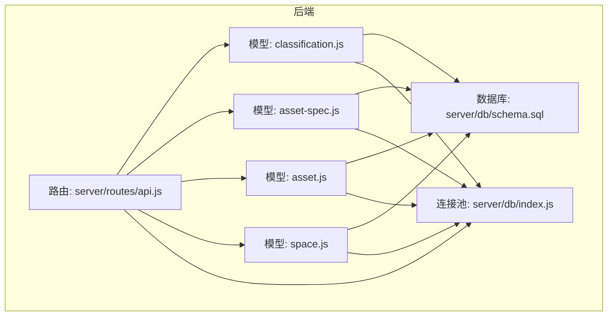
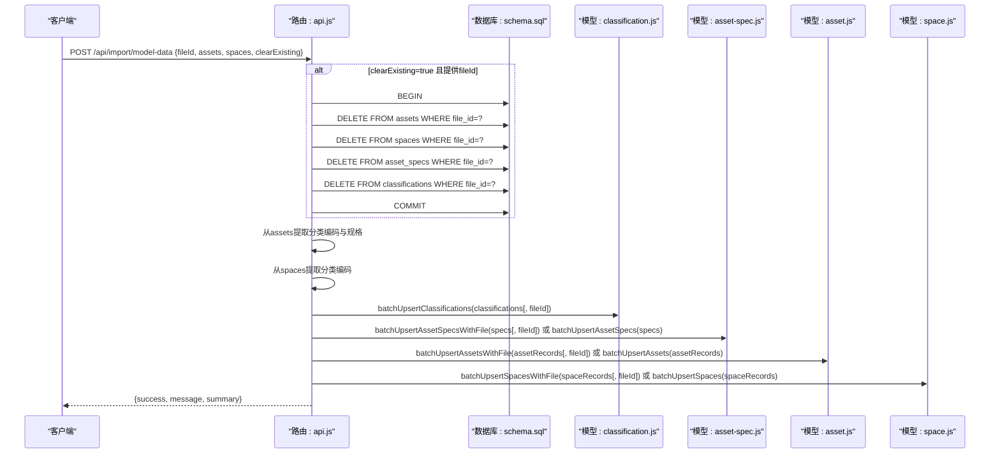
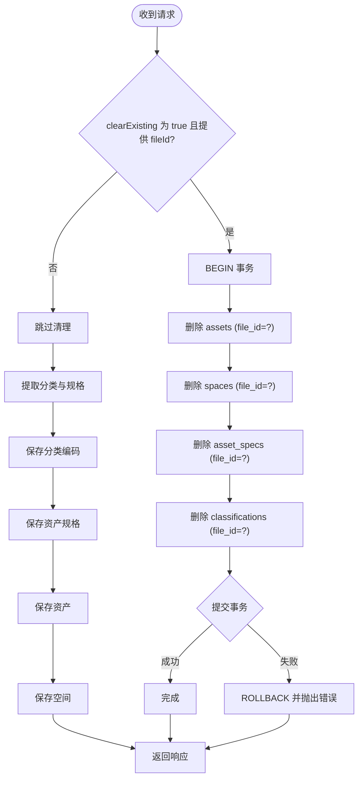
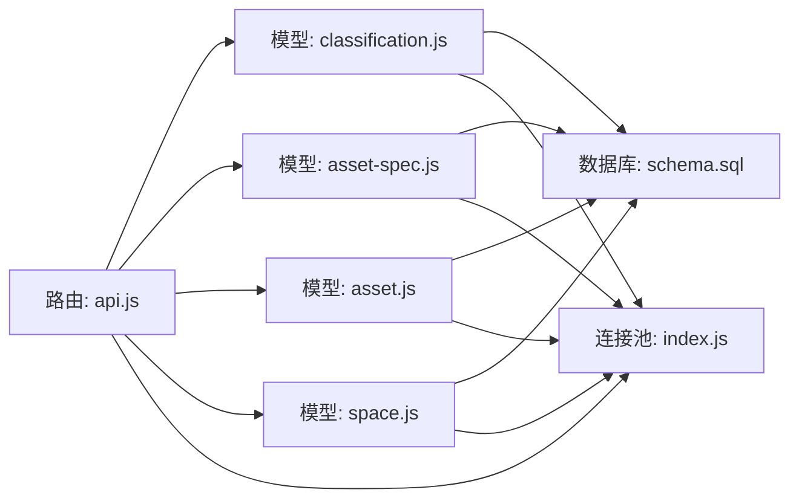

# 模型数据综合导入API

<cite>
**本文引用的文件**
- [server/routes/api.js](file://server/routes/api.js)
- [server/models/classification.js](file://server/models/classification.js)
- [server/models/asset-spec.js](file://server/models/asset-spec.js)
- [server/models/asset.js](file://server/models/asset.js)
- [server/models/space.js](file://server/models/space.js)
- [server/db/schema.sql](file://server/db/schema.sql)
- [server/db/index.js](file://server/db/index.js)
- [server/README.md](file://server/README.md)
- [server/index.js](file://server/index.js)
</cite>

## 目录
1. [简介](#简介)
2. [项目结构](#项目结构)
3. [核心组件](#核心组件)
4. [架构总览](#架构总览)
5. [详细组件分析](#详细组件分析)
6. [依赖分析](#依赖分析)
7. [性能考量](#性能考量)
8. [故障排查指南](#故障排查指南)
9. [结论](#结论)
10. [附录](#附录)

## 简介
本文件面向“模型数据综合导入API”，聚焦于POST /api/import/model-data端点，系统性说明：
- 请求体字段含义与用法：fileId、assets、spaces、clearExisting
- 当clearExisting为true时的数据清理流程（事务与外键约束）
- 从资产与空间数据中提取分类编码与资产规格的逻辑
- 分类编码、资产规格、资产与空间数据的批量保存顺序与fileId关联机制
- API调用方式、响应结构、错误处理与curl示例
- 该API在系统数据导入流程中的核心作用

## 项目结构
后端采用Express路由+PostgreSQL模型层的分层设计，API路由集中于routes/api.js，数据访问封装在server/models/*中，数据库连接通过server/db/index.js提供连接池与事务客户端。

图表来源
- [server/routes/api.js](file://server/routes/api.js#L293-L464)
- [server/models/classification.js](file://server/models/classification.js#L31-L81)
- [server/models/asset-spec.js](file://server/models/asset-spec.js#L34-L74)
- [server/models/asset.js](file://server/models/asset.js#L31-L60)
- [server/models/space.js](file://server/models/space.js#L32-L70)
- [server/db/schema.sql](file://server/db/schema.sql#L6-L70)
- [server/db/index.js](file://server/db/index.js#L1-L70)

章节来源
- [server/routes/api.js](file://server/routes/api.js#L293-L464)
- [server/db/schema.sql](file://server/db/schema.sql#L6-L70)
- [server/db/index.js](file://server/db/index.js#L1-L70)

## 核心组件
- 路由层：负责解析请求体、协调清理与批量导入流程、返回统一响应
- 模型层：
  - 分类编码模型：支持批量插入/更新，可按fileId关联
  - 资产规格模型：支持批量插入/更新，可按fileId关联
  - 资产模型：支持批量插入/更新，可按fileId关联
  - 空间模型：支持批量插入/更新，可按fileId关联
- 数据库层：PostgreSQL表结构定义与连接池

章节来源
- [server/routes/api.js](file://server/routes/api.js#L293-L464)
- [server/models/classification.js](file://server/models/classification.js#L31-L81)
- [server/models/asset-spec.js](file://server/models/asset-spec.js#L34-L74)
- [server/models/asset.js](file://server/models/asset.js#L31-L60)
- [server/models/space.js](file://server/models/space.js#L32-L70)
- [server/db/schema.sql](file://server/db/schema.sql#L6-L70)

## 架构总览
POST /api/import/model-data的调用序列如下：

图表来源
- [server/routes/api.js](file://server/routes/api.js#L293-L464)
- [server/models/classification.js](file://server/models/classification.js#L31-L81)
- [server/models/asset-spec.js](file://server/models/asset-spec.js#L104-L156)
- [server/models/asset.js](file://server/models/asset.js#L160-L200)
- [server/models/space.js](file://server/models/space.js#L126-L168)
- [server/db/schema.sql](file://server/db/schema.sql#L6-L70)

## 详细组件分析

### 端点：POST /api/import/model-data
- 功能概述：从模型提取的资产与空间数据进行综合导入，支持按fileId关联与可选的旧数据清理
- 请求体字段
  - fileId: number（可选）。用于将本次导入的数据与特定模型文件关联，便于后续按文件维度管理与清理
  - assets: 数组。每项包含资产字段（如dbId、mcCode、name、floor、room、omniClass21Number、omniClass21Description、category、family、type、typeComments、manufacturer、address、phone等）
  - spaces: 数组。每项包含空间字段（如dbId、spaceCode、name、classificationCode、classificationDesc、floor、area、perimeter等）
  - clearExisting: boolean（默认false）。当为true且提供fileId时，将按fileId清理旧数据
- 处理流程
  - 若clearExisting为true且提供fileId：在事务中删除对应fileId下的旧资产、空间、资产规格与分类编码记录
  - 从assets提取分类编码与资产规格（按typeComments去重），从spaces提取分类编码
  - 批量保存分类编码；若提供fileId则按fileId关联
  - 批量保存资产规格；若提供fileId则按fileId关联
  - 批量保存资产；若提供fileId则按fileId关联
  - 批量保存空间；若提供fileId则按fileId关联
  - 返回成功响应与导入摘要
- 响应结构
  - success: boolean
  - message: string
  - summary: { classifications, specs, assets, spaces }

章节来源
- [server/routes/api.js](file://server/routes/api.js#L293-L464)
- [server/README.md](file://server/README.md#L120-L158)

### 数据清理流程（clearExisting=true）
- 事务处理
  - 在路由层开启事务，依次删除对应fileId的资产、空间、资产规格与分类编码记录，然后提交
  - 任一步骤失败回滚，避免脏数据
- 外键约束考虑
  - schema中资产、空间、资产规格、分类编码均通过file_id外键关联model_files，并设置ON DELETE CASCADE
  - 因此删除file_id对应的记录会级联删除子表记录，简化清理逻辑
- 注意事项
  - 清理顺序：先删子表/关联表，再删父表（此处按file_id删除，无需复杂顺序）
  - 若未来引入更强的父子外键关系，需调整删除顺序

图表来源
- [server/routes/api.js](file://server/routes/api.js#L308-L351)
- [server/db/schema.sql](file://server/db/schema.sql#L6-L70)

章节来源
- [server/routes/api.js](file://server/routes/api.js#L308-L351)
- [server/db/schema.sql](file://server/db/schema.sql#L6-L70)

### 分类编码与资产规格提取逻辑
- 分类编码提取
  - 资产：从omniClass21Number与omniClass21Description生成分类编码记录，类型标记为asset
  - 空间：从classificationCode与classificationDesc生成分类编码记录，类型标记为space
- 资产规格提取
  - 以typeComments为键去重，构建规格对象（含specCode、specName、classificationCode、classificationDesc、category、family、type、manufacturer、address、phone）
- 保存策略
  - 分类编码：若提供fileId则按file_id+classification_code唯一约束保存
  - 资产规格：若提供fileId则按file_id+spec_code唯一约束保存；否则直接插入（兼容历史）

章节来源
- [server/routes/api.js](file://server/routes/api.js#L353-L409)
- [server/models/classification.js](file://server/models/classification.js#L31-L81)
- [server/models/asset-spec.js](file://server/models/asset-spec.js#L104-L156)

### 批量保存顺序与fileId关联机制
- 保存顺序
  1) 分类编码
  2) 资产规格
  3) 资产
  4) 空间
- 关联fileId
  - 若提供fileId：使用带file_id的批量插入/更新方法（ON CONFLICT DO UPDATE）
  - 若未提供fileId：使用不带file_id的批量插入/更新方法
- 外键与唯一约束
  - 资产与空间：file_id+asset_code、file_id+space_code唯一
  - 资产规格：file_id+spec_code唯一
  - 分类编码：file_id+classification_code唯一

章节来源
- [server/routes/api.js](file://server/routes/api.js#L411-L447)
- [server/models/asset.js](file://server/models/asset.js#L160-L200)
- [server/models/space.js](file://server/models/space.js#L126-L168)
- [server/models/asset-spec.js](file://server/models/asset-spec.js#L104-L156)
- [server/models/classification.js](file://server/models/classification.js#L31-L81)
- [server/db/schema.sql](file://server/db/schema.sql#L6-L70)

### API调用方法、响应与错误处理
- 调用方式
  - HTTP方法：POST
  - 路径：/api/import/model-data
  - Content-Type：application/json
- 请求体示例（来自文档）
  - assets：包含dbId、mcCode、name、floor、room、omniClass21Number、omniClass21Description、category、family、type、typeComments、manufacturer、address、phone等字段
  - spaces：包含dbId、spaceCode、name、classificationCode、classificationDesc、floor、area、perimeter等字段
- curl示例（基于server/README.md的请求体格式）
  - 示例命令（请根据实际服务地址与端口调整）
    - curl -X POST http://localhost:3001/api/import/model-data -H "Content-Type: application/json" -d '{"fileId":1,"assets":[{"dbId":123,"mcCode":"MC-001","name":"设备名称","floor":"1F","room":"房间名","omniClass21Number":"21-01 10 10","omniClass21Description":"分类描述","category":"类别","family":"族","type":"类型","typeComments":"规格编码","manufacturer":"制造商","address":"地址","phone":"电话"}],"spaces":[{"dbId":456,"spaceCode":"R-001","name":"房间名称","classificationCode":"13-11 00 00","classificationDesc":"分类描述","floor":"标高 1","area":"25.5","perimeter":"20.2"}]}'
- 响应
  - 成功：{success:true,message:"数据导入成功",summary:{classifications,specs,assets,spaces}}
  - 失败：{success:false,error:"错误信息"}
- 错误处理
  - 路由层捕获异常并返回500
  - 模型层事务回滚，抛出错误
  - 清理阶段失败会回滚并抛出错误

章节来源
- [server/README.md](file://server/README.md#L120-L158)
- [server/routes/api.js](file://server/routes/api.js#L293-L464)

## 依赖分析
- 路由对模型的依赖
  - classification.js：批量保存分类编码（支持fileId）
  - asset-spec.js：批量保存资产规格（支持fileId）
  - asset.js：批量保存资产（支持fileId）
  - space.js：批量保存空间（支持fileId）
- 模型对数据库的依赖
  - schema.sql：定义表结构、外键、唯一约束、索引与更新触发器
  - index.js：提供query与getClient，用于SQL执行与事务控制
- 外部依赖
  - Express路由与中间件
  - PostgreSQL连接池

图表来源
- [server/routes/api.js](file://server/routes/api.js#L293-L464)
- [server/models/classification.js](file://server/models/classification.js#L31-L81)
- [server/models/asset-spec.js](file://server/models/asset-spec.js#L34-L74)
- [server/models/asset.js](file://server/models/asset.js#L31-L60)
- [server/models/space.js](file://server/models/space.js#L32-L70)
- [server/db/schema.sql](file://server/db/schema.sql#L6-L70)
- [server/db/index.js](file://server/db/index.js#L1-L70)

章节来源
- [server/routes/api.js](file://server/routes/api.js#L293-L464)
- [server/db/schema.sql](file://server/db/schema.sql#L6-L70)
- [server/db/index.js](file://server/db/index.js#L1-L70)

## 性能考量
- 事务批处理
  - 分类编码、资产规格、资产、空间均使用BEGIN/COMMIT包裹循环插入，降低多次往返开销
- 唯一约束与冲突处理
  - 带fileId的批量更新使用ON CONFLICT DO UPDATE，避免重复插入
- 约束与索引
  - 为file_id、主键与常用查询字段建立索引，提升查询与去重效率
- 清理策略
  - clearExisting=true时按fileId批量删除，避免逐条删除带来的性能问题

章节来源
- [server/models/classification.js](file://server/models/classification.js#L31-L81)
- [server/models/asset-spec.js](file://server/models/asset-spec.js#L104-L156)
- [server/models/asset.js](file://server/models/asset.js#L160-L200)
- [server/models/space.js](file://server/models/space.js#L126-L168)
- [server/db/schema.sql](file://server/db/schema.sql#L6-L70)

## 故障排查指南
- 常见错误与定位
  - 500错误：路由层捕获异常并返回错误信息，检查服务日志
  - 唯一约束冲突：确认fileId与主键组合是否正确，或清理后重试
  - 外键约束问题：确认model_files中是否存在对应file_id，或执行级联修复脚本
- 排查步骤
  - 检查数据库连接池配置与可用性
  - 查看路由日志输出（清理、保存过程均有日志）
  - 使用查询接口验证导入结果（分类编码、资产规格、资产、空间）
- 相关脚本参考
  - 级联外键修复脚本：确保assets/spaces/asset_specs/classifications的file_id外键存在且启用ON DELETE CASCADE
  - schema迁移脚本：为表添加file_id并重建唯一约束与索引

章节来源
- [server/routes/api.js](file://server/routes/api.js#L293-L464)
- [server/db/index.js](file://server/db/index.js#L1-L70)
- [server/db/schema.sql](file://server/db/schema.sql#L6-L70)

## 结论
POST /api/import/model-data是系统数据导入的核心入口，具备以下能力：
- 统一接收资产与空间数据，自动提取分类编码与资产规格
- 支持按fileId关联与清理，确保数据隔离与一致性
- 通过事务与唯一约束保障批量导入的原子性与幂等性
- 为后续查询、映射与可视化提供稳定的数据基础

## 附录
- API端点概览（来自server/index.js与server/README.md）
  - POST /api/import/model-data：综合导入模型数据
- 请求体字段说明（来自server/README.md）
  - assets：资产数组，包含dbId、mcCode、name、floor、room、omniClass21Number、omniClass21Description、category、family、type、typeComments、manufacturer、address、phone
  - spaces：空间数组，包含dbId、spaceCode、name、classificationCode、classificationDesc、floor、area、perimeter
- curl调用示例（来自server/README.md）
  - 示例命令：POST /api/import/model-data，Body为assets与spaces数组

章节来源
- [server/index.js](file://server/index.js#L41-L82)
- [server/README.md](file://server/README.md#L120-L158)