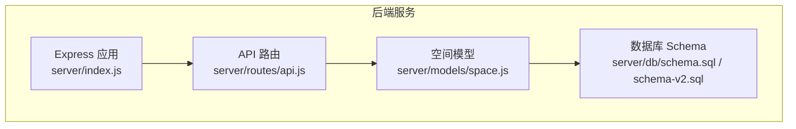
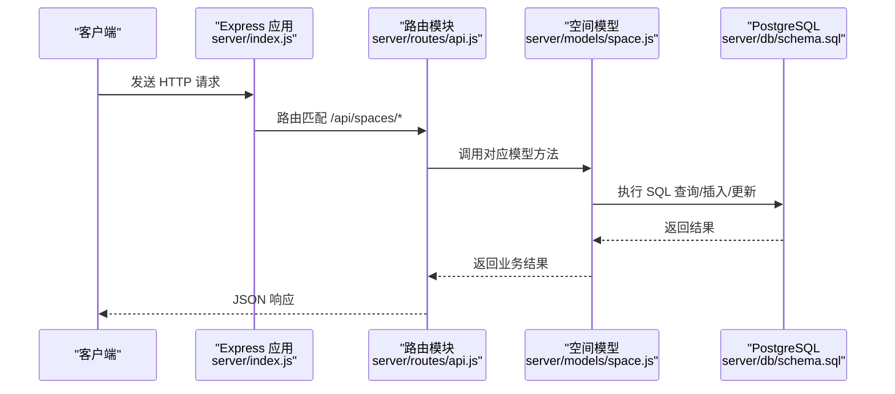
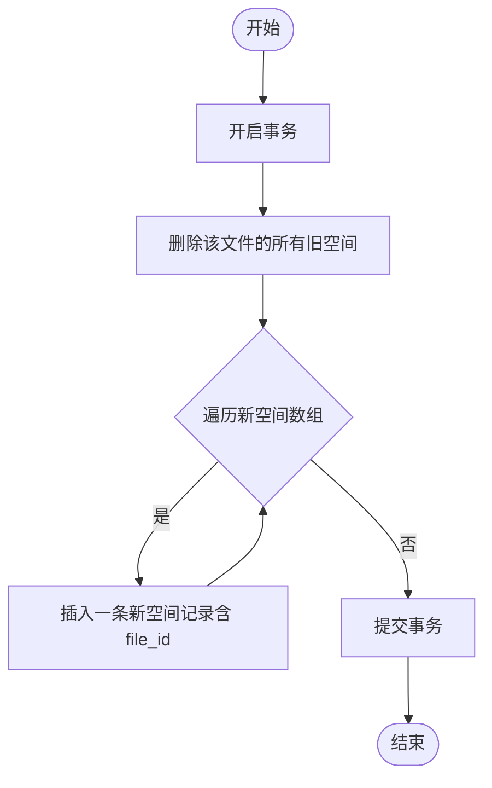
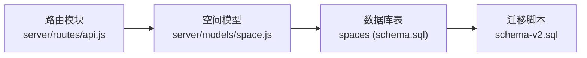

# 空间API

<cite>
**本文引用的文件**
- [server/index.js](file://server/index.js)
- [server/routes/api.js](file://server/routes/api.js)
- [server/models/space.js](file://server/models/space.js)
- [server/db/schema.sql](file://server/db/schema.sql)
- [server/db/schema-v2.sql](file://server/db/schema-v2.sql)
- [server/README.md](file://server/README.md)
</cite>

## 目录
1. [简介](#简介)
2. [项目结构](#项目结构)
3. [核心组件](#核心组件)
4. [架构总览](#架构总览)
5. [详细组件分析](#详细组件分析)
6. [依赖分析](#依赖分析)
7. [性能考虑](#性能考虑)
8. [故障排查指南](#故障排查指南)
9. [结论](#结论)
10. [附录](#附录)

## 简介
本文件聚焦于 /api/spaces 相关端点，涵盖以下能力：
- 获取所有空间
- 根据编码查询空间
- 按楼层查询空间
- 批量导入空间
- 更新空间属性

同时，结合后端模型层 batchUpsertSpacesWithFile 的事务与文件关联逻辑，说明数据清理与一致性保障机制。

## 项目结构
后端采用 Express + PostgreSQL 架构，API 路由集中于路由模块，业务逻辑封装在模型层，数据库表结构在 schema 中定义。

图表来源
- [server/index.js](file://server/index.js#L43-L49)
- [server/routes/api.js](file://server/routes/api.js#L204-L292)
- [server/models/space.js](file://server/models/space.js#L1-L220)
- [server/db/schema.sql](file://server/db/schema.sql#L54-L70)
- [server/db/schema-v2.sql](file://server/db/schema-v2.sql#L44-L70)

章节来源
- [server/index.js](file://server/index.js#L43-L49)
- [server/routes/api.js](file://server/routes/api.js#L204-L292)
- [server/db/schema.sql](file://server/db/schema.sql#L54-L70)
- [server/db/schema-v2.sql](file://server/db/schema-v2.sql#L44-L70)

## 核心组件
- 路由层：在路由模块中注册 /api/spaces 的 GET/POST/PATCH 端点，并调用空间模型执行业务逻辑。
- 模型层：提供空间的查询、批量导入、更新等方法；支持带文件关联的批量导入。
- 数据层：spaces 表包含空间编码、名称、分类、楼层、面积、周长等字段，并通过 file_id 与模型文件关联。

章节来源
- [server/routes/api.js](file://server/routes/api.js#L204-L292)
- [server/models/space.js](file://server/models/space.js#L72-L219)
- [server/db/schema.sql](file://server/db/schema.sql#L54-L70)
- [server/db/schema-v2.sql](file://server/db/schema-v2.sql#L44-L70)

## 架构总览
空间 API 的典型请求-响应流程如下：

图表来源
- [server/index.js](file://server/index.js#L43-L49)
- [server/routes/api.js](file://server/routes/api.js#L204-L292)
- [server/models/space.js](file://server/models/space.js#L72-L219)
- [server/db/schema.sql](file://server/db/schema.sql#L54-L70)

## 详细组件分析

### GET /api/spaces
- 功能：返回所有空间记录。
- 实现要点：
  - 路由层调用空间模型的“获取所有空间”方法。
  - 模型层执行排序查询，按空间编码升序返回。
- 响应结构：
  - 成功时返回包含 data 数组的对象。
  - 失败时返回包含 error 的对象。
- curl 示例：
  - curl -i http://localhost:3001/api/spaces

章节来源
- [server/routes/api.js](file://server/routes/api.js#L211-L218)
- [server/models/space.js](file://server/models/space.js#L75-L88)

### GET /api/spaces/:code
- 功能：根据空间编码精确查询空间。
- 实现要点：
  - 路由层从路径参数解析编码，调用模型层按编码查询。
  - 若未找到，返回 404 并提示“空间不存在”。
- 响应结构：
  - 成功时返回包含 data 的对象。
  - 失败时返回包含 error 的对象。
- curl 示例：
  - curl -i http://localhost:3001/api/spaces/R-001

章节来源
- [server/routes/api.js](file://server/routes/api.js#L224-L234)
- [server/models/space.js](file://server/models/space.js#L84-L97)

### GET /api/spaces/floor/:floor
- 功能：按楼层筛选空间列表。
- 实现要点：
  - 路由层从路径参数读取楼层，调用模型层按楼层查询并排序。
- 响应结构：
  - 成功时返回包含 data 数组的对象。
  - 失败时返回包含 error 的对象。
- curl 示例：
  - curl -i http://localhost:3001/api/spaces/floor/1F

章节来源
- [server/routes/api.js](file://server/routes/api.js#L240-L247)
- [server/models/space.js](file://server/models/space.js#L93-L97)

### POST /api/spaces/batch
- 功能：批量导入空间。
- 请求体格式：
  - JSON 对象，包含 spaces 数组，数组元素为空间对象。
  - 空间对象字段建议包含：spaceCode、name、classificationCode、classificationDesc、floor、area、perimeter、dbId 等。
- 数据验证：
  - 路由层校验 spaces 是否为数组，否则返回 400。
  - 模型层批量导入方法在事务中逐条插入，保证原子性。
- 响应结构：
  - 成功时返回包含 message 的对象。
  - 失败时返回包含 error 的对象。
- curl 示例：
  - curl -X POST http://localhost:3001/api/spaces/batch -H "Content-Type: application/json" -d '{"spaces":[{"spaceCode":"R-001","name":"房间A","classificationCode":"13-11 00 00","classificationDesc":"描述","floor":"1F","area":25.5,"perimeter":20.2,"dbId":123}]}'

章节来源
- [server/routes/api.js](file://server/routes/api.js#L253-L264)
- [server/models/space.js](file://server/models/space.js#L36-L70)

### PATCH /api/spaces/:code
- 功能：更新指定空间的属性。
- 允许更新的字段：
  - name、classification_code、classification_desc、floor、area、perimeter。
- 数据验证：
  - 路由层对请求体进行白名单过滤，若无有效字段则返回 400。
  - 模型层构建动态 SET 子句，仅更新允许字段，并设置 updated_at。
- 响应结构：
  - 成功时返回包含 message 的对象。
  - 失败时返回包含 error 的对象。
- curl 示例：
  - curl -X PATCH http://localhost:3001/api/spaces/R-001 -H "Content-Type: application/json" -d '{"area":30.0,"floor":"2F"}'

章节来源
- [server/routes/api.js](file://server/routes/api.js#L266-L291)
- [server/models/space.js](file://server/models/space.js#L175-L206)

### 后端模型层：batchUpsertSpacesWithFile 的事务与文件关联
- 事务逻辑：
  - 开启事务，先删除该文件对应的所有旧空间记录，再批量插入新空间，最后提交事务，保证一致性。
- 文件关联：
  - 导入时将 spaces 表的 file_id 字段写入，使空间与模型文件建立关联。
- 清理策略：
  - 该方法在导入前清理同文件内的旧空间，避免重复或冲突。
- 与综合导入的关系：
  - 综合导入接口在收到 clearExisting=true 且提供 fileId 时，会显式清理旧数据（assets、spaces、asset_specs、classifications），随后再调用 batchUpsertSpacesWithFile 完成新数据入库。

图表来源
- [server/models/space.js](file://server/models/space.js#L129-L168)
- [server/routes/api.js](file://server/routes/api.js#L317-L342)

章节来源
- [server/models/space.js](file://server/models/space.js#L129-L168)
- [server/routes/api.js](file://server/routes/api.js#L317-L342)

## 依赖分析
- 路由依赖模型：空间路由依赖空间模型提供的查询、批量导入、更新方法。
- 模型依赖数据库：空间模型依赖数据库连接与 SQL 执行，spaces 表包含 file_id 字段以支持文件级隔离。
- 数据库依赖迁移：schema-v2.sql 为 spaces 表添加 file_id 并调整唯一约束，使其在同一文件内保持唯一性。

图表来源
- [server/routes/api.js](file://server/routes/api.js#L204-L292)
- [server/models/space.js](file://server/models/space.js#L129-L168)
- [server/db/schema.sql](file://server/db/schema.sql#L54-L70)
- [server/db/schema-v2.sql](file://server/db/schema-v2.sql#L44-L70)

章节来源
- [server/routes/api.js](file://server/routes/api.js#L204-L292)
- [server/models/space.js](file://server/models/space.js#L129-L168)
- [server/db/schema.sql](file://server/db/schema.sql#L54-L70)
- [server/db/schema-v2.sql](file://server/db/schema-v2.sql#L44-L70)

## 性能考虑
- 批量导入使用事务包裹，减少多次往返开销，提升吞吐。
- spaces 表针对分类编码、楼层、db_id 等常用查询字段建立了索引，有助于查询性能。
- 建议：
  - 控制单次批量导入规模，避免长时间持有事务锁。
  - 对高频查询字段（如 floor、classification_code）保持索引维护。
  - 在前端或调用方对请求体进行预校验，减少无效请求。

章节来源
- [server/db/schema.sql](file://server/db/schema.sql#L92-L96)
- [server/models/space.js](file://server/models/space.js#L36-L70)

## 故障排查指南
- 400 错误（请求体不合法）：
  - 批量导入时未提供数组或更新字段不在白名单内。
- 404 错误（资源不存在）：
  - 查询空间编码不存在时返回。
- 500 错误（服务器内部错误）：
  - 数据库异常、事务回滚、SQL 执行失败等。
- 建议排查步骤：
  - 检查请求体格式与字段命名是否符合预期。
  - 确认 spaces 表的 file_id 是否正确传入（综合导入场景）。
  - 查看服务端日志定位具体错误位置。

章节来源
- [server/routes/api.js](file://server/routes/api.js#L253-L264)
- [server/routes/api.js](file://server/routes/api.js#L266-L291)
- [server/models/space.js](file://server/models/space.js#L175-L206)

## 结论
- /api/spaces 提供了完整的空间数据生命周期管理能力：查询、按楼层筛选、批量导入与属性更新。
- 模型层通过事务与 file_id 关联，确保数据一致性与文件级隔离。
- 建议在生产环境中配合索引优化与批量规模控制，以获得更佳性能与稳定性。

## 附录

### API 定义与示例
- GET /api/spaces
  - 请求：无参数
  - 响应：success + data（数组）
  - 示例：curl -i http://localhost:3001/api/spaces
- GET /api/spaces/:code
  - 请求：路径参数 code
  - 响应：success + data（对象）或错误
  - 示例：curl -i http://localhost:3001/api/spaces/R-001
- GET /api/spaces/floor/:floor
  - 请求：路径参数 floor
  - 响应：success + data（数组）
  - 示例：curl -i http://localhost:3001/api/spaces/floor/1F
- POST /api/spaces/batch
  - 请求体：{ spaces: [ { spaceCode, name, classificationCode, classificationDesc, floor, area, perimeter, dbId }, ... ] }
  - 响应：success + message
  - 示例：curl -X POST http://localhost:3001/api/spaces/batch -H "Content-Type: application/json" -d '{"spaces":[{"spaceCode":"R-001","name":"房间A","classificationCode":"13-11 00 00","classificationDesc":"描述","floor":"1F","area":25.5,"perimeter":20.2,"dbId":123}]}'
- PATCH /api/spaces/:code
  - 请求体：{ name, classification_code, classification_desc, floor, area, perimeter }
  - 响应：success + message
  - 示例：curl -X PATCH http://localhost:3001/api/spaces/R-001 -H "Content-Type: application/json" -d '{"area":30.0,"floor":"2F"}'

章节来源
- [server/routes/api.js](file://server/routes/api.js#L211-L291)
- [server/README.md](file://server/README.md#L114-L121)