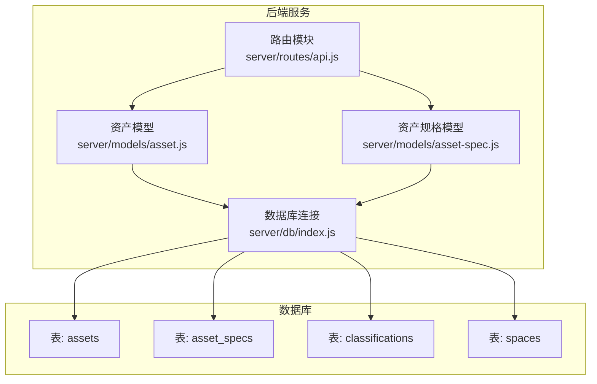
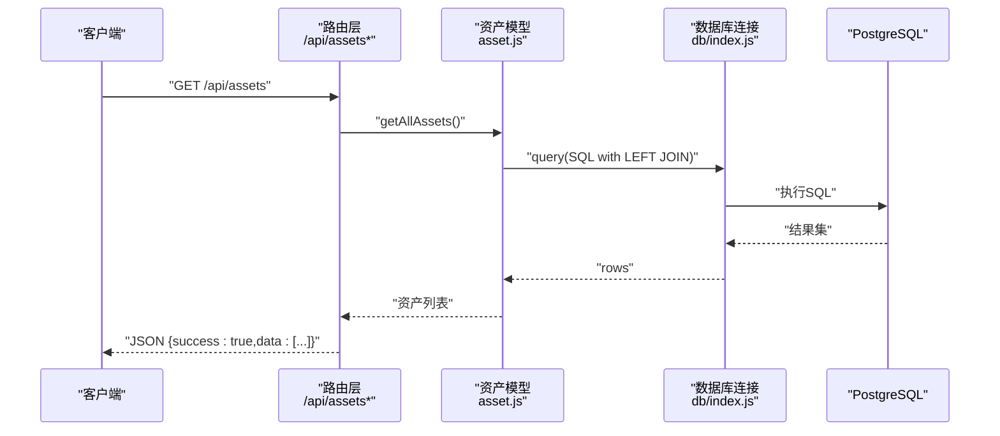
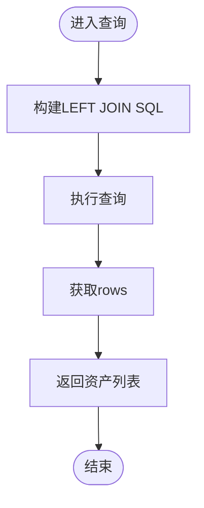
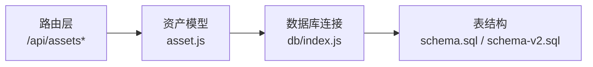

# 资产API

<cite>
**本文引用的文件**
- [server/index.js](file://server/index.js)
- [server/routes/api.js](file://server/routes/api.js)
- [server/models/asset.js](file://server/models/asset.js)
- [server/models/asset-spec.js](file://server/models/asset-spec.js)
- [server/db/schema.sql](file://server/db/schema.sql)
- [server/db/schema-v2.sql](file://server/db/schema-v2.sql)
- [server/db/index.js](file://server/db/index.js)
- [server/README.md](file://server/README.md)
</cite>

## 目录
1. [简介](#简介)
2. [项目结构](#项目结构)
3. [核心组件](#核心组件)
4. [架构总览](#架构总览)
5. [详细组件分析](#详细组件分析)
6. [依赖分析](#依赖分析)
7. [性能考虑](#性能考虑)
8. [故障排查指南](#故障排查指南)
9. [结论](#结论)
10. [附录](#附录)

## 简介
本文件聚焦于资产API的详细说明，涵盖以下端点：
- GET /api/assets：获取所有资产
- GET /api/assets/:code：根据资产编码查询
- GET /api/assets/floor/:floor：按楼层查询
- GET /api/assets/room/:room：按房间查询
- POST /api/assets/batch：批量导入资产
- PATCH /api/assets/:code：更新资产属性

同时，说明后端模型层如何通过LEFT JOIN关联asset_specs表获取完整资产信息，并给出请求与响应结构、参数格式及curl示例。

## 项目结构
后端采用Express路由+PostgreSQL模型层的分层设计：
- 路由层：集中定义REST接口，负责参数解析、校验与错误处理
- 模型层：封装数据库访问，提供查询、批量导入、更新等能力
- 数据库层：连接池、SQL执行与事务控制
- 表结构：assets、asset_specs、classifications、spaces等

图表来源
- [server/routes/api.js](file://server/routes/api.js#L100-L201)
- [server/models/asset.js](file://server/models/asset.js#L62-L133)
- [server/models/asset-spec.js](file://server/models/asset-spec.js#L76-L101)
- [server/db/index.js](file://server/db/index.js#L1-L70)
- [server/db/schema.sql](file://server/db/schema.sql#L18-L52)

章节来源
- [server/index.js](file://server/index.js#L43-L49)
- [server/routes/api.js](file://server/routes/api.js#L100-L201)
- [server/db/schema.sql](file://server/db/schema.sql#L18-L52)

## 核心组件
- 路由层（/api/assets相关）
  - GET /api/assets：返回所有资产，包含来自asset_specs的规格与分类信息
  - GET /api/assets/:code：按资产编码精确查询
  - GET /api/assets/floor/:floor：按楼层筛选
  - GET /api/assets/room/:room：按房间筛选
  - POST /api/assets/batch：批量导入资产数组
  - PATCH /api/assets/:code：按资产编码更新允许字段

- 模型层（资产）
  - 查询：LEFT JOIN asset_specs，返回资产基础字段与规格/分类扩展字段
  - 批量导入：支持事务批量写入
  - 更新：限定允许字段，自动更新updated_at

- 数据库层
  - 连接池与查询包装，提供事务客户端
  - schema.sql定义表结构与索引；schema-v2.sql引入model_files关联与唯一性变更

章节来源
- [server/routes/api.js](file://server/routes/api.js#L103-L201)
- [server/models/asset.js](file://server/models/asset.js#L62-L133)
- [server/db/schema.sql](file://server/db/schema.sql#L18-L52)
- [server/db/schema-v2.sql](file://server/db/schema-v2.sql#L44-L69)
- [server/db/index.js](file://server/db/index.js#L40-L60)

## 架构总览
资产API的典型请求-响应流程如下：

图表来源
- [server/routes/api.js](file://server/routes/api.js#L103-L114)
- [server/models/asset.js](file://server/models/asset.js#L62-L74)
- [server/db/index.js](file://server/db/index.js#L40-L51)

## 详细组件分析

### GET /api/assets：获取所有资产
- 功能：返回所有资产记录，自动LEFT JOIN资产规格表，合并规格名称与分类信息
- 返回结构：包含资产基础字段与来自asset_specs的扩展字段
- 响应示例结构（字段来自schema与LEFT JOIN）：
  - 资产基础字段：asset_code、name、floor、room、db_id、created_at、updated_at
  - 规格/分类扩展字段：spec_name、classification_code、classification_desc、category、family、type、manufacturer、address、phone
- curl示例
  - curl -i http://localhost:3001/api/assets

章节来源
- [server/routes/api.js](file://server/routes/api.js#L103-L114)
- [server/models/asset.js](file://server/models/asset.js#L62-L74)
- [server/db/schema.sql](file://server/db/schema.sql#L18-L52)

### GET /api/assets/:code：按资产编码查询
- 路径参数：:code（资产编码）
- 功能：精确匹配资产编码，返回该资产及其规格/分类扩展信息
- curl示例
  - curl -i http://localhost:3001/api/assets/MC-001

章节来源
- [server/routes/api.js](file://server/routes/api.js#L116-L130)
- [server/models/asset.js](file://server/models/asset.js#L76-L88)

### GET /api/assets/floor/:floor：按楼层查询
- 路径参数：:floor（楼层）
- 功能：返回指定楼层的所有资产，包含规格/分类扩展信息
- curl示例
  - curl -i http://localhost:3001/api/assets/floor/1F

章节来源
- [server/routes/api.js](file://server/routes/api.js#L132-L143)
- [server/models/asset.js](file://server/models/asset.js#L105-L118)

### GET /api/assets/room/:room：按房间查询
- 路径参数：:room（房间）
- 功能：返回指定房间的所有资产，包含规格/分类扩展信息
- curl示例
  - curl -i http://localhost:3001/api/assets/room/机房A

章节来源
- [server/routes/api.js](file://server/routes/api.js#L145-L156)
- [server/models/asset.js](file://server/models/asset.js#L120-L133)

### POST /api/assets/batch：批量导入资产
- 请求体格式
  - assets: 数组，元素为资产对象，至少包含asset_code字段
  - 每条资产对象可包含：asset_code、spec_code、name、floor、room、db_id
- 响应
  - success: true/false
  - message: 导入数量提示
- curl示例
  - curl -X POST http://localhost:3001/api/assets/batch -H "Content-Type: application/json" -d '{"assets":[{"asset_code":"MC-001","spec_code":"SPEC-A","name":"设备A","floor":"1F","room":"机房A","db_id":123}]}'

章节来源
- [server/routes/api.js](file://server/routes/api.js#L158-L173)
- [server/models/asset.js](file://server/models/asset.js#L31-L60)

### PATCH /api/assets/:code：更新资产属性
- 路径参数：:code（资产编码）
- 请求体：允许更新的字段集合（仅部分字段有效）
  - 允许字段：spec_code、name、floor、room
- 响应
  - success: true/false
  - message: 更新成功提示
- curl示例
  - curl -X PATCH http://localhost:3001/api/assets/MC-001 -H "Content-Type: application/json" -d '{"name":"新名称","floor":"2F"}'

章节来源
- [server/routes/api.js](file://server/routes/api.js#L175-L201)
- [server/models/asset.js](file://server/models/asset.js#L202-L238)

### 后端模型层：LEFT JOIN关联asset_specs
- 查询策略
  - 所有资产查询均通过LEFT JOIN asset_specs，以spec_code为键
  - 返回资产基础字段与规格/分类扩展字段，便于前端展示完整信息
- 关键SQL片段（摘自模型）
  - SELECT a.*, s.spec_name, s.classification_code, s.classification_desc, s.category, s.family, s.type, s.manufacturer, s.address, s.phone
  - FROM assets a LEFT JOIN asset_specs s ON a.spec_code = s.spec_code
- 事务与批量导入
  - 批量导入使用事务包裹，提升一致性与性能
  - 支持带file_id的批量导入（schema-v2新增）

图表来源
- [server/models/asset.js](file://server/models/asset.js#L62-L74)
- [server/db/schema.sql](file://server/db/schema.sql#L18-L52)

章节来源
- [server/models/asset.js](file://server/models/asset.js#L62-L133)
- [server/db/schema.sql](file://server/db/schema.sql#L18-L52)

## 依赖分析
- 路由到模型
  - /api/assets相关路由调用asset.js中的查询与更新方法
- 模型到数据库
  - 通过db/index.js提供的query与getClient进行SQL执行与事务控制
- 表结构依赖
  - assets.spec_code与asset_specs.spec_code形成LEFT JOIN关联
  - schema-v2为三张表增加file_id外键与唯一性约束，支持多文件隔离

图表来源
- [server/routes/api.js](file://server/routes/api.js#L100-L201)
- [server/models/asset.js](file://server/models/asset.js#L62-L133)
- [server/db/index.js](file://server/db/index.js#L40-L60)
- [server/db/schema.sql](file://server/db/schema.sql#L18-L52)
- [server/db/schema-v2.sql](file://server/db/schema-v2.sql#L44-L69)

章节来源
- [server/routes/api.js](file://server/routes/api.js#L100-L201)
- [server/models/asset.js](file://server/models/asset.js#L62-L133)
- [server/db/schema.sql](file://server/db/schema.sql#L18-L52)
- [server/db/schema-v2.sql](file://server/db/schema-v2.sql#L44-L69)

## 性能考虑
- 索引优化
  - 资产表对floor、room等常用过滤字段建立索引，有助于按楼层/房间查询
- 批量导入
  - 使用事务批量写入，减少往返开销，提升吞吐
- LEFT JOIN
  - 通过一次查询合并规格信息，避免N+1查询问题
- 连接池
  - 使用连接池管理并发，降低连接成本

章节来源
- [server/db/schema.sql](file://server/db/schema.sql#L72-L96)
- [server/models/asset.js](file://server/models/asset.js#L31-L60)

## 故障排查指南
- 404未找到
  - GET /api/assets/:code、/api/assets/floor/:floor、/api/assets/room/:room可能返回“不存在”提示
- 400参数错误
  - POST /api/assets/batch缺少assets数组或PATCH无有效字段时返回错误
- 500服务器错误
  - 数据库异常或事务回滚导致
- 建议排查步骤
  - 确认数据库连接参数正确
  - 检查assets表与asset_specs表是否存在对应记录
  - 核对请求体字段与允许更新字段清单

章节来源
- [server/routes/api.js](file://server/routes/api.js#L116-L156)
- [server/routes/api.js](file://server/routes/api.js#L158-L201)
- [server/db/index.js](file://server/db/index.js#L14-L33)

## 结论
资产API围绕REST规范设计，提供全量查询、条件查询、批量导入与属性更新能力。模型层通过LEFT JOIN整合资产与规格信息，简化了前端展示与业务处理。建议在生产环境中配合索引、连接池与事务策略，确保查询性能与数据一致性。

## 附录

### API定义与示例

- GET /api/assets
  - 请求：无参数
  - 响应：{success:true,data:[...]}
  - curl：curl -i http://localhost:3001/api/assets

- GET /api/assets/:code
  - 请求：路径参数 code
  - 响应：{success:true,data:资产对象}
  - curl：curl -i http://localhost:3001/api/assets/MC-001

- GET /api/assets/floor/:floor
  - 请求：路径参数 floor
  - 响应：{success:true,data:[...]}
  - curl：curl -i http://localhost:3001/api/assets/floor/1F

- GET /api/assets/room/:room
  - 请求：路径参数 room
  - 响应：{success:true,data:[...]}
  - curl：curl -i http://localhost:3001/api/assets/room/机房A

- POST /api/assets/batch
  - 请求体：{assets:[{asset_code,...}]}
  - 响应：{success:true,message:"成功导入 N 条资产"}
  - curl：curl -X POST http://localhost:3001/api/assets/batch -H "Content-Type: application/json" -d '{"assets":[{"asset_code":"MC-001","spec_code":"SPEC-A","name":"设备A","floor":"1F","room":"机房A","db_id":123}]}'

- PATCH /api/assets/:code
  - 请求体：{允许字段之一或多个}
  - 响应：{success:true,message:"资产更新成功"}
  - curl：curl -X PATCH http://localhost:3001/api/assets/MC-001 -H "Content-Type: application/json" -d '{"name":"新名称","floor":"2F"}'

章节来源
- [server/routes/api.js](file://server/routes/api.js#L103-L201)
- [server/README.md](file://server/README.md#L94-L122)