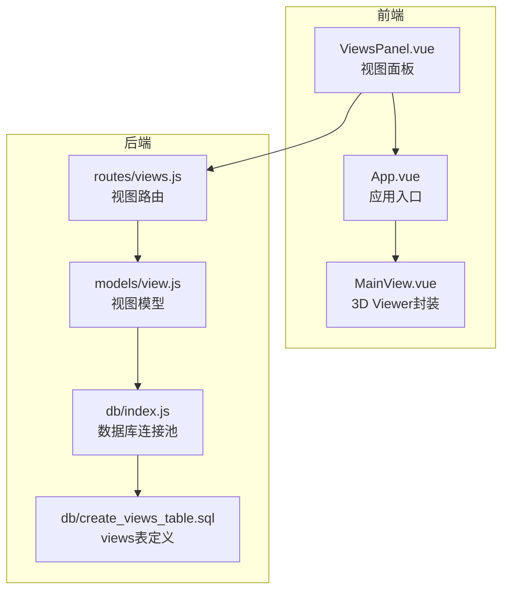
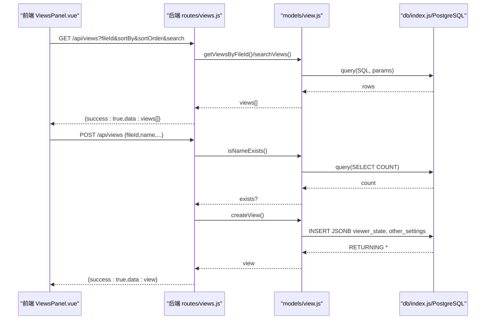
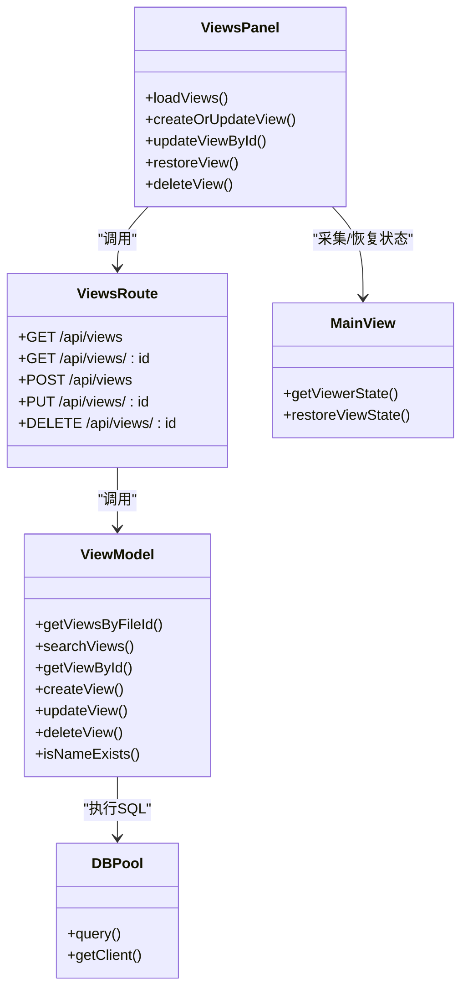

# 视图管理API

<cite>
**本文引用的文件**
- [server/routes/views.js](file://server/routes/views.js)
- [server/models/view.js](file://server/models/view.js)
- [server/db/create_views_table.sql](file://server/db/create_views_table.sql)
- [server/db/index.js](file://server/db/index.js)
- [src/components/ViewsPanel.vue](file://src/components/ViewsPanel.vue)
- [src/components/MainView.vue](file://src/components/MainView.vue)
- [src/App.vue](file://src/App.vue)
</cite>

## 目录
1. [简介](#简介)
2. [项目结构](#项目结构)
3. [核心组件](#核心组件)
4. [架构总览](#架构总览)
5. [详细组件分析](#详细组件分析)
6. [依赖关系分析](#依赖关系分析)
7. [性能考量](#性能考量)
8. [故障排查指南](#故障排查指南)
9. [结论](#结论)
10. [附录](#附录)

## 简介
本文件系统化梳理“视图管理API”的设计与实现，重点覆盖以下方面：
- 视图状态的持久化与管理：通过PostgreSQL JSONB字段存储Forge Viewer状态、隔离/隐藏状态、剖切面、爆炸视图、渲染选项等。
- 后端路由与模型：提供视图列表查询、单个视图读取、创建、更新、删除的REST接口。
- 前端交互：视图面板支持保存当前视图、保存为新视图、搜索与排序、上下文菜单操作等。
- 状态数据结构：viewer_state/other_settings字段的JSON格式与兼容性处理。
- curl示例与错误码说明，便于快速集成与排障。

## 项目结构
视图管理API位于后端的routes与models目录，数据库表定义在db目录，前端视图面板与状态采集/恢复在src目录。

**图表来源**
- [server/routes/views.js](file://server/routes/views.js#L1-L181)
- [server/models/view.js](file://server/models/view.js#L1-L199)
- [server/db/index.js](file://server/db/index.js#L1-L70)
- [server/db/create_views_table.sql](file://server/db/create_views_table.sql#L1-L46)
- [src/components/ViewsPanel.vue](file://src/components/ViewsPanel.vue#L1-L470)
- [src/components/MainView.vue](file://src/components/MainView.vue#L2580-L2780)
- [src/App.vue](file://src/App.vue#L132-L142)

**章节来源**
- [server/routes/views.js](file://server/routes/views.js#L1-L181)
- [server/models/view.js](file://server/models/view.js#L1-L199)
- [server/db/create_views_table.sql](file://server/db/create_views_table.sql#L1-L46)
- [server/db/index.js](file://server/db/index.js#L1-L70)
- [src/components/ViewsPanel.vue](file://src/components/ViewsPanel.vue#L1-L470)
- [src/components/MainView.vue](file://src/components/MainView.vue#L2580-L2780)
- [src/App.vue](file://src/App.vue#L132-L142)

## 核心组件
- 路由层：提供GET/POST/PUT/DELETE四个端点，负责参数校验、错误处理与响应包装。
- 模型层：封装SQL查询、插入、更新、删除与名称唯一性检查。
- 数据库层：views表采用JSONB字段存储视图状态，包含索引与唯一约束。
- 前端：ViewsPanel负责UI交互与调用后端API；MainView负责采集/恢复Forge Viewer状态。

**章节来源**
- [server/routes/views.js](file://server/routes/views.js#L1-L181)
- [server/models/view.js](file://server/models/view.js#L1-L199)
- [server/db/create_views_table.sql](file://server/db/create_views_table.sql#L1-L46)
- [src/components/ViewsPanel.vue](file://src/components/ViewsPanel.vue#L193-L381)
- [src/components/MainView.vue](file://src/components/MainView.vue#L2587-L2748)

## 架构总览
后端通过Express路由接收请求，调用模型层执行数据库操作；模型层使用PostgreSQL连接池执行SQL；前端通过fetch调用后端API，实现视图的增删改查与状态恢复。

**图表来源**
- [server/routes/views.js](file://server/routes/views.js#L14-L109)
- [server/models/view.js](file://server/models/view.js#L14-L96)
- [server/db/index.js](file://server/db/index.js#L40-L51)
- [src/components/ViewsPanel.vue](file://src/components/ViewsPanel.vue#L193-L339)

## 详细组件分析

### GET /api/views —— 获取文件的所有视图
- 必填参数：fileId（整数）
- 可选参数：sortBy（name/created_at/updated_at，默认name）、sortOrder（asc/desc，默认asc）、search（字符串，模糊匹配）
- 返回：success与data数组，每项包含id、file_id、name、thumbnail、created_at、updated_at
- 行为：
  - 缺少fileId时返回400
  - 提供search时走模糊搜索；否则按排序字段与方向排序
- 前端调用示例（参数构造）：
  - 通过ViewsPanel.vue在加载视图列表时拼装查询参数并发起请求

**章节来源**
- [server/routes/views.js](file://server/routes/views.js#L14-L41)
- [server/models/view.js](file://server/models/view.js#L14-L48)
- [src/components/ViewsPanel.vue](file://src/components/ViewsPanel.vue#L193-L219)

### GET /api/views/:id —— 获取单个视图的完整状态数据
- 路径参数：id（整数）
- 返回：success与data对象，包含views表全部字段（含JSONB viewer_state、other_settings）
- 行为：
  - 视图不存在返回404
  - 成功返回完整状态数据，前端可直接调用MainView.restoreViewState恢复

**章节来源**
- [server/routes/views.js](file://server/routes/views.js#L43-L64)
- [server/models/view.js](file://server/models/view.js#L55-L59)
- [src/components/ViewsPanel.vue](file://src/components/ViewsPanel.vue#L369-L381)

### POST /api/views —— 创建新视图
- 请求体必填：fileId（整数）、name（字符串）
- 兼容字段：viewer_state 或 viewerState、other_settings 或 otherSettings
- 校验：
  - 缺少fileId/name返回400
  - 名称重复（同一fileId下）返回409
- 存储：
  - viewer_state、other_settings以JSONB形式写入数据库
  - thumbnail可选（Base64字符串）
- 前端调用示例：
  - ViewsPanel.vue通过MainView.getViewerState采集状态，然后POST到后端
  - 若返回409提示名称冲突，前端可弹窗确认后走PUT更新

**章节来源**
- [server/routes/views.js](file://server/routes/views.js#L66-L110)
- [server/models/view.js](file://server/models/view.js#L66-L96)
- [src/components/ViewsPanel.vue](file://src/components/ViewsPanel.vue#L274-L339)
- [src/components/MainView.vue](file://src/components/MainView.vue#L2587-L2616)

### PUT /api/views/:id —— 更新视图
- 路径参数：id（整数）
- 请求体：name、thumbnail、viewer_state、other_settings（允许部分字段）
- 校验：
  - 若更新name，需检查同一fileId下是否重复，重复返回409
  - 无有效字段时抛错（400）
- 存储：
  - viewer_state、other_settings以JSONB形式写入数据库
  - updated_at自动更新
- 前端调用示例：
  - ViewsPanel.vue在“保存为”或“重命名+保存”场景调用PUT

**章节来源**
- [server/routes/views.js](file://server/routes/views.js#L112-L154)
- [server/models/view.js](file://server/models/view.js#L104-L147)
- [src/components/ViewsPanel.vue](file://src/components/ViewsPanel.vue#L341-L358)

### DELETE /api/views/:id —— 删除视图
- 路径参数：id（整数）
- 行为：
  - 视图不存在返回404
  - 成功返回被删除的视图记录

**章节来源**
- [server/routes/views.js](file://server/routes/views.js#L156-L178)
- [server/models/view.js](file://server/models/view.js#L149-L158)
- [src/components/ViewsPanel.vue](file://src/components/ViewsPanel.vue#L424-L451)

### 视图状态数据结构与持久化
- 数据库存储字段（JSONB）：
  - camera_state、isolation_state、selection_state、theming_state、environment、cutplanes、explode_scale、render_options、other_settings
- 前端采集与恢复：
  - MainView.getViewerState返回包含viewerState、cameraState、isolationState、selectionState、themingState、environment、cutplanes、explodeScale、renderOptions、otherSettings的对象
  - MainView.restoreViewState使用viewer.restoreState恢复Forge Viewer状态，并根据other_settings同步自定义UI状态
- 字段兼容性：
  - 模型层对viewer_state/viewerState、other_settings/otherSettings进行兼容处理，统一序列化为JSONB

**章节来源**
- [server/db/create_views_table.sql](file://server/db/create_views_table.sql#L1-L46)
- [server/models/view.js](file://server/models/view.js#L66-L96)
- [src/components/MainView.vue](file://src/components/MainView.vue#L2587-L2748)

## 依赖关系分析

**图表来源**
- [server/routes/views.js](file://server/routes/views.js#L1-L181)
- [server/models/view.js](file://server/models/view.js#L1-L199)
- [server/db/index.js](file://server/db/index.js#L40-L60)
- [src/components/ViewsPanel.vue](file://src/components/ViewsPanel.vue#L193-L451)
- [src/components/MainView.vue](file://src/components/MainView.vue#L2587-L2748)

**章节来源**
- [server/routes/views.js](file://server/routes/views.js#L1-L181)
- [server/models/view.js](file://server/models/view.js#L1-L199)
- [server/db/index.js](file://server/db/index.js#L1-L70)
- [src/components/ViewsPanel.vue](file://src/components/ViewsPanel.vue#L193-L451)
- [src/components/MainView.vue](file://src/components/MainView.vue#L2587-L2748)

## 性能考量
- 数据库索引：views表对file_id、name、created_at建立索引，有利于按文件分组与排序检索。
- 排序与搜索：后端对sortBy/sortOrder进行白名单校验，避免SQL注入；search使用ILIKE模糊匹配。
- JSONB存储：viewer_state、other_settings以JSONB存储，便于灵活扩展状态字段；注意合理控制JSON体积，避免过大导致IO与网络开销增加。
- 前端缓存：ViewsPanel在加载视图列表时使用防抖搜索与本地状态，减少频繁请求。

**章节来源**
- [server/db/create_views_table.sql](file://server/db/create_views_table.sql#L28-L32)
- [server/models/view.js](file://server/models/view.js#L14-L48)
- [src/components/ViewsPanel.vue](file://src/components/ViewsPanel.vue#L221-L229)

## 故障排查指南
- 400 缺少参数：检查fileId、name是否传入；GET端点缺少fileId会报错。
- 409 名称冲突：同一fileId下视图名称必须唯一；若创建/更新返回冲突，请更换名称或先删除旧视图。
- 404 视图不存在：访问不存在的视图ID；请确认ID正确或先创建视图。
- 500 服务器内部错误：数据库连接异常、SQL执行失败；检查DB连接池与表结构。
- 前端状态恢复失败：确认viewer_state格式正确且viewer已初始化；MainView.restoreViewState会打印日志，便于定位问题。

**章节来源**
- [server/routes/views.js](file://server/routes/views.js#L18-L109)
- [server/models/view.js](file://server/models/view.js#L160-L178)
- [src/components/MainView.vue](file://src/components/MainView.vue#L2686-L2748)

## 结论
视图管理API通过PostgreSQL JSONB字段实现了对Forge Viewer状态的完整持久化，配合前后端协作，提供了完整的“保存当前视图/保存为新视图/恢复视图/删除视图”的闭环。建议在生产环境中：
- 控制viewer_state与其他设置的JSON体积，避免过大JSON影响性能；
- 在前端做好状态采集与恢复的错误兜底；
- 对fileId与name建立合理的业务约束，避免重复与歧义。

## 附录

### API定义与示例

- GET /api/views
  - 查询参数：fileId（必填），sortBy（可选），sortOrder（可选），search（可选）
  - 示例：curl -i "http://localhost:3001/api/views?fileId=123&sortBy=name&sortOrder=asc&search=办公"
  - 响应：success与data数组（每项包含id、file_id、name、thumbnail、created_at、updated_at）

- GET /api/views/:id
  - 示例：curl -i "http://localhost:3001/api/views/456"
  - 响应：success与data对象（包含JSONB viewer_state、other_settings等）

- POST /api/views
  - 请求体：fileId（必填）、name（必填）、thumbnail（可选）、viewer_state或viewerState、other_settings或otherSettings
  - 示例：curl -i -X POST "http://localhost:3001/api/views" -H "Content-Type: application/json" -d '{"fileId":123,"name":"视图A","viewer_state":{...},"other_settings":{...}}'
  - 响应：success与新建视图对象

- PUT /api/views/:id
  - 请求体：name（可选）、thumbnail（可选）、viewer_state（可选）、other_settings（可选）
  - 示例：curl -i -X PUT "http://localhost:3001/api/views/456" -H "Content-Type: application/json" -d '{"name":"视图A(更新)","viewer_state":{...}}'
  - 响应：success与更新后的视图对象

- DELETE /api/views/:id
  - 示例：curl -i -X DELETE "http://localhost:3001/api/views/456"
  - 响应：success与被删除视图对象

### 视图状态JSON结构要点
- viewer_state：由Forge Viewer官方API生成的状态快照，包含viewport、objectSet、cutplanes、explodeScale、renderOptions等。
- other_settings：包含UI层面的自定义设置，如热力图开关、温度标签可见性等。
- 存储格式：JSONB，便于灵活扩展字段与高效检索。

**章节来源**
- [server/db/create_views_table.sql](file://server/db/create_views_table.sql#L1-L46)
- [server/models/view.js](file://server/models/view.js#L66-L96)
- [src/components/MainView.vue](file://src/components/MainView.vue#L2587-L2748)