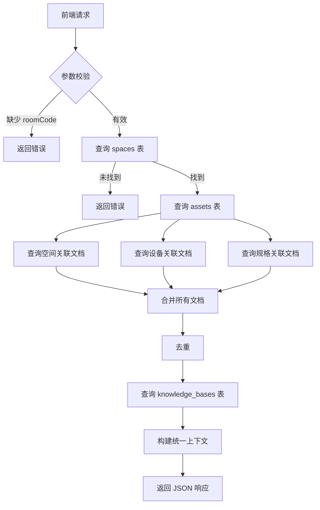
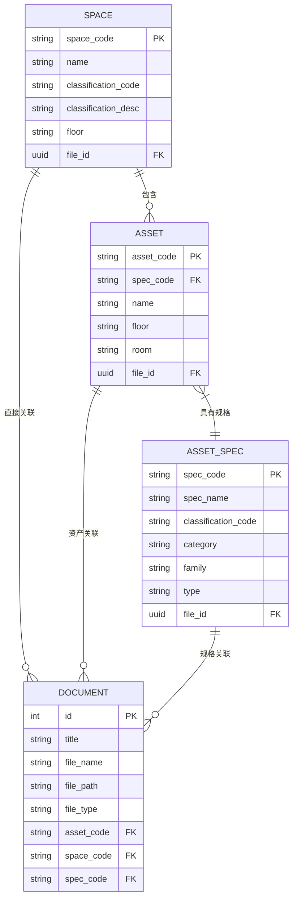

# AI上下文获取

<cite>
**本文档引用的文件**
- [ai.js](file://server/routes/v1/ai.js)
- [space.js](file://server/models/space.js)
- [asset.js](file://server/models/asset.js)
- [document.js](file://server/models/document.js)
- [asset-spec.js](file://server/models/asset-spec.js)
- [schema.sql](file://server/db/schema.sql)
- [init-all.sql](file://server/db/init-all.sql)
- [openwebui-service.js](file://server/services/openwebui-service.js)
- [ai-analysis.ts](file://src/services/ai-analysis.ts)
</cite>

## 目录
1. [简介](#简介)
2. [核心功能与数据流](#核心功能与数据流)
3. [上下文获取接口实现](#上下文获取接口实现)
4. [多源文档聚合逻辑](#多源文档聚合逻辑)
5. [数据库表结构与查询优化](#数据库表结构与查询优化)
6. [前端使用场景与RAG集成](#前端使用场景与RAG集成)
7. [性能优化建议](#性能优化建议)
8. [错误处理与调试](#错误处理与调试)
9. [结论](#结论)

## 简介
AI上下文获取功能是TwinSight系统中实现智能分析的核心组件。该功能通过房间编码（roomCode）作为入口，动态聚合与该空间关联的多维度信息，包括空间元数据、关联设备列表、相关技术文档以及预构建的知识库信息。这些信息被整合为统一的上下文结构，用于支持后续的RAG（检索增强生成）查询，从而为AI提供准确、丰富的背景知识，提升分析的准确性和实用性。

**Section sources**
- [ai.js](file://server/routes/v1/ai.js#L234-L354)

## 核心功能与数据流
AI上下文获取功能的核心在于构建一个从单一房间编码出发的完整信息图谱。其数据流遵循以下步骤：
1.  **空间定位**：根据提供的`roomCode`，首先在`spaces`表中查询并确认该空间的存在。
2.  **设备发现**：利用`assets`表中`room`字段与`roomCode`的模糊匹配，获取该房间内所有关联的设备。
3.  **文档聚合**：执行多源文档查询，分别从空间、设备和设备规格三个维度获取相关文档。
4.  **知识库关联**：通过`spaces`表中的`file_id`，在`knowledge_bases`表中查找与该模型文件关联的AI知识库。
5.  **上下文构建**：将上述所有信息去重、合并，构建一个结构化的JSON响应，供前端或AI服务使用。

**Diagram sources**
- [ai.js](file://server/routes/v1/ai.js#L240-L350)

## 上下文获取接口实现
上下文获取功能由后端API `/api/v1/ai/context` 实现，其核心逻辑位于`server/routes/v1/ai.js`文件中。

### 接口定义
- **方法**: `GET`
- **路径**: `/api/v1/ai/context`
- **查询参数**:
  - `roomCode` (必需): 房间编码。
  - `fileId` (可选): 模型文件ID，用于多模型环境下的精确查询。

### 处理流程
1.  **参数验证**：检查`roomCode`是否提供。
2.  **空间信息获取**：执行SQL查询，从`spaces`表获取指定`roomCode`的空间信息。如果提供了`fileId`，则同时作为查询条件以确保准确性。
3.  **设备列表获取**：执行SQL查询，从`assets`表获取`room`字段包含`roomCode`的所有设备，并通过`LEFT JOIN`关联`asset_specs`表以获取设备的规格信息。
4.  **文档聚合**：
    - **空间文档**：查询`documents`表中`space_code`等于`roomCode`的文档。
    - **设备文档**：查询`documents`表中`asset_code`在上一步获取的设备列表中的文档。
    - **规格文档**：查询`documents`表中`spec_code`在上一步获取的设备规格列表中的文档。
5.  **文档去重**：将三组文档合并后，根据`id`进行去重，确保每份文档只出现一次。
6.  **知识库信息获取**：根据空间信息中的`file_id`，查询`knowledge_bases`表，获取关联的AI知识库ID和名称。
7.  **响应构建**：将所有信息整合到一个结构化的`data`对象中，并返回成功响应。

**Section sources**
- [ai.js](file://server/routes/v1/ai.js#L234-L354)

## 多源文档聚合逻辑
文档聚合是AI上下文获取的关键环节，它确保了AI能够访问到与目标空间最相关的所有文档。该逻辑通过三种关联关系实现：

### 1. 空间直接关联 (Direct Space Association)
这是最直接的关联方式。文档通过`space_code`字段与特定空间建立联系。例如，一份名为“泵房电气图纸”的文档，其`space_code`为`BF02US01`，则该文档被视为泵房的直接相关文档。

### 2. 资产关联 (Asset Association)
设备（Asset）是空间内的具体构件。文档可以通过`asset_code`字段与特定设备关联。例如，一台编号为`A001`的水泵，其操作手册文档的`asset_code`即为`A001`。当查询泵房的上下文时，该泵房内所有设备的操作手册都会被纳入。

### 3. 规格关联 (Specification Association)
设备规格（Asset Specification）代表了设备的类型或型号。文档可以通过`spec_code`字段与设备规格关联。例如，所有`spec_code`为`PUMP-200`的水泵，其通用技术规格书可以关联到该规格上。这样，当查询包含此类水泵的任何房间时，该通用规格书都会被包含在上下文中。

### 聚合与去重
三种来源的文档被分别查询后，通过JavaScript的`filter`和`findIndex`方法进行合并和去重。去重的依据是文档的唯一标识`id`，确保了即使一份文档通过多种途径被关联（例如，既关联了设备又关联了其规格），在最终的上下文中也只会出现一次。

**Diagram sources**
- [ai.js](file://server/routes/v1/ai.js#L273-L309)
- [schema.sql](file://server/db/schema.sql#L58-L73)
- [init-all.sql](file://server/db/init-all.sql#L188-L203)

## 数据库表结构与查询优化
系统的数据模型设计清晰，支持高效的上下文查询。

### 核心表结构
- **`spaces` 表**: 存储空间（房间）信息，核心字段为`space_code`和`file_id`。
- **`assets` 表**: 存储设备信息，核心字段为`asset_code`、`spec_code`和`room`。
- **`asset_specs` 表**: 存储设备规格信息，核心字段为`spec_code`。
- **`documents` 表**: 存储文档信息，通过`asset_code`、`space_code`和`spec_code`三个外键实现多对多关联。
- **`knowledge_bases` 表**: 存储AI知识库与模型文件的映射关系，通过`file_id`进行关联。

### 查询优化
数据库脚本中定义了多个索引，对查询性能至关重要：
- **`idx_spaces_classification`**: 加速按分类查询空间。
- **`idx_assets_room`**: 加速按房间名称查询设备，这是上下文获取中最关键的查询之一。
- **`idx_documents_asset`**, **`idx_documents_space`**, **`idx_documents_spec`**: 分别加速按资产、空间和规格查询文档。
- **`idx_knowledge_bases_file_id`**: 加速按模型文件ID查询知识库。

这些索引确保了即使在数据量庞大的情况下，上下文获取的响应时间也能保持在可接受的范围内。

**Section sources**
- [schema.sql](file://server/db/schema.sql)
- [init-all.sql](file://server/db/init-all.sql)

## 前端使用场景与RAG集成
前端通过`src/services/ai-analysis.ts`中的服务调用后端API，实现AI分析功能。

### 使用场景
当用户在三维视图中点击一个房间时，前端会触发AI分析流程：
1.  获取被点击房间的`roomCode`。
2.  调用`/api/v1/ai/context`接口，获取该房间的完整上下文。
3.  将获取到的上下文信息（特别是`knowledgeBase.id`）传递给RAG查询接口。
4.  用户输入问题后，前端调用`/api/v1/ai/query`接口，将问题和知识库ID发送给AI服务。
5.  AI服务利用知识库中的文档进行检索和生成，返回包含来源引用的分析结果。
6.  前端调用`/api/v1/ai/format-sources`接口，将AI返回的文档名称转换为系统内的可点击预览链接，提升用户体验。

### RAG集成
RAG查询的实现依赖于`openwebui-service.js`。`chatWithRAG`函数会将知识库ID（`kbId`）作为`files`参数的一部分发送给Open WebUI服务。Open WebUI会从其向量数据库中检索与该知识库相关的文档片段，并将其作为上下文注入到大语言模型的提示词（Prompt）中，从而生成基于特定领域知识的准确回答。

**Section sources**
- [ai-analysis.ts](file://src/services/ai-analysis.ts#L28-L98)
- [openwebui-service.js](file://server/services/openwebui-service.js#L257-L310)

## 性能优化建议
尽管现有设计已包含索引优化，但仍可进一步提升性能：

### 1. 查询分页
当前的上下文获取接口对设备和文档数量没有限制。在设备或文档数量极多的房间中，可能导致响应缓慢或内存溢出。建议引入分页机制：
- 在API中增加`page`和`pageSize`参数。
- 对`assets`和`documents`的查询结果进行分页处理。
- 返回结果中包含分页信息（如`total`、`currentPage`）。

### 2. 缓存策略
对于不经常变动的上下文信息，可以实施缓存：
- 使用Redis等内存数据库缓存`/api/v1/ai/context`的响应结果。
- 缓存键可设计为`ai_context:${fileId}:${roomCode}`。
- 设置合理的过期时间（如10分钟），并在数据更新时（如文档上传、设备修改）主动清除相关缓存。

### 3. 数据库查询优化
- **避免N+1查询**：当前逻辑中，获取设备后需要提取`specCodes`再查询规格文档。虽然在单次查询中完成，但逻辑上是分离的。可以考虑在获取设备时，通过一个更复杂的JOIN查询一次性获取所有必要信息，减少数据库交互次数。
- **字段选择**：在查询`documents`表时，只选择必要的字段（如`id`, `title`, `file_name`, `file_type`），避免使用`SELECT *`，减少网络传输量。

## 错误处理与调试
系统具备完善的错误处理机制：
- **参数校验**：对`roomCode`等必填参数进行检查，返回清晰的400错误。
- **资源未找到**：当`roomCode`不存在时，返回404错误。
- **服务异常**：捕获所有运行时异常，返回500错误，并在日志中记录详细错误信息，便于调试。

**Section sources**
- [ai.js](file://server/routes/v1/ai.js#L244-L256)
- [ai.js](file://server/routes/v1/ai.js#L351-L354)

## 结论
AI上下文获取功能通过精心设计的数据模型和高效的查询逻辑，成功地将分散在`spaces`、`assets`、`asset_specs`和`documents`等多个表中的信息聚合为一个统一的、结构化的上下文。该功能为AI的智能分析提供了坚实的知识基础，是实现RAG应用的核心环节。通过引入分页和缓存等优化措施，可以进一步提升其在大规模数据场景下的性能和稳定性。