# AI智能查询

<cite>
**本文档引用的文件**   
- [ai.js](file://server/routes/v1/ai.js)
- [openwebui-service.js](file://server/services/openwebui-service.js)
- [openwebui-config.js](file://server/config/openwebui-config.js)
- [rate-limit.js](file://server/middleware/rate-limit.js)
- [schema.sql](file://server/db/schema.sql)
- [ai-analysis.js](file://server/routes/ai-analysis.js)
- [create-knowledge-base-tables.js](file://server/scripts/create-knowledge-base-tables.js)
</cite>

## 目录
1. [简介](#简介)
2. [核心功能实现](#核心功能实现)
3. [RAG查询接口](#rag查询接口)
4. [消息构造与模型选择](#消息构造与模型选择)
5. [知识库与文件引用策略](#知识库与文件引用策略)
6. [文件ID到知识库ID的自动查找](#文件id到知识库id的自动查找)
7. [Web搜索控制](#web搜索控制)
8. [查询请求与响应结构](#查询请求与响应结构)
9. [流式响应支持](#流式响应支持)
10. [错误处理与日志记录](#错误处理与日志记录)
11. [性能优化建议](#性能优化建议)
12. [系统架构图](#系统架构图)

## 简介
本文档详细描述了AI智能查询功能的实现，重点介绍基于RAG（检索增强生成）的查询接口。系统通过Open WebUI服务实现知识库管理和智能问答，支持通过prompt和知识库ID进行查询。文档涵盖chatWithRAG服务方法的调用机制、消息构造、模型选择、文件精确引用和知识库补充引用的组合策略，以及文件ID自动查找知识库ID的功能。

**Section sources**
- [ai.js](file://server/routes/v1/ai.js#L1-L416)
- [openwebui-service.js](file://server/services/openwebui-service.js#L1-L359)

## 核心功能实现
AI智能查询功能主要通过`ai.js`路由文件和`openwebui-service.js`服务文件实现。系统使用Open WebUI作为后端AI服务，通过API调用实现知识库管理、文档同步和智能查询功能。核心功能包括知识库创建、文档同步、RAG查询和上下文获取。

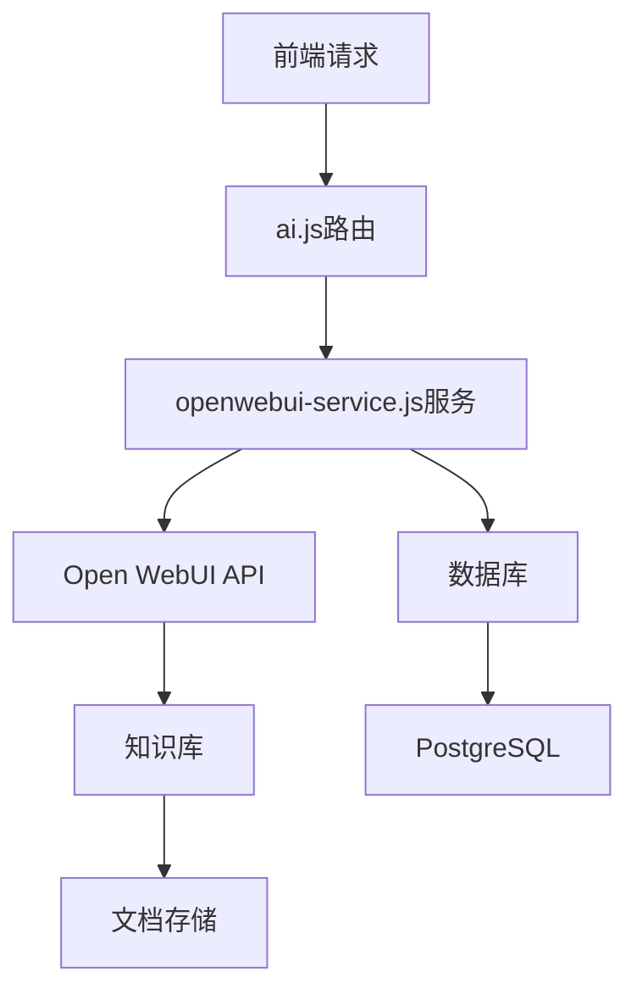

**Diagram sources **
- [ai.js](file://server/routes/v1/ai.js#L1-L416)
- [openwebui-service.js](file://server/services/openwebui-service.js#L1-L359)

**Section sources**
- [ai.js](file://server/routes/v1/ai.js#L1-L416)
- [openwebui-service.js](file://server/services/openwebui-service.js#L1-L359)

## RAG查询接口
系统提供了基于RAG的查询接口，通过POST请求`/api/v1/ai/query`实现智能问答功能。接口支持通过prompt、知识库ID、文件ID和Web搜索开关进行查询。

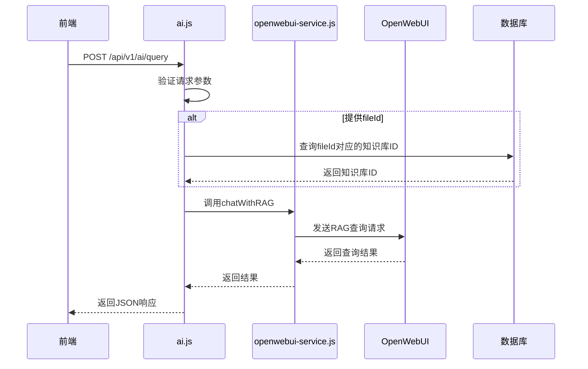

**Diagram sources **
- [ai.js](file://server/routes/v1/ai.js#L194-L232)
- [openwebui-service.js](file://server/services/openwebui-service.js#L257-L310)

**Section sources**
- [ai.js](file://server/routes/v1/ai.js#L194-L232)
- [openwebui-service.js](file://server/services/openwebui-service.js#L257-L310)

## 消息构造与模型选择
在RAG查询过程中，系统会构造包含用户问题、知识库ID和模型选择的请求体。默认使用gemini-2.0-flash模型，但可以根据需要进行配置。

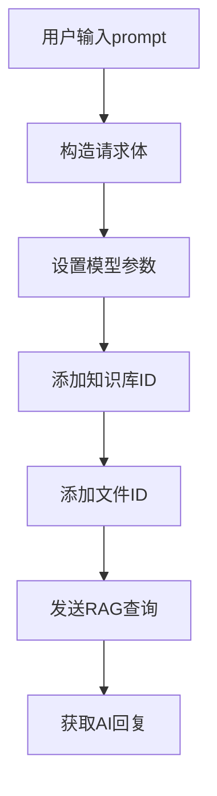

**Diagram sources **
- [openwebui-service.js](file://server/services/openwebui-service.js#L267-L309)

**Section sources**
- [openwebui-service.js](file://server/services/openwebui-service.js#L257-L310)

## 知识库与文件引用策略
系统实现了文件精确引用和知识库补充引用的组合策略。优先使用具体的文件ID进行精确引用，同时使用知识库ID作为补充引用，确保查询结果的准确性和全面性。

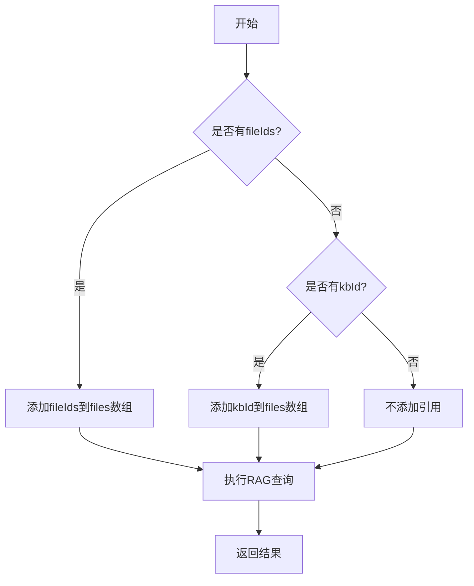

**Diagram sources **
- [openwebui-service.js](file://server/services/openwebui-service.js#L275-L297)

**Section sources**
- [openwebui-service.js](file://server/services/openwebui-service.js#L257-L310)

## 文件ID到知识库ID的自动查找
当查询请求中只提供fileId而没有提供kbId时，系统会自动查找对应的知识库ID。这一功能通过数据库查询实现，确保用户无需手动管理知识库ID。

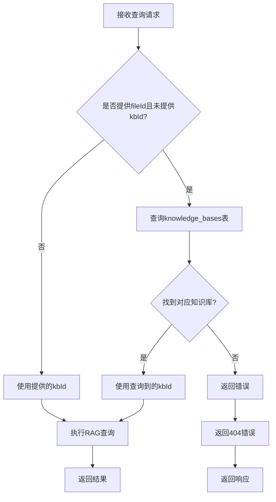

**Diagram sources **
- [ai.js](file://server/routes/v1/ai.js#L209-L219)

**Section sources**
- [ai.js](file://server/routes/v1/ai.js#L194-L232)

## Web搜索控制
系统支持通过allowWebSearch参数控制是否允许联网搜索。该参数默认为true，但可以根据安全和隐私需求进行配置。

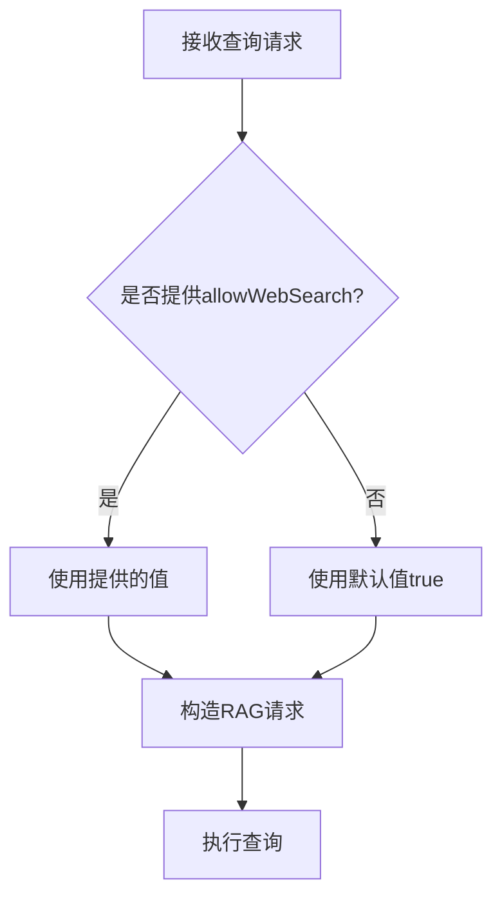

**Diagram sources **
- [ai.js](file://server/routes/v1/ai.js#L224-L225)

**Section sources**
- [ai.js](file://server/routes/v1/ai.js#L194-L232)

## 查询请求与响应结构
RAG查询接口的请求和响应采用标准的JSON格式。请求包含prompt、kbId、fileId和allowWebSearch等参数，响应包含查询结果和状态信息。

### 查询请求示例
```json
{
  "prompt": "请解释这个设备的工作原理",
  "kbId": "kb-12345",
  "fileId": 678,
  "allowWebSearch": true
}
```

### 查询响应示例
```json
{
  "success": true,
  "data": {
    "id": "chatcmpl-123",
    "object": "chat.completion",
    "created": 1700000000,
    "model": "gemini-2.0-flash",
    "choices": [
      {
        "index": 0,
        "message": {
          "role": "assistant",
          "content": "根据文档内容，该设备的工作原理如下..."
        },
        "finish_reason": "stop"
      }
    ],
    "usage": {
      "prompt_tokens": 100,
      "completion_tokens": 200,
      "total_tokens": 300
    }
  }
}
```

**Section sources**
- [ai.js](file://server/routes/v1/ai.js#L194-L232)
- [openwebui-service.js](file://server/services/openwebui-service.js#L257-L310)

## 流式响应支持
系统设计考虑了流式响应的支持，虽然当前实现中未直接展示流式处理，但Open WebUI API支持流式传输，为未来实现提供了基础。

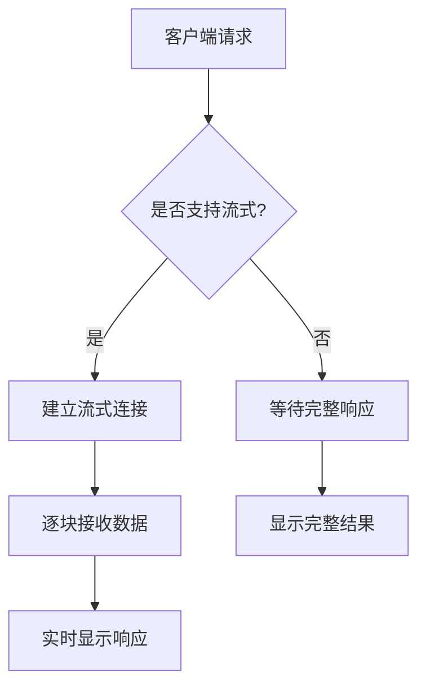

**Section sources**
- [openwebui-service.js](file://server/services/openwebui-service.js#L257-L310)

## 错误处理与日志记录
系统实现了全面的错误处理和日志记录机制，确保查询过程的稳定性和可追溯性。所有关键操作都有详细的日志记录，便于问题排查和系统监控。

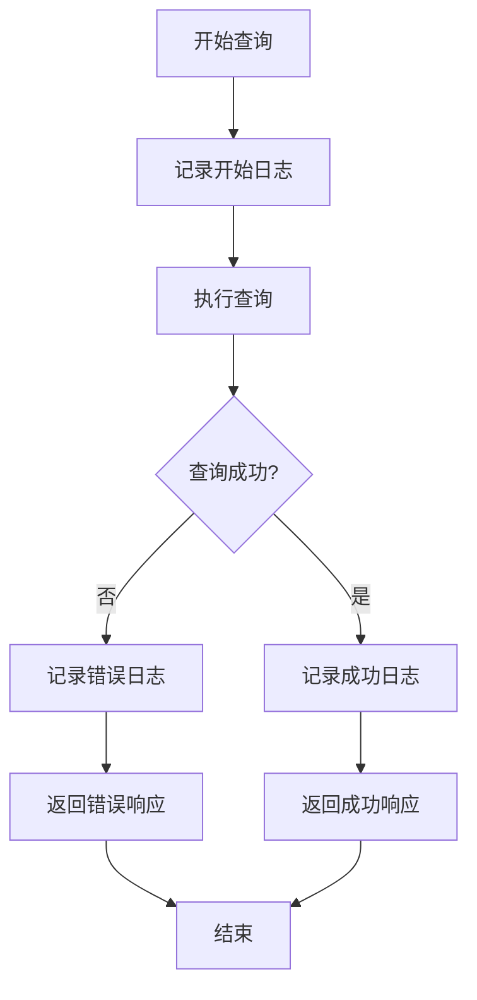

**Section sources**
- [ai.js](file://server/routes/v1/ai.js#L229-L231)
- [openwebui-service.js](file://server/services/openwebui-service.js#L57-L60)

## 性能优化建议
为提高系统性能和用户体验，建议实施查询缓存策略和限流机制。这些优化措施可以有效减少重复查询的开销，防止API滥用。

### 查询缓存策略
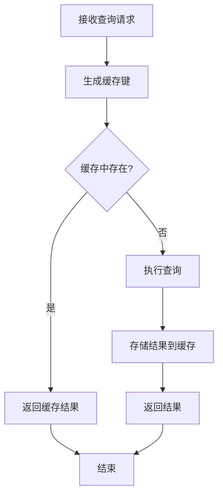

### 限流机制
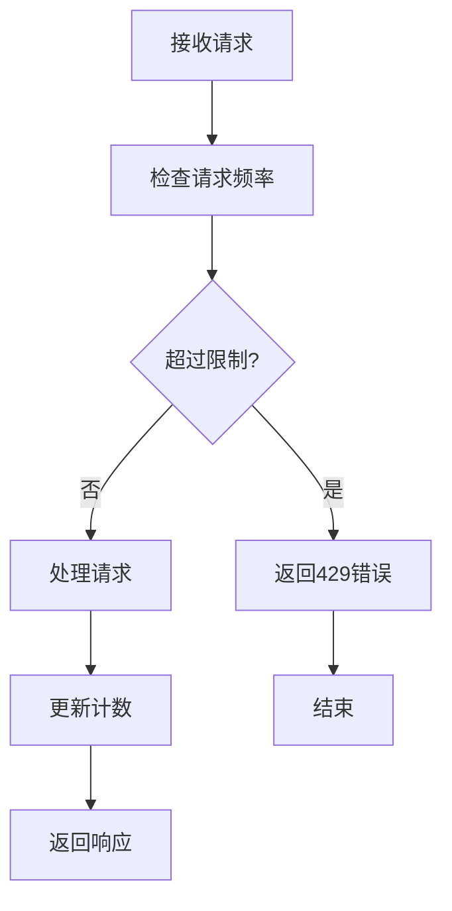

**Diagram sources **
- [rate-limit.js](file://server/middleware/rate-limit.js#L33-L68)

**Section sources**
- [rate-limit.js](file://server/middleware/rate-limit.js#L1-L94)

## 系统架构图
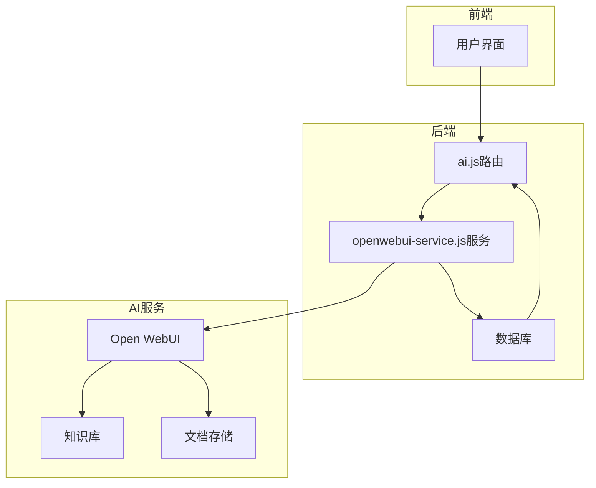

**Diagram sources **
- [ai.js](file://server/routes/v1/ai.js#L1-L416)
- [openwebui-service.js](file://server/services/openwebui-service.js#L1-L359)
- [schema.sql](file://server/db/schema.sql#L1-L202)

**Section sources**
- [ai.js](file://server/routes/v1/ai.js#L1-L416)
- [openwebui-service.js](file://server/services/openwebui-service.js#L1-L359)
- [schema.sql](file://server/db/schema.sql#L1-L202)