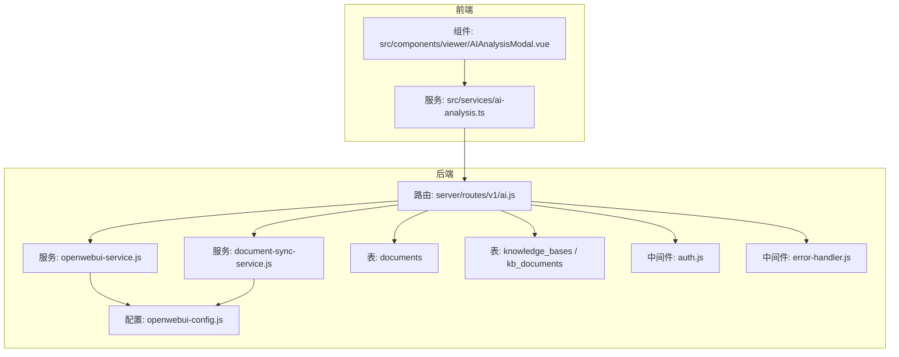
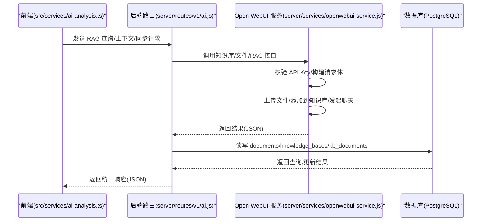
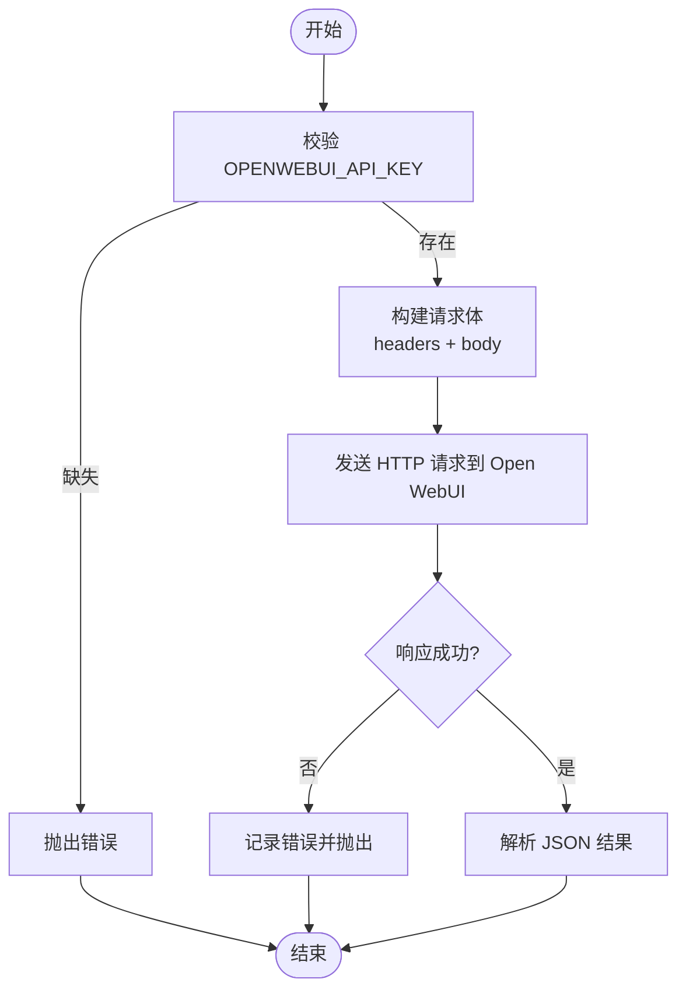
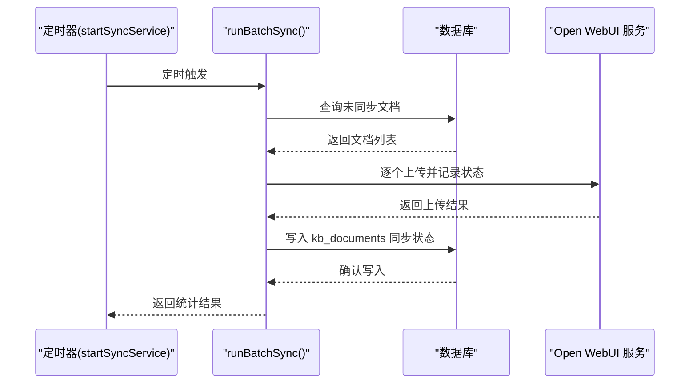
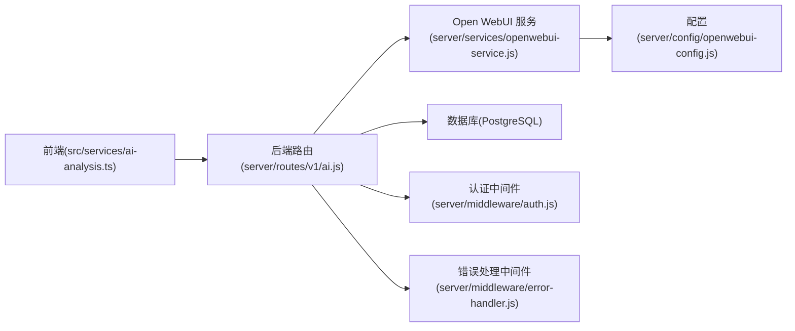
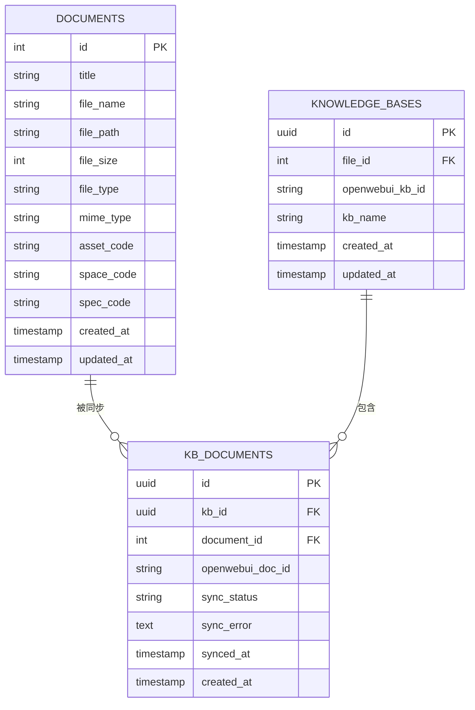

# AI服务API

<cite>
**本文引用的文件**
- [server/routes/v1/ai.js](file://server/routes/v1/ai.js)
- [server/services/openwebui-service.js](file://server/services/openwebui-service.js)
- [server/services/document-sync-service.js](file://server/services/document-sync-service.js)
- [server/config/openwebui-config.js](file://server/config/openwebui-config.js)
- [server/db/create_documents_table.sql](file://server/db/create_documents_table.sql)
- [server/scripts/create-knowledge-base-tables.js](file://server/scripts/create-knowledge-base-tables.js)
- [server/middleware/auth.js](file://server/middleware/auth.js)
- [server/middleware/error-handler.js](file://server/middleware/error-handler.js)
- [src/services/ai-analysis.ts](file://src/services/ai-analysis.ts)
- [src/components/viewer/AIAnalysisModal.vue](file://src/components/viewer/AIAnalysisModal.vue)
</cite>

## 目录
1. [简介](#简介)
2. [项目结构](#项目结构)
3. [核心组件](#核心组件)
4. [架构总览](#架构总览)
5. [详细组件分析](#详细组件分析)
6. [依赖关系分析](#依赖关系分析)
7. [性能考虑](#性能考虑)
8. [故障排查指南](#故障排查指南)
9. [结论](#结论)
10. [附录](#附录)

## 简介
本文件面向开发者与运维人员，系统性梳理 TwinSight 项目的 AI 服务 API，重点覆盖以下能力：
- 知识库管理：创建、列举、删除、查询知识库
- 文档同步：手动同步与自动同步，支持多格式文档入库
- RAG 查询：结合知识库与文件进行检索增强生成
- AI 上下文获取：按房间聚合空间、资产、文档与知识库信息
- 与 Open WebUI 的集成：知识库、文件上传、RAG 聊天
- API 密钥验证与错误处理机制
- 使用示例：RAG 查询、手动同步文档到知识库

## 项目结构
AI 服务 API 主要位于后端 server 目录，前端 src 目录提供调用示例与展示组件。关键目录与文件如下：
- 后端路由与服务
  - 路由：server/routes/v1/ai.js
  - 服务：server/services/openwebui-service.js、server/services/document-sync-service.js
  - 配置：server/config/openwebui-config.js
- 数据模型与迁移
  - 文档表：server/db/create_documents_table.sql
  - 知识库映射表：server/scripts/create-knowledge-base-tables.js
- 中间件
  - 认证与鉴权：server/middleware/auth.js
  - 错误处理：server/middleware/error-handler.js
- 前端调用与展示
  - AI 分析服务：src/services/ai-analysis.ts
  - AI 分析弹窗：src/components/viewer/AIAnalysisModal.vue

图表来源
- [server/routes/v1/ai.js](file://server/routes/v1/ai.js#L1-L416)
- [server/services/openwebui-service.js](file://server/services/openwebui-service.js#L1-L359)
- [server/services/document-sync-service.js](file://server/services/document-sync-service.js#L1-L250)
- [server/config/openwebui-config.js](file://server/config/openwebui-config.js#L1-L56)
- [server/db/create_documents_table.sql](file://server/db/create_documents_table.sql#L1-L49)
- [server/scripts/create-knowledge-base-tables.js](file://server/scripts/create-knowledge-base-tables.js#L1-L84)
- [server/middleware/auth.js](file://server/middleware/auth.js#L1-L120)
- [server/middleware/error-handler.js](file://server/middleware/error-handler.js#L1-L115)
- [src/services/ai-analysis.ts](file://src/services/ai-analysis.ts#L1-L179)
- [src/components/viewer/AIAnalysisModal.vue](file://src/components/viewer/AIAnalysisModal.vue#L1-L499)

章节来源
- [server/routes/v1/ai.js](file://server/routes/v1/ai.js#L1-L416)
- [server/services/openwebui-service.js](file://server/services/openwebui-service.js#L1-L359)
- [server/services/document-sync-service.js](file://server/services/document-sync-service.js#L1-L250)
- [server/config/openwebui-config.js](file://server/config/openwebui-config.js#L1-L56)
- [server/db/create_documents_table.sql](file://server/db/create_documents_table.sql#L1-L49)
- [server/scripts/create-knowledge-base-tables.js](file://server/scripts/create-knowledge-base-tables.js#L1-L84)
- [server/middleware/auth.js](file://server/middleware/auth.js#L1-L120)
- [server/middleware/error-handler.js](file://server/middleware/error-handler.js#L1-L115)
- [src/services/ai-analysis.ts](file://src/services/ai-analysis.ts#L1-L179)
- [src/components/viewer/AIAnalysisModal.vue](file://src/components/viewer/AIAnalysisModal.vue#L1-L499)

## 核心组件
- 路由层（AI API）
  - 健康检查、知识库管理、文档同步、RAG 查询、AI 上下文、来源格式化等接口
- Open WebUI 服务
  - 封装 Open WebUI 的知识库、文件上传、RAG 聊天等调用
- 文档同步服务
  - 自动扫描未同步文档并批量上传至知识库；支持失败重试与状态记录
- 配置中心
  - Open WebUI 基础地址、API Key、端点、支持格式、默认模型等
- 数据模型与迁移
  - documents 表与知识库映射表（knowledge_bases、kb_documents）

章节来源
- [server/routes/v1/ai.js](file://server/routes/v1/ai.js#L1-L416)
- [server/services/openwebui-service.js](file://server/services/openwebui-service.js#L1-L359)
- [server/services/document-sync-service.js](file://server/services/document-sync-service.js#L1-L250)
- [server/config/openwebui-config.js](file://server/config/openwebui-config.js#L1-L56)
- [server/db/create_documents_table.sql](file://server/db/create_documents_table.sql#L1-L49)
- [server/scripts/create-knowledge-base-tables.js](file://server/scripts/create-knowledge-base-tables.js#L1-L84)

## 架构总览
AI 服务 API 的整体交互链路如下：
- 前端通过 src/services/ai-analysis.ts 调用后端 /api/v1/ai/* 接口
- 路由层 server/routes/v1/ai.js 解析请求，调用 Open WebUI 服务与数据库
- Open WebUI 服务 server/services/openwebui-service.js 与 Open WebUI 对接
- 文档同步服务 server/services/document-sync-service.js 负责后台自动同步
- 配置 server/config/openwebui-config.js 提供 Open WebUI 连接参数
- 数据层通过 documents 与知识库映射表实现文档与知识库的关联与状态追踪

图表来源
- [server/routes/v1/ai.js](file://server/routes/v1/ai.js#L1-L416)
- [server/services/openwebui-service.js](file://server/services/openwebui-service.js#L1-L359)
- [server/services/document-sync-service.js](file://server/services/document-sync-service.js#L1-L250)
- [src/services/ai-analysis.ts](file://src/services/ai-analysis.ts#L1-L179)

## 详细组件分析

### 路由层（AI API）
- 健康检查
  - GET /api/v1/ai/health：检查 Open WebUI 服务连通性
- 知识库管理
  - GET /api/v1/ai/knowledge-bases：列出知识库
  - POST /api/v1/ai/knowledge-bases：创建知识库，可选绑定 file_id
- 文档同步
  - POST /api/v1/ai/sync-kb：手动同步，支持按 kbId 或 fileId 自动定位知识库并批量同步文档
- RAG 查询
  - POST /api/v1/ai/query：根据 prompt、kbId 或 fileId 进行检索增强问答
- AI 上下文
  - GET /api/v1/ai/context：按 roomCode 与可选 fileId 获取空间、资产、文档与知识库信息
- 来源格式化
  - POST /api/v1/ai/format-sources：将来源文档名映射为系统内可预览的 URL

章节来源
- [server/routes/v1/ai.js](file://server/routes/v1/ai.js#L1-L416)

### Open WebUI 服务
- 健康检查
  - checkHealth：检测 Open WebUI 服务可用性
- 知识库
  - listKnowledgeBases、createKnowledgeBase、getKnowledgeBase、deleteKnowledgeBase
- 文件与知识库
  - isSupportedFormat：校验文件格式
  - uploadDocument：两步上传（上传文件 → 添加到知识库）
  - listDocuments：列出知识库中的文件
- RAG 聊天
  - chatWithRAG：支持传入 kbId 与 fileIds，构造 files 参数进行检索增强
- 批量同步
  - syncDocumentsToKB：遍历文档列表，逐个上传并记录结果

图表来源
- [server/services/openwebui-service.js](file://server/services/openwebui-service.js#L1-L359)
- [server/config/openwebui-config.js](file://server/config/openwebui-config.js#L1-L56)

章节来源
- [server/services/openwebui-service.js](file://server/services/openwebui-service.js#L1-L359)
- [server/config/openwebui-config.js](file://server/config/openwebui-config.js#L1-L56)

### 文档同步服务（后台）
- 自动同步策略
  - 查询未同步文档（排除已成功/失败），按文档类型过滤
  - 通过资产/空间编码反查模型文件，确定知识库 ID
  - 逐个上传并记录同步状态（成功/失败/跳过）
- 后台定时任务
  - startSyncService(intervalMs)：延迟启动，周期性执行
  - triggerSync()：手动触发一次同步

图表来源
- [server/services/document-sync-service.js](file://server/services/document-sync-service.js#L1-L250)

章节来源
- [server/services/document-sync-service.js](file://server/services/document-sync-service.js#L1-L250)

### 数据模型与迁移
- documents 表
  - 存储文档标题、文件名、路径、大小、类型、MIME、以及与资产/空间/规格的关联字段
  - 约束：三者仅允许单一关联
- 知识库映射表
  - knowledge_bases：file_id → openwebui_kb_id 的映射
  - kb_documents：文档与知识库的同步状态与错误记录

章节来源
- [server/db/create_documents_table.sql](file://server/db/create_documents_table.sql#L1-L49)
- [server/scripts/create-knowledge-base-tables.js](file://server/scripts/create-knowledge-base-tables.js#L1-L84)

### 前端调用与展示
- AI 分析服务
  - triggerTemperatureAlert：触发温度报警分析工作流
  - requestAnalysis：请求手动 AI 分析
  - checkAIHealth：检查 AI 服务状态
- AI 分析弹窗
  - 支持点击分析文本中的文档链接，打开系统内预览

章节来源
- [src/services/ai-analysis.ts](file://src/services/ai-analysis.ts#L1-L179)
- [src/components/viewer/AIAnalysisModal.vue](file://src/components/viewer/AIAnalysisModal.vue#L1-L499)

## 依赖关系分析
- 路由依赖服务与配置
  - /api/v1/ai/* 依赖 openwebui-service.js 与数据库
- 服务依赖配置
  - openwebui-service.js 依赖 openwebui-config.js 的 baseUrl、apiKey、端点与默认模型
- 数据依赖
  - documents 与知识库映射表共同支撑“按房间/资产/规格”聚合上下文
- 前端依赖后端
  - 前端通过 VITE_API_URL 调用后端 AI 接口

图表来源
- [server/routes/v1/ai.js](file://server/routes/v1/ai.js#L1-L416)
- [server/services/openwebui-service.js](file://server/services/openwebui-service.js#L1-L359)
- [server/config/openwebui-config.js](file://server/config/openwebui-config.js#L1-L56)
- [server/middleware/auth.js](file://server/middleware/auth.js#L1-L120)
- [server/middleware/error-handler.js](file://server/middleware/error-handler.js#L1-L115)

章节来源
- [server/routes/v1/ai.js](file://server/routes/v1/ai.js#L1-L416)
- [server/services/openwebui-service.js](file://server/services/openwebui-service.js#L1-L359)
- [server/config/openwebui-config.js](file://server/config/openwebui-config.js#L1-L56)
- [server/middleware/auth.js](file://server/middleware/auth.js#L1-L120)
- [server/middleware/error-handler.js](file://server/middleware/error-handler.js#L1-L115)

## 性能考虑
- 批量同步
  - 后台同步采用分批查询与逐个上传，避免瞬时压力过大
  - 上传前检查文件格式，跳过不支持格式减少无效请求
- 并发控制
  - 同步过程中使用 isSyncing 标记避免重复执行
  - 上传后等待文件处理轮询，超时仍继续添加到知识库
- 数据库索引
  - documents 与知识库映射表均建立必要索引，提升查询效率
- 响应优化
  - 健康检查与上下文接口尽量减少跨表复杂查询，必要时分步查询并合并

[本节为通用建议，无需特定文件来源]

## 故障排查指南
- Open WebUI 连接失败
  - 检查 OPENWEBUI_URL 与 OPENWEBUI_API_KEY 是否正确配置
  - 使用健康检查接口确认服务可达
- 上传失败
  - 检查文件格式是否在支持列表中
  - 查看 kb_documents 中的 sync_error 字段定位失败原因
- RAG 查询无结果
  - 确认知识库 ID 或 fileId 是否正确
  - 检查知识库中是否存在已入库的文档
- 前端无法显示来源
  - 使用来源格式化接口将来源名映射为系统内预览 URL
- 认证与权限
  - 后端使用 JWT 验证，开发模式可跳过；生产环境需提供有效 Bearer Token
  - 错误处理中间件统一返回标准错误结构

章节来源
- [server/services/openwebui-service.js](file://server/services/openwebui-service.js#L1-L359)
- [server/services/document-sync-service.js](file://server/services/document-sync-service.js#L1-L250)
- [server/middleware/auth.js](file://server/middleware/auth.js#L1-L120)
- [server/middleware/error-handler.js](file://server/middleware/error-handler.js#L1-L115)

## 结论
本项目通过清晰的路由层、服务层与配置层，实现了与 Open WebUI 的深度集成，覆盖了知识库管理、文档同步、RAG 查询与 AI 上下文聚合等核心能力。配合统一的认证与错误处理机制，能够稳定支撑上层业务场景。建议在生产环境中：
- 明确 OPENWEBUI_API_KEY 与 baseUrl 的配置
- 合理设置后台同步间隔与并发策略
- 使用来源格式化接口提升用户体验
- 建立完善的监控与告警，关注同步失败率与查询成功率

[本节为总结性内容，无需特定文件来源]

## 附录

### API 定义与使用示例

- 健康检查
  - 方法与路径：GET /api/v1/ai/health
  - 返回：包含 openwebui 状态与时间戳的对象
  - 示例路径：[server/routes/v1/ai.js](file://server/routes/v1/ai.js#L19-L33)

- 知识库管理
  - 列举知识库：GET /api/v1/ai/knowledge-bases
  - 创建知识库：POST /api/v1/ai/knowledge-bases（body：name、description、fileId）
  - 示例路径：
    - [server/routes/v1/ai.js](file://server/routes/v1/ai.js#L35-L82)
    - [server/services/openwebui-service.js](file://server/services/openwebui-service.js#L102-L126)

- 手动同步文档到知识库
  - POST /api/v1/ai/sync-kb（body：kbId 或 fileId，documentIds 可选）
  - 行为：按 fileId 自动定位知识库，查询相关文档并批量上传
  - 示例路径：
    - [server/routes/v1/ai.js](file://server/routes/v1/ai.js#L84-L192)
    - [server/services/openwebui-service.js](file://server/services/openwebui-service.js#L318-L345)

- 使用 RAG 进行查询
  - POST /api/v1/ai/query（body：prompt、kbId、fileId、allowWebSearch）
  - 行为：优先使用 kbId，若提供 fileId 则自动解析知识库 ID
  - 示例路径：
    - [server/routes/v1/ai.js](file://server/routes/v1/ai.js#L194-L232)
    - [server/services/openwebui-service.js](file://server/services/openwebui-service.js#L257-L310)

- 获取 AI 分析上下文
  - GET /api/v1/ai/context（query：roomCode、fileId）
  - 行为：聚合空间、资产、文档与知识库信息
  - 示例路径：
    - [server/routes/v1/ai.js](file://server/routes/v1/ai.js#L234-L355)

- 来源格式化
  - POST /api/v1/ai/format-sources（body：sources、fileId）
  - 行为：将来源文档名映射为系统内预览 URL
  - 示例路径：
    - [server/routes/v1/ai.js](file://server/routes/v1/ai.js#L357-L412)

- 前端调用示例
  - 触发温度报警分析：/api/ai/temperature-alert
  - 手动分析：/api/ai/analyze
  - 检查 AI 服务状态：/api/ai/health
  - 示例路径：
    - [src/services/ai-analysis.ts](file://src/services/ai-analysis.ts#L1-L179)

### API 密钥验证与错误处理机制
- 认证中间件
  - Bearer Token 校验，开发模式可跳过
  - 权限检查（通配符与具体权限）
  - 示例路径：
    - [server/middleware/auth.js](file://server/middleware/auth.js#L1-L120)

- 错误处理中间件
  - 统一返回 success、error、details
  - 特定数据库约束错误与 JSON 解析错误的专门处理
  - 示例路径：
    - [server/middleware/error-handler.js](file://server/middleware/error-handler.js#L1-L115)

### 数据模型图

图表来源
- [server/db/create_documents_table.sql](file://server/db/create_documents_table.sql#L1-L49)
- [server/scripts/create-knowledge-base-tables.js](file://server/scripts/create-knowledge-base-tables.js#L1-L84)