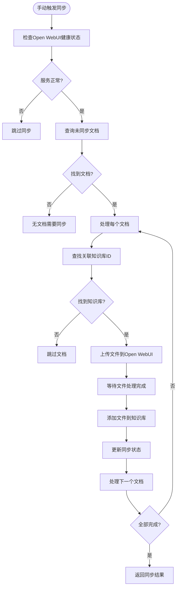
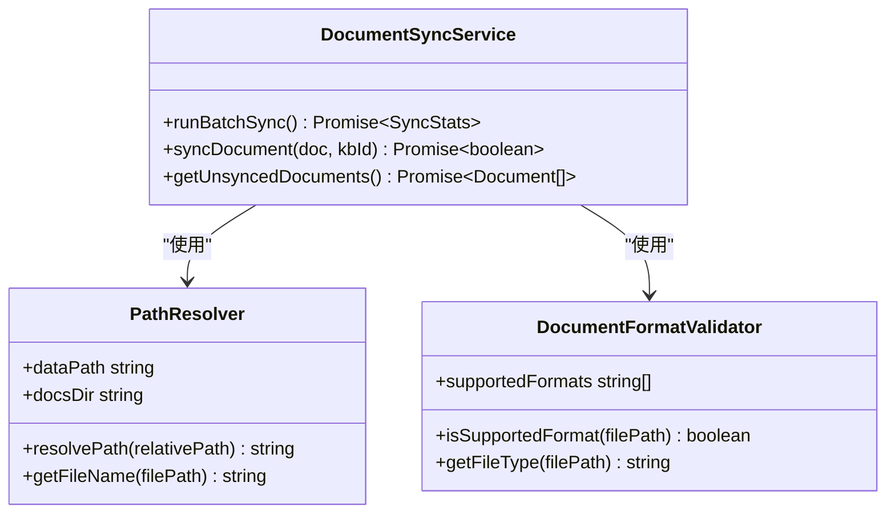
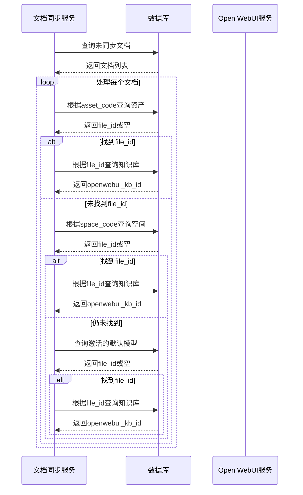
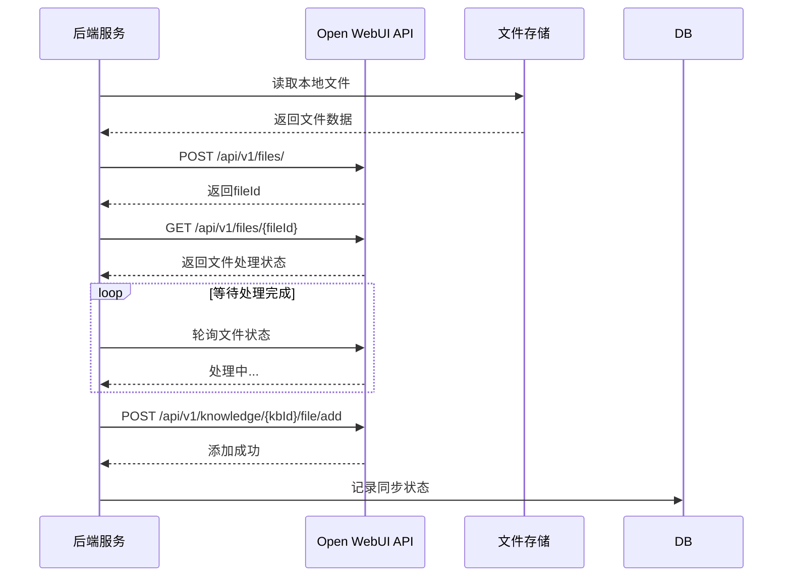
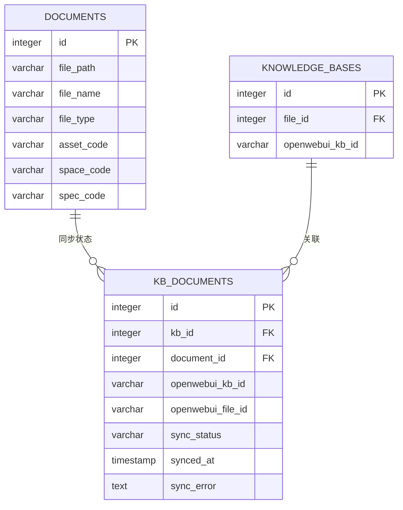
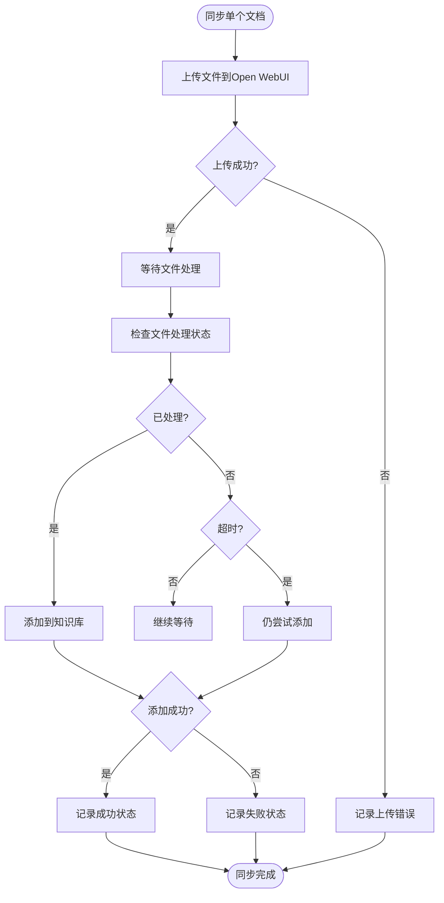
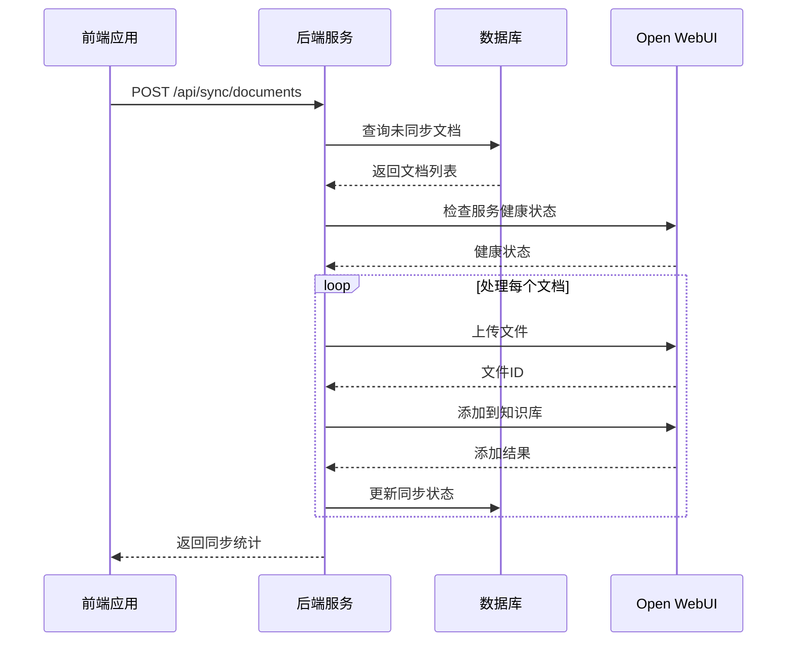

# 文档同步

<cite>
**本文档引用的文件**   
- [document-sync-service.js](file://server/services/document-sync-service.js)
- [openwebui-service.js](file://server/services/openwebui-service.js)
- [documents.js](file://server/routes/documents.js)
- [document.js](file://server/models/document.js)
- [schema.sql](file://server/db/schema.sql)
</cite>

## 目录
1. [简介](#简介)
2. [核心组件](#核心组件)
3. [同步流程详解](#同步流程详解)
4. [文件路径与格式处理](#文件路径与格式处理)
5. [数据库查询与文档关联](#数据库查询与文档关联)
6. [Open WebUI知识库同步机制](#open-webui知识库同步机制)
7. [同步状态记录](#同步状态记录)
8. [错误处理与重试机制](#错误处理与重试机制)
9. [前端调用示例](#前端调用示例)

## 简介
本文档详细说明了文档同步功能的实现机制，涵盖手动触发文档同步到知识库的完整流程。系统支持按知识库ID或文件ID进行同步，通过`syncDocumentsToKB`服务方法实现核心逻辑。文档描述了文件路径处理、格式验证、支持的文档类型，以及从数据库查询关联文档（资产、空间、规格）的机制。同步过程分为两步：先上传文件到Open WebUI，再将其添加到指定知识库。同时包含同步失败的重试机制和超时处理策略，以及同步状态在`kb_documents`表中的记录设计。

## 核心组件

文档同步功能由多个核心组件协同工作，包括文档同步服务、Open WebUI服务、文档模型和路由接口。这些组件共同实现了从文档上传到知识库存储的完整流程。

**Section sources**
- [document-sync-service.js](file://server/services/document-sync-service.js#L1-L250)
- [openwebui-service.js](file://server/services/openwebui-service.js#L1-L359)
- [documents.js](file://server/routes/documents.js#L1-L451)
- [document.js](file://server/models/document.js#L1-L167)

## 同步流程详解

文档同步流程分为手动触发和自动批量执行两种模式。手动触发通过调用`triggerSync`方法启动，而系统也支持定时自动同步。同步过程首先检查Open WebUI服务的健康状态，然后查询数据库中未同步的文档列表，逐个处理并更新同步状态。

**Diagram sources **
- [document-sync-service.js](file://server/services/document-sync-service.js#L157-L217)
- [openwebui-service.js](file://server/services/openwebui-service.js#L66-L74)

## 文件路径与格式处理

系统对文档文件路径和格式进行严格处理，确保只有支持的文件类型才能被同步到知识库。文件路径基于配置的上传目录进行解析，格式验证则通过扩展名匹配实现。

### 文件路径处理
文件路径使用配置中的数据路径进行拼接，支持生产环境和本地开发环境的不同配置。系统使用`appConfig.upload.dataPath`作为基础路径，结合文档的相对路径构建完整文件系统路径。

### 支持的文档类型
系统支持多种文档格式，包括PDF、Office文档、文本文件和数据文件。具体支持的格式通过配置文件定义，并在同步过程中进行验证。

**Diagram sources **
- [document-sync-service.js](file://server/services/document-sync-service.js#L104-L107)
- [openwebui-service.js](file://server/services/openwebui-service.js#L132-L135)
- [config/index.js](file://server/config/index.js)

## 数据库查询与文档关联

系统通过数据库查询机制确定文档与知识库的关联关系。文档可以关联到资产、空间或规格，系统根据这些关联信息查找对应的知识库ID。

### 文档关联查询逻辑
系统按照优先级顺序查找关联的知识库：
1. 首先通过`asset_code`查找资产对应的模型文件
2. 如果未找到，则通过`space_code`查找空间对应的模型文件
3. 如果仍未找到，则使用当前激活的默认模型文件

**Diagram sources **
- [document-sync-service.js](file://server/services/document-sync-service.js#L41-L91)
- [document.js](file://server/models/document.js#L12-L38)

## Open WebUI知识库同步机制

文档同步到Open WebUI知识库采用两步式上传机制，确保文件正确处理并添加到知识库中。该过程包括文件上传和知识库添加两个独立但关联的步骤。

### 两步式上传流程
1. **文件上传阶段**：将本地文件上传到Open WebUI的文件管理系统
2. **知识库添加阶段**：将已上传的文件添加到指定的知识库中

**Diagram sources **
- [openwebui-service.js](file://server/services/openwebui-service.js#L146-L237)
- [document-sync-service.js](file://server/services/document-sync-service.js#L110-L119)

## 同步状态记录

系统使用`kb_documents`表记录每个文档的同步状态，确保同步过程的可追溯性和幂等性。该表存储了同步结果、时间戳和错误信息，防止重复同步和数据丢失。

### kb_documents表结构
| 字段名 | 类型 | 说明 |
|--------|------|------|
| id | SERIAL | 主键 |
| kb_id | INTEGER | 知识库记录ID（外键） |
| document_id | INTEGER | 文档ID（外键） |
| openwebui_kb_id | TEXT | Open WebUI知识库ID |
| openwebui_file_id | TEXT | Open WebUI文件ID |
| sync_status | VARCHAR | 同步状态（synced, failed, pending） |
| synced_at | TIMESTAMP | 同步时间 |
| sync_error | TEXT | 同步错误信息 |

**Diagram sources **
- [schema.sql](file://server/db/schema.sql#L203-L350)
- [document-sync-service.js](file://server/services/document-sync-service.js#L122-L144)

## 错误处理与重试机制

系统实现了完善的错误处理和重试机制，确保同步过程的稳定性和可靠性。当同步失败时，系统会记录错误信息并避免无限重试，同时提供适当的超时处理策略。

### 错误处理策略
- **服务健康检查**：在同步前检查Open WebUI服务状态
- **格式验证**：跳过不支持的文件格式
- **异常捕获**：捕获上传和添加过程中的所有异常
- **状态记录**：记录失败状态以防止重复尝试

### 超时处理
系统在文件上传后等待最多30秒，通过轮询检查文件处理状态。如果超时，系统仍会尝试将文件添加到知识库，确保不会因处理延迟而完全失败。

**Diagram sources **
- [document-sync-service.js](file://server/services/document-sync-service.js#L132-L147)
- [openwebui-service.js](file://server/services/openwebui-service.js#L186-L214)

## 前端调用示例

前端可以通过API接口手动触发文档同步过程。以下是一个使用JavaScript调用同步API的示例：

**Diagram sources **
- [document-sync-service.js](file://server/services/document-sync-service.js#L241-L243)
- [routes/documents.js](file://server/routes/documents.js)