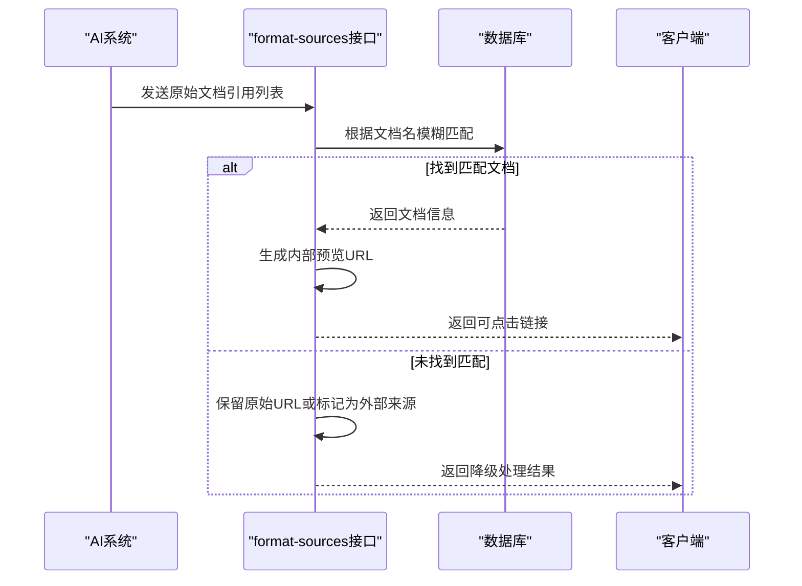
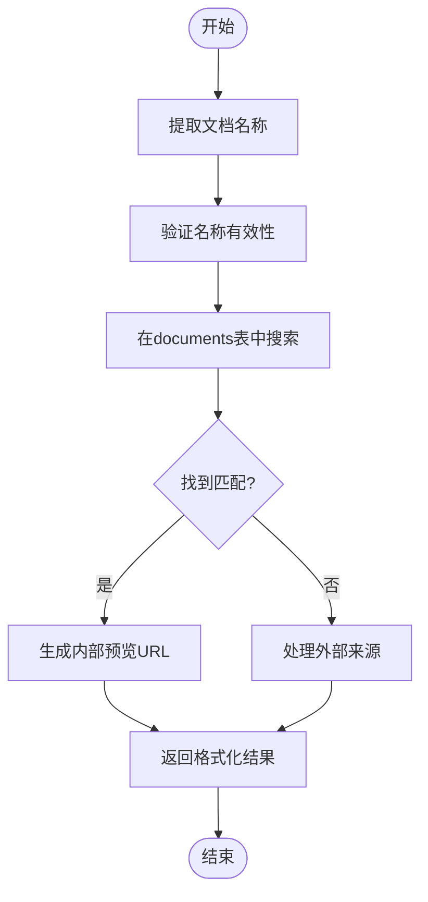
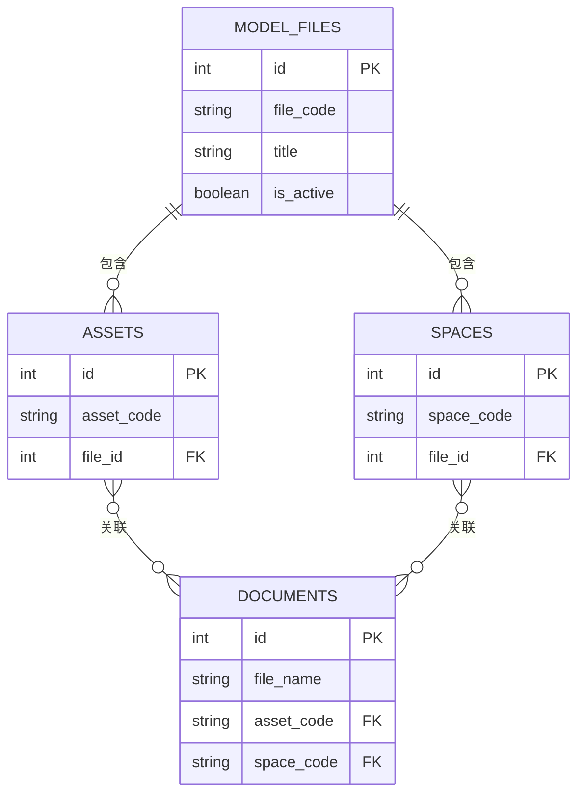
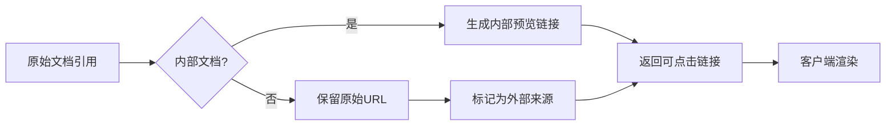
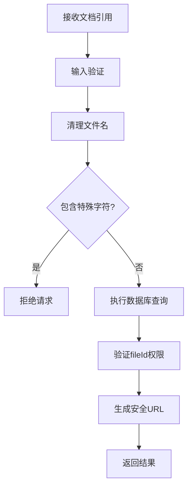
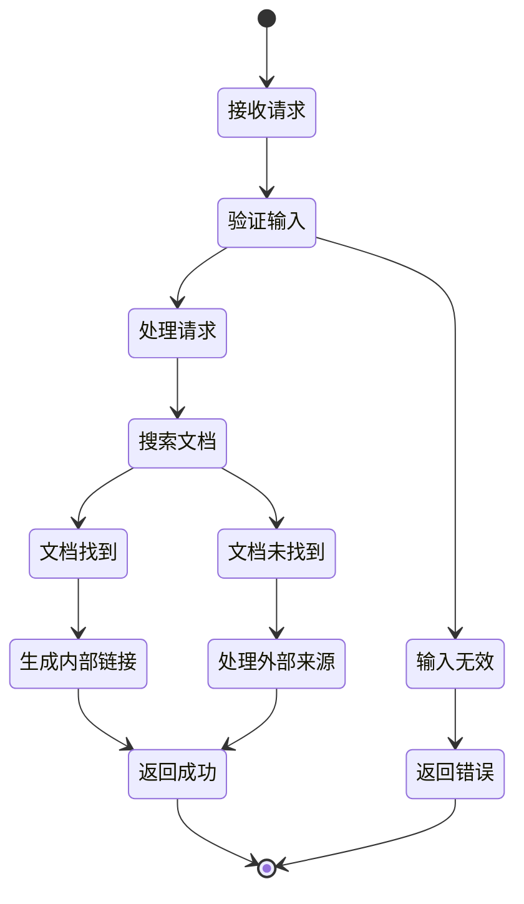

# 来源格式化

<cite>
**本文档引用的文件**  
- [ai.js](file://server/routes/v1/ai.js#L357-L412)
- [document.js](file://server/models/document.js)
- [documents.js](file://server/routes/documents.js#L397-L428)
- [create_documents_table.sql](file://server/db/create_documents_table.sql)
- [model-file.js](file://server/models/model-file.js)
- [add-file-id.sql](file://server/db/migrations/add-file-id.sql)
- [schema.sql](file://server/db/schema.sql)
</cite>

## 目录
1. [简介](#简介)
2. [核心功能分析](#核心功能分析)
3. [来源格式化接口实现](#来源格式化接口实现)
4. [文档匹配逻辑](#文档匹配逻辑)
5. [fileId作用域限制](#fileid作用域限制)
6. [外部来源降级处理](#外部来源降级处理)
7. [安全性考虑](#安全性考虑)
8. [性能优化建议](#性能优化建议)
9. [错误处理与默认行为](#错误处理与默认行为)

## 简介
来源格式化功能是系统中AI回复处理的核心组件，负责将AI生成的原始文档引用转换为系统内可点击的预览链接。该功能通过`format-sources`接口实现，能够智能识别文档名称并匹配系统内文档，为用户提供无缝的文档访问体验。

## 核心功能分析

来源格式化功能主要涉及文档管理、AI服务集成和数据关联三个核心模块。系统通过fileId将模型文件与相关数据实体（资产、空间、规格等）进行关联，确保数据隔离和上下文准确性。

**Section sources**
- [ai.js](file://server/routes/v1/ai.js#L357-L412)
- [model-file.js](file://server/models/model-file.js)

## 来源格式化接口实现

`format-sources`接口是来源格式化功能的核心，位于`/api/v1/ai/format-sources`端点。该接口接收AI回复中的原始文档引用，将其转换为系统内可点击的预览链接。



**Diagram sources**
- [ai.js](file://server/routes/v1/ai.js#L357-L412)
- [documents.js](file://server/routes/documents.js#L397-L428)

**Section sources**
- [ai.js](file://server/routes/v1/ai.js#L357-L412)

## 文档匹配逻辑

来源格式化功能通过模糊匹配算法在documents表中查找对应的文档记录。系统使用ILIKE操作符进行不区分大小写的模式匹配，提高匹配准确率。



**Diagram sources**
- [ai.js](file://server/routes/v1/ai.js#L377-L383)
- [create_documents_table.sql](file://server/db/create_documents_table.sql)

**Section sources**
- [ai.js](file://server/routes/v1/ai.js#L377-L383)

## fileId作用域限制

fileId用于限定文档搜索的作用域，确保只匹配特定模型文件下的文档。系统通过关联查询，验证文档是否属于指定fileId对应模型文件的资产、空间或规格。



**Diagram sources**
- [add-file-id.sql](file://server/db/migrations/add-file-id.sql)
- [schema.sql](file://server/db/schema.sql)

**Section sources**
- [add-file-id.sql](file://server/db/migrations/add-file-id.sql)
- [schema.sql](file://server/db/schema.sql)

## 外部来源降级处理

当文档在系统内未找到匹配时，系统会进行降级处理，保留原始URL或标记为外部来源，确保AI回复的完整性不受影响。



**Diagram sources**
- [ai.js](file://server/routes/v1/ai.js#L395-L400)

**Section sources**
- [ai.js](file://server/routes/v1/ai.js#L395-L400)

## 安全性考虑

系统在来源格式化过程中实施了多项安全措施，防止路径遍历攻击和其他安全风险。



**Diagram sources**
- [ai.js](file://server/routes/v1/ai.js)
- [documents.js](file://server/routes/documents.js)

**Section sources**
- [ai.js](file://server/routes/v1/ai.js)
- [documents.js](file://server/routes/documents.js)

## 性能优化建议

为提高来源格式化功能的性能，建议在文档名称字段上添加全文索引，优化模糊查询效率。

```mermaid
graph TB
A[性能瓶颈] --> B[模糊查询慢]
B --> C[解决方案]
C --> D[添加全文索引]
C --> E[缓存常用查询]
C --> F[优化数据库查询]
D --> G[CREATE INDEX documents_title_idx ON documents USING GIN(title gin_trgm_ops)]
E --> H[Redis缓存匹配结果]
F --> I[优化SQL查询语句]
```

**Diagram sources**
- [create_documents_table.sql](file://server/db/create_documents_table.sql)

**Section sources**
- [create_documents_table.sql](file://server/db/create_documents_table.sql)

## 错误处理与默认行为

系统对各种异常情况进行了完善的错误处理，确保在文档未找到或其他错误情况下仍能提供合理的默认行为。



**Diagram sources**
- [ai.js](file://server/routes/v1/ai.js)

**Section sources**
- [ai.js](file://server/routes/v1/ai.js)