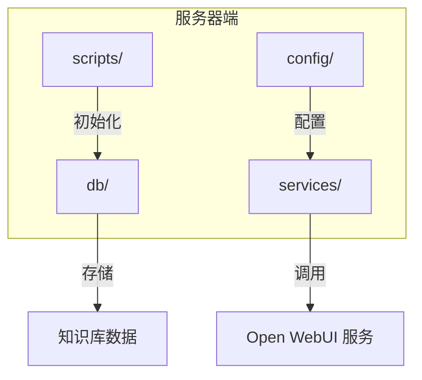
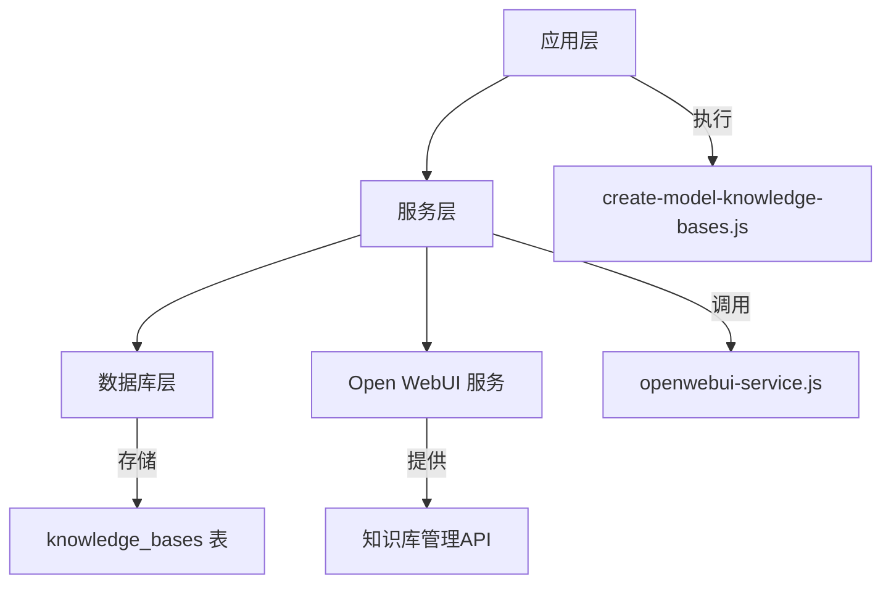
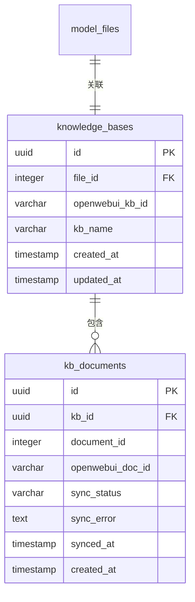
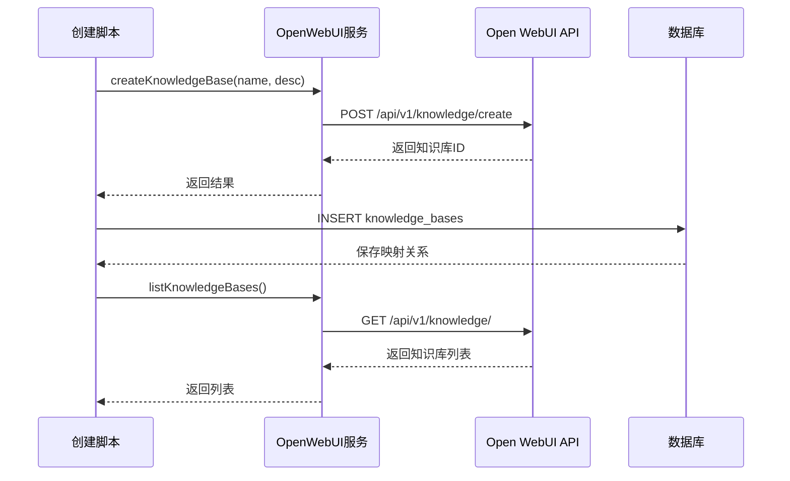
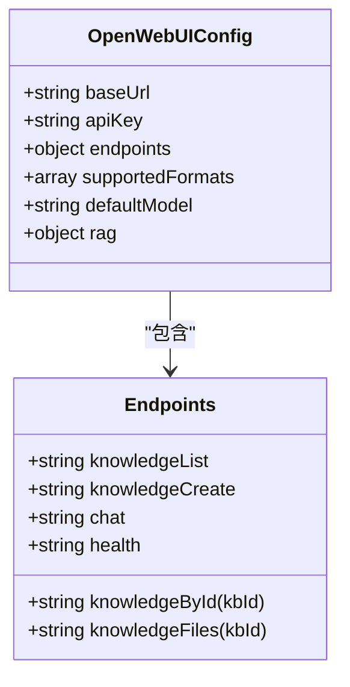
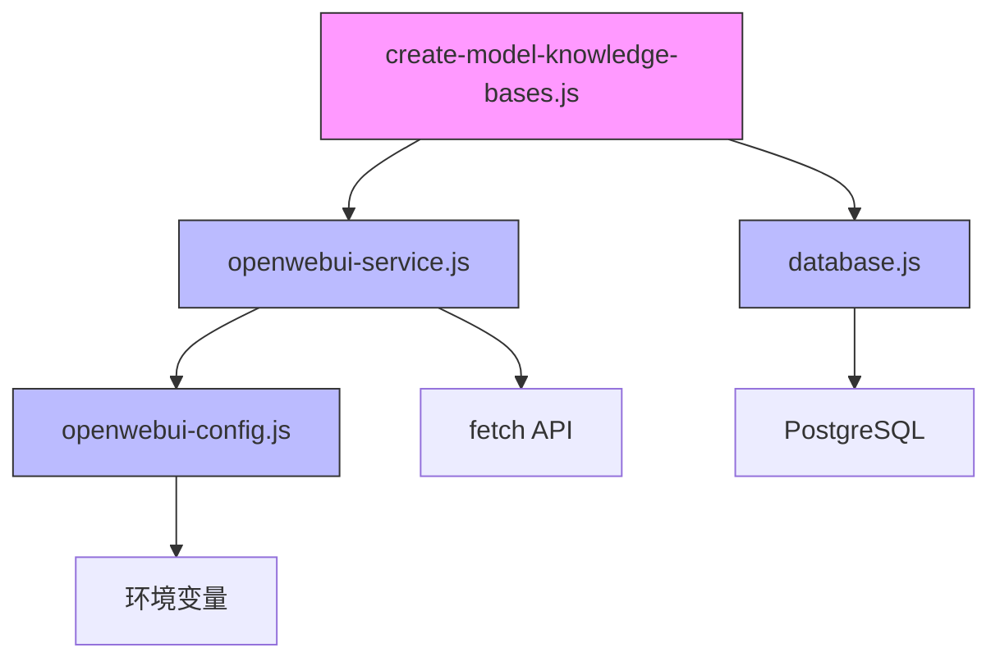

# 知识库管理

<cite>
**本文档引用的文件**
- [create-knowledge-base-tables.js](file://server/scripts/create-knowledge-base-tables.js)
- [create-model-knowledge-bases.js](file://server/scripts/create-model-knowledge-bases.js)
- [openwebui-service.js](file://server/services/openwebui-service.js)
- [openwebui-config.js](file://server/config/openwebui-config.js)
- [schema.sql](file://server/db/schema.sql)
</cite>

## 目录
1. [简介](#简介)
2. [项目结构](#项目结构)
3. [核心组件](#核心组件)
4. [架构概述](#架构概述)
5. [详细组件分析](#详细组件分析)
6. [依赖分析](#依赖分析)
7. [性能考虑](#性能考虑)
8. [故障排除指南](#故障排除指南)
9. [结论](#结论)
10. [附录](#附录)（如有必要）

## 简介
本文档详细介绍了知识库管理功能的实现，涵盖知识库的创建、查询和删除操作。文档解释了如何通过API创建知识库并将其与文件ID关联存储在数据库中，以及如何获取所有知识库列表。同时描述了与Open WebUI服务的集成机制，包括调用`createKnowledgeBase`、`listKnowledgeBases`等方法的具体实现。提供了创建知识库的代码示例，说明请求参数、响应格式及错误处理策略，并说明了数据库中`knowledge_bases`表的作用和字段含义。

## 项目结构
知识库管理功能主要分布在服务器端的`scripts`、`services`、`config`和`db`目录中。核心功能由`create-knowledge-base-tables.js`脚本初始化数据库结构，`openwebui-service.js`提供与Open WebUI服务的集成接口，`openwebui-config.js`管理服务配置，而数据库表结构定义在`schema.sql`文件中。

**图表来源**
- [create-knowledge-base-tables.js](file://server/scripts/create-knowledge-base-tables.js#L1-L84)
- [schema.sql](file://server/db/schema.sql#L1-L202)

**章节来源**
- [create-knowledge-base-tables.js](file://server/scripts/create-knowledge-base-tables.js#L1-L84)
- [schema.sql](file://server/db/schema.sql#L1-L202)

## 核心组件
知识库管理的核心组件包括数据库表结构、Open WebUI服务集成和知识库创建脚本。这些组件共同实现了知识库的生命周期管理，从创建、查询到删除的完整功能。

**章节来源**
- [create-knowledge-base-tables.js](file://server/scripts/create-knowledge-base-tables.js#L1-L84)
- [openwebui-service.js](file://server/services/openwebui-service.js#L1-L359)

## 架构概述
知识库管理系统的架构分为三层：数据库层、服务层和应用层。数据库层负责持久化存储知识库与文件的映射关系；服务层提供与Open WebUI的API集成；应用层通过脚本和API调用实现具体业务逻辑。

**图表来源**
- [openwebui-service.js](file://server/services/openwebui-service.js#L1-L359)
- [create-model-knowledge-bases.js](file://server/scripts/create-model-knowledge-bases.js#L1-L97)

## 详细组件分析

### 数据库表结构分析
知识库管理功能的数据库设计包含两个核心表：`knowledge_bases`和`kb_documents`，用于存储知识库与系统文件的映射关系及同步状态。

#### 知识库表结构

**图表来源**
- [create-knowledge-base-tables.js](file://server/scripts/create-knowledge-base-tables.js#L18-L26)
- [schema.sql](file://server/db/schema.sql#L8-L26)

**章节来源**
- [create-knowledge-base-tables.js](file://server/scripts/create-knowledge-base-tables.js#L1-L84)

### 服务集成分析
Open WebUI服务提供了知识库管理的核心API，包括创建、查询、删除知识库以及文档上传和RAG查询等功能。

#### 服务方法调用流程

**图表来源**
- [openwebui-service.js](file://server/services/openwebui-service.js#L83-L105)
- [create-model-knowledge-bases.js](file://server/scripts/create-model-knowledge-bases.js#L57-L64)

**章节来源**
- [openwebui-service.js](file://server/services/openwebui-service.js#L1-L359)

### 配置管理分析
Open WebUI的配置管理通过`openwebui-config.js`文件实现，集中管理服务URL、API密钥、支持的文件格式等配置项。

#### 配置结构

**图表来源**
- [openwebui-config.js](file://server/config/openwebui-config.js#L6-L56)

**章节来源**
- [openwebui-config.js](file://server/config/openwebui-config.js#L1-L56)

## 依赖分析
知识库管理功能依赖于多个核心组件和服务，形成了一个完整的依赖链。

**图表来源**
- [create-model-knowledge-bases.js](file://server/scripts/create-model-knowledge-bases.js#L8-L11)
- [openwebui-service.js](file://server/services/openwebui-service.js#L6-L8)
- [config/index.js](file://server/config/index.js)

**章节来源**
- [create-model-knowledge-bases.js](file://server/scripts/create-model-knowledge-bases.js#L1-L97)
- [openwebui-service.js](file://server/services/openwebui-service.js#L1-L359)

## 性能考虑
知识库管理功能在设计时考虑了多个性能因素，包括数据库索引优化、API调用效率和文件处理等待机制。

- **数据库索引**：为`knowledge_bases`和`kb_documents`表的关键字段创建了索引，确保查询性能
- **API调用**：使用Bearer Token认证，减少认证开销
- **文件处理**：实现轮询机制等待Open WebUI处理文件内容，避免过早添加到知识库
- **批量操作**：提供批量同步文档到知识库的功能，减少API调用次数

**章节来源**
- [create-knowledge-base-tables.js](file://server/scripts/create-knowledge-base-tables.js#L46-L51)
- [openwebui-service.js](file://server/services/openwebui-service.js#L186-L214)

## 故障排除指南
在使用知识库管理功能时可能遇到的常见问题及解决方案：

1. **Open WebUI服务不可用**
   - 检查`OPENWEBUI_URL`环境变量是否正确配置
   - 确认Open WebUI服务正在运行且可访问

2. **API密钥未配置**
   - 确保`OPENWEBUI_API_KEY`环境变量已设置
   - 检查密钥是否具有足够的权限

3. **文件格式不支持**
   - 确认上传的文件格式在支持列表中（.docx, .pdf, .txt等）
   - 检查文件扩展名是否正确

4. **数据库连接失败**
   - 检查数据库配置是否正确
   - 确认数据库服务正在运行

**章节来源**
- [openwebui-service.js](file://server/services/openwebui-service.js#L27-L30)
- [openwebui-service.js](file://server/services/openwebui-service.js#L147-L149)

## 结论
知识库管理功能通过集成Open WebUI服务，实现了完整的知识库生命周期管理。系统通过`knowledge_bases`表将模型文件与Open WebUI知识库进行映射，提供了创建、查询和删除知识库的能力。服务层封装了与Open WebUI的API交互，简化了上层应用的调用。配置管理集中化，便于维护和修改。整体设计考虑了性能和可靠性，为系统提供了强大的知识管理能力。

## 附录

### knowledge_bases表字段说明
| 字段名 | 类型 | 是否为空 | 约束 | 说明 |
|--------|------|----------|------|------|
| id | UUID | 否 | PRIMARY KEY | 主键，自动生成 |
| file_id | INTEGER | 否 | FOREIGN KEY | 关联的模型文件ID，级联删除 |
| openwebui_kb_id | VARCHAR(255) | 否 | NOT NULL | Open WebUI中的知识库ID |
| kb_name | VARCHAR(255) | 否 | NOT NULL | 知识库名称 |
| created_at | TIMESTAMP | 是 | DEFAULT CURRENT_TIMESTAMP | 创建时间 |
| updated_at | TIMESTAMP | 是 | DEFAULT CURRENT_TIMESTAMP | 更新时间 |
| UNIQUE(file_id) | - | - | 唯一约束 | 确保每个文件只能关联一个知识库 |

**章节来源**
- [create-knowledge-base-tables.js](file://server/scripts/create-knowledge-base-tables.js#L18-L26)

### Open WebUI API端点
| 端点 | 方法 | 说明 |
|------|------|------|
| `/api/v1/knowledge/` | GET | 获取所有知识库列表 |
| `/api/v1/knowledge/create` | POST | 创建新知识库 |
| `/api/v1/knowledge/{id}` | GET | 获取单个知识库详情 |
| `/api/v1/knowledge/{id}/delete` | DELETE | 删除知识库 |
| `/api/v1/files/` | POST | 上传文件到文件管理系统 |
| `/api/v1/knowledge/{id}/file/add` | POST | 将文件添加到知识库 |
| `/api/chat/completions` | POST | 使用RAG进行聊天查询 |
| `/health` | GET | 健康检查 |

**章节来源**
- [openwebui-config.js](file://server/config/openwebui-config.js#L17-L32)