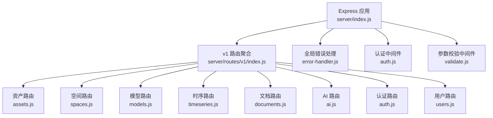
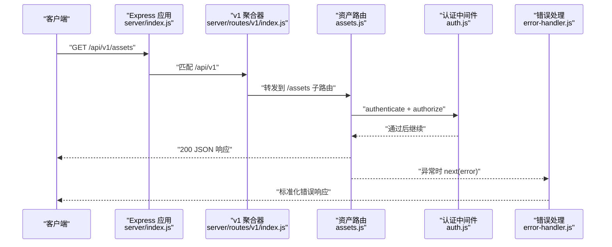
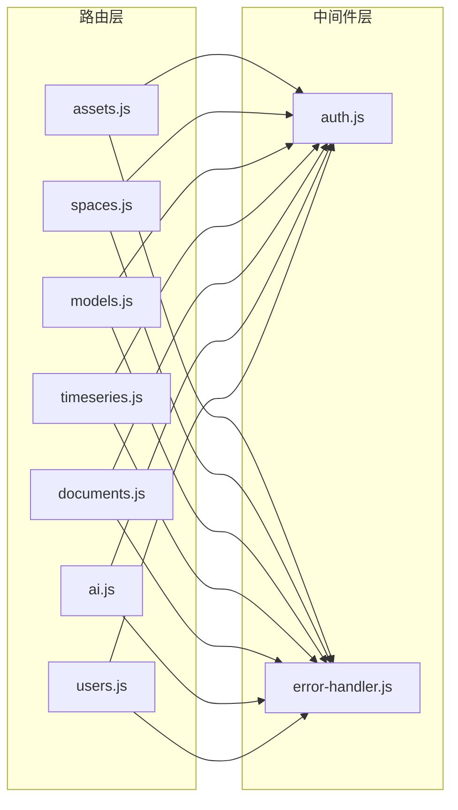

# API路由设计

<cite>
**本文引用的文件**
- [server/index.js](file://server/index.js)
- [server/routes/v1/index.js](file://server/routes/v1/index.js)
- [server/routes/v1/assets.js](file://server/routes/v1/assets.js)
- [server/routes/v1/spaces.js](file://server/routes/v1/spaces.js)
- [server/routes/v1/documents.js](file://server/routes/v1/documents.js)
- [server/routes/v1/users.js](file://server/routes/v1/users.js)
- [server/routes/v1/models.js](file://server/routes/v1/models.js)
- [server/routes/v1/timeseries.js](file://server/routes/v1/timeseries.js)
- [server/routes/v1/ai.js](file://server/routes/v1/ai.js)
- [server/middleware/auth.js](file://server/middleware/auth.js)
- [server/middleware/error-handler.js](file://server/middleware/error-handler.js)
- [server/config/auth.js](file://server/config/auth.js)
</cite>

## 目录
1. [简介](#简介)
2. [项目结构](#项目结构)
3. [核心组件](#核心组件)
4. [架构总览](#架构总览)
5. [详细组件分析](#详细组件分析)
6. [依赖分析](#依赖分析)
7. [性能考虑](#性能考虑)
8. [故障排查指南](#故障排查指南)
9. [结论](#结论)
10. [附录](#附录)

## 简介
本文件聚焦于 API v1 版本的路由架构设计与实现，系统性解析 index.js 如何聚合资产、空间、模型、时序、文档、AI、认证与用户等子路由；阐述 RESTful 设计原则在实际路由中的应用（资源命名、HTTP 方法映射、版本控制策略）；说明中间件注入方式与错误传播机制；并讨论未来版本兼容性与扩展性设计建议。

## 项目结构
- 服务入口通过 Express 应用启动，统一挂载新版 v1 路由与旧版兼容路由。
- v1 路由采用模块化设计，每个领域（资产、空间、模型、时序、文档、AI、认证、用户）独立文件，最终在 v1 聚合器中统一挂载。
- 中间件层提供认证、授权、参数校验与全局错误处理。

图表来源
- [server/index.js](file://server/index.js#L106-L121)
- [server/routes/v1/index.js](file://server/routes/v1/index.js#L28-L39)

章节来源
- [server/index.js](file://server/index.js#L106-L121)
- [server/routes/v1/index.js](file://server/routes/v1/index.js#L1-L42)

## 核心组件
- v1 路由聚合器：集中挂载各子路由模块，提供健康检查端点。
- 各领域路由：按资源建模，遵循 RESTful 命名与方法映射。
- 中间件链：认证、授权、参数校验、错误处理贯穿各路由。
- 权限与角色：统一的权限常量与角色映射，便于细粒度授权。

章节来源
- [server/routes/v1/index.js](file://server/routes/v1/index.js#L1-L42)
- [server/middleware/auth.js](file://server/middleware/auth.js#L1-L120)
- [server/middleware/error-handler.js](file://server/middleware/error-handler.js#L1-L115)
- [server/config/auth.js](file://server/config/auth.js#L1-L142)

## 架构总览
- 版本控制：统一前缀 /api/v1，新功能优先在此版本下开发，旧版路由保留兼容。
- 路由挂载：v1 聚合器在服务入口处挂载，子路由按领域划分，路径前缀为 /api/v1/{resource}。
- 中间件注入：各路由在处理函数前注入认证与授权中间件，参数校验中间件负责输入规范化与错误返回。
- 错误传播：统一的 ApiError 类型与全局错误处理器，确保一致的错误响应格式。

图表来源
- [server/index.js](file://server/index.js#L106-L121)
- [server/routes/v1/index.js](file://server/routes/v1/index.js#L28-L39)
- [server/routes/v1/assets.js](file://server/routes/v1/assets.js#L33-L57)
- [server/middleware/auth.js](file://server/middleware/auth.js#L12-L54)
- [server/middleware/error-handler.js](file://server/middleware/error-handler.js#L55-L108)

## 详细组件分析

### v1 路由聚合器（index.js）
- 功能：健康检查、挂载各子路由模块。
- 关键点：
  - 健康检查：返回版本与时间戳信息。
  - 子路由挂载：按领域挂载，路径前缀为 /api/v1/{resource}。
  - 预留扩展：注释保留了设施、属性等预留路由挂载位置。

章节来源
- [server/routes/v1/index.js](file://server/routes/v1/index.js#L1-L42)

### 资产路由（assets.js）
- 资源命名：复数形式 /api/v1/assets，支持按文件或规格过滤。
- HTTP 方法映射：
  - GET /api/v1/assets：分页/过滤获取资产列表。
  - GET /api/v1/assets/{code}：按编码获取资产详情。
  - POST /api/v1/assets：创建资产。
  - PUT /api/v1/assets/{code}：更新资产。
  - DELETE /api/v1/assets/{code}：删除资产。
  - POST /api/v1/assets/batch：批量导入资产。
- 中间件注入：认证、授权、参数校验。
- 错误处理：统一抛出 ApiError，交由全局错误处理器处理。

章节来源
- [server/routes/v1/assets.js](file://server/routes/v1/assets.js#L33-L164)
- [server/routes/v1/assets.js](file://server/routes/v1/assets.js#L166-L253)
- [server/middleware/auth.js](file://server/middleware/auth.js#L12-L54)
- [server/middleware/error-handler.js](file://server/middleware/error-handler.js#L1-L115)
- [server/config/auth.js](file://server/config/auth.js#L1-L62)

### 空间路由（spaces.js）
- 资源命名：复数形式 /api/v1/spaces，支持按文件与楼层过滤。
- HTTP 方法映射：
  - GET /api/v1/spaces：获取空间列表。
  - GET /api/v1/spaces/{code}：按编码获取空间详情。
  - POST /api/v1/spaces：创建空间。
  - PUT /api/v1/spaces/{code}：更新空间。
  - DELETE /api/v1/spaces/{code}：删除空间。
  - POST /api/v1/spaces/batch：批量导入空间。
  - GET /api/v1/spaces/floors：获取楼层列表。
- 中间件注入：认证、授权、参数校验。
- 错误处理：统一抛出 ApiError，交由全局错误处理器处理。

章节来源
- [server/routes/v1/spaces.js](file://server/routes/v1/spaces.js#L21-L155)
- [server/routes/v1/spaces.js](file://server/routes/v1/spaces.js#L157-L220)
- [server/middleware/auth.js](file://server/middleware/auth.js#L12-L54)
- [server/middleware/error-handler.js](file://server/middleware/error-handler.js#L1-L115)
- [server/config/auth.js](file://server/config/auth.js#L1-L62)

### 模型文件路由（models.js）
- 资源命名：复数形式 /api/v1/models，支持激活、关联资产/空间查询。
- HTTP 方法映射：
  - GET /api/v1/models：获取模型文件列表。
  - GET /api/v1/models/{id}：按 ID 获取模型文件详情。
  - PUT /api/v1/models/{id}：更新模型文件信息。
  - DELETE /api/v1/models/{id}：删除模型文件。
  - POST /api/v1/models/{id}/activate：激活模型文件。
  - GET /api/v1/models/active：获取当前激活的模型文件。
  - GET /api/v1/models/{id}/assets：获取模型文件关联的资产。
  - GET /api/v1/models/{id}/spaces：获取模型文件关联的空间。
- 中间件注入：认证、授权、参数校验。
- 错误处理：统一抛出 ApiError，交由全局错误处理器处理。

章节来源
- [server/routes/v1/models.js](file://server/routes/v1/models.js#L21-L174)
- [server/routes/v1/models.js](file://server/routes/v1/models.js#L176-L224)
- [server/middleware/auth.js](file://server/middleware/auth.js#L12-L54)
- [server/middleware/error-handler.js](file://server/middleware/error-handler.js#L1-L115)
- [server/config/auth.js](file://server/config/auth.js#L1-L62)

### 时序数据路由（timeseries.js）
- 资源命名：复数形式 /api/v1/timeseries，封装 InfluxDB 查询。
- HTTP 方法映射：
  - GET /api/v1/timeseries/query：查询单房间时序数据。
  - POST /api/v1/timeseries/query/batch：批量查询多房间时序数据。
  - POST /api/v1/timeseries/latest：获取多房间最新温度值。
  - GET /api/v1/timeseries/latest/{roomCode}：获取单房间最新温度值。
  - GET /api/v1/timeseries/statistics：获取时间范围内的统计数据。
- 中间件注入：认证、授权、参数校验。
- 错误处理：统一抛出 ApiError，交由全局错误处理器处理。

章节来源
- [server/routes/v1/timeseries.js](file://server/routes/v1/timeseries.js#L41-L164)
- [server/routes/v1/timeseries.js](file://server/routes/v1/timeseries.js#L166-L288)
- [server/routes/v1/timeseries.js](file://server/routes/v1/timeseries.js#L290-L352)
- [server/middleware/auth.js](file://server/middleware/auth.js#L12-L54)
- [server/middleware/error-handler.js](file://server/middleware/error-handler.js#L1-L115)
- [server/config/auth.js](file://server/config/auth.js#L1-L62)

### 文档路由（documents.js）
- 资源命名：复数形式 /api/v1/documents，支持文件上传与关联查询。
- HTTP 方法映射：
  - GET /api/v1/documents：获取文档列表（支持资产/空间/分类过滤）。
  - GET /api/v1/documents/{id}：按 ID 获取文档详情。
  - POST /api/v1/documents：上传文档（multipart/form-data）。
  - PUT /api/v1/documents/{id}：更新文档信息。
  - DELETE /api/v1/documents/{id}：删除文档并清理文件。
  - GET /api/v1/documents/asset/{assetCode}：获取资产关联的文档。
  - GET /api/v1/documents/space/{spaceCode}：获取空间关联的文档。
- 中间件注入：认证、授权、参数校验、文件上传中间件。
- 错误处理：统一抛出 ApiError，交由全局错误处理器处理。

章节来源
- [server/routes/v1/documents.js](file://server/routes/v1/documents.js#L54-L133)
- [server/routes/v1/documents.js](file://server/routes/v1/documents.js#L135-L265)
- [server/routes/v1/documents.js](file://server/routes/v1/documents.js#L267-L325)
- [server/middleware/auth.js](file://server/middleware/auth.js#L12-L54)
- [server/middleware/error-handler.js](file://server/middleware/error-handler.js#L1-L115)
- [server/config/auth.js](file://server/config/auth.js#L1-L62)

### AI 路由（ai.js）
- 资源命名：复数形式 /api/v1/ai，提供知识库管理与 RAG 查询。
- HTTP 方法映射：
  - GET /api/v1/ai/health：健康检查。
  - GET /api/v1/ai/knowledge-bases：获取知识库列表。
  - POST /api/v1/ai/knowledge-bases：创建知识库并可绑定文件。
  - POST /api/v1/ai/sync-kb：手动同步文档到知识库。
  - POST /api/v1/ai/query：使用 RAG 进行查询。
  - GET /api/v1/ai/context：获取房间上下文（房间、设备、文档、知识库）。
  - POST /api/v1/ai/format-sources：格式化来源链接。
- 中间件注入：部分端点使用数据库连接池与外部服务调用。
- 错误处理：统一捕获并返回标准化错误。

章节来源
- [server/routes/v1/ai.js](file://server/routes/v1/ai.js#L19-L415)
- [server/middleware/error-handler.js](file://server/middleware/error-handler.js#L1-L115)

### 用户路由（users.js）
- 资源命名：复数形式 /api/v1/users，仅管理员可用。
- HTTP 方法映射：
  - GET /api/v1/users：获取用户列表（分页）。
  - GET /api/v1/users/{id}：获取用户详情（含角色）。
  - PUT /api/v1/users/{id}：更新用户基本信息与状态。
  - PUT /api/v1/users/{id}/roles：设置用户角色（系统管理员）。
  - DELETE /api/v1/users/{id}：删除用户（禁止删除自己）。
- 中间件注入：认证中间件对所有路由生效；授权中间件按权限控制。
- 错误处理：部分路由直接返回 JSON 错误，部分使用 next(error) 交由全局错误处理器。

章节来源
- [server/routes/v1/users.js](file://server/routes/v1/users.js#L1-L178)
- [server/middleware/auth.js](file://server/middleware/auth.js#L12-L86)
- [server/middleware/error-handler.js](file://server/middleware/error-handler.js#L1-L115)
- [server/config/auth.js](file://server/config/auth.js#L1-L142)

### 认证与授权中间件（auth.js）
- authenticate：JWT 校验，开发模式下可模拟用户。
- authorize：基于权限字符串的授权检查，支持通配符权限。
- optionalAuth：可选认证，用于无需强制登录的场景。
- 与路由配合：在各路由处理函数前注入，确保资源级访问控制。

章节来源
- [server/middleware/auth.js](file://server/middleware/auth.js#L1-L120)
- [server/config/auth.js](file://server/config/auth.js#L1-L142)

### 错误处理中间件（error-handler.js）
- ApiError：自定义错误类，提供常见状态码工厂方法。
- notFoundHandler：404 路径处理。
- errorHandler：统一错误处理，区分 ApiError、数据库约束错误、JSON 解析错误与未知错误，开发/生产环境差异化返回。

章节来源
- [server/middleware/error-handler.js](file://server/middleware/error-handler.js#L1-L115)

## 依赖分析
- 路由与中间件耦合：各路由文件依赖认证与授权中间件，参数校验中间件，以及统一的错误处理。
- 权限与角色：权限常量与角色映射集中定义，路由通过 authorize 中间件进行权限检查。
- 服务集成：AI 路由集成外部 Open WebUI 服务与数据库连接池；时序路由集成 InfluxDB 客户端。
- 版本兼容：服务入口同时挂载 v1 与旧版路由，保障迁移期间的兼容性。

图表来源
- [server/routes/v1/assets.js](file://server/routes/v1/assets.js#L33-L57)
- [server/routes/v1/spaces.js](file://server/routes/v1/spaces.js#L21-L47)
- [server/routes/v1/models.js](file://server/routes/v1/models.js#L21-L44)
- [server/routes/v1/timeseries.js](file://server/routes/v1/timeseries.js#L41-L95)
- [server/routes/v1/documents.js](file://server/routes/v1/documents.js#L54-L98)
- [server/routes/v1/ai.js](file://server/routes/v1/ai.js#L19-L415)
- [server/routes/v1/users.js](file://server/routes/v1/users.js#L1-L37)
- [server/middleware/auth.js](file://server/middleware/auth.js#L12-L54)
- [server/middleware/error-handler.js](file://server/middleware/error-handler.js#L55-L108)

章节来源
- [server/index.js](file://server/index.js#L106-L121)
- [server/config/auth.js](file://server/config/auth.js#L1-L142)

## 性能考虑
- 路由层性能：路由处理函数尽量保持轻量，复杂逻辑下沉至模型层或服务层。
- 数据库查询：文档路由使用参数化 SQL，避免拼接；时序路由使用流式查询 API，降低内存占用。
- 文件上传：文档路由限制文件大小与类型，避免恶意文件上传带来的性能与安全风险。
- 中间件开销：认证与授权中间件在路由前执行，建议在高并发场景下优化 JWT 解码与权限检查逻辑。
- 缓存与降级：AI 路由与外部服务交互较多，建议引入缓存与降级策略，避免外部服务不可用影响整体性能。

## 故障排查指南
- 认证失败：检查 Authorization 头是否为 Bearer Token，确认 JWT 密钥与签名有效。
- 权限不足：确认用户权限集合是否包含所需权限，或是否为系统管理员。
- 参数校验失败：检查请求体与路径参数是否符合路由定义的校验规则。
- 资源不存在：统一返回 404，确认资源编码或 ID 是否正确。
- 数据库约束冲突：唯一约束冲突返回 409，外键约束冲突返回 400。
- JSON 解析错误：请求体格式不合法，检查 Content-Type 与 JSON 结构。
- 开发模式错误详情：开发环境下返回详细错误栈，生产环境隐藏细节。

章节来源
- [server/middleware/auth.js](file://server/middleware/auth.js#L12-L54)
- [server/middleware/error-handler.js](file://server/middleware/error-handler.js#L55-L108)

## 结论
v1 路由架构采用模块化设计，清晰划分资产、空间、模型、时序、文档、AI、认证与用户等业务领域，遵循 RESTful 设计原则，统一版本前缀与中间件注入方式，形成一致的错误处理与权限控制机制。服务入口同时保留旧版路由以保障兼容性，为未来版本演进与扩展提供了稳定基础。

## 附录
- 版本控制策略：统一使用 /api/v1 前缀，新增功能优先在此版本下开发，旧版路由逐步迁移。
- 扩展性建议：
  - 新增领域路由：在 v1 聚合器中注册挂载，遵循相同中间件与错误处理约定。
  - 权限扩展：在权限常量与角色映射中补充新权限，路由通过 authorize 中间件启用。
  - 中间件增强：根据业务需求增加速率限制、审计日志等中间件。
  - 文档与测试：为每个路由添加 Swagger 注解与单元测试，提升可维护性。