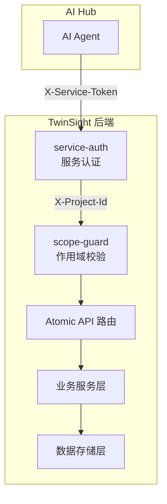

# Atomic API

<cite>
**本文档引用文件**
- [server/routes/atomic/v1/index.js](../../../../../../server/routes/atomic/v1/index.js)
- [server/routes/atomic/v1/assets.js](../../../../../../server/routes/atomic/v1/assets.js)
- [server/routes/atomic/v1/alarm.js](../../../../../../server/routes/atomic/v1/alarm.js)
- [server/routes/atomic/v1/timeseries.js](../../../../../../server/routes/atomic/v1/timeseries.js)
- [server/routes/atomic/v1/ui.js](../../../../../../server/routes/atomic/v1/ui.js)
- [server/routes/atomic/v1/knowledge.js](../../../../../../server/routes/atomic/v1/knowledge.js)
- [server/routes/atomic/v1/power.js](../../../../../../server/routes/atomic/v1/power.js)
- [server/middleware/service-auth.js](../../../../../../server/middleware/service-auth.js)
- [server/middleware/scope-guard.js](../../../../../../server/middleware/scope-guard.js)
</cite>

## 目录
1. [架构概述](#架构概述)
2. [认证流程](#认证流程)
3. [Scope 机制](#scope-机制)
4. [端点列表](#端点列表)
5. [错误处理](#错误处理)

## 架构概述

Atomic API 是 TwinSight 平台为 AI Hub 提供的专用 M2M（Machine-to-Machine）API 接口层。它采用分层架构设计，提供标准化的数据查询、控制指令和事件记录能力，使 AI Hub 能够以原子化的方式访问 TwinSight 的核心功能。



**设计原则：**
- **原子性**: 每个端点执行单一、明确的操作
- **标准化**: 统一的请求/响应格式和错误处理
- **安全性**: 双重认证（服务令牌 + 用户 JWT）+ 作用域隔离
- **可追踪性**: 每个请求都携带 request_id 和 trace_id

**Section sources**
- [server/routes/atomic/v1/index.js](../../../../../../server/routes/atomic/v1/index.js)

## 认证流程

Atomic API 采用双重认证机制，确保调用安全：

### 1. 用户认证（JWT）
所有请求首先通过现有的 `authenticate` 中间件验证用户身份：
- 从 `Authorization` 请求头提取 JWT
- 验证令牌有效性
- 将用户信息挂载到 `req.user`

### 2. 服务认证（Service Token）
通过 `service-auth` 中间件验证服务间调用：
- 从 `X-Service-Token` 请求头获取服务令牌
- 验证令牌是否在允许列表中（环境变量 `SERVICE_TOKENS`）
- 开发模式下未配置令牌时打印警告并放行
- 生产环境必须配置有效令牌

**请求头示例：**
```http
Authorization: Bearer <user_jwt_token>
X-Service-Token: <ai_hub_service_token>
X-Project-Id: 123
X-Request-Id: req_abc123
X-Trace-Id: trace_xyz789
```

**Section sources**
- [server/middleware/service-auth.js](../../../../../../server/middleware/service-auth.js)

## Scope 机制

Scope 机制用于隔离不同项目和设施的数据访问，确保多租户安全性。

### Scope 头字段

| 字段名 | 必填 | 说明 |
|--------|------|------|
| `X-Project-Id` | 是 | 项目标识，所有 Atomic API 调用必须携带 |
| `X-Facility-Id` | 否 | 设施标识（预留） |
| `X-File-Id` | 否 | 模型文件 ID，用于关联具体模型 |
| `X-Request-Id` | 否 | 请求追踪 ID |
| `X-Trace-Id` | 否 | 分布式追踪 ID |

### Scope 挂载

通过 `scope-guard` 中间件，解析后的 scope 信息挂载到请求对象：

```javascript
req.scope = {
    projectId: '123',
    facilityId: null,
    fileId: 456
};

req.tracing = {
    requestId: 'req_abc123',
    traceId: 'trace_xyz789'
};
```

### 审计日志

每个 Atomic API 调用都会记录最小可审计日志：
```
📡 [atomic] POST /api/atomic/v1/assets/query | project=123 | user=admin | request_id=req_abc123 | trace_id=trace_xyz789
```

**Section sources**
- [server/middleware/scope-guard.js](../../../../../../server/middleware/scope-guard.js)

## 端点列表

### 1. 资产查询 `/assets`

#### POST `/api/atomic/v1/assets/query`
统一资产查询端点，支持 RDS 编码层级查询。

**请求体：**
```json
{
  "fileId": 123,
  "aspectType": "function",
  "code": "=A1",
  "level": 3,
  "format": "tree"
}
```

**参数说明：**
- `fileId` (number): 模型文件 ID（必填，也可通过 X-File-Id 头传递）
- `aspectType` (string): 方面类型，可选 `function` | `location` | `power`
- `code` (string): RDS 编码（模糊匹配）
- `level` (number): 最大层级深度
- `format` (string): 返回格式，`flat`（默认）或 `tree`

**响应示例：**
```json
{
  "success": true,
  "data": [
    {
      "id": 1,
      "code": "=A1",
      "parentCode": null,
      "aspectType": "function",
      "level": 1,
      "name": "空调系统",
      "bimGuid": "abc-123",
      "mcCode": "MC001",
      "refCode": "REF001"
    }
  ],
  "meta": {
    "request_id": "req_abc123",
    "duration_ms": 45,
    "total": 10,
    "format": "flat"
  }
}
```

**Section sources**
- [server/routes/atomic/v1/assets.js](../../../../../../server/routes/atomic/v1/assets.js)

---

### 2. 报警事件 `/alarm`

#### POST `/api/atomic/v1/alarm/create`
创建标准报警事件记录。

**请求体：**
```json
{
  "severity": "critical",
  "source": "rule",
  "objectCode": "=A1.FAN01",
  "message": "温度超过阈值",
  "metadata": {
    "threshold": 28,
    "actual": 32
  }
}
```

**参数说明：**
- `severity` (string): 严重级别，必填，可选 `critical` | `warning` | `info`
- `source` (string): 来源，必填，如 `rule` | `manual` | `iot`
- `objectCode` (string): 相关对象 RDS 编码
- `message` (string): 报警描述，必填
- `metadata` (object): 附加元数据

**响应示例：**
```json
{
  "success": true,
  "data": {
    "alarmId": "alarm_xxx-xxx",
    "severity": "critical",
    "source": "rule",
    "message": "温度超过阈值",
    "createdAt": "2024-01-15T10:30:00Z"
  },
  "meta": {
    "request_id": "req_abc123",
    "duration_ms": 12
  }
}
```

**Section sources**
- [server/routes/atomic/v1/alarm.js](../../../../../../server/routes/atomic/v1/alarm.js)

---

### 3. 时序数据 `/timeseries`

#### POST `/api/atomic/v1/timeseries/query`
统一时序数据查询，聚合现有查询能力。

**请求体：**
```json
{
  "roomCodes": ["ROOM001", "ROOM002"],
  "startMs": 1705312800000,
  "endMs": 1705399200000,
  "fileId": 123,
  "queryType": "range"
}
```

**参数说明：**
- `roomCodes` (string[]): 房间编码列表，必填
- `startMs` (number): 起始时间戳（毫秒）
- `endMs` (number): 结束时间戳（毫秒）
- `fileId` (number): 模型文件 ID，必填
- `queryType` (string): 查询类型，可选 `range`（默认） | `latest` | `average`

**响应示例：**
```json
{
  "success": true,
  "data": {
    "series": [
      {
        "roomCode": "ROOM001",
        "values": [
          {"time": "2024-01-15T10:00:00Z", "value": 24.5}
        ]
      }
    ]
  },
  "meta": {
    "request_id": "req_abc123",
    "duration_ms": 89,
    "query_type": "range",
    "room_count": 2
  }
}
```

**Section sources**
- [server/routes/atomic/v1/timeseries.js](../../../../../../server/routes/atomic/v1/timeseries.js)

---

### 4. UI 控制指令 `/ui`

#### POST `/api/atomic/v1/ui/command`
发送 UI 控制指令到前端，通过 WebSocket 控制通道分发。

**请求体：**
```json
{
  "type": "highlight",
  "target": "=A1.FAN01",
  "sessionId": "socket_xxx",
  "params": {
    "color": "red",
    "duration": 5000
  }
}
```

**参数说明：**
- `type` (string): 指令类型，必填，可选 `navigate` | `highlight` | `isolate` | `reset`
- `target` (string): 目标对象 RDS 编码（reset 指令可不填）
- `sessionId` (string): 目标会话 ID（定向推送，不填则广播到项目）
- `params` (object): 附加参数

**支持的指令：**
- `navigate`: 导航到指定对象视角
- `highlight`: 高亮显示指定对象
- `isolate`: 隔离显示指定对象
- `reset`: 重置视图

**响应示例：**
```json
{
  "success": true,
  "data": {
    "commandId": "cmd_1234567890",
    "delivered": true,
    "command": {
      "type": "highlight",
      "target": "=A1.FAN01",
      "timestamp": "2024-01-15T10:30:00Z"
    }
  },
  "meta": {
    "request_id": "req_abc123",
    "duration_ms": 23
  }
}
```

**Section sources**
- [server/routes/atomic/v1/ui.js](../../../../../../server/routes/atomic/v1/ui.js)

---

### 5. 知识库检索 `/knowledge`

#### POST `/api/atomic/v1/knowledge/rag-search`
RAG 知识库检索，透传到现有 AI 分析服务。

**请求体：**
```json
{
  "query": "空调故障处理",
  "fileId": 123,
  "kbId": "kb_default",
  "topK": 5
}
```

**参数说明：**
- `query` (string): 检索查询文本，必填
- `fileId` (number): 模型文件 ID（用于定位关联知识库）
- `kbId` (string): 知识库 ID（可选，直接指定）
- `topK` (number): 返回结果数量，默认 5

**响应示例：**
```json
{
  "success": true,
  "data": {
    "assets": [...],
    "documents": [
      {
        "id": "doc_1",
        "title": "空调维护手册",
        "content": "...",
        "score": 0.95
      }
    ],
    "kbId": "kb_default",
    "fileIds": [123],
    "query": "空调故障处理"
  },
  "meta": {
    "request_id": "req_abc123",
    "duration_ms": 156,
    "source": "openwebui_rag"
  }
}
```

**Section sources**
- [server/routes/atomic/v1/knowledge.js](../../../../../../server/routes/atomic/v1/knowledge.js)

---

### 6. 电源追溯 `/power`

#### POST `/api/atomic/v1/power/trace`
电源拓扑追溯，转发到 Logic Engine 服务。

**请求体：**
```json
{
  "mcCode": "MC001",
  "direction": "upstream",
  "fileId": 123
}
```

**参数说明：**
- `mcCode` (string): 设备 MC 编码，必填
- `direction` (string): 追溯方向，必填，可选 `upstream` | `downstream`
- `fileId` (number): 模型文件 ID

**响应示例：**
```json
{
  "success": true,
  "data": {
    "nodes": [
      {"id": "MC001", "type": "device", "name": "空调主机"},
      {"id": "MC002", "type": "power", "name": "配电柜A"}
    ],
    "edges": [
      {"source": "MC002", "target": "MC001", "type": "powers"}
    ],
    "startNode": "MC001"
  },
  "meta": {
    "request_id": "req_abc123",
    "duration_ms": 234,
    "source": "logic_engine"
  }
}
```

**Section sources**
- [server/routes/atomic/v1/power.js](../../../../../../server/routes/atomic/v1/power.js)

## 错误处理

Atomic API 采用统一的错误响应格式：

```json
{
  "success": false,
  "error": {
    "code": "ERROR_CODE",
    "message": "人类可读的错误描述",
    "request_id": "req_abc123"
  }
}
```

### 常见错误码

| HTTP 状态码 | 错误码 | 说明 |
|------------|--------|------|
| 400 | `INVALID_PARAMS` | 请求参数无效或缺失 |
| 400 | `MISSING_PROJECT_ID` | 缺少 X-Project-Id 请求头 |
| 401 | `MISSING_SERVICE_TOKEN` | 缺少 X-Service-Token 请求头 |
| 403 | `INVALID_SERVICE_TOKEN` | 服务令牌无效或未授权 |
| 500 | `SERVICE_AUTH_NOT_CONFIGURED` | 服务认证未配置（生产环境） |
| 500 | `ASSETS_QUERY_FAILED` | 资产查询失败 |
| 500 | `ALARM_CREATE_FAILED` | 报警创建失败 |
| 500 | `TIMESERIES_QUERY_FAILED` | 时序数据查询失败 |
| 500 | `UI_COMMAND_FAILED` | UI 指令执行失败 |
| 500 | `RAG_SEARCH_FAILED` | 知识库检索失败 |
| 500 | `POWER_TRACE_FAILED` | 电源追溯失败 |

### 错误处理最佳实践

1. **始终检查 `success` 字段**：不要仅依赖 HTTP 状态码
2. **使用 `request_id` 追踪问题**：在错误报告中包含此 ID
3. **处理超时**：建议设置 10-15 秒超时
4. **重试策略**：对于 5xx 错误，可实施指数退避重试
