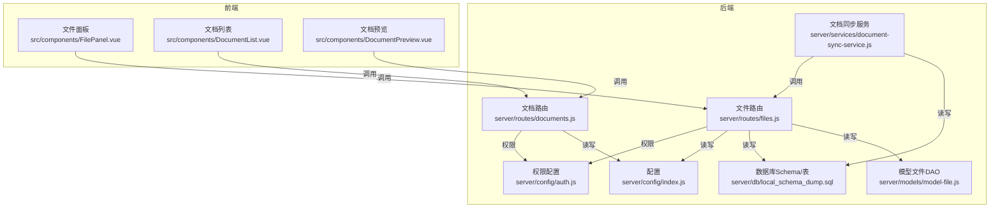
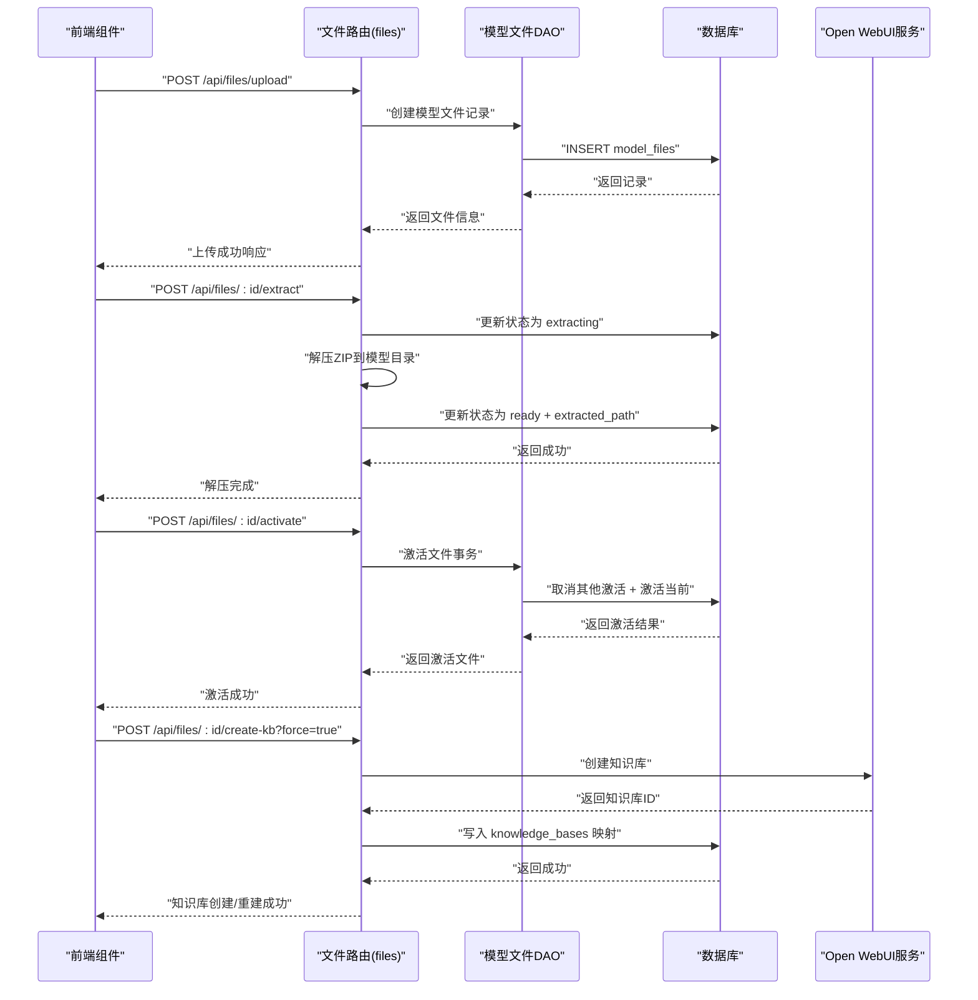
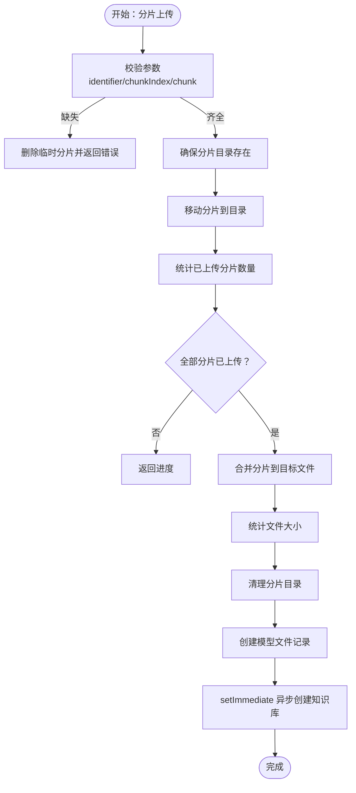
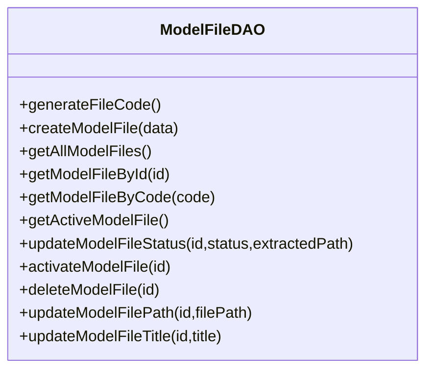
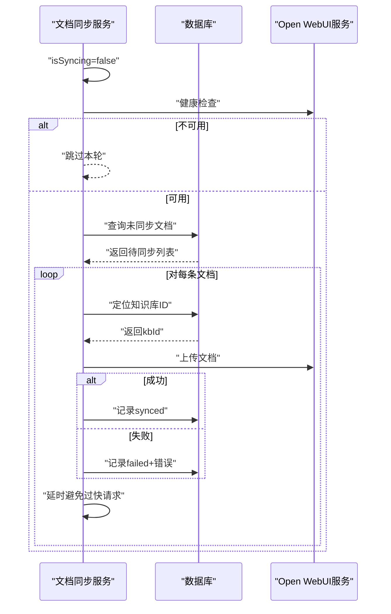
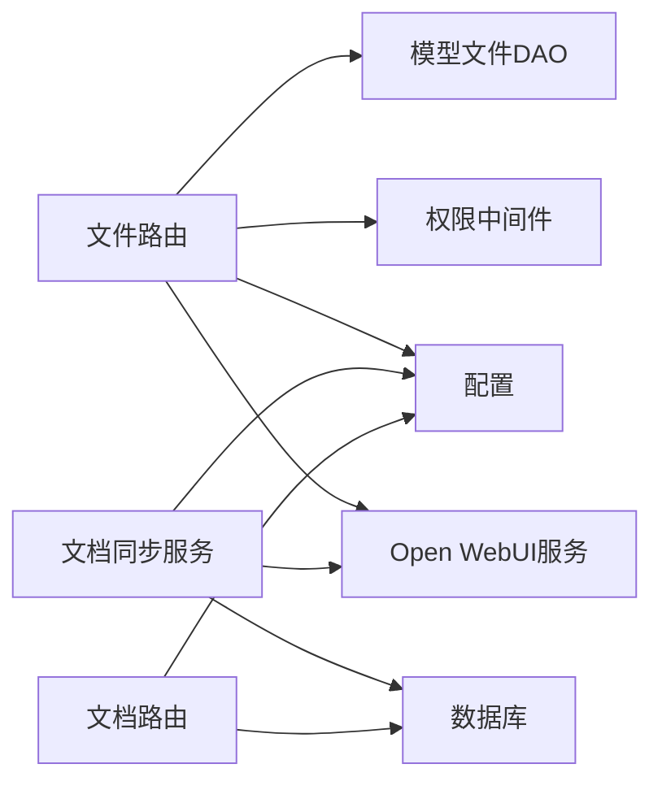

# 文件管理API

<cite>
**本文引用的文件**
- [server/routes/files.js](file://server/routes/files.js)
- [server/models/model-file.js](file://server/models/model-file.js)
- [server/services/document-sync-service.js](file://server/services/document-sync-service.js)
- [server/config/index.js](file://server/config/index.js)
- [server/config/auth.js](file://server/config/auth.js)
- [server/db/local_schema_dump.sql](file://server/db/local_schema_dump.sql)
- [server/routers/api.js](file://server/routes/api.js)
- [server/routers/documents.js](file://server/routes/documents.js)
- [src/components/FilePanel.vue](file://src/components/FilePanel.vue)
- [src/components/DocumentList.vue](file://src/components/DocumentList.vue)
- [src/components/DocumentPreview.vue](file://src/components/DocumentPreview.vue)
</cite>

## 目录
1. [简介](#简介)
2. [项目结构](#项目结构)
3. [核心组件](#核心组件)
4. [架构总览](#架构总览)
5. [详细组件分析](#详细组件分析)
6. [依赖分析](#依赖分析)
7. [性能考虑](#性能考虑)
8. [故障排查指南](#故障排查指南)
9. [结论](#结论)
10. [附录](#附录)

## 简介
本文件管理API围绕“模型文件”与“文档文件”的上传、管理、解压、激活以及与知识库（Open WebUI）的集成展开，覆盖了断点续传、权限控制、异步知识库创建与文档同步、以及前后端交互的关键流程。本文面向开发者与运维人员，既提供高层架构说明，也给出代码级的可视化图示与定位路径，便于快速定位实现细节与问题根因。

## 项目结构
- 后端采用Express路由+PostgreSQL数据层，文件上传与管理集中在文件路由模块；文档文件上传与预览在文档路由模块；知识库同步在独立的服务模块。
- 前端通过Vue组件与后端API交互，文件面板负责模型文件的生命周期管理，文档列表与预览组件负责文档文件的上传与预览。

图表来源
- [server/routes/files.js](file://server/routes/files.js#L1-L120)
- [server/routes/documents.js](file://server/routes/documents.js#L382-L422)
- [server/services/document-sync-service.js](file://server/services/document-sync-service.js#L1-L120)
- [server/models/model-file.js](file://server/models/model-file.js#L1-L179)
- [server/config/index.js](file://server/config/index.js#L58-L93)
- [server/config/auth.js](file://server/config/auth.js#L1-L142)
- [server/db/local_schema_dump.sql](file://server/db/local_schema_dump.sql#L292-L336)
- [src/components/FilePanel.vue](file://src/components/FilePanel.vue#L700-L899)
- [src/components/DocumentList.vue](file://src/components/DocumentList.vue#L410-L458)
- [src/components/DocumentPreview.vue](file://src/components/DocumentPreview.vue#L109-L149)

章节来源
- [server/routes/files.js](file://server/routes/files.js#L1-L120)
- [server/config/index.js](file://server/config/index.js#L58-L93)

## 核心组件
- 文件路由（模型文件管理）
  - 单文件上传、断点续传（分片检查/上传/合并）、文件列表、当前激活文件、单个文件详情、更新标题、删除文件、解压文件、激活文件、关联资产/空间、手动创建知识库、手动同步文档到知识库。
- 模型文件DAO
  - 生成文件编码、创建记录、查询列表/单条、获取激活文件、更新状态/路径/标题、删除记录、激活切换（事务）。
- 文档同步服务
  - 后台批量扫描未同步文档、根据资产/空间/规格/激活文件推断知识库、上传到Open WebUI、记录同步结果。
- 配置与权限
  - 文件上传路径、最大文件大小、数据库连接、JWT、权限常量与角色映射。
- 前端组件
  - 文件面板：创建/重建知识库、同步文档、上下文菜单操作。
  - 文档列表：多文件上传、进度展示。
  - 文档预览：内联预览PDF/图片/视频等。

章节来源
- [server/routes/files.js](file://server/routes/files.js#L158-L789)
- [server/models/model-file.js](file://server/models/model-file.js#L1-L179)
- [server/services/document-sync-service.js](file://server/services/document-sync-service.js#L1-L250)
- [server/config/index.js](file://server/config/index.js#L58-L93)
- [server/config/auth.js](file://server/config/auth.js#L1-L142)
- [src/components/FilePanel.vue](file://src/components/FilePanel.vue#L700-L899)
- [src/components/DocumentList.vue](file://src/components/DocumentList.vue#L410-L458)
- [src/components/DocumentPreview.vue](file://src/components/DocumentPreview.vue#L109-L149)

## 架构总览
文件管理API围绕“模型文件”与“文档文件”两条主线：
- 模型文件：上传（含断点续传）→ 解压 → 激活 → 关联资产/空间 → 知识库创建/重建/同步。
- 文档文件：上传（含EXIF提取）→ 预览 → 后台同步到知识库（可选）。

图表来源
- [server/routes/files.js](file://server/routes/files.js#L158-L361)
- [server/models/model-file.js](file://server/models/model-file.js#L76-L127)
- [server/db/local_schema_dump.sql](file://server/db/local_schema_dump.sql#L306-L318)

## 详细组件分析

### 文件路由（模型文件管理）
- 单文件上传
  - 仅允许zip/svfzip类型，限制大小，临时目录存放，完成后移动至上传目录并创建数据库记录，异步创建知识库。
- 断点续传
  - 分片上传接口，服务端维护分片目录，合并完成后创建记录并触发知识库创建。
- 文件管理
  - 列表、当前激活、详情、更新标题、删除（可选删除知识库）、解压（更新状态/路径）、激活（事务切换）、关联资产/空间查询。
- 知识库集成
  - 手动创建/重建知识库（支持force参数），手动同步文档到知识库（按文件关联的资产/空间/规格筛选未同步文档）。

图表来源
- [server/routes/files.js](file://server/routes/files.js#L218-L361)

章节来源
- [server/routes/files.js](file://server/routes/files.js#L158-L789)

### 模型文件DAO
- 生成唯一文件编码（时间戳+UUID片段）。
- CRUD与状态管理：创建、查询、更新状态/路径/标题、删除、激活切换（事务）。
- 查询辅助：按ID/编码获取、获取激活文件。

图表来源
- [server/models/model-file.js](file://server/models/model-file.js#L1-L179)

章节来源
- [server/models/model-file.js](file://server/models/model-file.js#L1-L179)

### 文档同步服务（后台）
- 未同步文档扫描：按创建时间排序，限制数量，过滤支持格式。
- 知识库定位：按资产/空间/规格/激活文件推断知识库ID。
- 同步执行：上传到Open WebUI，记录同步状态（成功/失败）。
- 服务控制：启动定时任务、手动触发、防并发标志。

图表来源
- [server/services/document-sync-service.js](file://server/services/document-sync-service.js#L1-L250)

章节来源
- [server/services/document-sync-service.js](file://server/services/document-sync-service.js#L1-L250)

### 前端交互组件
- 文件面板
  - 创建知识库（首次冲突返回409，前端弹窗确认后带force=true重建）。
  - 同步文档到知识库（调用后端接口，显示结果）。
- 文档列表
  - 多文件上传，进度监听，成功后刷新列表。
- 文档预览
  - 内联预览PDF/图片/视频，不支持格式则提示下载。

章节来源
- [src/components/FilePanel.vue](file://src/components/FilePanel.vue#L700-L899)
- [src/components/DocumentList.vue](file://src/components/DocumentList.vue#L410-L458)
- [src/components/DocumentPreview.vue](file://src/components/DocumentPreview.vue#L109-L149)

## 依赖分析
- 路由层依赖
  - 文件路由依赖模型文件DAO、权限中间件、配置（上传路径/大小）、Open WebUI服务（知识库）。
  - 文档路由依赖文档模型、EXIF提取、权限中间件、配置。
- 数据层依赖
  - 知识库映射表、文档同步映射表、模型文件表、资产/空间/规格表。
- 外部依赖
  - Open WebUI：知识库创建、文档上传、健康检查。
  - Multer：文件上传与分片。
  - AdmZip：模型文件解压。
  - PG：连接池与事务。

图表来源
- [server/routes/files.js](file://server/routes/files.js#L1-L120)
- [server/routes/documents.js](file://server/routes/documents.js#L189-L223)
- [server/services/document-sync-service.js](file://server/services/document-sync-service.js#L1-L120)
- [server/config/index.js](file://server/config/index.js#L58-L93)
- [server/config/auth.js](file://server/config/auth.js#L1-L142)
- [server/db/local_schema_dump.sql](file://server/db/local_schema_dump.sql#L292-L336)

章节来源
- [server/routes/files.js](file://server/routes/files.js#L1-L120)
- [server/routes/documents.js](file://server/routes/documents.js#L189-L223)
- [server/services/document-sync-service.js](file://server/services/document-sync-service.js#L1-L120)
- [server/config/index.js](file://server/config/index.js#L58-L93)
- [server/config/auth.js](file://server/config/auth.js#L1-L142)
- [server/db/local_schema_dump.sql](file://server/db/local_schema_dump.sql#L292-L336)

## 性能考虑
- 文件上传
  - 断点续传避免大文件中断重传，分片目录与临时目录同文件系统避免跨设备重命名失败。
  - 上传完成后立即创建数据库记录，异步创建知识库，不阻塞响应。
- 解压与激活
  - 解压前更新状态为“解压中”，成功后更新为“就绪”并写入解压路径，失败回滚状态。
  - 激活采用事务，确保原子性地取消其他文件激活并激活当前文件。
- 文档同步
  - 后台定时任务，限制每次同步数量，避免对数据库与Open WebUI造成过大压力。
  - 同步失败记录错误，避免无限重试。
- 前端
  - 文档列表上传进度实时反馈，成功后延迟移除队列项，减少UI抖动。

[本节为通用建议，无需列出具体文件来源]

## 故障排查指南
- 上传失败
  - 检查文件类型与大小限制、临时目录权限、磁盘空间。
  - 断点续传：确认分片目录存在且分片索引连续。
- 解压失败
  - 确认ZIP文件有效、解压目录权限、目标路径与配置一致。
- 激活失败
  - 确认文件状态为“就绪”，检查事务是否回滚。
- 知识库创建/同步失败
  - 检查Open WebUI服务健康状态、API密钥配置、数据库中knowledge_bases映射。
  - 手动同步时确认文件已创建知识库且文档存在未同步记录。
- 文档预览失败
  - 检查文件是否存在、Content-Type设置、浏览器兼容性。

章节来源
- [server/routes/files.js](file://server/routes/files.js#L218-L361)
- [server/services/document-sync-service.js](file://server/services/document-sync-service.js#L153-L217)
- [server/routes/documents.js](file://server/routes/documents.js#L382-L422)

## 结论
文件管理API通过清晰的路由职责划分、严谨的状态机与事务控制、完善的权限与配置体系，实现了从模型文件上传、解压、激活到知识库创建与文档同步的完整闭环。配合前端组件的直观交互，用户可以高效地完成文件生命周期管理与知识库集成。后续可在以下方面持续优化：
- 增加上传/解压/同步的进度回调与重试策略。
- 优化知识库同步的并发与速率限制。
- 增强错误日志与可观测性指标。

[本节为总结性内容，无需列出具体文件来源]

## 附录

### API定义（文件管理）
- 上传模型文件
  - 方法与路径：POST /api/files/upload
  - 权限：MODEL_UPLOAD
  - 请求体：multipart/form-data，字段file（zip/svfzip）、title
  - 响应：成功返回文件记录
- 断点续传-检查分片
  - 方法与路径：GET /api/files/upload/check/:identifier
  - 权限：MODEL_UPLOAD
  - 响应：已上传分片索引数组
- 断点续传-上传分片
  - 方法与路径：POST /api/files/upload/chunk
  - 权限：MODEL_UPLOAD
  - 请求体：multipart/form-data，字段chunk、identifier、chunkIndex、totalChunks、fileName、title
  - 响应：completed=true时返回最终文件记录
- 获取模型文件列表
  - 方法与路径：GET /api/files
  - 权限：MODEL_READ
  - 响应：文件列表
- 获取当前激活文件
  - 方法与路径：GET /api/files/active
  - 权限：MODEL_READ
  - 响应：激活文件
- 获取单个文件
  - 方法与路径：GET /api/files/:id
  - 权限：MODEL_READ
  - 响应：文件详情
- 更新文件标题
  - 方法与路径：PUT /api/files/:id
  - 权限：MODEL_UPLOAD
  - 请求体：title
  - 响应：更新后的文件
- 删除文件
  - 方法与路径：DELETE /api/files/:id?deleteKB=true
  - 权限：MODEL_DELETE
  - 响应：删除成功
- 解压文件
  - 方法与路径：POST /api/files/:id/extract
  - 权限：MODEL_UPLOAD
  - 响应：解压路径
- 激活文件
  - 方法与路径：POST /api/files/:id/activate
  - 权限：MODEL_ACTIVATE
  - 响应：激活后的文件
- 获取文件关联资产
  - 方法与路径：GET /api/files/:id/assets
  - 权限：MODEL_READ
  - 响应：资产列表
- 获取文件关联空间
  - 方法与路径：GET /api/files/:id/spaces
  - 权限：MODEL_READ
  - 响应：空间列表
- 手动创建知识库
  - 方法与路径：POST /api/files/:id/create-kb?force=true
  - 权限：MODEL_UPLOAD
  - 响应：知识库信息
- 手动同步文档到知识库
  - 方法与路径：POST /api/files/:id/sync-docs
  - 权限：MODEL_UPLOAD
  - 响应：同步统计

章节来源
- [server/routes/files.js](file://server/routes/files.js#L158-L789)

### 数据模型（关键表）
- knowledge_bases：模型文件与Open WebUI知识库ID映射
- kb_documents：文档与知识库/文件同步状态映射

章节来源
- [server/db/local_schema_dump.sql](file://server/db/local_schema_dump.sql#L292-L336)