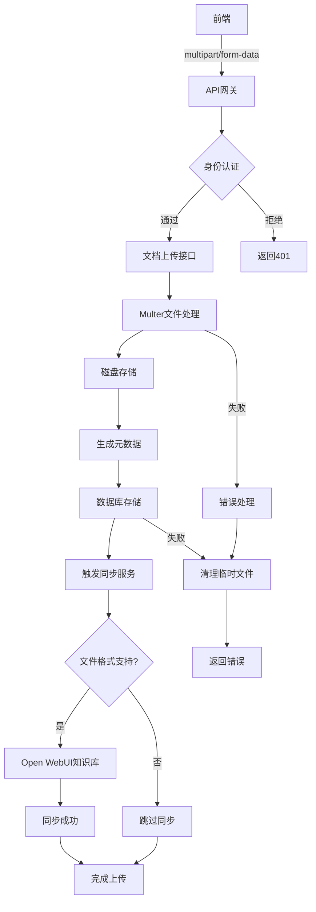

# 文档上传与存储管理

<cite>
**本文档引用文件**  
- [documents.js](file://server/routes/documents.js)
- [index.js](file://server/config/index.js)
- [document-sync-service.js](file://server/services/document-sync-service.js)
- [document.js](file://server/models/document.js)
- [document-exif.js](file://server/models/document-exif.js)
- [openwebui-config.js](file://server/config/openwebui-config.js)
- [openwebui-service.js](file://server/services/openwebui-service.js)
</cite>

## 目录
1. [简介](#简介)
2. [文件上传处理机制](#文件上传处理机制)
3. [存储配置与文件命名策略](#存储配置与文件命名策略)
4. [文件验证与限制规则](#文件验证与限制规则)
5. [上传接口设计与参数说明](#上传接口设计与参数说明)
6. [前端文件提交示例](#前端文件提交示例)
7. [文档元数据处理与路径生成](#文档元数据处理与路径生成)
8. [错误处理机制](#错误处理机制)
9. [文档同步服务](#文档同步服务)
10. [系统架构图](#系统架构图)

## 简介
本文档详细说明 TwinSight 系统中文档上传功能的技术实现。重点涵盖基于 Multer 的文件上传处理、磁盘存储配置、文件命名策略、上传目录动态创建、文件大小与类型限制、上传接口设计、前端提交方式、元数据处理以及与 Open WebUI 知识库的异步同步流程。

## 文件上传处理机制
系统采用 Multer 中间件处理文件上传请求，支持 `multipart/form-data` 格式的数据解析。上传流程由 Express 路由 `/api/documents/upload` 处理，结合身份认证和权限控制中间件，确保只有授权用户可执行上传操作。

Multer 配置为单文件上传模式（`upload.single('file')`），自动解析表单中的文件字段，并将其保存至服务器指定目录。上传过程中，系统会提取文件原始信息，处理中文文件名编码问题，并生成唯一文件标识。

**本节来源**  
- [documents.js](file://server/routes/documents.js#L19-L68)

## 存储配置与文件命名策略
### 磁盘存储配置
系统使用 `multer.diskStorage` 实现磁盘存储，配置如下：

- **目标路径**：通过 `appConfig.upload.docsDir` 动态获取文档存储目录
- **目录创建**：在 `destination` 函数中使用 `fs.mkdir` 递归创建上传目录，确保路径存在
- **路径配置**：基于 `DATA_PATH` 环境变量区分开发与生产环境路径

### 文件命名策略
采用时间戳+随机字符串的组合方式生成唯一文件名，避免文件名冲突：

- **时间戳**：`Date.now()` 获取当前毫秒级时间戳
- **随机字符串**：`Math.random().toString(36).substring(2, 15)` 生成随机字符
- **扩展名保留**：使用 `path.extname()` 提取原始文件扩展名
- **格式**：`${timestamp}_${random}${ext}`

此策略确保每个上传文件具有全局唯一名称，同时保留原始文件类型信息。

**本节来源**  
- [documents.js](file://server/routes/documents.js#L20-L38)
- [index.js](file://server/config/index.js#L60-L68)

## 文件验证与限制规则
### 文件类型白名单
系统实施严格的文件类型白名单机制，仅允许以下格式上传：

- **文档**：PDF (`application/pdf`)
- **图片**：JPG、JPEG、PNG、SVG (`image/jpeg`, `image/jpg`, `image/png`, `image/svg+xml`)
- **视频**：MP4 (`video/mp4`)

验证同时检查 `mimetype` 和文件扩展名，双重保障安全性。

### 文件大小限制
通过 Multer 的 `limits` 配置设置文件大小上限：

- **最大尺寸**：200MB（`200 * 1024 * 1024` 字节）
- **配置来源**：从环境变量 `MAX_FILE_SIZE` 读取，未设置时默认 500MB

### 中文文件名处理
针对 Multer 在处理中文文件名时的编码问题，系统在上传后立即进行 UTF-8 编码转换：

```javascript
originalName = Buffer.from(req.file.originalname, 'latin1').toString('utf8');
```

若转换失败则使用原始文件名，确保文件名正确显示。

**本节来源**  
- [documents.js](file://server/routes/documents.js#L42-L67)
- [index.js](file://server/config/index.js#L61)

## 上传接口设计与参数说明
### 接口信息
- **端点**：`POST /api/documents/upload`
- **认证**：需携带有效 JWT 令牌
- **权限**：需具备 `DOCUMENT_CREATE` 权限

### 请求参数
| 参数名 | 类型 | 必填 | 说明 |
|-------|------|------|------|
| `file` | File | 是 | 上传的文件对象 |
| `title` | String | 否 | 文档标题，未提供时使用文件名 |
| `assetCode` | String | 三选一 | 关联的资产编码 |
| `spaceCode` | String | 三选一 | 关联的空间编码 |
| `specCode` | String | 三选一 | 关联的规格编码 |
| `viewId` | Integer | 三选一 | 关联的视图ID |

### 参数验证规则
- 至少提供 `assetCode`、`spaceCode`、`specCode` 或 `viewId` 中的一个作为关联标识
- 文件字段必须存在
- 标题不能为空字符串
- 自动验证文件类型和大小限制

**本节来源**  
- [documents.js](file://server/routes/documents.js#L150-L166)

## 前端文件提交示例
前端应使用 `multipart/form-data` 编码提交文件，示例如下：

```javascript
// 使用 fetch 提交
const formData = new FormData();
formData.append('file', fileInput.files[0]);
formData.append('title', '项目报告');
formData.append('assetCode', 'ASSET-001');

fetch('/api/documents/upload', {
  method: 'POST',
  body: formData,
  headers: {
    'Authorization': 'Bearer ' + token
  }
});
```

或使用 Axios：

```javascript
axios.post('/api/documents/upload', formData, {
  headers: {
    'Content-Type': 'multipart/form-data',
    'Authorization': `Bearer ${token}`
  }
});
```

**本节来源**  
- [documents.js](file://server/routes/documents.js#L150-L208)

## 文档元数据处理与路径生成
### 元数据存储
上传成功后，系统将文档元数据存储至数据库，包含：

- **基础信息**：标题、原始文件名、文件大小、MIME类型
- **路径信息**：相对存储路径（`/docs/{filename}`）
- **关联信息**：资产/空间/规格编码或视图ID
- **时间戳**：创建时间、更新时间

### 路径生成规则
- **存储路径**：`${appConfig.upload.dataPath}/docs/`
- **访问路径**：`/docs/{系统生成的唯一文件名}`
- **示例**：`/docs/1701234567890_abc123xyz.pdf`

### EXIF 信息提取
对于 JPG/JPEG 图像文件，系统自动提取 EXIF 元数据，包括：
- 拍摄时间、图像尺寸
- 相机型号、光圈、快门速度、ISO
- GPS 经纬度、海拔

EXIF 数据单独存储于 `document_exif` 表，与主文档记录关联。

**本节来源**  
- [documents.js](file://server/routes/documents.js#L179-L207)
- [document.js](file://server/models/document.js#L58-L82)
- [document-exif.js](file://server/models/document-exif.js#L12-L68)

## 错误处理机制
系统实现多层次错误处理，确保上传过程的健壮性：

### 客户端错误
- **400 Bad Request**：文件缺失、参数不全、文件类型不支持
- **返回格式**：JSON 结构包含 `success: false` 和错误详情

### 服务端错误
- **500 Internal Server Error**：数据库操作失败、文件系统错误
- **异常捕获**：使用 try-catch 捕获异步操作异常
- **资源清理**：上传失败时自动删除已保存的临时文件

### 特殊处理
- **文件名编码错误**：尝试转换失败时使用原始文件名并记录警告
- **目录创建失败**：在 `destination` 回调中传递错误，终止上传
- **数据库记录失败**：删除已上传的物理文件，避免孤儿文件

**本节来源**  
- [documents.js](file://server/routes/documents.js#L211-L222)

## 文档同步服务
### 同步流程
文档上传后，由后台服务 `document-sync-service.js` 异步触发与 Open WebUI 知识库的同步：

1. **定时检查**：每 5 分钟扫描未同步的文档
2. **知识库匹配**：根据文档关联的资产/空间编码查找对应知识库
3. **文件上传**：调用 Open WebUI API 上传文件
4. **状态记录**：在 `kb_documents` 表中记录同步状态

### 同步条件
- 仅同步支持 RAG 的文件格式（PDF、Office、文本等）
- 目标知识库必须存在且配置正确
- Open WebUI 服务必须健康可用

### 错误处理
- **同步失败**：记录失败原因，避免无限重试
- **服务不可用**：跳过本次同步，等待下次检查
- **格式不支持**：跳过并记录日志

**本节来源**  
- [document-sync-service.js](file://server/services/document-sync-service.js#L1-L250)
- [openwebui-service.js](file://server/services/openwebui-service.js#L146-L237)

## 系统架构图


**图表来源**  
- [documents.js](file://server/routes/documents.js#L150-L223)
- [document-sync-service.js](file://server/services/document-sync-service.js#L157-L217)