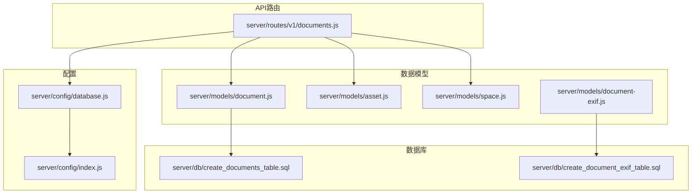
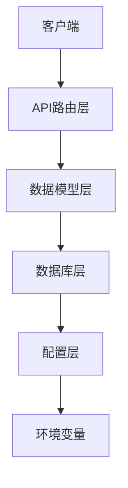
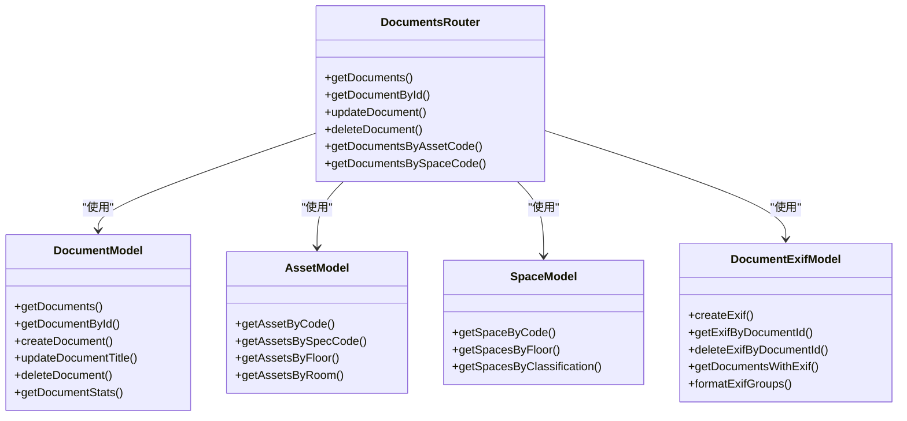
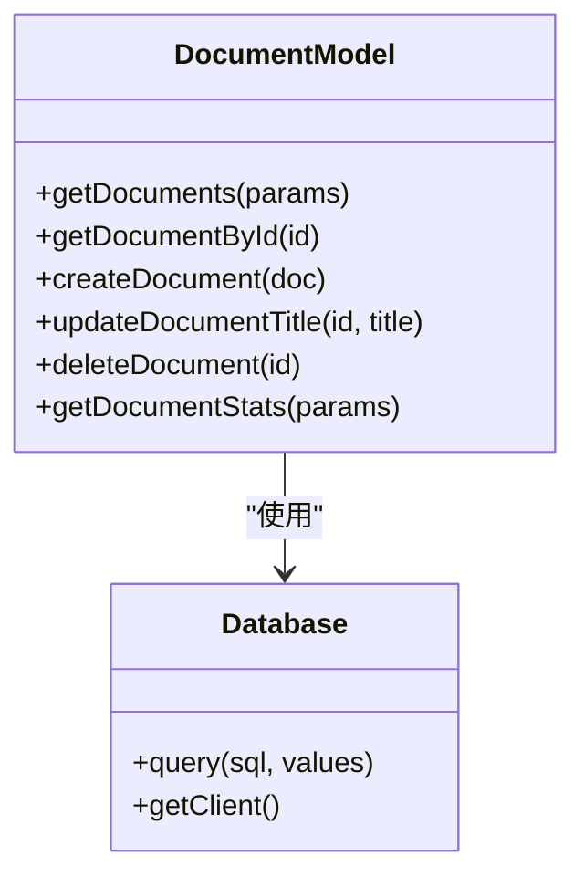
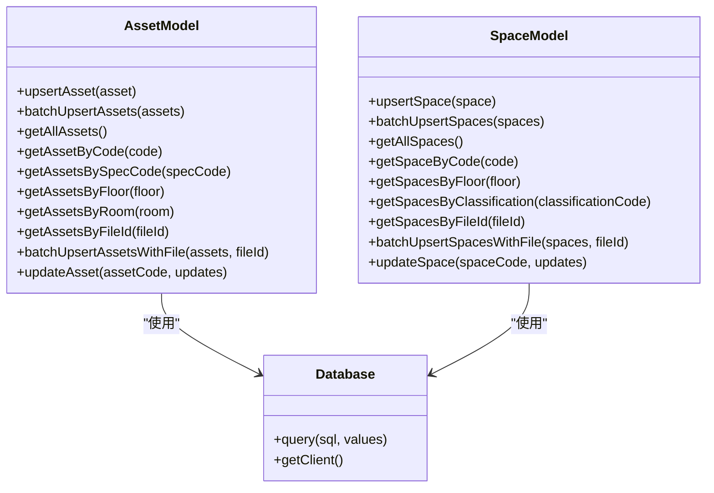
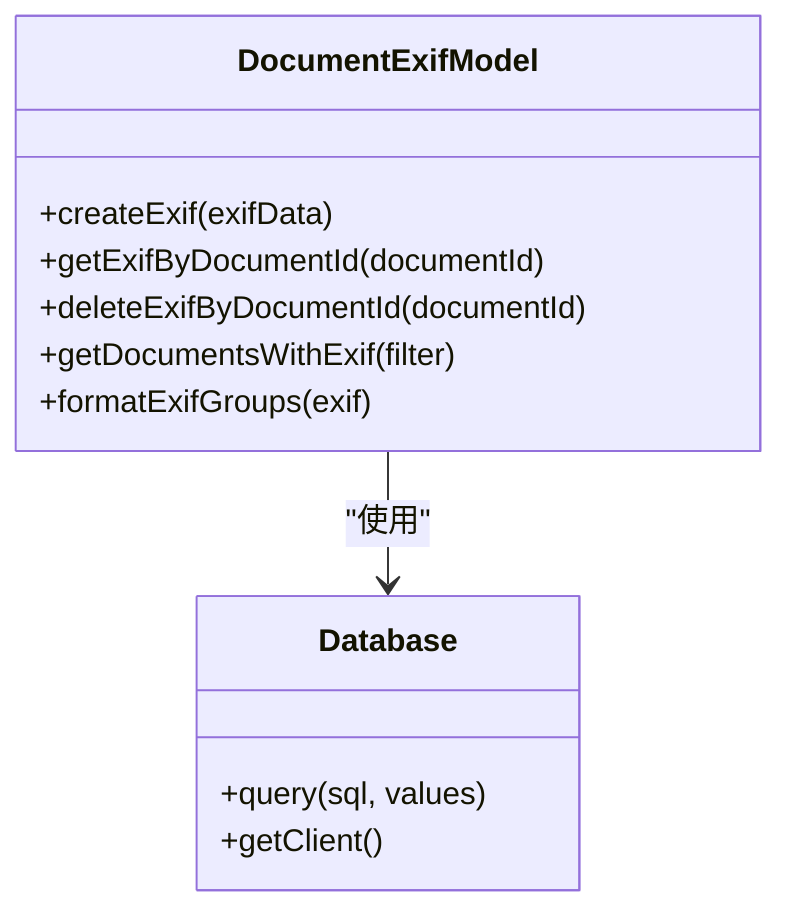
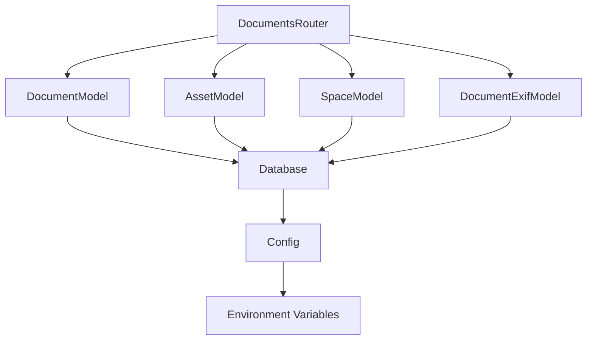

# 文档元数据与关联查询

<cite>
**本文档引用的文件**  
- [documents.js](file://server/routes/v1/documents.js)
- [document.js](file://server/models/document.js)
- [create_documents_table.sql](file://server/db/create_documents_table.sql)
- [document-exif.js](file://server/models/document-exif.js)
- [create_document_exif_table.sql](file://server/db/create_document_exif_table.sql)
- [asset.js](file://server/models/asset.js)
- [space.js](file://server/models/space.js)
- [database.js](file://server/config/database.js)
- [index.js](file://server/config/index.js)
</cite>

## 目录
1. [简介](#简介)
2. [项目结构](#项目结构)
3. [核心组件](#核心组件)
4. [架构概述](#架构概述)
5. [详细组件分析](#详细组件分析)
6. [依赖分析](#依赖分析)
7. [性能考虑](#性能考虑)
8. [故障排除指南](#故障排除指南)
9. [结论](#结论)
10. [附录](#附录)（如有必要）

## 简介
本文档详细说明了文档元数据管理API的设计与实现，重点描述了文档信息的增删改查操作、文档与资产和空间的关联查询机制、文档元数据字段的含义和用途，以及相关的使用示例和查询结果的排序规则与分页处理建议。

## 项目结构
文档管理功能主要位于`server/routes/v1/documents.js`中，该文件定义了所有文档相关的API路由。文档数据模型定义在`server/models/document.js`中，而文档与资产、空间的关联查询则通过`server/models/asset.js`和`server/models/space.js`实现。数据库表结构由`server/db/create_documents_table.sql`和`server/db/create_document_exif_table.sql`定义。

**图示来源**  
- [documents.js](file://server/routes/v1/documents.js)
- [document.js](file://server/models/document.js)
- [asset.js](file://server/models/asset.js)
- [space.js](file://server/models/space.js)
- [document-exif.js](file://server/models/document-exif.js)
- [create_documents_table.sql](file://server/db/create_documents_table.sql)
- [create_document_exif_table.sql](file://server/db/create_document_exif_table.sql)
- [database.js](file://server/config/database.js)
- [index.js](file://server/config/index.js)

**章节来源**  
- [documents.js](file://server/routes/v1/documents.js)
- [document.js](file://server/models/document.js)
- [asset.js](file://server/models/asset.js)
- [space.js](file://server/models/space.js)
- [document-exif.js](file://server/models/document-exif.js)
- [create_documents_table.sql](file://server/db/create_documents_table.sql)
- [create_document_exif_table.sql](file://server/db/create_document_exif_table.sql)
- [database.js](file://server/config/database.js)
- [index.js](file://server/config/index.js)

## 核心组件
文档元数据管理API的核心组件包括文档路由、文档模型、资产模型、空间模型、EXIF信息模型以及数据库配置。这些组件共同实现了文档的增删改查、与资产和空间的关联查询、EXIF信息提取与存储等功能。

**章节来源**  
- [documents.js](file://server/routes/v1/documents.js)
- [document.js](file://server/models/document.js)
- [asset.js](file://server/models/asset.js)
- [space.js](file://server/models/space.js)
- [document-exif.js](file://server/models/document-exif.js)
- [create_documents_table.sql](file://server/db/create_documents_table.sql)
- [create_document_exif_table.sql](file://server/db/create_document_exif_table.sql)
- [database.js](file://server/config/database.js)
- [index.js](file://server/config/index.js)

## 架构概述
文档元数据管理API采用分层架构，包括API路由层、数据模型层、数据库层和配置层。API路由层负责处理HTTP请求和响应，数据模型层负责业务逻辑和数据访问，数据库层负责数据存储和查询，配置层负责应用配置和环境变量管理。

**图示来源**  
- [documents.js](file://server/routes/v1/documents.js)
- [document.js](file://server/models/document.js)
- [asset.js](file://server/models/asset.js)
- [space.js](file://server/models/space.js)
- [document-exif.js](file://server/models/document-exif.js)
- [create_documents_table.sql](file://server/db/create_documents_table.sql)
- [create_document_exif_table.sql](file://server/db/create_document_exif_table.sql)
- [database.js](file://server/config/database.js)
- [index.js](file://server/config/index.js)

## 详细组件分析
### 文档路由分析
文档路由组件定义了所有文档相关的API端点，包括获取文档列表、获取单个文档详情、更新文档信息、删除文档记录及物理文件等操作。这些端点通过`server/routes/v1/documents.js`文件中的Express路由实现。

#### 文档路由类图

**图示来源**  
- [documents.js](file://server/routes/v1/documents.js)
- [document.js](file://server/models/document.js)
- [asset.js](file://server/models/asset.js)
- [space.js](file://server/models/space.js)
- [document-exif.js](file://server/models/document-exif.js)

**章节来源**  
- [documents.js](file://server/routes/v1/documents.js)

### 文档模型分析
文档模型组件负责文档数据的访问和业务逻辑处理，包括获取文档列表、获取单个文档详情、创建文档记录、更新文档标题、删除文档记录等操作。这些操作通过`server/models/document.js`文件中的函数实现。

#### 文档模型类图

**图示来源**  
- [document.js](file://server/models/document.js)
- [database.js](file://server/config/database.js)

**章节来源**  
- [document.js](file://server/models/document.js)

### 资产与空间模型分析
资产与空间模型组件负责资产和空间数据的访问和业务逻辑处理，包括获取资产和空间列表、获取单个资产和空间详情、批量插入资产和空间等操作。这些操作通过`server/models/asset.js`和`server/models/space.js`文件中的函数实现。

#### 资产与空间模型类图

**图示来源**  
- [asset.js](file://server/models/asset.js)
- [space.js](file://server/models/space.js)
- [database.js](file://server/config/database.js)

**章节来源**  
- [asset.js](file://server/models/asset.js)
- [space.js](file://server/models/space.js)

### EXIF信息模型分析
EXIF信息模型组件负责图像文件EXIF元数据的提取、存储和访问，包括创建EXIF记录、根据文档ID获取EXIF信息、删除EXIF记录、获取带有EXIF信息的文档列表等操作。这些操作通过`server/models/document-exif.js`文件中的函数实现。

#### EXIF信息模型类图

**图示来源**  
- [document-exif.js](file://server/models/document-exif.js)
- [database.js](file://server/config/database.js)

**章节来源**  
- [document-exif.js](file://server/models/document-exif.js)

## 依赖分析
文档元数据管理API的依赖关系包括文档路由对文档模型、资产模型、空间模型和EXIF信息模型的依赖，文档模型、资产模型、空间模型和EXIF信息模型对数据库的依赖，以及数据库对配置的依赖。这些依赖关系通过模块导入和函数调用实现。

**图示来源**  
- [documents.js](file://server/routes/v1/documents.js)
- [document.js](file://server/models/document.js)
- [asset.js](file://server/models/asset.js)
- [space.js](file://server/models/space.js)
- [document-exif.js](file://server/models/document-exif.js)
- [database.js](file://server/config/database.js)
- [index.js](file://server/config/index.js)

**章节来源**  
- [documents.js](file://server/routes/v1/documents.js)
- [document.js](file://server/models/document.js)
- [asset.js](file://server/models/asset.js)
- [space.js](file://server/models/space.js)
- [document-exif.js](file://server/models/document-exif.js)
- [database.js](file://server/config/database.js)
- [index.js](file://server/config/index.js)

## 性能考虑
文档元数据管理API的性能考虑包括数据库查询优化、文件上传和下载性能、EXIF信息提取性能等。数据库查询通过索引优化，文件上传和下载通过流式处理优化，EXIF信息提取通过异步处理优化。

## 故障排除指南
文档元数据管理API的故障排除指南包括数据库连接问题、文件上传和下载问题、EXIF信息提取问题等。数据库连接问题可以通过检查数据库配置和连接字符串解决，文件上传和下载问题可以通过检查文件路径和权限解决，EXIF信息提取问题可以通过检查文件格式和权限解决。

**章节来源**  
- [database.js](file://server/config/database.js)
- [index.js](file://server/config/index.js)

## 结论
文档元数据管理API通过分层架构和模块化设计，实现了文档的增删改查、与资产和空间的关联查询、EXIF信息提取与存储等功能。API设计遵循RESTful原则，使用Express框架实现，数据存储使用PostgreSQL数据库，配置管理使用环境变量。

## 附录
### 文档元数据字段说明
| 字段名 | 类型 | 描述 |
| --- | --- | --- |
| title | VARCHAR(255) | 文档标题（可编辑） |
| file_name | VARCHAR(255) | 原始文件名 |
| file_path | VARCHAR(500) | 服务器存储路径 |
| file_size | INTEGER | 文件大小（字节） |
| file_type | VARCHAR(50) | 文件扩展名（如pdf, jpg） |
| mime_type | VARCHAR(100) | MIME类型 |
| asset_code | VARCHAR(100) | 关联的资产编码 |
| space_code | VARCHAR(100) | 关联的空间编码 |
| spec_code | VARCHAR(100) | 关联的规格编码 |
| created_at | TIMESTAMP | 创建时间 |
| updated_at | TIMESTAMP | 更新时间 |

**章节来源**  
- [create_documents_table.sql](file://server/db/create_documents_table.sql)

### EXIF信息字段说明
| 字段名 | 类型 | 描述 |
| --- | --- | --- |
| date_time | TIMESTAMP | 拍摄时间 |
| image_width | INTEGER | 图像宽度 |
| image_height | INTEGER | 图像高度 |
| equip_model | VARCHAR(255) | 照相机型号 |
| f_number | DECIMAL(5,2) | 光圈值（如f/2.8） |
| exposure_time | VARCHAR(50) | 曝光时间（如1/125s） |
| iso_speed | INTEGER | ISO速度 |
| focal_length | DECIMAL(10,2) | 焦距（mm） |
| gps_longitude | DECIMAL(12,8) | GPS经度 |
| gps_latitude | DECIMAL(11,8) | GPS纬度 |
| gps_altitude | DECIMAL(10,2) | GPS高度（米） |
| created_at | TIMESTAMP | 创建时间 |
| updated_at | TIMESTAMP | 更新时间 |

**章节来源**  
- [create_document_exif_table.sql](file://server/db/create_document_exif_table.sql)