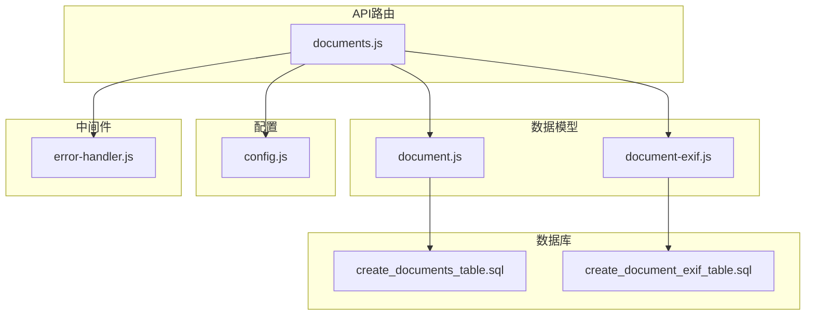
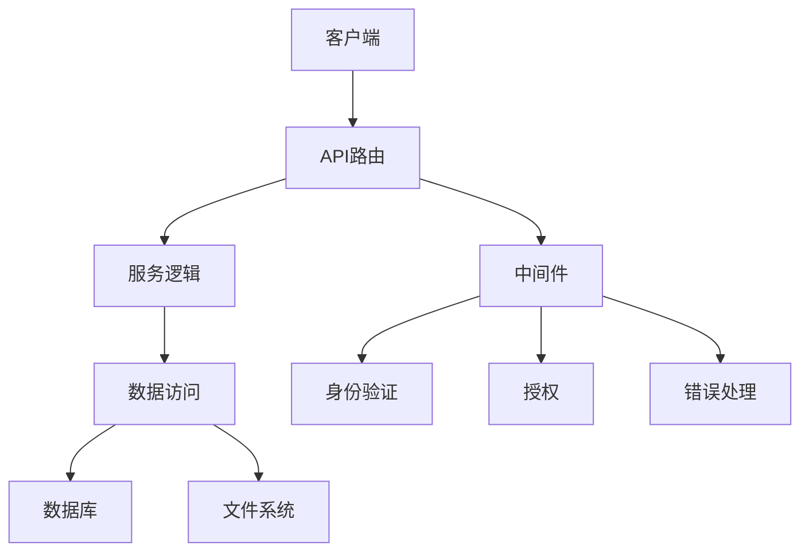
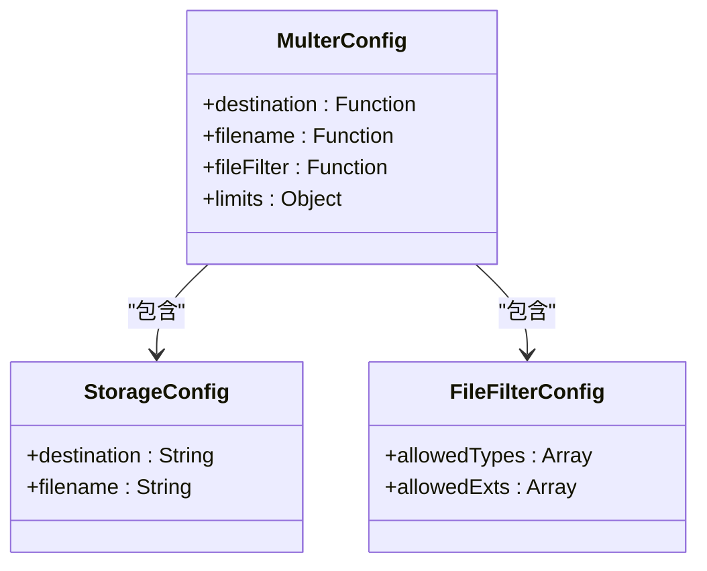
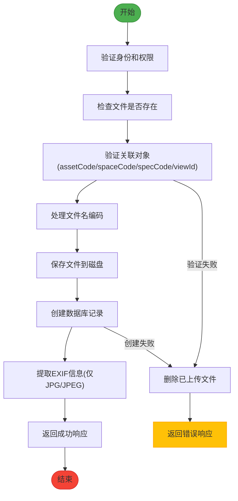
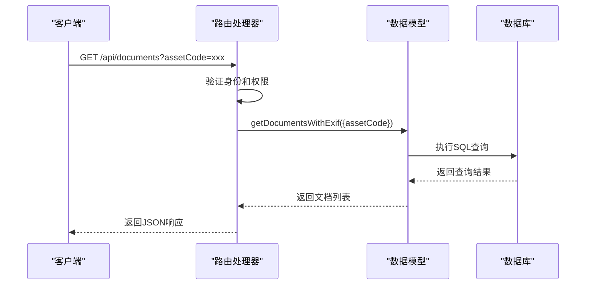
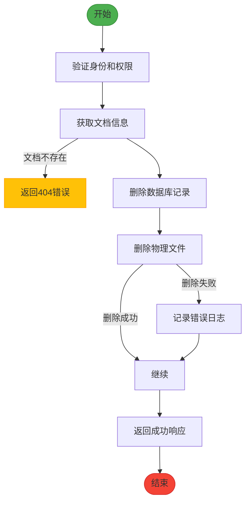
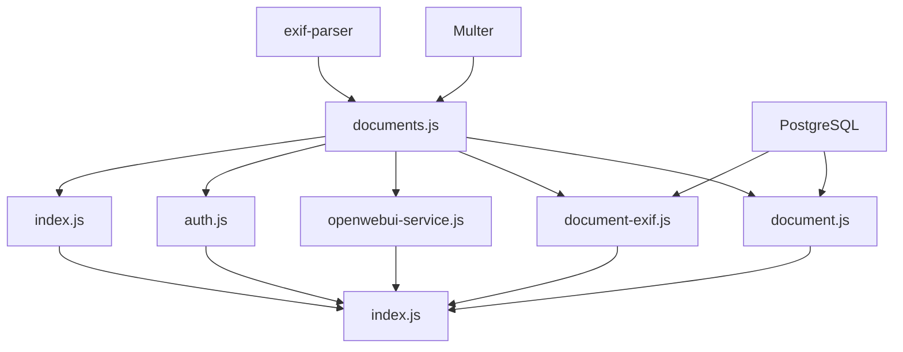

# 文档管理API

<cite>
**本文档引用的文件**   
- [documents.js](file://server/routes/documents.js)
- [document.js](file://server/models/document.js)
- [document-exif.js](file://server/models/document-exif.js)
- [create_documents_table.sql](file://server/db/create_documents_table.sql)
- [create_document_exif_table.sql](file://server/db/create_document_exif_table.sql)
- [config.js](file://server/config/index.js)
- [error-handler.js](file://server/middleware/error-handler.js)
</cite>

## 目录
1. [简介](#简介)
2. [项目结构](#项目结构)
3. [核心组件](#核心组件)
4. [架构概述](#架构概述)
5. [详细组件分析](#详细组件分析)
6. [依赖分析](#依赖分析)
7. [性能考虑](#性能考虑)
8. [故障排除指南](#故障排除指南)
9. [结论](#结论)
10. [附录](#附录)（如有必要）

## 简介
本文档详细说明了文档管理API的功能，包括文档的上传、下载、查询和删除操作。文档管理API支持将文档与资产、空间、规格或视图进行关联，并提供文件上传的Multer配置、存储路径和文件类型限制。API还支持提取图像文件的EXIF信息，并提供相应的查询接口。所有操作均受权限控制，确保数据安全。

## 项目结构
文档管理API位于`server/routes/documents.js`，其核心数据模型定义在`server/models/document.js`和`server/models/document-exif.js`中。数据库表结构由`server/db/create_documents_table.sql`和`server/db/create_document_exif_table.sql`定义。文件上传配置在`server/config/index.js`中管理，而错误处理由`server/middleware/error-handler.js`统一处理。



**图源**
- [documents.js](file://server/routes/documents.js)
- [document.js](file://server/models/document.js)
- [document-exif.js](file://server/models/document-exif.js)
- [create_documents_table.sql](file://server/db/create_documents_table.sql)
- [create_document_exif_table.sql](file://server/db/create_document_exif_table.sql)
- [config.js](file://server/config/index.js)
- [error-handler.js](file://server/middleware/error-handler.js)

**章节源**
- [documents.js](file://server/routes/documents.js)
- [document.js](file://server/models/document.js)
- [document-exif.js](file://server/models/document-exif.js)
- [create_documents_table.sql](file://server/db/create_documents_table.sql)
- [create_document_exif_table.sql](file://server/db/create_document_exif_table.sql)
- [config.js](file://server/config/index.js)
- [error-handler.js](file://server/middleware/error-handler.js)

## 核心组件
文档管理API的核心功能包括文档的上传、下载、查询和删除。上传功能支持将文档与资产、空间、规格或视图关联，并自动提取JPG/JPEG文件的EXIF信息。查询接口支持按资产、空间、规格或视图获取文档列表。所有操作均通过RESTful API提供，并受权限控制。

**章节源**
- [documents.js](file://server/routes/documents.js)
- [document.js](file://server/models/document.js)
- [document-exif.js](file://server/models/document-exif.js)

## 架构概述
文档管理API采用分层架构，包括路由层、服务层和数据访问层。路由层处理HTTP请求和响应，服务层实现业务逻辑，数据访问层与数据库交互。文件上传使用Multer中间件，配置了磁盘存储和文件过滤。EXIF信息提取使用exif-parser库。所有API端点均受身份验证和授权中间件保护。



**图源**
- [documents.js](file://server/routes/documents.js)
- [document.js](file://server/models/document.js)
- [document-exif.js](file://server/models/document-exif.js)
- [error-handler.js](file://server/middleware/error-handler.js)

## 详细组件分析

### 文档上传分析
文档上传功能通过`/api/documents/upload`端点实现。客户端以multipart/form-data格式发送请求，包含文件和关联信息。服务器使用Multer中间件处理文件上传，将其存储在指定目录，并生成唯一文件名。上传成功后，文档信息被插入数据库，并可选择性地提取EXIF信息。

#### 文件上传配置


**图源**
- [documents.js](file://server/routes/documents.js)

#### 上传流程


**图源**
- [documents.js](file://server/routes/documents.js)

**章节源**
- [documents.js](file://server/routes/documents.js)

### 文档查询分析
文档查询功能支持按资产、空间、规格或视图获取文档列表。查询接口返回文档基本信息及其EXIF信息（如果存在）。EXIF信息被格式化为分组结构，便于前端展示。

#### 查询接口


**图源**
- [documents.js](file://server/routes/documents.js)
- [document-exif.js](file://server/models/document-exif.js)

**章节源**
- [documents.js](file://server/routes/documents.js)
- [document-exif.js](file://server/models/document-exif.js)

### 文档删除分析
文档删除功能通过`/api/documents/:id`端点实现。删除操作首先从数据库获取文档信息，然后删除数据库记录和物理文件。如果文件删除失败，操作仍会继续，以确保数据库状态的一致性。

#### 删除流程


**图源**
- [documents.js](file://server/routes/documents.js)

**章节源**
- [documents.js](file://server/routes/documents.js)

## 依赖分析
文档管理API依赖于多个内部和外部组件。内部依赖包括数据库模型、配置模块和中间件。外部依赖包括Multer（文件上传）、exif-parser（EXIF信息提取）和PostgreSQL（数据库存储）。所有依赖关系通过package.json管理。



**图源**
- [documents.js](file://server/routes/documents.js)
- [document.js](file://server/models/document.js)
- [document-exif.js](file://server/models/document-exif.js)
- [package.json](file://server/package.json)

**章节源**
- [documents.js](file://server/routes/documents.js)
- [document.js](file://server/models/document.js)
- [document-exif.js](file://server/models/document-exif.js)
- [package.json](file://server/package.json)

## 性能考虑
文档管理API在设计时考虑了性能因素。数据库查询使用索引以提高性能，文件上传和删除操作在服务器端高效执行。EXIF信息提取仅针对JPG/JPEG文件，并在上传时异步处理，避免阻塞主流程。大文件上传支持断点续传，提高用户体验。

## 故障排除指南
### 常见问题及解决方案
| 问题 | 可能原因 | 解决方案 |
|------|---------|---------|
| 上传失败 | 文件类型不支持 | 检查文件扩展名是否为.pdf, .jpg, .jpeg, .png, .svg, .mp4 |
| 上传失败 | 文件大小超过限制 | 检查文件是否超过200MB |
| 上传失败 | 缺少关联对象 | 确保请求中包含assetCode, spaceCode, specCode或viewId |
| 下载失败 | 文件不存在 | 检查文件路径是否正确，文件是否已被删除 |
| 查询返回空 | 无关联文档 | 检查关联对象编码是否正确 |

### 错误处理策略
API使用统一的错误处理中间件，返回标准化的错误响应。常见错误包括：
- 400 Bad Request：请求参数无效
- 401 Unauthorized：未授权访问
- 403 Forbidden：权限不足
- 404 Not Found：资源不存在
- 500 Internal Server Error：服务器内部错误

**章节源**
- [error-handler.js](file://server/middleware/error-handler.js)
- [documents.js](file://server/routes/documents.js)

## 结论
文档管理API提供了完整的文档生命周期管理功能，包括上传、下载、查询和删除。API设计考虑了安全性、性能和易用性，支持与资产、空间、规格或视图的关联，并能提取图像文件的EXIF信息。通过合理的架构设计和错误处理，API能够稳定可靠地运行。

## 附录

### API端点汇总
| 端点 | 方法 | 描述 | 权限 |
|------|------|------|------|
| /api/documents/upload | POST | 上传文档 | DOCUMENT_CREATE |
| /api/documents | GET | 获取文档列表 | DOCUMENT_READ |
| /api/documents/:id | GET | 获取文档详情 | DOCUMENT_READ |
| /api/documents/:id/exif | GET | 获取文档EXIF信息 | DOCUMENT_READ |
| /api/documents/:id | PUT | 更新文档标题 | DOCUMENT_UPDATE |
| /api/documents/:id | DELETE | 删除文档 | DOCUMENT_DELETE |
| /api/documents/:id/download | GET | 下载文档 | DOCUMENT_READ |
| /api/documents/:id/preview | GET | 预览文档 | DOCUMENT_READ |
| /api/documents/view/:viewId | GET | 获取视图关联文档 | DOCUMENT_READ |

### 文件存储路径生成规则
文件存储路径由以下规则生成：
1. 使用`appConfig.upload.docsDir`作为根目录
2. 文件名采用`时间戳_随机字符串.扩展名`的格式
3. 数据库中存储的路径为`/docs/文件名`

### 支持的文件类型
| 文件类型 | MIME类型 | 扩展名 |
|--------|--------|------|
| PDF | application/pdf | .pdf |
| JPG | image/jpeg | .jpg, .jpeg |
| PNG | image/png | .png |
| SVG | image/svg+xml | .svg |
| MP4 | video/mp4 | .mp4 |

### 代码示例
#### 上传文档
```javascript
// 使用fetch上传文档
const formData = new FormData();
formData.append('file', fileInput.files[0]);
formData.append('assetCode', 'ASSET001');
formData.append('title', '设备手册');

fetch('/api/documents/upload', {
    method: 'POST',
    body: formData,
    headers: {
        'Authorization': 'Bearer ' + token
    }
})
.then(response => response.json())
.then(data => console.log(data));
```

#### 按资产查询文档
```javascript
// 查询资产关联的文档
fetch('/api/documents?assetCode=ASSET001', {
    headers: {
        'Authorization': 'Bearer ' + token
    }
})
.then(response => response.json())
.then(data => console.log(data.data));
```

#### 删除文档
```javascript
// 删除文档
fetch('/api/documents/123', {
    method: 'DELETE',
    headers: {
        'Authorization': 'Bearer ' + token
    }
})
.then(response => response.json())
.then(data => console.log(data));
```