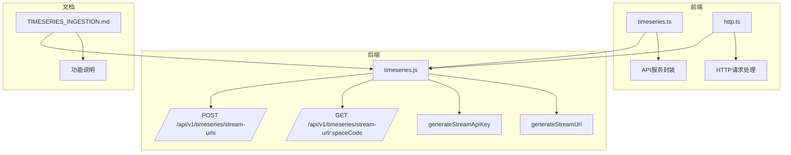
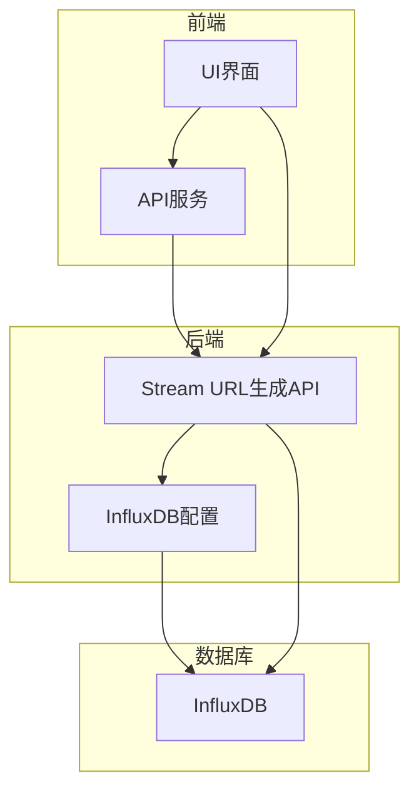
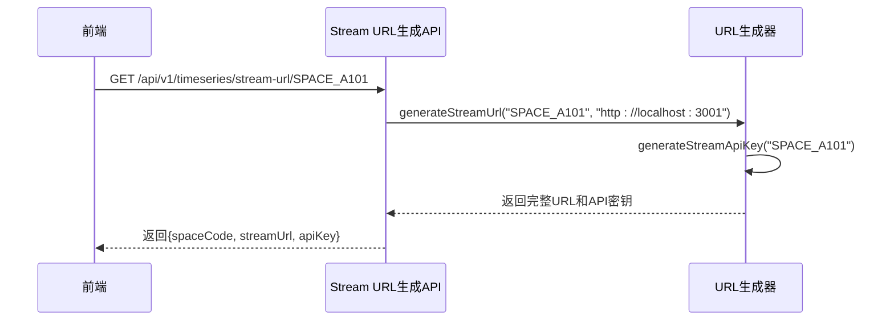
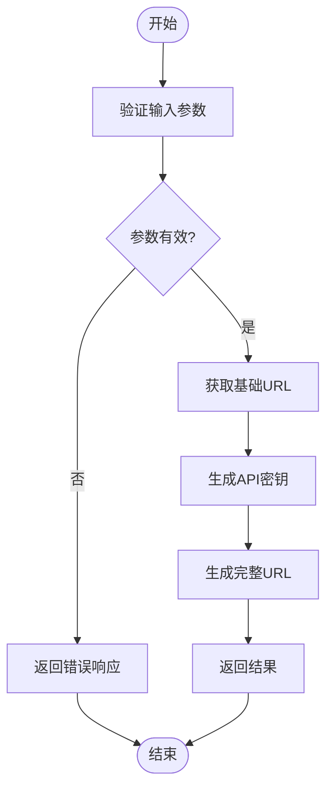
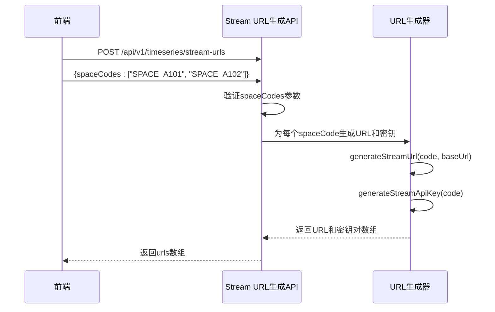
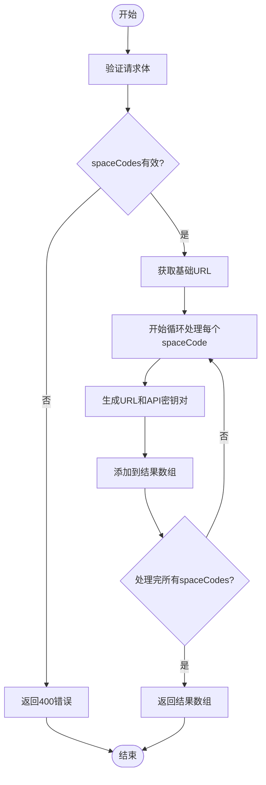
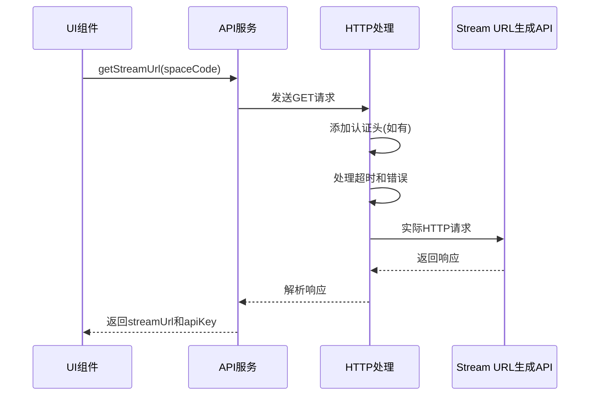
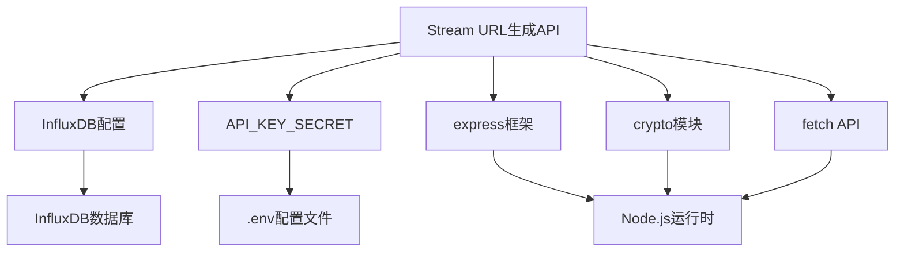

# Stream URL生成API

<cite>
**本文档引用的文件**
- [timeseries.js](file://server/routes/timeseries.js)
- [TIMESERIES_INGESTION.md](file://archive/TIMESERIES_INGESTION.md)
- [timeseries.ts](file://src/services/api/timeseries.ts)
- [http.ts](file://src/services/http.ts)
</cite>

## 目录
1. [简介](#简介)
2. [项目结构](#项目结构)
3. [核心组件](#核心组件)
4. [架构概述](#架构概述)
5. [详细组件分析](#详细组件分析)
6. [依赖分析](#依赖分析)
7. [性能考虑](#性能考虑)
8. [故障排除指南](#故障排除指南)
9. [结论](#结论)
10. [附录](#附录)（如有必要）

## 简介
本文档详细介绍了Stream URL生成API，该API用于为外部系统（如IoT设备、BMS系统、Node-RED等）提供安全的数据推送地址。系统通过为每个空间生成唯一的加密URL和API密钥，确保数据接入的安全性。文档涵盖GET /api/v1/timeseries/stream-url/:spaceCode和POST /api/v1/timeseries/stream-urls两个端点，详细说明了generateStreamUrl函数如何结合空间编码、基础URL和API Key生成完整的数据推送URL。同时，文档解释了批量获取接口如何处理多个spaceCodes并返回相应的URL和密钥对，提供了前端集成示例，并描述了返回数据结构中各字段的用途和安全注意事项。

## 项目结构
Stream URL生成API主要由后端路由、前端服务和相关配置文件组成。后端路由文件timeseries.js定义了API端点和核心逻辑，包括URL和API密钥的生成函数。前端服务文件timeseries.ts封装了API调用，而http.ts提供了HTTP请求的统一处理。文档文件TIMESERIES_INGESTION.md提供了功能概述和使用方法。

**Diagram sources**
- [timeseries.js](file://server/routes/timeseries.js#L1-L563)
- [timeseries.ts](file://src/services/api/timeseries.ts#L1-L95)
- [http.ts](file://src/services/http.ts#L1-L220)
- [TIMESERIES_INGESTION.md](file://archive/TIMESERIES_INGESTION.md#L1-L144)

**Section sources**
- [timeseries.js](file://server/routes/timeseries.js#L1-L563)
- [TIMESERIES_INGESTION.md](file://archive/TIMESERIES_INGESTION.md#L1-L144)

## 核心组件
Stream URL生成API的核心组件包括generateStreamUrl、generateStreamApiKey和validateStreamApiKey三个函数。这些函数共同实现了安全URL的生成和验证机制。generateStreamUrl函数结合空间编码、基础URL和API Key生成完整的数据推送URL。generateStreamApiKey函数使用HMAC-SHA256算法基于空间编码和服务器密钥生成唯一的API密钥。validateStreamApiKey函数用于验证提供的API密钥是否有效，确保数据推送的安全性。

**Section sources**
- [timeseries.js](file://server/routes/timeseries.js#L18-L42)
- [timeseries.js](file://server/routes/timeseries.js#L27-L33)

## 架构概述
Stream URL生成API的架构分为前端、后端和数据库三层。前端通过API服务调用后端端点，后端处理请求并生成相应的URL和密钥对，数据库存储相关的配置信息。该架构确保了数据推送的安全性和可扩展性。

**Diagram sources**
- [timeseries.js](file://server/routes/timeseries.js#L1-L563)
- [TIMESERIES_INGESTION.md](file://archive/TIMESERIES_INGESTION.md#L1-L144)

## 详细组件分析

### 单个Stream URL获取分析
单个Stream URL获取功能通过GET /api/v1/timeseries/stream-url/:spaceCode端点实现。该功能接收空间编码作为参数，生成包含加密API密钥的完整数据推送URL。

#### 对于API/服务组件：

**Diagram sources**
- [timeseries.js](file://server/routes/timeseries.js#L511-L532)

#### 对于复杂逻辑组件：

**Diagram sources**
- [timeseries.js](file://server/routes/timeseries.js#L511-L532)

**Section sources**
- [timeseries.js](file://server/routes/timeseries.js#L511-L532)
- [TIMESERIES_INGESTION.md](file://archive/TIMESERIES_INGESTION.md#L39-L55)

### 批量Stream URL获取分析
批量Stream URL获取功能通过POST /api/v1/timeseries/stream-urls端点实现。该功能接收空间编码数组作为请求体，为每个空间编码生成相应的URL和密钥对。

#### 对于API/服务组件：

**Diagram sources**
- [timeseries.js](file://server/routes/timeseries.js#L534-L560)

#### 对于复杂逻辑组件：

**Diagram sources**
- [timeseries.js](file://server/routes/timeseries.js#L534-L560)

**Section sources**
- [timeseries.js](file://server/routes/timeseries.js#L534-L560)
- [TIMESERIES_INGESTION.md](file://archive/TIMESERIES_INGESTION.md#L57-L68)

### 前端集成分析
前端集成通过API服务封装实现，提供了简洁的接口供UI组件调用。前端服务处理了HTTP请求的细节，包括认证、错误处理和超时控制。

#### 对于API/服务组件：

**Diagram sources**
- [timeseries.ts](file://src/services/api/timeseries.ts#L1-L95)
- [http.ts](file://src/services/http.ts#L1-L220)

**Section sources**
- [timeseries.ts](file://src/services/api/timeseries.ts#L1-L95)
- [http.ts](file://src/services/http.ts#L1-L220)

## 依赖分析
Stream URL生成API依赖于多个组件和配置。主要依赖包括InfluxDB配置、服务器密钥和前端HTTP服务。这些依赖确保了API的功能完整性和安全性。

**Diagram sources**
- [timeseries.js](file://server/routes/timeseries.js#L1-L563)
- [config.js](file://server/config/index.js#L1-L50)

**Section sources**
- [timeseries.js](file://server/routes/timeseries.js#L1-L563)
- [config.js](file://server/config/index.js#L1-L50)

## 性能考虑
Stream URL生成API的性能主要受以下几个因素影响：HMAC-SHA256算法的计算开销、HTTP请求处理时间和批量操作的循环效率。由于HMAC-SHA256算法的计算复杂度相对较低，且URL生成过程不涉及数据库查询，因此单个URL生成的性能非常高。批量操作的性能与空间编码的数量成线性关系，但由于每个URL的生成都是独立的，可以通过并行处理来优化性能。建议在高并发场景下使用连接池和缓存机制来进一步提升性能。

## 故障排除指南
在使用Stream URL生成API时，可能会遇到以下常见问题：

1. **API密钥无效**：确保使用的API密钥是通过generateStreamApiKey函数生成的，且空间编码正确。
2. **URL生成失败**：检查服务器的基础URL配置是否正确，确保协议和主机名有效。
3. **批量请求参数错误**：确保POST请求体中的spaceCodes是有效的数组且不为空。
4. **跨域问题**：在开发环境中，确保前端和后端的域名和端口配置正确，或配置适当的CORS策略。
5. **环境变量缺失**：确保API_KEY_SECRET环境变量已正确设置，否则API密钥生成将使用默认值，可能影响安全性。

**Section sources**
- [timeseries.js](file://server/routes/timeseries.js#L1-L563)
- [TIMESERIES_INGESTION.md](file://archive/TIMESERIES_INGESTION.md#L1-L144)

## 结论
Stream URL生成API为外部系统提供了安全、便捷的数据推送机制。通过为每个空间生成唯一的加密URL和API密钥，系统确保了数据接入的安全性。API设计简洁，易于集成，支持单个和批量URL生成，满足了不同场景的需求。前端集成示例展示了如何在实际应用中使用这些API，而安全注意事项则强调了保护API密钥的重要性。总体而言，该API为物联网数据接入提供了一个可靠的基础。

## 附录
### API端点详细说明

| 端点 | 方法 | 描述 | 请求参数 | 响应示例 |
|------|------|------|----------|----------|
| /api/v1/timeseries/stream-url/:spaceCode | GET | 获取单个空间的Stream URL | spaceCode (路径参数) | {"success": true, "data": {"spaceCode": "SPACE_A101", "streamUrl": "http://localhost:3001/api/v1/timeseries/streams/SPACE_A101?key=dwRvzsxLSa-RPixSS2J7bQ", "apiKey": "dwRvzsxLSa-RPixSS2J7bQ"}} |
| /api/v1/timeseries/stream-urls | POST | 批量获取多个空间的Stream URL | {spaceCodes: string[]} (请求体) | {"success": true, "data": [{"spaceCode": "SPACE_A101", "streamUrl": "http://localhost:3001/api/v1/timeseries/streams/SPACE_A101?key=dwRvzsxLSa-RPixSS2J7bQ", "apiKey": "dwRvzsxLSa-RPixSS2J7bQ"}, ...]} |

**Section sources**
- [timeseries.js](file://server/routes/timeseries.js#L511-L560)
- [TIMESERIES_INGESTION.md](file://archive/TIMESERIES_INGESTION.md#L39-L68)