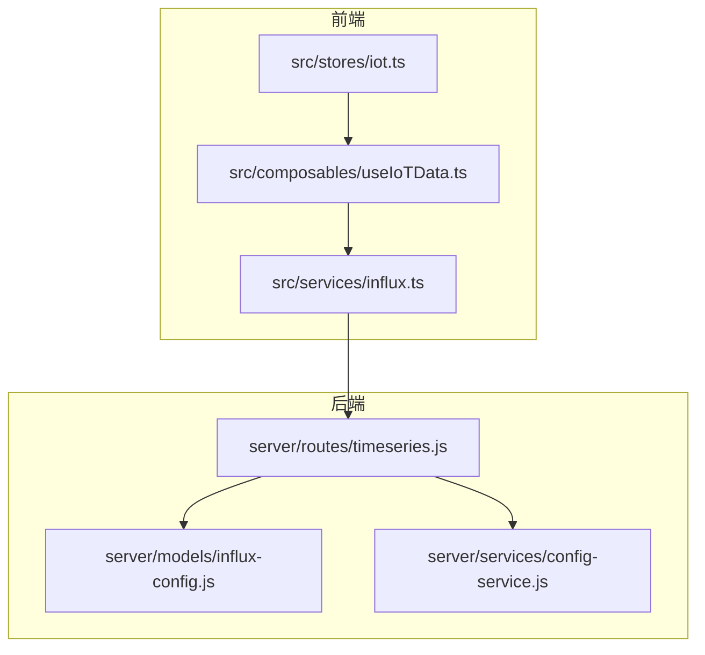
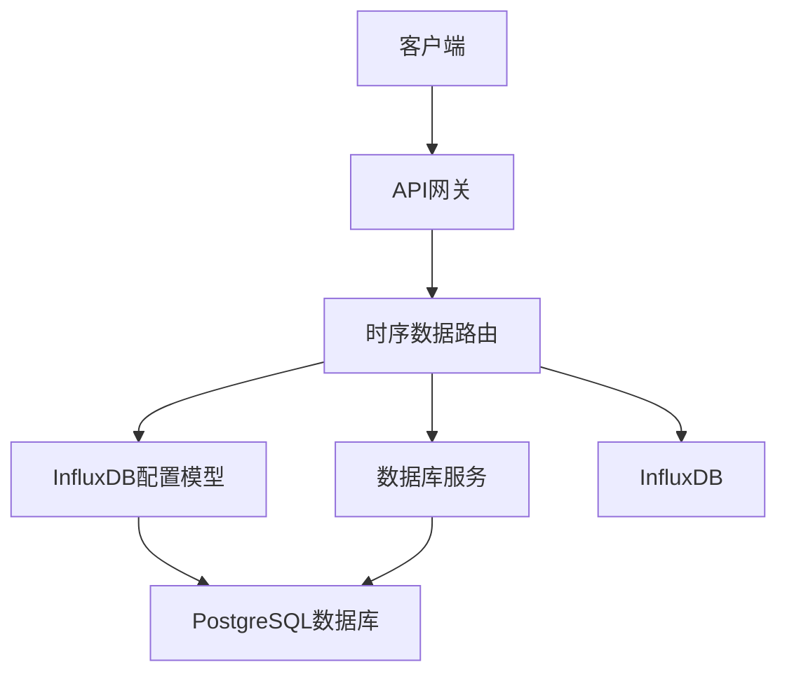
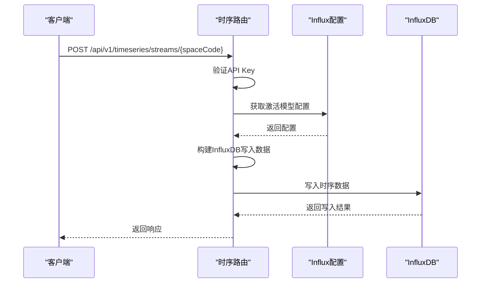
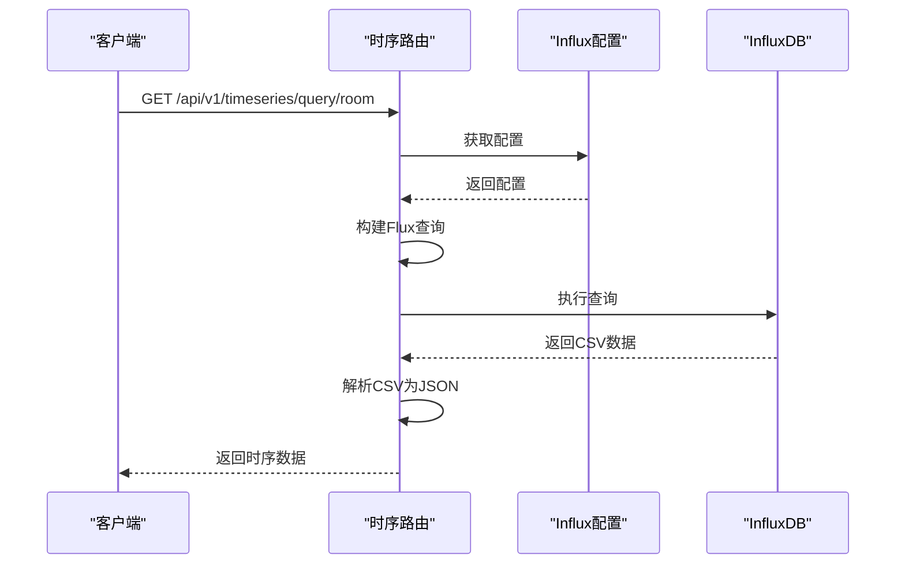
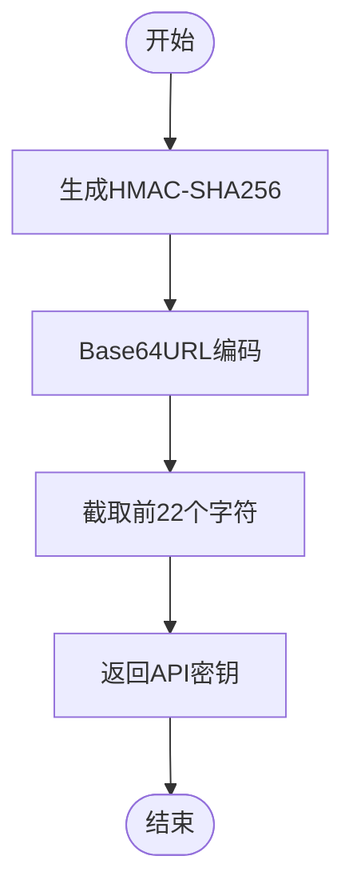
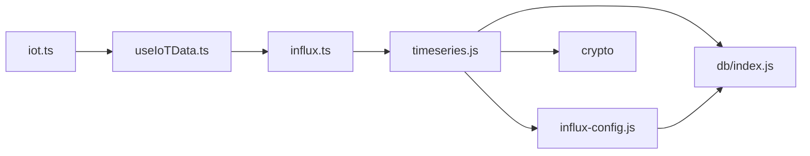

# 时序数据API

<cite>
**本文档引用的文件**
- [timeseries.js](file://server/routes/timeseries.js)
- [influx-config.js](file://server/models/influx-config.js)
- [config-service.js](file://server/services/config-service.js)
- [influx.ts](file://src/services/influx.ts)
- [useIoTData.ts](file://src/composables/useIoTData.ts)
- [iot.ts](file://src/stores/iot.ts)
- [init-all.sql](file://server/db/init-all.sql)
- [influx-config.js](file://server/routes/influx-config.js)
</cite>

## 目录
1. [简介](#简介)
2. [项目结构](#项目结构)
3. [核心组件](#核心组件)
4. [架构概述](#架构概述)
5. [详细组件分析](#详细组件分析)
6. [依赖分析](#依赖分析)
7. [性能考虑](#性能考虑)
8. [故障排除指南](#故障排除指南)
9. [结论](#结论)

## 简介
本文档详细说明了时序数据API的功能，包括时序数据的写入、查询和配置状态检查。文档解释了基于HMAC的API Key生成和验证机制，以及Stream URL的生成规则。同时描述了与InfluxDB的集成方式，包括查询构建、数据写入和响应解析，并提供了相关使用示例。

## 项目结构
时序数据API的实现主要分布在服务器端的routes和models目录中，以及前端的services和composables目录中。后端通过Express路由处理API请求，前端通过服务层与后端进行通信。

**图表来源**
- [timeseries.js](file://server/routes/timeseries.js#L1-L563)
- [influx.ts](file://src/services/influx.ts#L1-L164)
- [influx-config.js](file://server/models/influx-config.js#L1-L184)

**章节来源**
- [timeseries.js](file://server/routes/timeseries.js#L1-L563)
- [influx.ts](file://src/services/influx.ts#L1-L164)

## 核心组件
时序数据API的核心组件包括数据写入、查询处理、配置管理和安全验证。这些组件协同工作，实现了完整的时序数据管理功能。

**章节来源**
- [timeseries.js](file://server/routes/timeseries.js#L1-L563)
- [influx-config.js](file://server/models/influx-config.js#L1-L184)

## 架构概述
时序数据API采用分层架构，前端通过RESTful API与后端交互，后端代理所有InfluxDB操作。系统通过数据库中的配置信息动态加载InfluxDB连接参数，确保了配置的灵活性和安全性。

**图表来源**
- [timeseries.js](file://server/routes/timeseries.js#L1-L563)
- [influx-config.js](file://server/models/influx-config.js#L1-L184)
- [db/index.js](file://server/db/index.js#L1-L93)

## 详细组件分析

### 时序数据写入与查询分析
时序数据API提供了完整的数据写入和查询功能，通过标准化的接口处理时序数据的生命周期管理。

#### 数据写入流程

**图表来源**
- [timeseries.js](file://server/routes/timeseries.js#L267-L335)

#### 数据查询流程

**图表来源**
- [timeseries.js](file://server/routes/timeseries.js#L385-L427)

### API密钥与Stream URL生成分析
API密钥和Stream URL的生成机制确保了数据访问的安全性和可追溯性。

#### API密钥生成流程

**图表来源**
- [timeseries.js](file://server/routes/timeseries.js#L18-L22)

**章节来源**
- [timeseries.js](file://server/routes/timeseries.js#L18-L33)

## 依赖分析
时序数据API的组件之间存在明确的依赖关系，这些依赖确保了系统的稳定性和可维护性。

**图表来源**
- [timeseries.js](file://server/routes/timeseries.js#L7-L8)
- [influx-config.js](file://server/models/influx-config.js#L4-L5)
- [influx.ts](file://src/services/influx.ts#L6-L8)

**章节来源**
- [timeseries.js](file://server/routes/timeseries.js#L1-L563)
- [influx-config.js](file://server/models/influx-config.js#L1-L184)
- [influx.ts](file://src/services/influx.ts#L1-L164)

## 性能考虑
时序数据API在设计时考虑了性能优化，通过缓存机制减少数据库查询，使用流式处理提高数据传输效率。系统还实现了合理的错误处理和超时机制，确保在异常情况下仍能保持稳定运行。

## 故障排除指南
当遇到时序数据API相关问题时，可以按照以下步骤进行排查：
1. 检查InfluxDB配置是否正确
2. 验证API密钥是否有效
3. 确认网络连接是否正常
4. 检查数据库连接状态

**章节来源**
- [timeseries.js](file://server/routes/timeseries.js#L331-L334)
- [influx-config.js](file://server/models/influx-config.js#L168-L175)

## 结论
时序数据API提供了一套完整的时序数据管理解决方案，通过安全的API密钥机制、灵活的配置管理和高效的查询处理，满足了时序数据存储和分析的需求。系统设计考虑了可扩展性和可维护性，为未来的功能扩展奠定了良好基础。