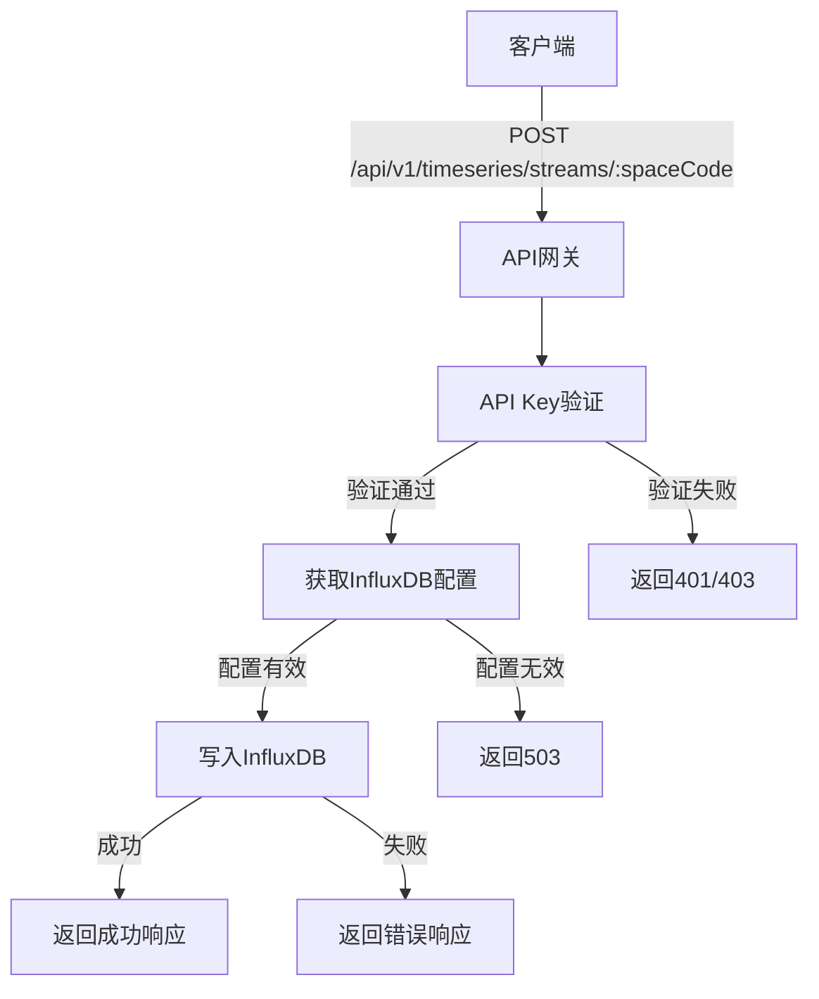
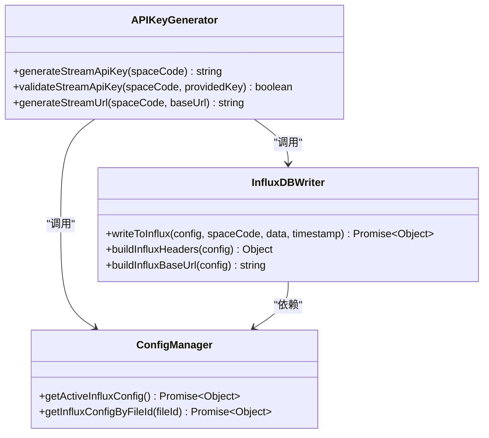
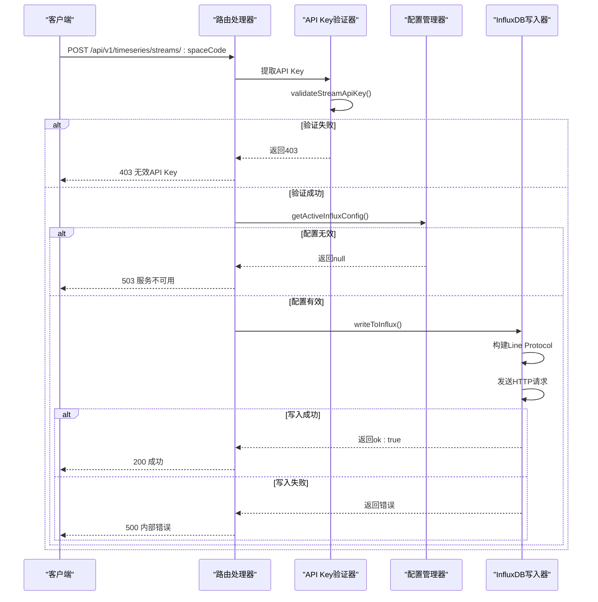
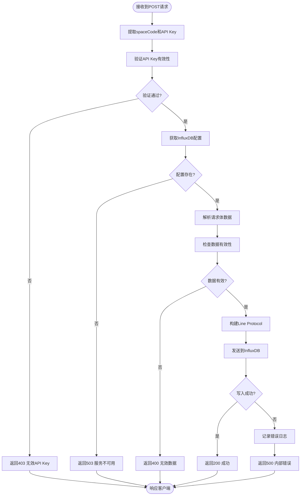
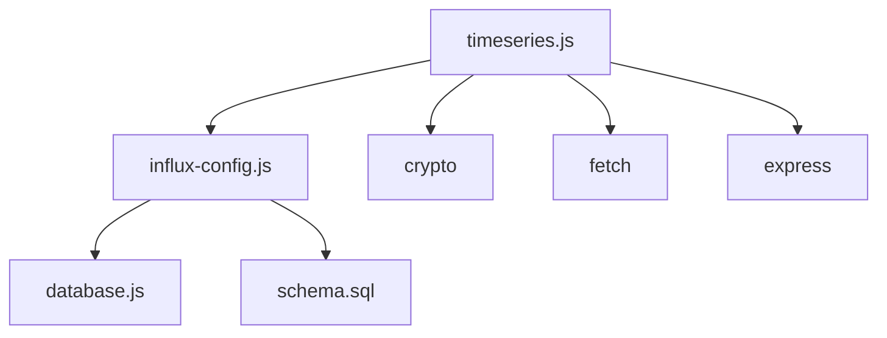

# 时序数据写入API

<cite>
**本文档引用文件**  
- [timeseries.js](file://server/routes/timeseries.js#L267-L335)
- [influx-config.js](file://server/models/influx-config.js#L9)
- [schema.sql](file://server/db/schema.sql#L103-L119)
</cite>

## 目录
1. [简介](#简介)
2. [核心组件](#核心组件)
3. [架构概述](#架构概述)
4. [详细组件分析](#详细组件分析)
5. [依赖分析](#依赖分析)
6. [性能考虑](#性能考虑)
7. [故障排除指南](#故障排除指南)
8. [结论](#结论)

## 简介
本文档详细说明了时序数据写入API的实现机制，重点介绍POST /api/v1/timeseries/streams/:spaceCode接口的实现细节。文档涵盖了基于HMAC的API Key验证流程、数据格式要求、写入InfluxDB的具体过程，以及相关的安全设计和错误处理机制。

## 核心组件
本节分析时序数据写入API的核心组件，包括API路由、认证机制和数据写入逻辑。

**节来源**
- [timeseries.js](file://server/routes/timeseries.js#L267-L335)
- [influx-config.js](file://server/models/influx-config.js#L9)

## 架构概述
时序数据写入API采用分层架构设计，通过后端代理所有InfluxDB操作。系统使用数据库中存储的配置信息连接到InfluxDB，并通过安全的API Key机制验证客户端身份。

**图来源**  
- [timeseries.js](file://server/routes/timeseries.js#L267-L335)

## 详细组件分析

### API Key验证机制分析
时序数据写入API采用基于HMAC的安全验证机制，确保只有授权客户端能够写入数据。

#### 安全设计类图

**图来源**  
- [timeseries.js](file://server/routes/timeseries.js#L18-L42)

#### API调用序列图

**图来源**  
- [timeseries.js](file://server/routes/timeseries.js#L267-L335)

### 数据写入流程分析
本节详细分析数据写入InfluxDB的具体过程，包括Line Protocol构建和HTTP请求发送。

#### 数据处理流程图

**图来源**  
- [timeseries.js](file://server/routes/timeseries.js#L137-L180)

**节来源**
- [timeseries.js](file://server/routes/timeseries.js#L137-L180)

## 依赖分析
时序数据写入API依赖于多个核心组件和外部服务，确保系统的稳定性和安全性。

**图来源**  
- [timeseries.js](file://server/routes/timeseries.js#L1-L563)
- [influx-config.js](file://server/models/influx-config.js#L1-L184)

**节来源**
- [timeseries.js](file://server/routes/timeseries.js#L1-L563)
- [influx-config.js](file://server/models/influx-config.js#L1-L184)

## 性能考虑
时序数据写入API在设计时考虑了性能优化，包括：
- 使用HMAC-SHA256进行安全验证，平衡安全性和性能
- 采用流式处理方式构建Line Protocol，减少内存占用
- 使用异步非阻塞I/O操作，提高并发处理能力
- 通过连接池和重用机制优化InfluxDB通信性能

## 故障排除指南
本节说明API的错误处理机制和常见问题的解决方案。

**节来源**
- [timeseries.js](file://server/routes/timeseries.js#L280-L330)

## 结论
时序数据写入API提供了一个安全、高效的机制，用于将时序数据写入InfluxDB。通过基于HMAC的API Key验证、灵活的配置管理和健壮的错误处理，系统确保了数据写入的安全性和可靠性。客户端可以通过简单的HTTP POST请求，使用预生成的API Key将数据推送到指定的空间。