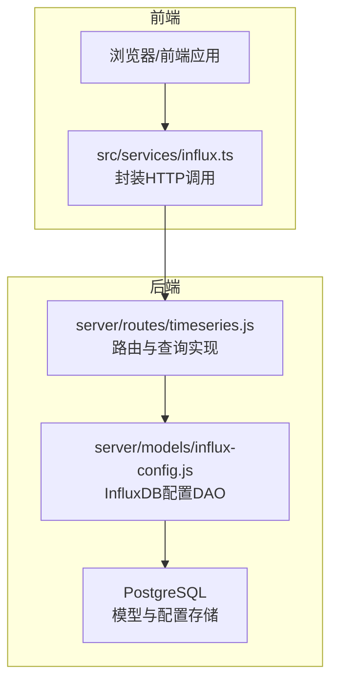
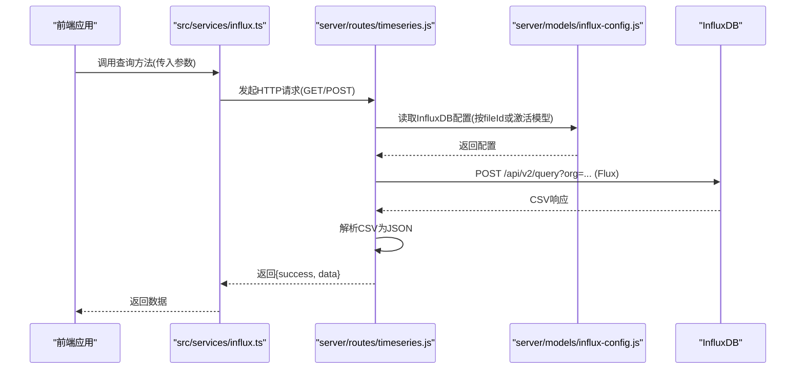
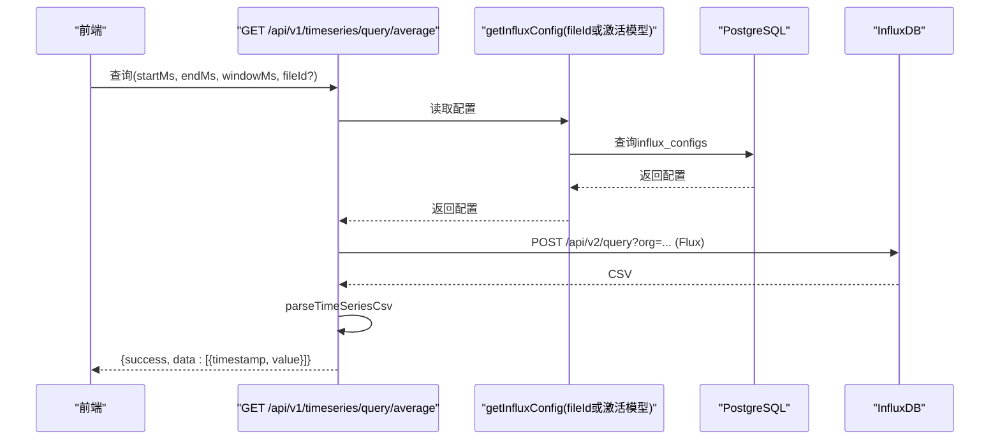
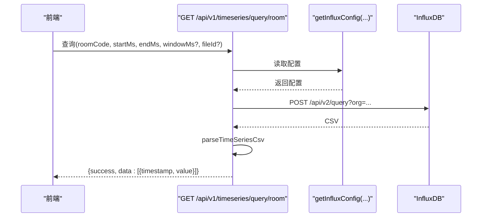
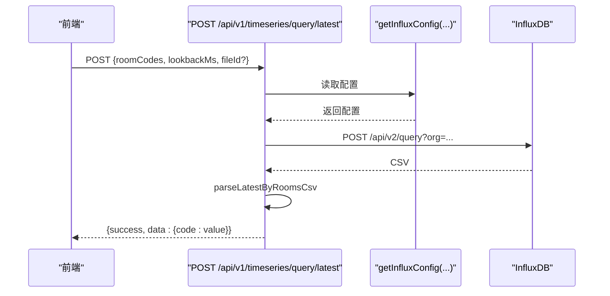
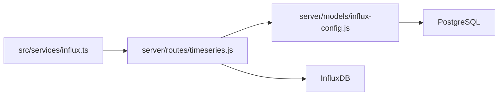

# 时序数据查询API

<cite>
**本文引用的文件**
- [server/routes/timeseries.js](file://server/routes/timeseries.js)
- [server/models/influx-config.js](file://server/models/influx-config.js)
- [src/services/influx.ts](file://src/services/influx.ts)
- [src/components/MainView.vue](file://src/components/MainView.vue)
- [src\AppViewer.vue](file://src\AppViewer.vue)
- [server/models/model-file.js](file://server/models/model-file.js)
</cite>

## 目录
1. [简介](#简介)
2. [项目结构](#项目结构)
3. [核心组件](#核心组件)
4. [架构总览](#架构总览)
5. [详细组件分析](#详细组件分析)
6. [依赖关系分析](#依赖关系分析)
7. [性能考量](#性能考量)
8. [故障排查指南](#故障排查指南)
9. [结论](#结论)
10. [附录](#附录)

## 简介
本文件面向开发者，系统性梳理后端时序数据查询API，重点覆盖以下三个端点：
- GET /api/v1/timeseries/query/average：按时间窗口聚合的平均值时序查询
- GET /api/v1/timeseries/query/room：按房间过滤的历史时序查询
- POST /api/v1/timeseries/query/latest：按房间集合查询最新值

文档将深入解释每个查询的Flux脚本构建逻辑（时间范围过滤、数据聚合、标签匹配），解析CSV响应为JSON数据结构的方法，以及fileId参数如何支持跨模型数据查询。同时提供典型使用场景与调用示例，并给出性能优化与故障排查建议。

## 项目结构
后端API位于 server/routes/timeseries.js，负责：
- 读取InfluxDB配置（支持当前激活模型或指定fileId）
- 构建Flux查询语句
- 调用InfluxDB查询并解析CSV响应
- 对外提供平均值、房间时序、最新值三类查询接口

前端服务位于 src/services/influx.ts，封装对上述API的调用，便于业务组件使用。

图表来源
- [server/routes/timeseries.js](file://server/routes/timeseries.js#L1-L120)
- [server/models/influx-config.js](file://server/models/influx-config.js#L1-L60)

章节来源
- [server/routes/timeseries.js](file://server/routes/timeseries.js#L1-L120)
- [server/models/influx-config.js](file://server/models/influx-config.js#L1-L60)

## 核心组件
- Flux查询构建与执行：在路由层根据请求参数动态拼装Flux脚本，调用InfluxDB查询接口并接收CSV响应。
- CSV解析器：
  - parseTimeSeriesCsv：解析标准时序点（_time, _value）为[{timestamp, value}]。
  - parseLatestByRoomsCsv：解析多房间最新值（_value, code）为{code: value}。
- 配置选择策略：优先使用fileId指定的模型配置；若未提供，则使用当前激活模型的配置。
- 认证与安全：通过API Key保护流式写入端点；查询端点通过前端Bearer Token鉴权。

章节来源
- [server/routes/timeseries.js](file://server/routes/timeseries.js#L182-L257)
- [server/models/influx-config.js](file://server/models/influx-config.js#L1-L60)

## 架构总览
后端API采用“路由层+DAO层”的分层设计。路由层负责参数校验、Flux脚本构造、调用InfluxDB、解析CSV并返回JSON；DAO层负责从PostgreSQL读取InfluxDB配置；前端通过HTTP客户端封装调用。

图表来源
- [server/routes/timeseries.js](file://server/routes/timeseries.js#L337-L472)
- [server/models/influx-config.js](file://server/models/influx-config.js#L1-L60)
- [src/services/influx.ts](file://src/services/influx.ts#L55-L164)

## 详细组件分析

### 平均值时序查询：GET /api/v1/timeseries/query/average
- 功能概述：按指定时间范围与窗口大小对温度测量进行平均值聚合，返回时间序列点。
- 关键参数：
  - startMs, endMs：时间范围（毫秒）
  - windowMs：聚合窗口（毫秒），默认60000
  - fileId：可选，指定模型文件ID以跨模型查询
- Flux构建要点：
  - 使用from(bucket)与range(start, stop)限定数据源与时间范围
  - 使用filter过滤测量名（room_temp或temperature）与字段（_field == value）
  - 使用aggregateWindow按windowMs聚合，fn: mean
  - 使用group(columns: ["_time"])与mean()确保输出为单一序列
- CSV解析：
  - parseTimeSeriesCsv解析_csv_，提取_time与_value，转换为[{timestamp, value}]
- 错误处理：
  - 若配置不可用或查询失败，返回空数组
- 使用场景示例：
  - 获取某时间段内每小时的平均温度曲线
  - 在仪表板中展示聚合后的趋势图

图表来源
- [server/routes/timeseries.js](file://server/routes/timeseries.js#L337-L379)
- [server/models/influx-config.js](file://server/models/influx-config.js#L1-L60)

章节来源
- [server/routes/timeseries.js](file://server/routes/timeseries.js#L337-L379)
- [src/services/influx.ts](file://src/services/influx.ts#L55-L84)

### 房间时序查询：GET /api/v1/timeseries/query/room
- 功能概述：按房间码过滤，返回该房间的历史温度时序；可选开启按windowMs聚合。
- 关键参数：
  - roomCode：房间标识
  - startMs, endMs：时间范围
  - windowMs：可选，大于0时启用聚合
  - fileId：可选，跨模型查询
- Flux构建要点：
  - 过滤测量名与字段同上
  - 使用filter(fn: (r) => r.code == "${escapedCode}")匹配房间
  - 当windowMs > 0时，追加aggregateWindow(every: windowMs, fn: mean)
- CSV解析：
  - parseTimeSeriesCsv解析_csv_，输出[{timestamp, value}]
- 使用场景示例：
  - 查看单个房间的温度历史曲线
  - 对长周期数据按小时窗口聚合，降低点数

图表来源
- [server/routes/timeseries.js](file://server/routes/timeseries.js#L381-L427)

章节来源
- [server/routes/timeseries.js](file://server/routes/timeseries.js#L381-L427)
- [src/services/influx.ts](file://src/services/influx.ts#L85-L117)

### 最新值查询：POST /api/v1/timeseries/query/latest
- 功能概述：批量查询多个房间的最新温度值，返回{code: value}映射。
- 关键参数：
  - roomCodes：房间码数组
  - lookbackMs：回溯时间窗口，默认300000（5分钟）
  - fileId：可选，跨模型查询
- Flux构建要点：
  - range(start: now()-lookbackMs)
  - 过滤测量名与字段
  - 使用filter(fn: (r) => r["code"] =~ /${regex}/)匹配多个房间
  - 使用group(columns: ["code"])与last()获取每个房间的最新值
- CSV解析：
  - parseLatestByRoomsCsv解析_csv_，输出{code: value}
- 使用场景示例：
  - 实时看板中展示各房间当前温度
  - 与模型文件关联，支持跨模型查询

图表来源
- [server/routes/timeseries.js](file://server/routes/timeseries.js#L429-L472)

章节来源
- [server/routes/timeseries.js](file://server/routes/timeseries.js#L429-L472)
- [src/services/influx.ts](file://src/services/influx.ts#L119-L144)

### CSV解析器详解
- parseTimeSeriesCsv
  - 输入：InfluxDB返回的CSV文本
  - 步骤：跳过注释行，定位包含_time与_value的表头，按列索引提取时间戳与数值，过滤非法值，输出[{timestamp, value}]
  - 时间复杂度：O(N)，N为CSV行数
- parseLatestByRoomsCsv
  - 输入：包含_code_与_value_的CSV
  - 步骤：定位包含code与_value的表头，按列索引提取code与value，过滤非法值，输出{code: value}
  - 时间复杂度：O(N)

章节来源
- [server/routes/timeseries.js](file://server/routes/timeseries.js#L213-L257)

### fileId参数与跨模型查询
- 配置来源：
  - getActiveInfluxConfig：从model_files中查找is_active=true的模型，再读取对应fileId的influx_configs
  - getInfluxConfigByFileId：直接按fileId读取influx_configs
- 使用方式：
  - 前端调用时传入fileId，后端据此选择InfluxDB配置，从而实现跨模型数据查询
- 与模型文件的关系：
  - model-file.js提供模型文件的创建、激活、删除等能力；激活模型后，其对应的InfluxDB配置可用于查询

章节来源
- [server/routes/timeseries.js](file://server/routes/timeseries.js#L44-L74)
- [server/models/influx-config.js](file://server/models/influx-config.js#L1-L60)
- [server/models/model-file.js](file://server/models/model-file.js#L66-L76)

### 前端集成与典型使用
- 前端封装：
  - src/services/influx.ts提供queryAverageSeries、queryRoomSeries、queryLatestByRooms等方法，统一处理fileId、认证头与错误处理
- 典型使用场景：
  - 主视图加载平均值曲线：在MainView.vue中调用queryAverageSeries(start, end, windowMs)
  - 房间系列缓存：在MainView.vue中批量调用queryRoomSeries(codes, start, end, windowMs)
  - 实时最新值：在MainView.vue中定期调用queryLatestByRooms(codes, lookbackMs)
  - AppViewer.vue中按选中房间刷新图表数据

章节来源
- [src/services/influx.ts](file://src/services/influx.ts#L55-L164)
- [src/components/MainView.vue](file://src/components/MainView.vue#L320-L357)
- [src/components/MainView.vue](file://src/components/MainView.vue#L1960-L2000)
- [src\AppViewer.vue](file://src\AppViewer.vue#L660-L676)

## 依赖关系分析
- 路由层依赖DAO层读取InfluxDB配置
- DAO层依赖PostgreSQL存储模型与配置
- 前端通过HTTP客户端调用后端API
- 查询端点与流式写入端点分离，前者通过Bearer Token鉴权，后者通过API Key鉴权

图表来源
- [server/routes/timeseries.js](file://server/routes/timeseries.js#L1-L120)
- [server/models/influx-config.js](file://server/models/influx-config.js#L1-L60)

章节来源
- [server/routes/timeseries.js](file://server/routes/timeseries.js#L1-L120)
- [server/models/influx-config.js](file://server/models/influx-config.js#L1-L60)

## 性能考量
- 聚合策略：合理设置windowMs，避免过大导致内存压力，过小导致点数过多
- 过滤条件：尽量使用精确的测量名与字段过滤，减少扫描范围
- 批量查询：前端使用Promise.all并发请求，缩短整体等待时间
- 缓存策略：对常用房间的series进行本地缓存，减少重复请求
- 错误降级：当InfluxDB未配置或查询失败时，返回空数据，保证前端可用性

## 故障排查指南
- 配置问题
  - 检查当前激活模型是否存在有效的influx_configs
  - 确认fileId是否正确，是否指向存在配置的模型
- 认证问题
  - 查询端点需Bearer Token；流式写入端点需API Key
- Flux语法问题
  - 确保测量名与字段过滤条件正确（room_temp或temperature，_field == value）
  - 聚合窗口与分组需匹配（group(columns: ["_time"])或group(columns: ["code"])）
- CSV解析问题
  - 确认CSV响应中包含_time/_value或code/value列
  - 检查时间戳与数值是否可解析为合法数字

章节来源
- [server/routes/timeseries.js](file://server/routes/timeseries.js#L337-L472)
- [server/models/influx-config.js](file://server/models/influx-config.js#L1-L60)

## 结论
本文档系统梳理了后端时序数据查询API的实现与使用，重点覆盖了三个核心端点的Flux构建逻辑、CSV解析策略与fileId跨模型查询机制。结合前端封装与典型使用场景，开发者可以快速集成温度历史曲线、房间时序与最新值查询功能，并在性能与稳定性方面做出合理权衡。

## 附录
- API调用示例（基于前端封装）
  - 获取平均值曲线：queryAverageSeries(startMs, endMs, windowMs, fileId?)
  - 获取房间时序：queryRoomSeries(roomCode, startMs, endMs, windowMs, fileId?)
  - 获取多个房间最新值：queryLatestByRooms(roomCodes, lookbackMs, fileId?)

章节来源
- [src/services/influx.ts](file://src/services/influx.ts#L55-L164)
- [src/components/MainView.vue](file://src/components/MainView.vue#L320-L357)
- [src/components/MainView.vue](file://src/components/MainView.vue#L1960-L2000)
- [src\AppViewer.vue](file://src\AppViewer.vue#L660-L676)