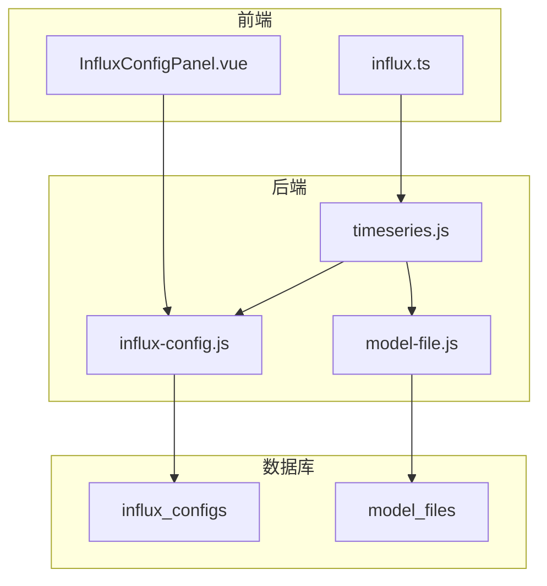
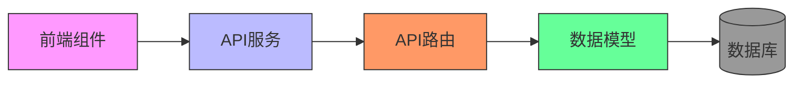
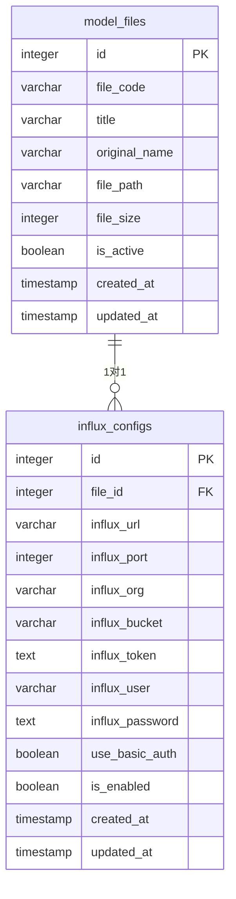
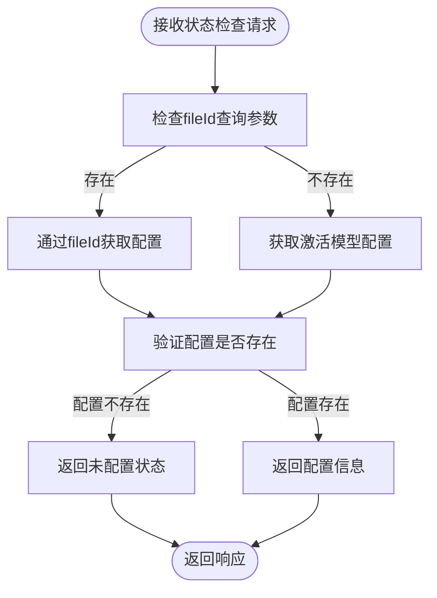
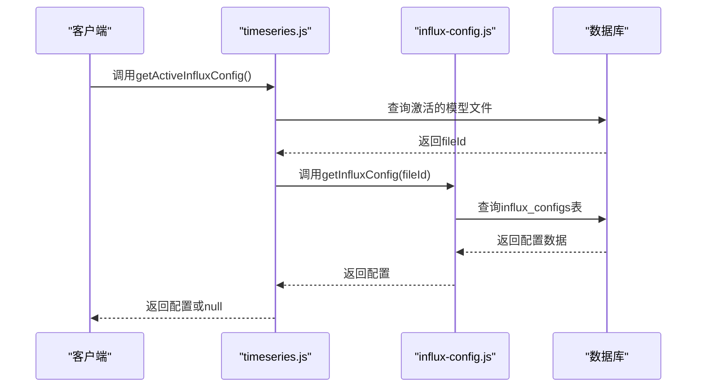
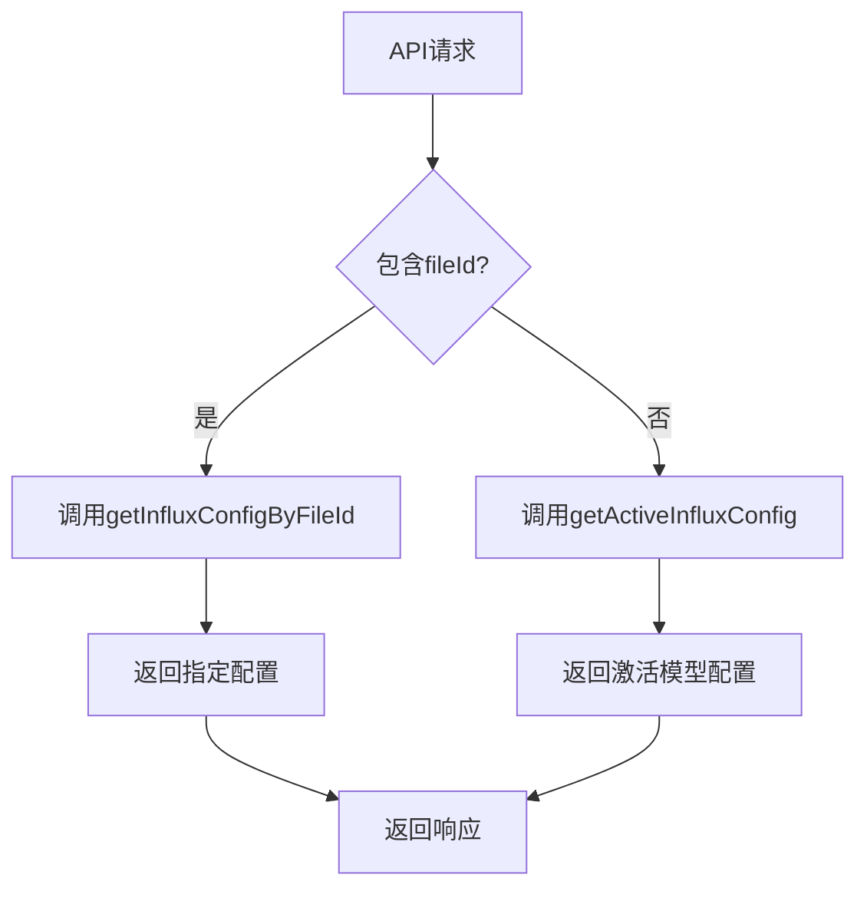
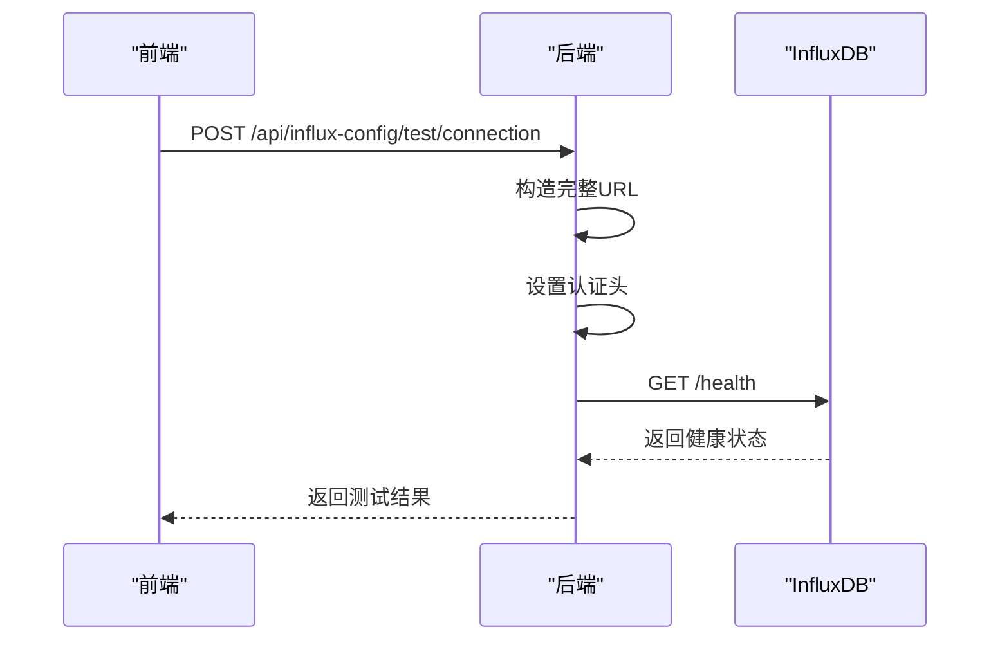
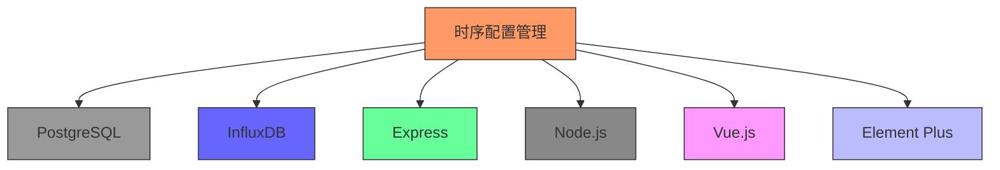

# 时序配置管理API

<cite>
**本文档引用的文件**  
- [influx-config.js](file://server/models/influx-config.js)
- [timeseries.js](file://server/routes/timeseries.js)
- [influx-config.js](file://server/routes/influx-config.js)
- [InfluxConfigPanel.vue](file://src/components/InfluxConfigPanel.vue)
- [influx.ts](file://src/services/influx.ts)
- [add-influx-config-table.js](file://server/scripts/add-influx-config-table.js)
- [model-file.js](file://server/models/model-file.js)
</cite>

## 目录
1. [简介](#简介)
2. [项目结构](#项目结构)
3. [核心组件](#核心组件)
4. [架构概述](#架构概述)
5. [详细组件分析](#详细组件分析)
6. [依赖分析](#依赖分析)
7. [性能考虑](#性能考虑)
8. [故障排除指南](#故障排除指南)
9. [结论](#结论)

## 简介
本文档详细描述了时序配置管理API的设计与实现，重点介绍`GET /api/v1/timeseries/status`端点及相关配置管理功能。文档涵盖了`getActiveInfluxConfig`函数如何从数据库获取当前激活模型的InfluxDB连接配置，以及配置状态检查的逻辑流程。同时解释了InfluxDB配置的动态加载机制，包括fileId参数的使用和配置缓存策略。结合`influx-config.js`中的`getInfluxConfig`和`testInfluxConnection`函数，描述了配置数据的存储结构和连接测试实现，并提供了配置状态响应的JSON示例和各字段含义说明。

## 项目结构
时序配置管理功能主要分布在服务器端的models、routes和scripts目录中，以及前端的components和服务层。核心配置管理逻辑位于`server/models/influx-config.js`和`server/routes/timeseries.js`中，数据库迁移脚本在`server/scripts/add-influx-config-table.js`中定义，前端界面由`src/components/InfluxConfigPanel.vue`实现。

**图示来源**  
- [influx-config.js](file://server/models/influx-config.js)
- [timeseries.js](file://server/routes/timeseries.js)
- [InfluxConfigPanel.vue](file://src/components/InfluxConfigPanel.vue)

**本节来源**  
- [influx-config.js](file://server/models/influx-config.js)
- [timeseries.js](file://server/routes/timeseries.js)
- [add-influx-config-table.js](file://server/scripts/add-influx-config-table.js)

## 核心组件
时序配置管理API的核心组件包括：InfluxDB配置数据访问对象、时序数据路由处理器、配置状态检查逻辑、连接测试功能以及前端配置管理面板。这些组件协同工作，实现了对InfluxDB连接配置的完整生命周期管理，从创建、更新、删除到状态检查和连接测试。

**本节来源**  
- [influx-config.js](file://server/models/influx-config.js)
- [timeseries.js](file://server/routes/timeseries.js)
- [InfluxConfigPanel.vue](file://src/components/InfluxConfigPanel.vue)

## 架构概述
时序配置管理API采用分层架构设计，前端组件通过API服务与后端路由交互，后端路由调用模型层的数据访问方法，最终与数据库进行交互。配置数据存储在独立的`influx_configs`表中，通过`file_id`与`model_files`表建立一对一关系。API提供了配置管理、状态检查和连接测试等功能，确保了配置的安全性和可用性。

**图示来源**  
- [influx-config.js](file://server/models/influx-config.js)
- [timeseries.js](file://server/routes/timeseries.js)
- [influx.ts](file://src/services/influx.ts)

## 详细组件分析

### 配置数据模型分析
InfluxDB配置数据模型定义了存储和管理InfluxDB连接配置所需的所有字段，包括URL、端口、组织、存储桶、认证信息等。该模型通过`file_id`与模型文件建立关联，实现了每个模型文件独立的配置管理。

**图示来源**  
- [add-influx-config-table.js](file://server/scripts/add-influx-config-table.js)
- [model-file.js](file://server/models/model-file.js)

### 配置状态检查流程
`GET /api/v1/timeseries/status`端点的处理流程涉及多个步骤，从接收请求到返回配置状态，确保了配置信息的准确性和安全性。

**图示来源**  
- [timeseries.js](file://server/routes/timeseries.js#L478-L508)

### getActiveInfluxConfig函数分析
`getActiveInfluxConfig`函数是获取当前激活模型InfluxDB配置的核心函数，其执行流程包括查找激活模型和获取对应配置两个主要步骤。

**图示来源**  
- [timeseries.js](file://server/routes/timeseries.js#L47-L61)
- [influx-config.js](file://server/models/influx-config.js#L9-L15)

### 配置动态加载机制
配置的动态加载机制支持通过fileId参数指定特定模型的配置，或获取当前激活模型的配置，提供了灵活的配置管理方式。

**图示来源**  
- [timeseries.js](file://server/routes/timeseries.js#L482-L487)

### 连接测试实现
连接测试功能通过`testInfluxConnection`函数实现，该函数构造适当的请求头并发送健康检查请求到InfluxDB服务器，以验证连接的有效性。

**图示来源**  
- [influx-config.js](file://server/models/influx-config.js#L108-L176)
- [influx-config.js](file://server/routes/influx-config.js#L135-L158)

**本节来源**  
- [influx-config.js](file://server/models/influx-config.js)
- [timeseries.js](file://server/routes/timeseries.js)
- [influx-config.js](file://server/routes/influx-config.js)
- [InfluxConfigPanel.vue](file://src/components/InfluxConfigPanel.vue)

## 依赖分析
时序配置管理功能依赖于多个核心组件和外部服务。数据库依赖PostgreSQL存储配置数据，时序数据库依赖InfluxDB进行数据存储和查询，前端依赖Vue.js框架和Element Plus组件库，后端依赖Express框架和Node.js运行时。

**图示来源**  
- [influx-config.js](file://server/models/influx-config.js)
- [timeseries.js](file://server/routes/timeseries.js)
- [package.json](file://package.json)

## 性能考虑
在设计时序配置管理API时，考虑了多个性能优化点。配置数据的查询使用了索引优化，连接测试实现了超时控制，API响应采用了适当的缓存策略。此外，通过限制并发连接数和优化数据库查询，确保了系统的稳定性和响应速度。

## 故障排除指南
当遇到配置管理相关问题时，可以按照以下步骤进行排查：
1. 检查数据库连接是否正常
2. 验证InfluxDB配置参数是否正确
3. 确认激活的模型文件是否存在
4. 检查API密钥和权限设置
5. 验证网络连接和防火墙设置

**本节来源**  
- [timeseries.js](file://server/routes/timeseries.js)
- [influx-config.js](file://server/models/influx-config.js)

## 结论
时序配置管理API提供了一套完整的InfluxDB连接配置管理解决方案，通过清晰的API设计和稳健的实现，确保了配置的安全性、可靠性和易用性。系统支持动态配置加载、连接状态检查和连接测试等功能，为时序数据的采集和查询提供了坚实的基础。