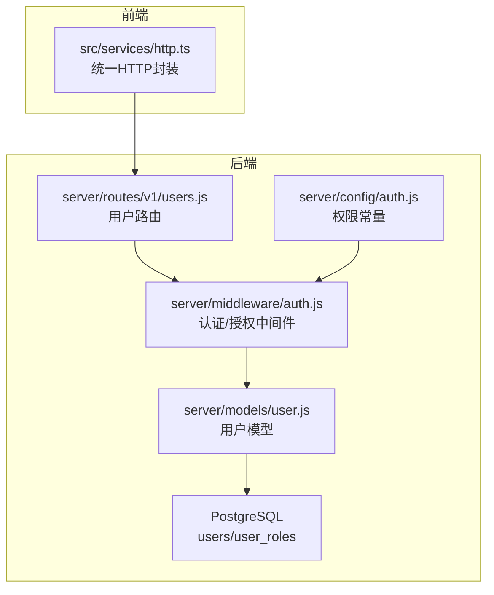
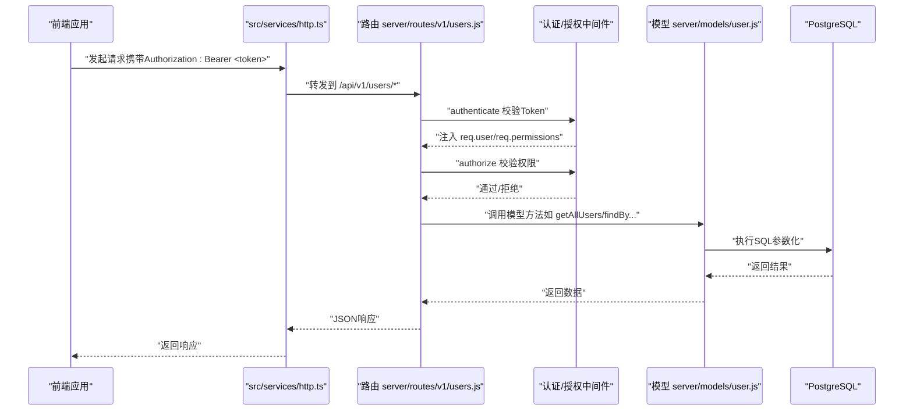
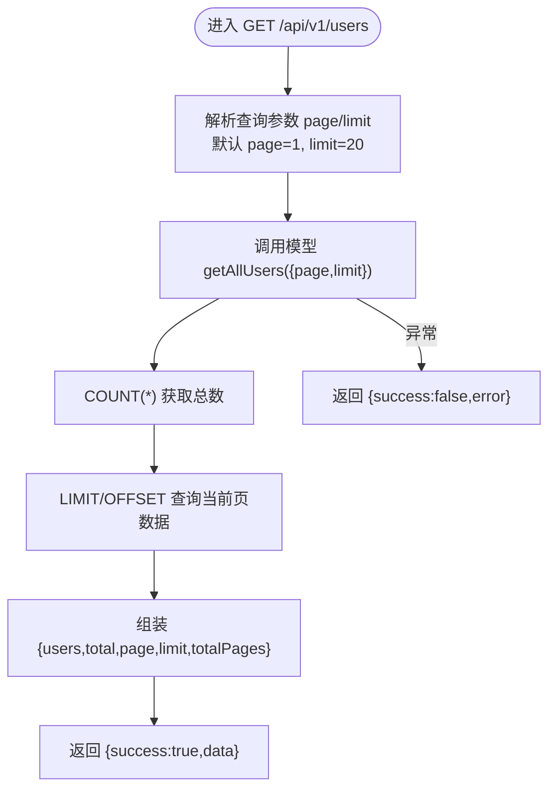
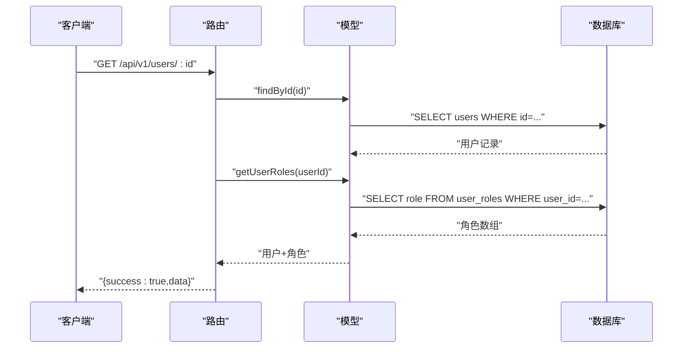
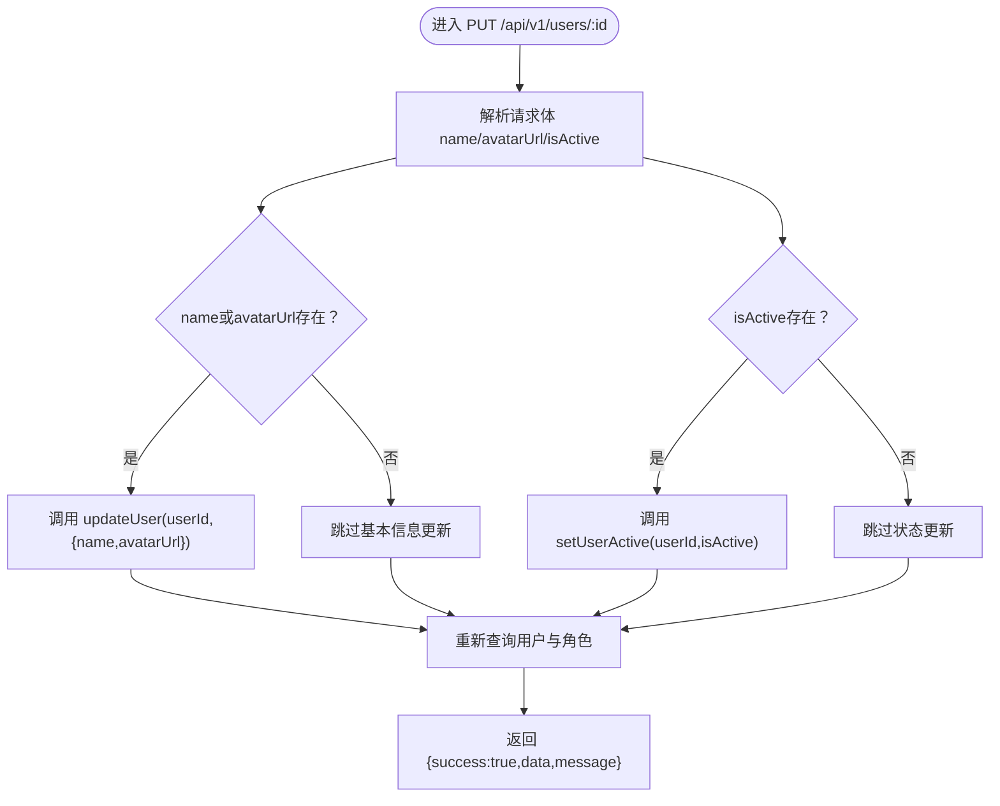
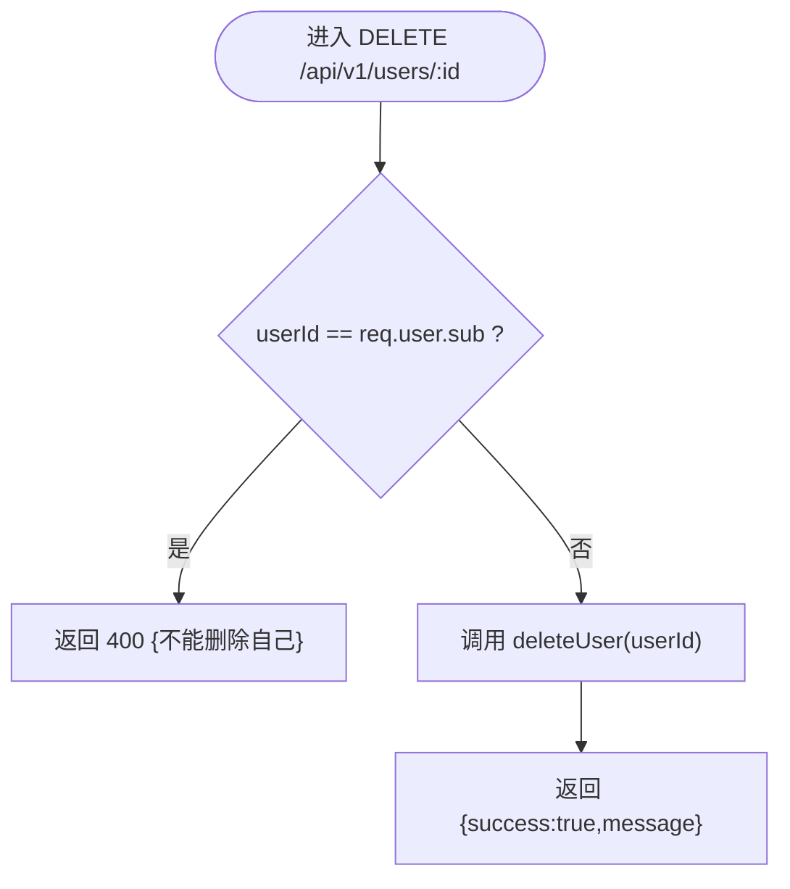
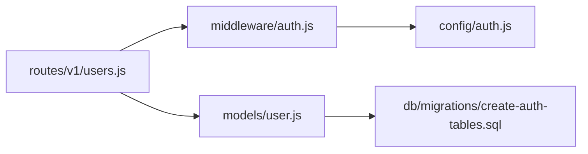
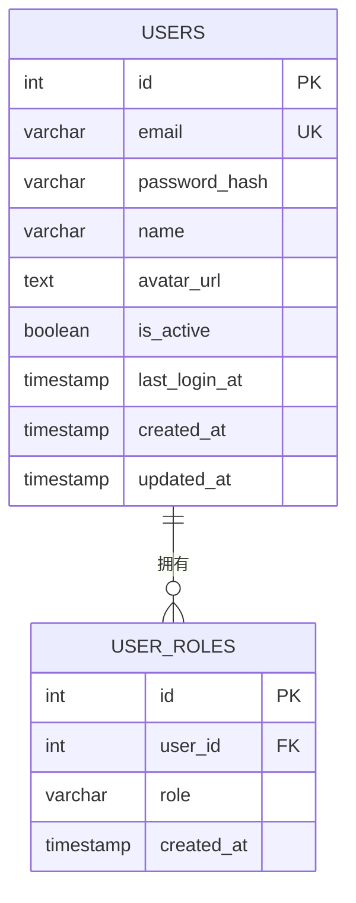

# 用户信息管理

<cite>
**本文引用的文件**
- [server/routes/v1/users.js](file://server/routes/v1/users.js)
- [server/models/user.js](file://server/models/user.js)
- [server/middleware/auth.js](file://server/middleware/auth.js)
- [server/config/auth.js](file://server/config/auth.js)
- [server/db/migrations/create-auth-tables.sql](file://server/db/migrations/create-auth-tables.sql)
- [src/services/http.ts](file://src/services/http.ts)
</cite>

## 目录
1. [简介](#简介)
2. [项目结构](#项目结构)
3. [核心组件](#核心组件)
4. [架构总览](#架构总览)
5. [详细组件分析](#详细组件分析)
6. [依赖分析](#依赖分析)
7. [性能考虑](#性能考虑)
8. [故障排查指南](#故障排查指南)
9. [结论](#结论)
10. [附录](#附录)

## 简介
本文件面向“用户信息管理”功能，围绕以下API进行深入解析：
- 用户列表查询：GET /api/v1/users（支持分页）
- 用户详情获取：GET /api/v1/users/:id
- 用户信息更新：PUT /api/v1/users/:id（支持更新基本信息与状态）
- 用户删除：DELETE /api/v1/users/:id（管理员不可删除自己）

文档同时说明分页参数 page、limit 的使用与默认值；用户基本信息（name、avatarUrl）更新与状态（isActive）管理的实现逻辑；JWT 令牌在请求头中的传递方式；以及模型层 getAllUsers、findById、updateUser、deleteUser 等方法的 SQL 实现细节。

## 项目结构
用户管理功能涉及后端路由、模型层、认证中间件与权限配置，以及前端 HTTP 封装服务。关键文件如下：
- 后端路由：server/routes/v1/users.js
- 模型层：server/models/user.js
- 认证中间件：server/middleware/auth.js
- 权限常量：server/config/auth.js
- 用户表结构：server/db/migrations/create-auth-tables.sql
- 前端 HTTP 封装：src/services/http.ts

图表来源
- [server/routes/v1/users.js](file://server/routes/v1/users.js#L1-L178)
- [server/models/user.js](file://server/models/user.js#L1-L252)
- [server/middleware/auth.js](file://server/middleware/auth.js#L1-L120)
- [server/config/auth.js](file://server/config/auth.js#L1-L142)
- [server/db/migrations/create-auth-tables.sql](file://server/db/migrations/create-auth-tables.sql#L1-L78)

章节来源
- [server/routes/v1/users.js](file://server/routes/v1/users.js#L1-L178)
- [server/models/user.js](file://server/models/user.js#L1-L252)
- [server/middleware/auth.js](file://server/middleware/auth.js#L1-L120)
- [server/config/auth.js](file://server/config/auth.js#L1-L142)
- [server/db/migrations/create-auth-tables.sql](file://server/db/migrations/create-auth-tables.sql#L1-L78)
- [src/services/http.ts](file://src/services/http.ts#L1-L220)

## 核心组件
- 用户路由（server/routes/v1/users.js）
  - 提供 GET /api/v1/users、GET /api/v1/users/:id、PUT /api/v1/users/:id、DELETE /api/v1/users/:id 等接口
  - 使用 authenticate 进行 JWT 认证，authorize 进行权限校验
  - 对分页参数 page、limit 进行解析与默认值设置
- 用户模型（server/models/user.js）
  - 提供 getAllUsers、findById、updateUser、setUserActive、deleteUser 等方法
  - SQL 查询使用参数化绑定，避免注入风险
- 认证中间件（server/middleware/auth.js）
  - authenticate：从 Authorization 头解析 Bearer Token 并解码，注入 req.user 与 req.permissions
  - authorize：基于 req.permissions 与所需权限进行授权判断
- 权限常量（server/config/auth.js）
  - 定义 PERMISSIONS、ROLES、ROLE_PERMISSIONS 等
- 用户表结构（server/db/migrations/create-auth-tables.sql）
  - users 主表含 id、email、name、avatar_url、is_active、last_login_at、created_at、updated_at
  - user_roles 关联用户与角色
- 前端 HTTP 封装（src/services/http.ts）
  - 自动在请求头添加 Authorization: Bearer <token>，支持 GET/POST/PUT/PATCH/DELETE

章节来源
- [server/routes/v1/users.js](file://server/routes/v1/users.js#L1-L178)
- [server/models/user.js](file://server/models/user.js#L1-L252)
- [server/middleware/auth.js](file://server/middleware/auth.js#L1-L120)
- [server/config/auth.js](file://server/config/auth.js#L1-L142)
- [server/db/migrations/create-auth-tables.sql](file://server/db/migrations/create-auth-tables.sql#L1-L78)
- [src/services/http.ts](file://src/services/http.ts#L1-L220)

## 架构总览
用户管理的请求处理链路如下：
- 前端通过 src/services/http.ts 发起带 Bearer Token 的请求
- Express 路由 server/routes/v1/users.js 接收请求
- 认证中间件 server/middleware/auth.js 校验 Token 并注入用户信息
- 授权中间件 server/middleware/auth.js 校验权限
- 模型层 server/models/user.js 执行数据库操作
- 返回统一格式的 JSON 响应

图表来源
- [server/routes/v1/users.js](file://server/routes/v1/users.js#L1-L178)
- [server/middleware/auth.js](file://server/middleware/auth.js#L1-L120)
- [server/models/user.js](file://server/models/user.js#L1-L252)
- [src/services/http.ts](file://src/services/http.ts#L1-L220)

## 详细组件分析

### 用户列表查询（GET /api/v1/users）
- 功能要点
  - 解析查询参数 page、limit，设置默认值为 1、20
  - 调用模型 getAllUsers，返回 users、total、page、limit、totalPages
  - 统一返回 { success: true, data: 结果对象 }
- 分页逻辑
  - offset = (page - 1) × limit
  - 先 COUNT(*) 获取 total，再 LIMIT/OFFSET 查询
- 错误处理
  - 捕获异常并返回 { success: false, error: message }

图表来源
- [server/routes/v1/users.js](file://server/routes/v1/users.js#L18-L37)
- [server/models/user.js](file://server/models/user.js#L148-L174)

章节来源
- [server/routes/v1/users.js](file://server/routes/v1/users.js#L18-L37)
- [server/models/user.js](file://server/models/user.js#L148-L174)

### 用户详情获取（GET /api/v1/users/:id）
- 功能要点
  - 根据 id 查询用户基本信息
  - 同步查询用户角色集合
  - 返回 { success: true, data: { ...user, roles } }
- 错误处理
  - 用户不存在返回 404

图表来源
- [server/routes/v1/users.js](file://server/routes/v1/users.js#L43-L66)
- [server/models/user.js](file://server/models/user.js#L30-L62)

章节来源
- [server/routes/v1/users.js](file://server/routes/v1/users.js#L43-L66)
- [server/models/user.js](file://server/models/user.js#L30-L62)

### 用户信息更新（PUT /api/v1/users/:id）
- 功能要点
  - 请求体支持 name、avatarUrl、isActive
  - 若提供 name/avatarUrl，则调用 updateUser 更新基本信息
  - 若提供 isActive，则调用 setUserActive 更新状态
  - 最终重新查询用户与角色并返回
- 安全与边界
  - 仅当字段存在时才执行对应更新
  - 字段为空字符串/undefined 的情况不会触发更新

图表来源
- [server/routes/v1/users.js](file://server/routes/v1/users.js#L72-L102)
- [server/models/user.js](file://server/models/user.js#L109-L146)

章节来源
- [server/routes/v1/users.js](file://server/routes/v1/users.js#L72-L102)
- [server/models/user.js](file://server/models/user.js#L109-L146)

### 用户删除（DELETE /api/v1/users/:id）
- 功能要点
  - 调用 deleteUser 删除用户
  - 返回 { success: true, message: '用户删除成功' }
- 安全限制
  - 不允许删除当前登录用户（比较 req.user.sub 与 userId）
  - 违反规则返回 400 { success: false, error: '不能删除自己' }

图表来源
- [server/routes/v1/users.js](file://server/routes/v1/users.js#L146-L175)
- [server/models/user.js](file://server/models/user.js#L176-L181)

章节来源
- [server/routes/v1/users.js](file://server/routes/v1/users.js#L146-L175)
- [server/models/user.js](file://server/models/user.js#L176-L181)

### 分页参数 page、limit 的使用与默认值
- 默认值
  - page 默认 1，limit 默认 20
- 计算方式
  - offset = (page - 1) × limit
  - 先 COUNT(*) 获取 total，再计算 totalPages = ceil(total / limit)
- 返回结构
  - data.users、data.total、data.page、data.limit、data.totalPages

章节来源
- [server/routes/v1/users.js](file://server/routes/v1/users.js#L18-L37)
- [server/models/user.js](file://server/models/user.js#L148-L174)

### 用户基本信息与状态管理
- 基本信息更新
  - updateUser：根据 id 更新 name、avatar_url，并设置 updated_at
- 状态管理
  - setUserActive：根据 id 更新 is_active，并设置 updated_at
- 角色管理（额外接口）
  - PUT /api/v1/users/:id/roles：设置用户角色（系统管理员权限）

章节来源
- [server/models/user.js](file://server/models/user.js#L109-L146)
- [server/routes/v1/users.js](file://server/routes/v1/users.js#L104-L144)

### JWT 令牌传递方式
- 前端自动在请求头添加 Authorization: Bearer <token>
- 后端中间件从 Authorization 头解析并校验 JWT
- 开发环境可选择性跳过认证（临时）

章节来源
- [src/services/http.ts](file://src/services/http.ts#L71-L81)
- [server/middleware/auth.js](file://server/middleware/auth.js#L12-L54)

### 管理员不可删除自己的安全限制
- 实现原理
  - 在 DELETE 路由中比较 req.user.sub 与请求参数 id
  - 相等则拒绝删除，返回 400

章节来源
- [server/routes/v1/users.js](file://server/routes/v1/users.js#L150-L168)

### 模型方法的 SQL 实现概览
- getAllUsers({ page, limit })
  - COUNT(*) 获取总数
  - LEFT JOIN user_roles，GROUP BY u.id，ORDER BY u.created_at DESC，LIMIT/OFFSET 分页
- findById(id)
  - SELECT users 基本字段 WHERE id
- updateUser(id, { name, avatarUrl })
  - UPDATE users SET name/ avatar_url（COALESCE 保持未传字段不变），并更新 updated_at
- setUserActive(id, isActive)
  - UPDATE users SET is_active，更新 updated_at
- deleteUser(id)
  - DELETE FROM users WHERE id

章节来源
- [server/models/user.js](file://server/models/user.js#L148-L181)

## 依赖分析
- 路由依赖中间件与模型
  - authenticate/authorize 依赖 JWT 秘钥与权限常量
  - 模型依赖数据库连接（query）
- 权限常量
  - PERMISSIONS.USER_READ、USER_UPDATE、USER_DELETE 用于授权
  - ROLES.ADMIN 拥有全部权限
- 数据库表
  - users 主表、user_roles 关联表

图表来源
- [server/routes/v1/users.js](file://server/routes/v1/users.js#L1-L178)
- [server/middleware/auth.js](file://server/middleware/auth.js#L1-L120)
- [server/config/auth.js](file://server/config/auth.js#L1-L142)
- [server/models/user.js](file://server/models/user.js#L1-L252)
- [server/db/migrations/create-auth-tables.sql](file://server/db/migrations/create-auth-tables.sql#L1-L78)

章节来源
- [server/routes/v1/users.js](file://server/routes/v1/users.js#L1-L178)
- [server/middleware/auth.js](file://server/middleware/auth.js#L1-L120)
- [server/config/auth.js](file://server/config/auth.js#L1-L142)
- [server/models/user.js](file://server/models/user.js#L1-L252)
- [server/db/migrations/create-auth-tables.sql](file://server/db/migrations/create-auth-tables.sql#L1-L78)

## 性能考虑
- 分页 COUNT 与 LIMIT/OFFSET
  - 对于大表，建议在 users.created_at 上建立索引以优化排序与分页
- 角色聚合
  - 使用 LEFT JOIN + GROUP BY + ARRAY_AGG 聚合角色，注意 users.id 唯一键与 user_roles.user_id 外键
- 参数化查询
  - 所有 SQL 使用参数绑定，避免注入风险，提升安全性

[本节为通用指导，不直接分析具体文件]

## 故障排查指南
- 认证失败
  - 未提供 Authorization 或格式不正确：返回 401
  - Token 过期或无效：返回 401
- 权限不足
  - 缺少所需权限：返回 403
- 用户不存在
  - GET /api/v1/users/:id 返回 404
- 删除自己
  - DELETE /api/v1/users/:id 返回 400
- 服务器内部错误
  - 500：统一 { success: false, error: message }

章节来源
- [server/middleware/auth.js](file://server/middleware/auth.js#L24-L54)
- [server/routes/v1/users.js](file://server/routes/v1/users.js#L18-L37)
- [server/routes/v1/users.js](file://server/routes/v1/users.js#L43-L66)
- [server/routes/v1/users.js](file://server/routes/v1/users.js#L146-L175)

## 结论
用户信息管理功能通过明确的路由、严格的认证与授权、清晰的模型方法与合理的分页策略，实现了用户列表、详情、更新与删除的完整能力。管理员不可删除自己的安全限制通过路由层的显式校验实现，前端通过统一 HTTP 封装自动附加 JWT 令牌，整体设计简洁可靠。

[本节为总结，不直接分析具体文件]

## 附录

### API 定义与调用示例（路径指引）
- 获取用户列表
  - 方法与路径：GET /api/v1/users
  - 分页参数：page（默认 1）、limit（默认 20）
  - 示例调用（前端）：参考 [src/services/http.ts](file://src/services/http.ts#L111-L118)
- 获取用户详情
  - 方法与路径：GET /api/v1/users/:id
  - 示例调用（前端）：参考 [src/services/http.ts](file://src/services/http.ts#L111-L118)
- 更新用户
  - 方法与路径：PUT /api/v1/users/:id
  - 请求体字段：name、avatarUrl、isActive
  - 示例调用（前端）：参考 [src/services/http.ts](file://src/services/http.ts#L137-L147)
- 删除用户
  - 方法与路径：DELETE /api/v1/users/:id
  - 示例调用（前端）：参考 [src/services/http.ts](file://src/services/http.ts#L167-L172)

章节来源
- [server/routes/v1/users.js](file://server/routes/v1/users.js#L18-L175)
- [src/services/http.ts](file://src/services/http.ts#L111-L172)

### 数据模型（users 与 user_roles）

图表来源
- [server/db/migrations/create-auth-tables.sql](file://server/db/migrations/create-auth-tables.sql#L5-L25)