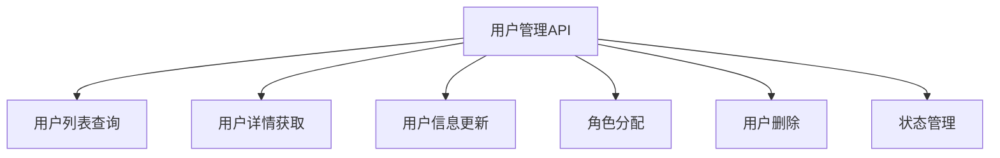
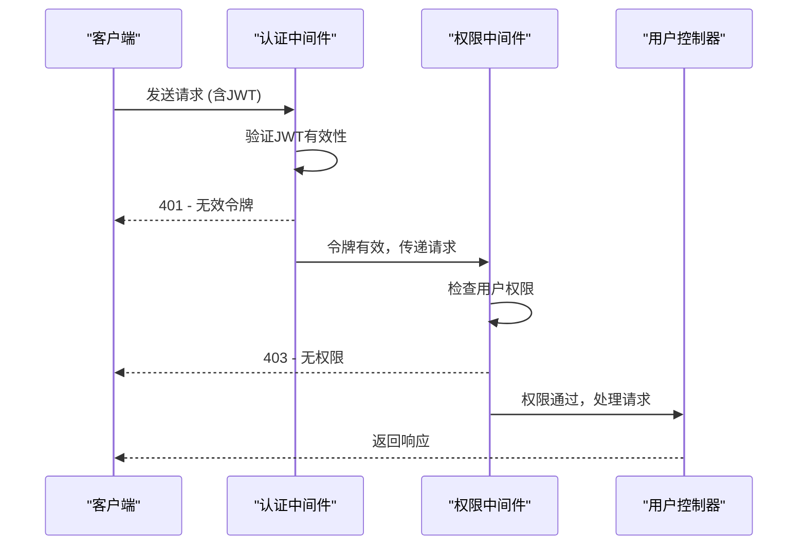
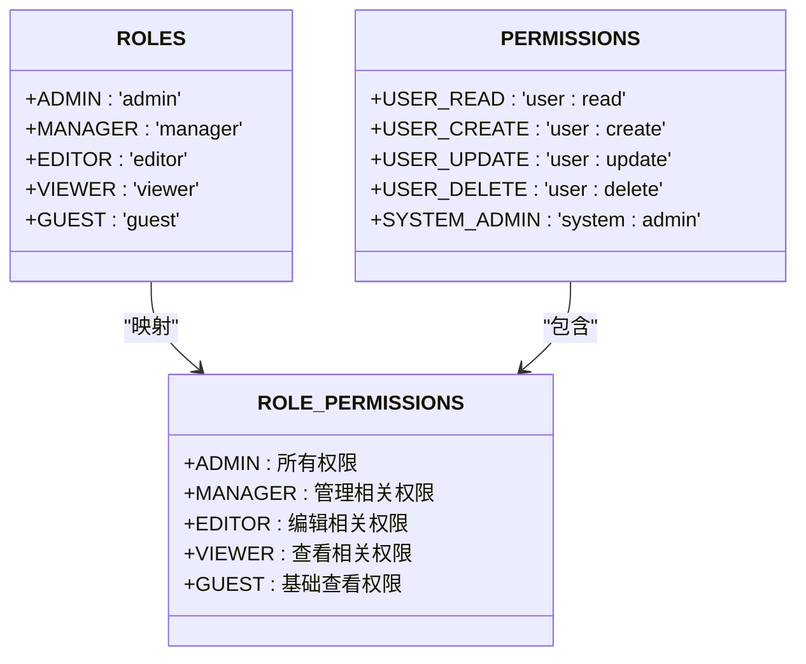
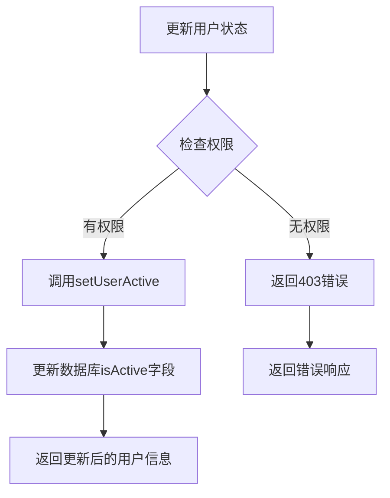
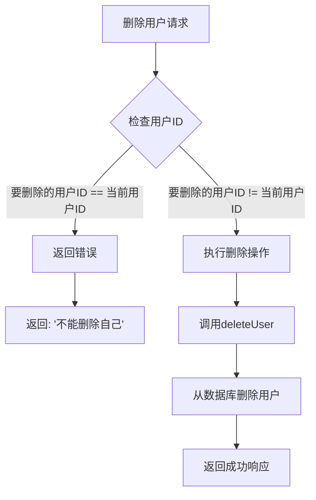

# 用户管理API

<cite>
**本文档引用的文件**   
- [users.js](file://server/routes/v1/users.js)
- [auth.js](file://server/config/auth.js)
- [auth.js](file://server/middleware/auth.js)
- [user.js](file://server/models/user.js)
- [auth-service.js](file://server/services/auth-service.js)
- [index.js](file://server/config/index.js)
- [create-auth-tables.sql](file://server/db/migrations/create-auth-tables.sql)
</cite>

## 目录
1. [简介](#简介)
2. [核心功能](#核心功能)
3. [认证与权限控制](#认证与权限控制)
4. [用户角色与权限](#用户角色与权限)
5. [用户状态管理](#用户状态管理)
6. [安全限制](#安全限制)
7. [API端点详情](#api端点详情)
8. [代码示例](#代码示例)

## 简介
本API提供全面的用户管理功能，包括用户列表查询、用户详情获取、用户信息更新、角色分配和用户删除等操作。系统采用基于JWT的认证机制和RBAC（基于角色的访问控制）权限模型，确保系统的安全性和灵活性。

**Section sources**
- [users.js](file://server/routes/v1/users.js#L1-L178)

## 核心功能
用户管理API提供以下核心功能：
- 用户列表查询（分页支持）
- 用户详情获取
- 用户基本信息更新
- 用户角色设置
- 用户删除操作
- 用户状态管理



**Diagram sources**
- [users.js](file://server/routes/v1/users.js#L1-L178)

**Section sources**
- [users.js](file://server/routes/v1/users.js#L1-L178)

## 认证与权限控制
系统采用JWT（JSON Web Token）进行认证，所有用户管理API端点都需要有效的JWT令牌才能访问。权限控制基于RBAC模型，通过中间件实现细粒度的权限检查。



**Diagram sources**
- [auth.js](file://server/middleware/auth.js#L1-L120)
- [users.js](file://server/routes/v1/users.js#L1-L178)

**Section sources**
- [auth.js](file://server/middleware/auth.js#L1-L120)

## 用户角色与权限
系统定义了多种用户角色和权限，通过角色-权限映射实现灵活的权限管理。

### 角色定义
系统支持以下用户角色：

| 角色 | 描述 |
|------|------|
| admin | 管理员，拥有系统所有权限 |
| manager | 管理员，拥有资产、空间、模型等管理权限 |
| editor | 编辑者，拥有读取和更新权限 |
| viewer | 查看者，仅拥有读取权限 |
| guest | 访客，有限的读取权限 |

### 权限定义
系统定义了细粒度的权限控制：



**Diagram sources**
- [auth.js](file://server/config/auth.js#L8-L142)

**Section sources**
- [auth.js](file://server/config/auth.js#L8-L142)

## 用户状态管理
用户状态通过`isActive`字段管理，支持启用和禁用用户账户。

### 状态管理实现


**Diagram sources**
- [user.js](file://server/models/user.js#L142-L146)
- [users.js](file://server/routes/v1/users.js#L83-L85)

**Section sources**
- [user.js](file://server/models/user.js#L142-L146)

## 安全限制
系统实施了重要的安全限制，防止关键操作导致系统不可用。

### 管理员自我删除保护


**Diagram sources**
- [users.js](file://server/routes/v1/users.js#L154-L160)

**Section sources**
- [users.js](file://server/routes/v1/users.js#L154-L160)

## API端点详情
### 获取用户列表
- **端点**: `GET /api/v1/users`
- **权限**: `USER_READ`
- **参数**: 
  - `page`: 页码（默认1）
  - `limit`: 每页数量（默认20）
- **响应**: 分页的用户列表

### 获取用户详情
- **端点**: `GET /api/v1/users/:id`
- **权限**: `USER_READ`
- **响应**: 用户详细信息及角色

### 更新用户
- **端点**: `PUT /api/v1/users/:id`
- **权限**: `USER_UPDATE`
- **请求体**: 
  - `name`: 用户名
  - `avatarUrl`: 头像URL
  - `isActive`: 用户状态

### 设置用户角色
- **端点**: `PUT /api/v1/users/:id/roles`
- **权限**: `SYSTEM_ADMIN`
- **请求体**: 
  - `roles`: 角色数组

### 删除用户
- **端点**: `DELETE /api/v1/users/:id`
- **权限**: `USER_DELETE`
- **限制**: 不能删除自己

**Section sources**
- [users.js](file://server/routes/v1/users.js#L1-L178)

## 代码示例
### 设置用户角色
```javascript
// 示例：为用户设置角色
// 此操作需要SYSTEM_ADMIN权限
PUT /api/v1/users/123/roles
{
  "roles": ["admin", "manager"]
}
```

### 更新用户状态
```javascript
// 示例：更新用户状态
// 此操作需要USER_UPDATE权限
PUT /api/v1/users/123
{
  "isActive": false
}
```

**Section sources**
- [users.js](file://server/routes/v1/users.js#L108-L137)
- [users.js](file://server/routes/v1/users.js#L72-L95)