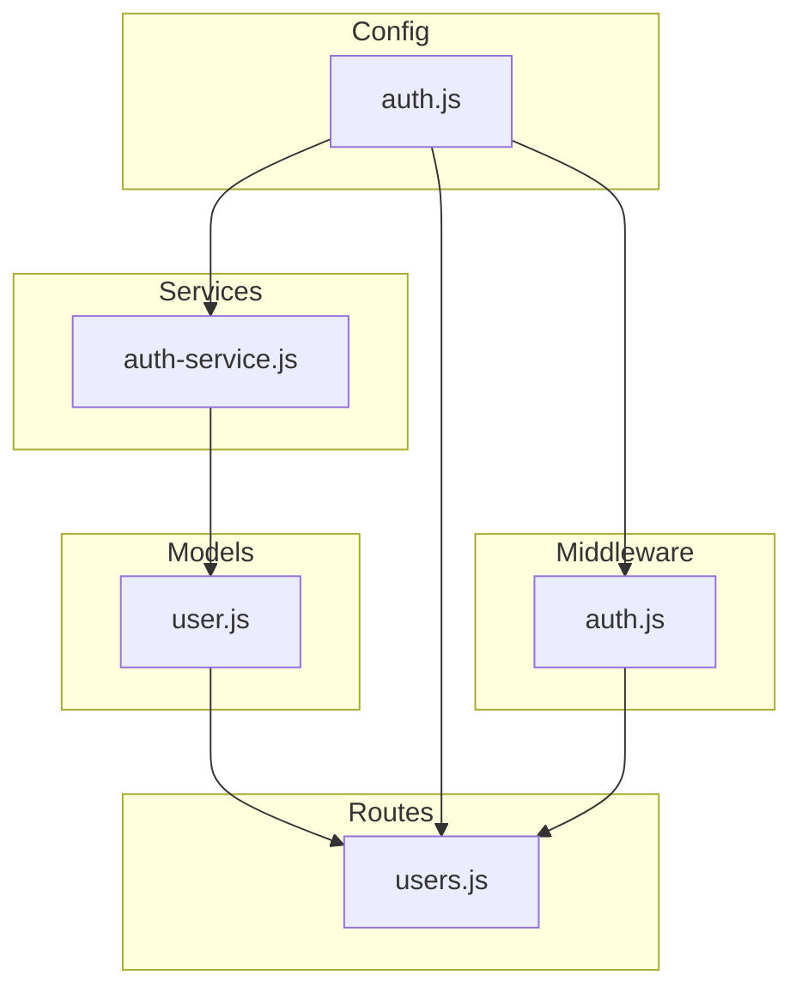
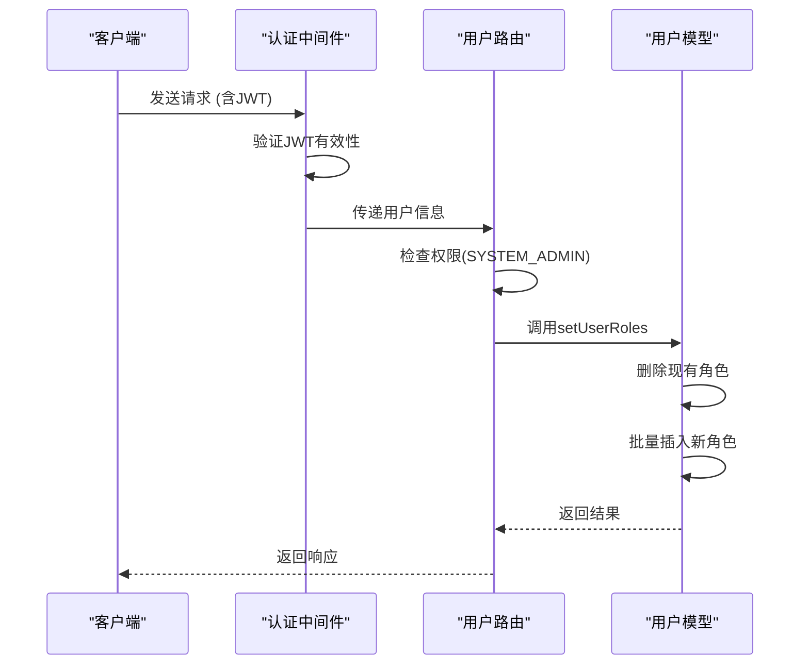
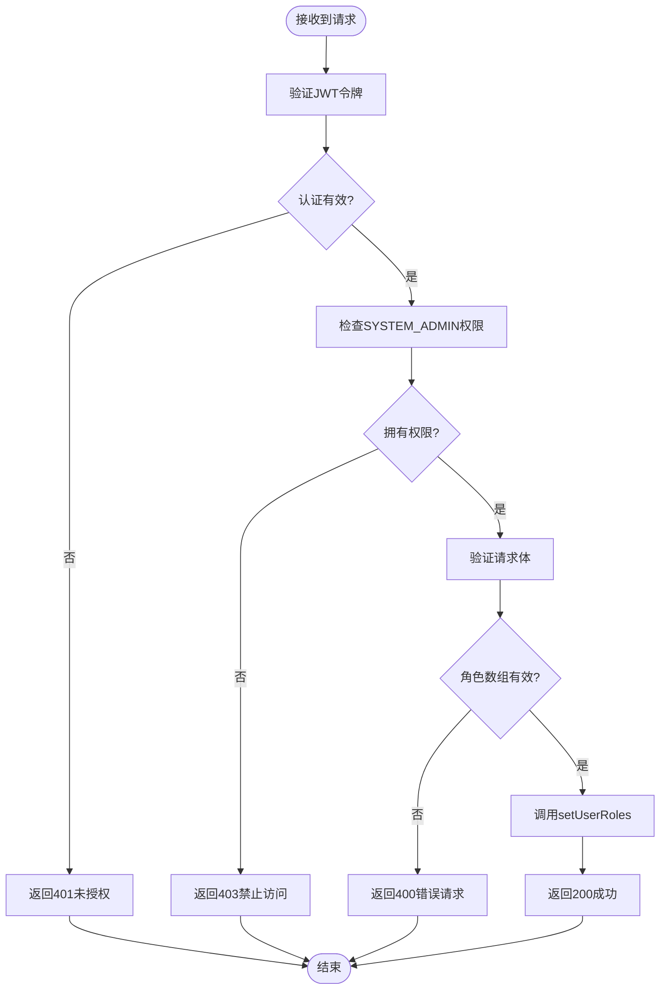
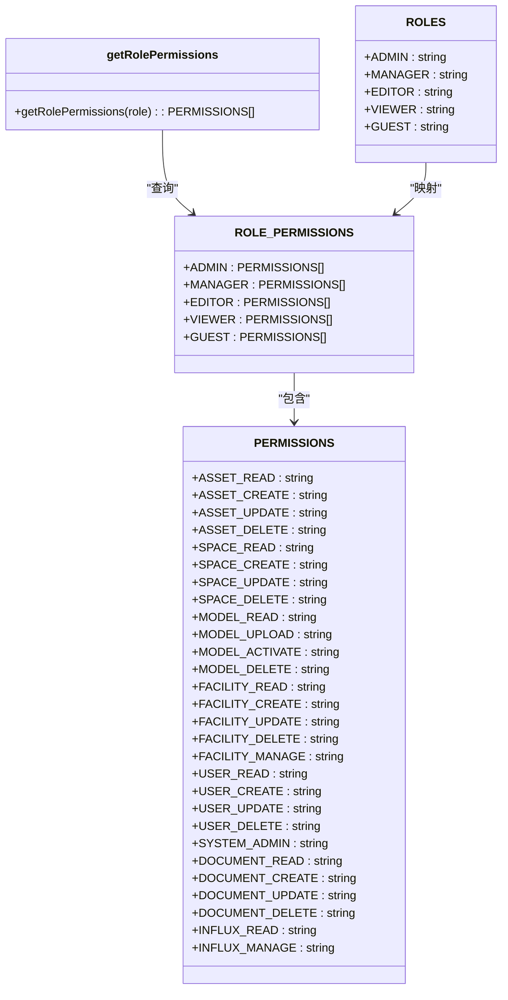
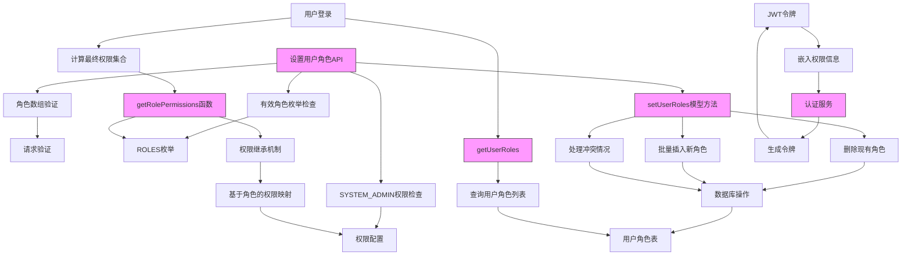

# 角色与权限管理

<cite>
**本文档引用的文件**   
- [user.js](file://server/models/user.js)
- [users.js](file://server/routes/v1/users.js)
- [auth.js](file://server/config/auth.js)
- [auth.js](file://server/middleware/auth.js)
- [auth-service.js](file://server/services/auth-service.js)
- [create-auth-tables.sql](file://server/db/migrations/create-auth-tables.sql)
</cite>

## 目录
1. [简介](#简介)
2. [项目结构](#项目结构)
3. [核心组件](#核心组件)
4. [架构概述](#架构概述)
5. [详细组件分析](#详细组件分析)
6. [依赖分析](#依赖分析)
7. [性能考虑](#性能考虑)
8. [故障排除指南](#故障排除指南)
9. [结论](#结论)

## 简介
本文档详细说明了系统中角色与权限管理功能的实现机制。重点阐述了设置用户角色API（PUT /api/v1/users/:id/roles）的安全控制措施、setUserRoles模型方法的实现逻辑、权限系统的设计原理以及在用户登录时如何获取角色和权限。

## 项目结构
角色与权限管理功能主要分布在服务器端的多个目录中，包括模型、路由、配置、中间件和服务。核心文件位于`server/models`、`server/routes/v1`、`server/config`、`server/middleware`和`server/services`目录下。



**Diagram sources**
- [user.js](file://server/models/user.js)
- [users.js](file://server/routes/v1/users.js)
- [auth.js](file://server/config/auth.js)
- [auth.js](file://server/middleware/auth.js)
- [auth-service.js](file://server/services/auth-service.js)

**Section sources**
- [user.js](file://server/models/user.js)
- [users.js](file://server/routes/v1/users.js)
- [auth.js](file://server/config/auth.js)
- [auth.js](file://server/middleware/auth.js)
- [auth-service.js](file://server/services/auth-service.js)

## 核心组件
角色与权限管理系统由多个核心组件构成，包括用户模型、路由处理、权限配置、认证中间件和认证服务。这些组件协同工作，实现了完整的角色权限管理功能。

**Section sources**
- [user.js](file://server/models/user.js)
- [users.js](file://server/routes/v1/users.js)
- [auth.js](file://server/config/auth.js)
- [auth.js](file://server/middleware/auth.js)
- [auth-service.js](file://server/services/auth-service.js)

## 架构概述
系统采用基于角色的访问控制（RBAC）模型，通过JWT令牌传递用户角色和权限信息。权限检查在中间件层完成，确保了API端点的安全性。



**Diagram sources**
- [user.js](file://server/models/user.js)
- [users.js](file://server/routes/v1/users.js)
- [auth.js](file://server/middleware/auth.js)

## 详细组件分析

### 设置用户角色API分析
设置用户角色API（PUT /api/v1/users/:id/roles）实现了严格的安全控制措施，确保只有系统管理员才能修改用户角色。

#### API安全控制机制


**Diagram sources**
- [users.js](file://server/routes/v1/users.js)
- [auth.js](file://server/middleware/auth.js)

**Section sources**
- [users.js](file://server/routes/v1/users.js#L108-L137)

### setUserRoles模型方法分析
setUserRoles模型方法负责持久化用户角色信息，采用先删除后插入的策略确保角色数据的一致性。

#### 模型方法实现逻辑
```mermaid
flowchart TD
Start([setUserRoles(userId, roles)]) --> DeleteRoles["删除用户所有现有角色"]
DeleteRoles --> LoopStart["遍历角色数组"]
LoopStart --> InsertRole["插入单个角色"]
InsertRole --> ConflictCheck{"角色已存在?"}
ConflictCheck --> |是| Skip["跳过插入"]
ConflictCheck --> |否| ExecuteInsert["执行插入操作"]
ExecuteInsert --> NextRole["处理下一个角色"]
NextRole --> LoopEnd{"所有角色处理完毕?"}
LoopEnd --> |否| LoopStart
LoopEnd --> |是| ReturnRoles["返回角色数组"]
ReturnRoles --> End([方法结束])
```

**Diagram sources**
- [user.js](file://server/models/user.js#L67-L79)

**Section sources**
- [user.js](file://server/models/user.js#L67-L79)

### 权限系统设计原理分析
权限系统采用基于角色的权限继承机制，通过预定义的权限映射表实现权限的快速查找和验证。

#### 权限继承机制


**Diagram sources**
- [auth.js](file://server/config/auth.js#L8-L117)

**Section sources**
- [auth.js](file://server/config/auth.js#L8-L117)

## 依赖分析
角色与权限管理功能依赖于多个系统组件，包括数据库模型、认证配置、中间件和业务服务。



**Diagram sources**
- [users.js](file://server/routes/v1/users.js)
- [user.js](file://server/models/user.js)
- [auth.js](file://server/config/auth.js)
- [auth-service.js](file://server/services/auth-service.js)
- [create-auth-tables.sql](file://server/db/migrations/create-auth-tables.sql)

**Section sources**
- [users.js](file://server/routes/v1/users.js)
- [user.js](file://server/models/user.js)
- [auth.js](file://server/config/auth.js)
- [auth-service.js](file://server/services/auth-service.js)

## 性能考虑
角色与权限管理系统在设计时考虑了性能因素，通过合理的数据库索引和缓存机制确保了高效的角色权限查询。

- 用户角色表(user_roles)在user_id字段上建立了索引，加速了按用户查询角色的操作
- 权限映射表(ROLE_PERMISSIONS)采用内存数据结构，避免了频繁的数据库查询
- JWT令牌中直接嵌入了权限信息，减少了每次请求时的权限计算开销

## 故障排除指南
当角色与权限管理功能出现问题时，可以按照以下步骤进行排查：

1. 检查JWT令牌是否有效且包含正确的角色信息
2. 验证用户角色是否正确存储在user_roles表中
3. 确认权限配置文件(auth.js)中的角色权限映射是否正确
4. 检查认证中间件是否正确执行了权限验证
5. 查看相关服务的日志输出，定位具体错误信息

**Section sources**
- [auth.js](file://server/config/auth.js)
- [auth.js](file://server/middleware/auth.js)
- [auth-service.js](file://server/services/auth-service.js)
- [user.js](file://server/models/user.js)

## 结论
本系统实现了完整的角色与权限管理功能，通过严格的权限控制、清晰的架构设计和高效的实现机制，确保了系统的安全性和可维护性。管理员可以灵活地分配VIEWER、EDITOR、ADMIN等不同角色，系统能够正确计算和验证用户的最终权限集合。