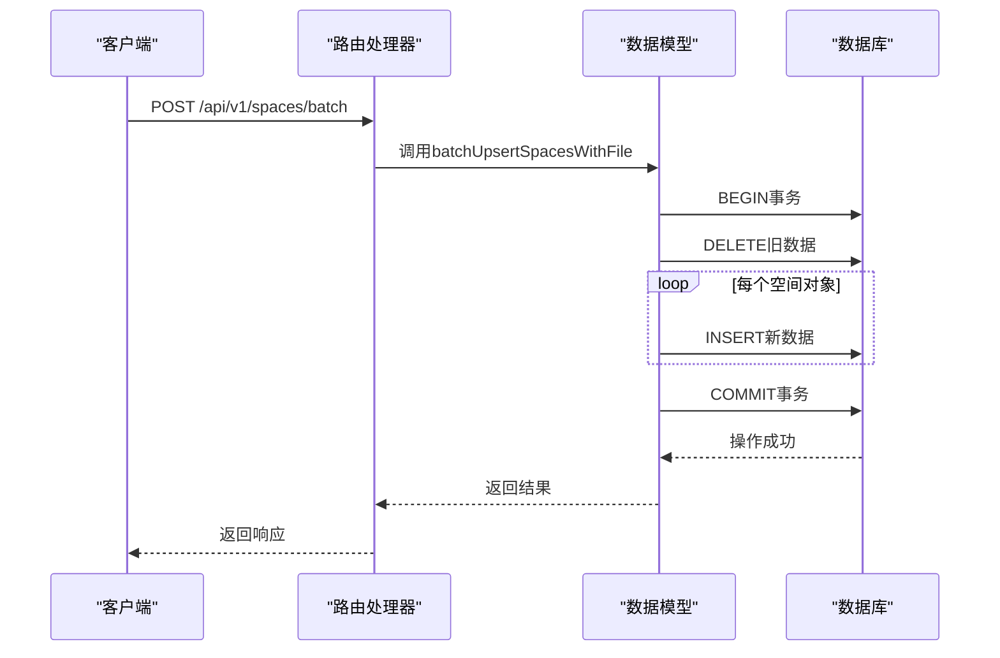
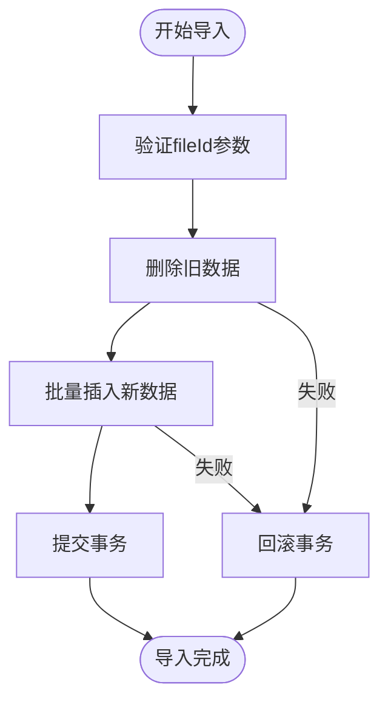
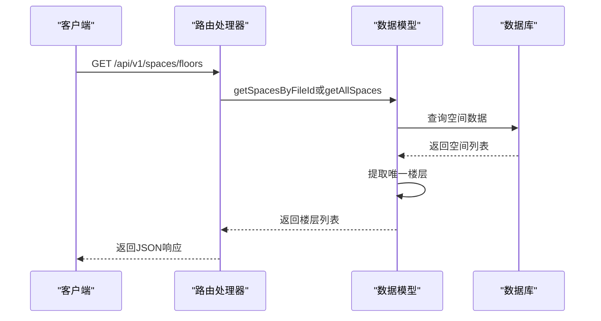
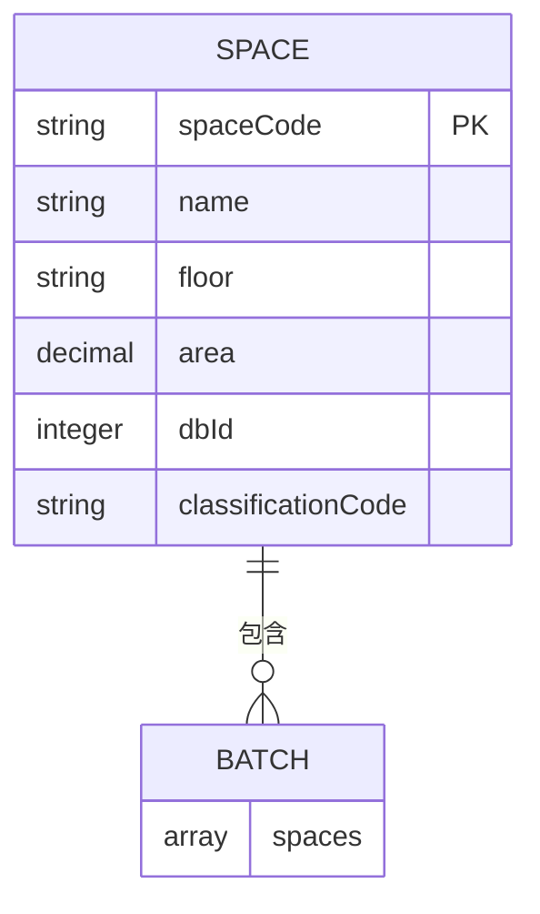
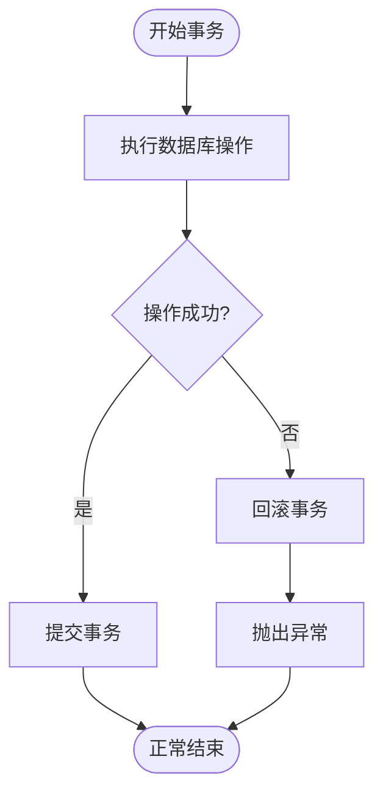
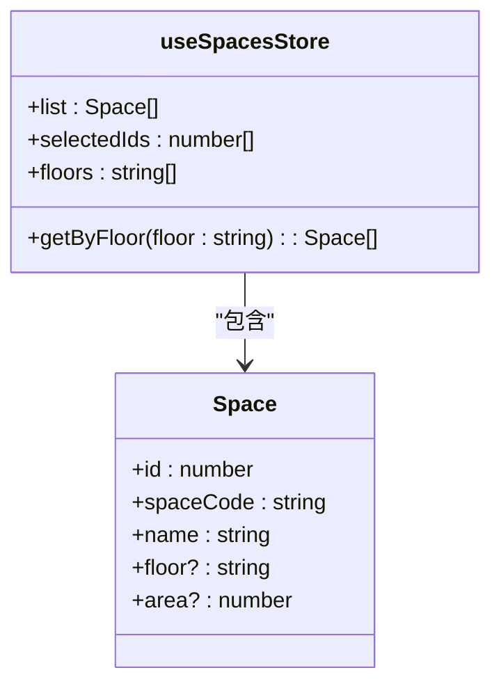

# 批量导入与楼层查询

<cite>
**本文档引用文件**  
- [spaces.js](file://server/routes/v1/spaces.js)
- [space.js](file://server/models/space.js)
- [space-service.js](file://server/services/space-service.js)
- [schema.sql](file://server/db/schema.sql)
- [spaces.ts](file://src/services/api/spaces.ts)
- [spaces.ts](file://src/stores/spaces.ts)
- [space.ts](file://src/types/space.ts)
</cite>

## 目录
1. [简介](#简介)
2. [批量导入功能实现](#批量导入功能实现)
3. [楼层查询接口](#楼层查询接口)
4. [数据结构与示例](#数据结构与示例)
5. [错误处理与事务回滚](#错误处理与事务回滚)
6. [前端应用与筛选](#前端应用与筛选)

## 简介
本文档详细说明空间管理API中批量导入和楼层查询功能的技术实现。重点介绍POST /api/v1/spaces/batch批量导入的实现机制，包括事务控制、基于fileId的旧数据清理、UUID生成策略以及批量插入的性能优化。同时描述GET /api/v1/spaces/floors接口如何从spaces表提取唯一楼层列表，并支持通过fileId参数进行上下文过滤。

**Section sources**
- [spaces.js](file://server/routes/v1/spaces.js#L1-L221)

## 批量导入功能实现

### 事务控制机制
批量导入功能通过数据库事务确保数据一致性。在`batchUpsertSpacesWithFile`模型方法中，使用BEGIN和COMMIT语句包裹整个操作流程，确保所有插入操作要么全部成功，要么全部回滚。



**Diagram sources**
- [space.js](file://server/models/space.js#L130-L171)
- [spaces.js](file://server/routes/v1/spaces.js#L171-L180)

### 旧数据清理策略
在执行批量导入前，系统会先删除与当前fileId关联的所有旧空间数据。这一清理操作通过DELETE FROM spaces WHERE file_id = $1语句实现，确保每次导入都是基于干净的数据状态。



**Diagram sources**
- [space.js](file://server/models/space.js#L135-L136)

### UUID生成策略
为确保每条空间记录的唯一性，系统在插入新记录时生成UUID。使用uuidv4()库函数生成标准的版本4 UUID，并将其存储在spaces表的uuid字段中，作为全局唯一标识符。

**Section sources**
- [space.js](file://server/models/space.js#L142-L143)

### 批量插入性能优化
批量插入采用循环方式逐条插入数据，虽然未使用批量COPY命令，但通过事务包装减少了磁盘I/O开销。每个INSERT语句使用参数化查询防止SQL注入，同时利用数据库连接池提高执行效率。

**Section sources**
- [space.js](file://server/models/space.js#L139-L162)

## 楼层查询接口

### 接口功能说明
GET /api/v1/spaces/floors接口用于获取系统中所有唯一的楼层列表。该接口支持通过fileId参数进行过滤，返回特定文件关联的空间楼层信息。



**Diagram sources**
- [spaces.js](file://server/routes/v1/spaces.js#L194-L213)
- [space.js](file://server/models/space.js#L121-L124)

### 数据提取逻辑
楼层列表的生成采用JavaScript的Set数据结构去重，通过`[...new Set(spaces.map(s => s.floor).filter(Boolean))].sort()`语句实现。该逻辑首先映射出所有楼层值，过滤空值，然后去重并排序。

**Section sources**
- [spaces.js](file://server/routes/v1/spaces.js#L210-L211)

## 数据结构与示例

### 批量导入数据结构
批量导入接口要求JSON数组格式，每个对象包含空间的基本属性。主要字段包括spaceCode（必填）、name、floor、area、dbId和classificationCode。



**Diagram sources**
- [space.ts](file://src/types/space.ts#L23-L33)
- [spaces.js](file://server/routes/v1/spaces.js#L168-L169)

### JSON示例
```json
{
  "spaces": [
    {
      "spaceCode": "RM-101",
      "name": "会议室101",
      "floor": "1F",
      "area": 50.5,
      "dbId": 1001,
      "classificationCode": "11-11-26"
    },
    {
      "spaceCode": "RM-102",
      "name": "办公室102",
      "floor": "1F",
      "area": 30.2,
      "dbId": 1002,
      "classificationCode": "11-11-26"
    }
  ]
}
```

**Section sources**
- [spaces.ts](file://src/types/space.ts#L23-L33)

## 错误处理与事务回滚

### 错误处理机制
系统采用try-catch结构捕获异常，在发生错误时执行ROLLBACK操作回滚事务。错误信息通过next(error)传递给全局错误处理器，确保客户端能收到适当的错误响应。



**Diagram sources**
- [space.js](file://server/models/space.js#L132-L169)

### 回滚策略
当任何插入操作失败时，系统立即执行ROLLBACK命令，撤销所有已执行的更改。这种原子性保证了数据的一致性，避免了部分导入导致的数据污染问题。

**Section sources**
- [space.js](file://server/models/space.js#L166-L168)

## 前端应用与筛选

### 楼层筛选应用
前端通过useSpacesStore状态管理器的floors getter方法获取楼层列表，用于视图筛选。该方法使用Set数据结构去重并排序，与后端逻辑保持一致。



**Diagram sources**
- [spaces.ts](file://src/stores/spaces.ts#L84-L90)
- [space.ts](file://src/types/space.ts#L7-L17)

### 状态管理集成
前端使用Pinia进行状态管理，spaces store负责存储空间数据和选择状态。getByFloor getter方法支持按楼层过滤空间，为前端视图提供灵活的筛选能力。

**Section sources**
- [spaces.ts](file://src/stores/spaces.ts#L69-L72)
- [spaces.ts](file://src/services/api/spaces.ts#L69-L76)