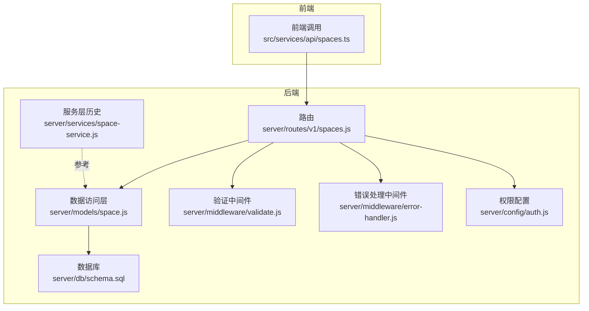
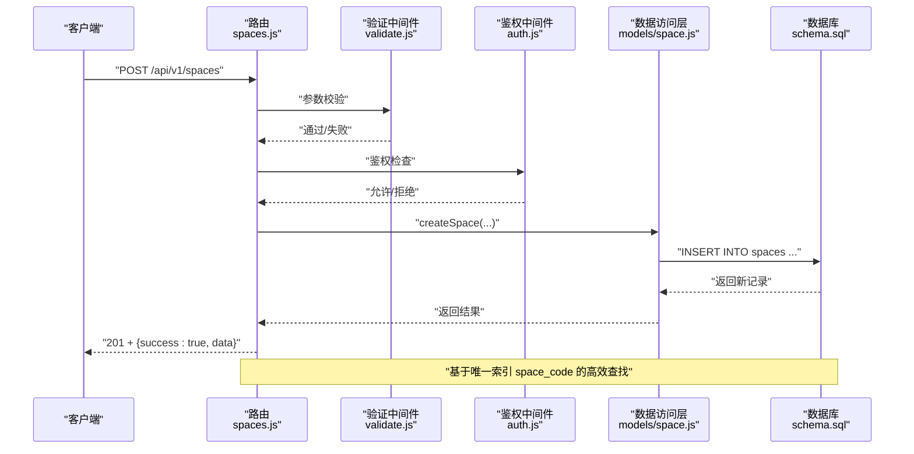
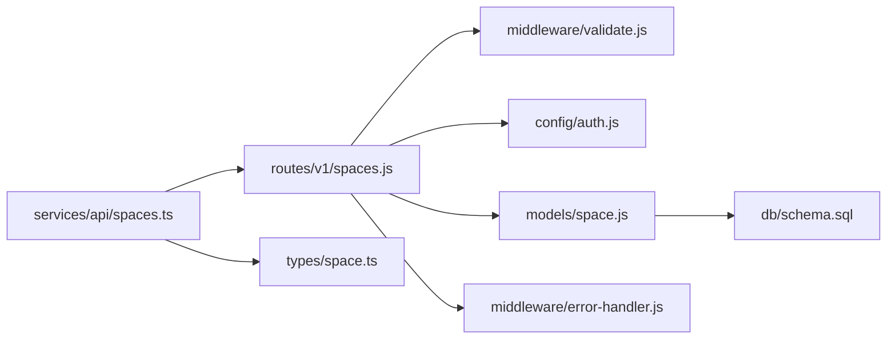
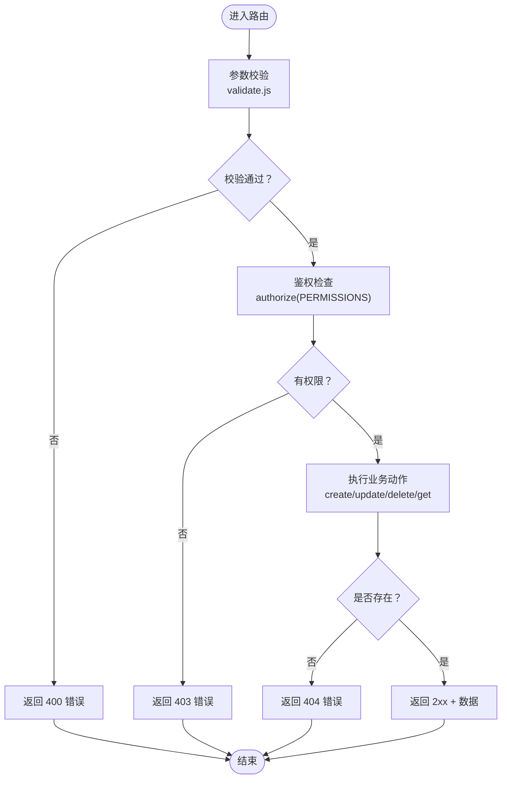

# 空间CRUD操作

<cite>
**本文引用的文件**
- [server/routes/v1/spaces.js](file://server/routes/v1/spaces.js)
- [server/models/space.js](file://server/models/space.js)
- [server/services/space-service.js](file://server/services/space-service.js)
- [src/services/api/spaces.ts](file://src/services/api/spaces.ts)
- [server/db/schema.sql](file://server/db/schema.sql)
- [src/types/space.ts](file://src/types/space.ts)
- [server/middleware/validate.js](file://server/middleware/validate.js)
- [server/middleware/error-handler.js](file://server/middleware/error-handler.js)
- [server/config/auth.js](file://server/config/auth.js)
</cite>

## 目录
1. [简介](#简介)
2. [项目结构](#项目结构)
3. [核心组件](#核心组件)
4. [架构总览](#架构总览)
5. [详细组件分析](#详细组件分析)
6. [依赖分析](#依赖分析)
7. [性能考虑](#性能考虑)
8. [故障排查指南](#故障排查指南)
9. [结论](#结论)
10. [附录](#附录)

## 简介
本技术文档聚焦于空间管理API的CRUD操作，覆盖以下要点：
- POST /api/v1/spaces 创建空间时的字段验证规则（如spaceCode必填、area为浮点数）
- PUT /api/v1/spaces/{code} 更新空间时的可更新字段限制（name、floor、area、classificationCode等）
- DELETE /api/v1/spaces/{code} 删除操作的404处理机制
- GET /api/v1/spaces 与 GET /api/v1/spaces/{code} 的查询逻辑，强调基于spaceCode唯一索引的高效查找
- 各操作的请求示例与响应格式
- 结合 server/models/space.js 中的 getSpaceByCode、updateSpace 等方法说明后端数据访问实现
- 空间编码（spaceCode）作为业务主键的设计考量及其在系统集成中的作用

## 项目结构
围绕空间CRUD的核心文件分布如下：
- 路由层：server/routes/v1/spaces.js
- 数据访问层：server/models/space.js
- 服务层（历史实现，仍可参考）：server/services/space-service.js
- 前端API封装：src/services/api/spaces.ts
- 数据库模式：server/db/schema.sql
- 类型定义：src/types/space.ts
- 请求验证中间件：server/middleware/validate.js
- 错误处理中间件：server/middleware/error-handler.js
- 权限配置：server/config/auth.js

图表来源
- [server/routes/v1/spaces.js](file://server/routes/v1/spaces.js#L1-L221)
- [server/models/space.js](file://server/models/space.js#L1-L224)
- [server/services/space-service.js](file://server/services/space-service.js#L1-L244)
- [server/db/schema.sql](file://server/db/schema.sql#L56-L102)
- [src/services/api/spaces.ts](file://src/services/api/spaces.ts#L1-L88)
- [server/middleware/validate.js](file://server/middleware/validate.js#L1-L72)
- [server/middleware/error-handler.js](file://server/middleware/error-handler.js#L1-L115)
- [server/config/auth.js](file://server/config/auth.js#L1-L52)

章节来源
- [server/routes/v1/spaces.js](file://server/routes/v1/spaces.js#L1-L221)
- [server/models/space.js](file://server/models/space.js#L1-L224)
- [server/db/schema.sql](file://server/db/schema.sql#L56-L102)
- [src/services/api/spaces.ts](file://src/services/api/spaces.ts#L1-L88)

## 核心组件
- 路由层（spaces.js）：定义CRUD接口、参数校验、鉴权与错误处理流程
- 数据访问层（space.js）：封装数据库查询与更新，包含基于spaceCode的唯一索引查询
- 服务层（space-service.js）：历史实现，展示COALESCE更新策略与批量导入逻辑
- 前端API封装（spaces.ts）：统一的HTTP调用封装，便于前端消费
- 验证与错误处理：validate.js与error-handler.js提供统一的参数校验与错误响应
- 权限配置：auth.js定义SPACE_READ/CREATE/UPDATE/DELETE权限

章节来源
- [server/routes/v1/spaces.js](file://server/routes/v1/spaces.js#L1-L221)
- [server/models/space.js](file://server/models/space.js#L1-L224)
- [server/services/space-service.js](file://server/services/space-service.js#L1-L244)
- [src/services/api/spaces.ts](file://src/services/api/spaces.ts#L1-L88)
- [server/middleware/validate.js](file://server/middleware/validate.js#L1-L72)
- [server/middleware/error-handler.js](file://server/middleware/error-handler.js#L1-L115)
- [server/config/auth.js](file://server/config/auth.js#L1-L52)

## 架构总览
从请求到数据库的典型调用链如下：

图表来源
- [server/routes/v1/spaces.js](file://server/routes/v1/spaces.js#L75-L101)
- [server/models/space.js](file://server/models/space.js#L11-L31)
- [server/db/schema.sql](file://server/db/schema.sql#L56-L73)
- [server/middleware/validate.js](file://server/middleware/validate.js#L1-L27)
- [server/config/auth.js](file://server/config/auth.js#L1-L52)

## 详细组件分析

### POST /api/v1/spaces 创建空间
- 字段验证规则
  - spaceCode：必填、字符串、去除空白
  - name：可选、字符串、去除空白
  - floor：可选、字符串、去除空白
  - area：可选、浮点数、转换为数值
  - dbId：可选、整数、转换为整型
  - fileId：可选、整数、转换为整型
  - classificationCode：可选、字符串、去除空白
- 业务行为
  - 通过数据访问层创建空间并返回完整记录
  - 返回状态码：201 Created
- 数据库层面
  - 表结构与唯一索引见 schema.sql；space_code 与 file_id 组合唯一
- 前端调用
  - 通过 src/services/api/spaces.ts 的 createSpace 方法发起请求

请求示例（字段说明）
- 请求体字段
  - spaceCode：必填
  - name：可选
  - floor：可选
  - area：可选（浮点数）
  - dbId：可选（整数）
  - fileId：可选（整数）
  - classificationCode：可选

响应格式
- 成功：201，返回 { success: true, data: 空间对象 }
- 失败：400/401/403/409/500，返回 { success: false, error, details? }

章节来源
- [server/routes/v1/spaces.js](file://server/routes/v1/spaces.js#L75-L101)
- [server/middleware/validate.js](file://server/middleware/validate.js#L1-L27)
- [server/db/schema.sql](file://server/db/schema.sql#L56-L73)
- [src/services/api/spaces.ts](file://src/services/api/spaces.ts#L34-L43)

### GET /api/v1/spaces 查询空间列表
- 查询条件
  - fileId：可选，整数过滤
  - floor：可选，字符串过滤（后端内存过滤）
- 返回
  - 成功：200，返回 { success: true, data: 空间数组 }
- 性能
  - 当提供 fileId 时，优先走数据访问层按 file_id 查询；否则全表扫描
  - floor 参数为内存过滤，不走数据库索引

请求示例
- GET /api/v1/spaces?fileId=123&floor=1F

响应格式
- 成功：200，返回 { success: true, data: 空间数组 }

章节来源
- [server/routes/v1/spaces.js](file://server/routes/v1/spaces.js#L21-L47)
- [server/models/space.js](file://server/models/space.js#L118-L125)

### GET /api/v1/spaces/{code} 根据编码获取空间
- 路径参数
  - code：必填、字符串、去除空白
- 查询逻辑
  - 通过 getSpaceByCode(code) 基于唯一索引精确匹配
  - 若不存在，抛出 404 错误
- 性能
  - 基于唯一索引 space_code 的高效查找

请求示例
- GET /api/v1/spaces/ROOM_001

响应格式
- 成功：200，返回 { success: true, data: 空间对象 }
- 不存在：404，返回 { success: false, error: "空间不存在" }

章节来源
- [server/routes/v1/spaces.js](file://server/routes/v1/spaces.js#L57-L73)
- [server/models/space.js](file://server/models/space.js#L82-L90)
- [server/middleware/error-handler.js](file://server/middleware/error-handler.js#L29-L31)

### PUT /api/v1/spaces/{code} 更新空间
- 路径参数
  - code：必填、字符串、去除空白
- 可更新字段
  - name、floor、area、classificationCode、classificationDesc、category、perimeter
  - 数据访问层通过白名单限定允许更新的字段
- 业务行为
  - 若无有效字段更新，抛出错误
  - 更新成功返回最新记录；若不存在返回 404
- 数据库层面
  - 使用 RETURNING * 返回更新后的记录
  - 更新时自动设置 updated_at

请求示例
- PUT /api/v1/spaces/ROOM_001
- 请求体字段（可选）
  - name、floor、area、classificationCode、classificationDesc、category、perimeter

响应格式
- 成功：200，返回 { success: true, data: 空间对象 }
- 不存在：404，返回 { success: false, error: "空间不存在" }

章节来源
- [server/routes/v1/spaces.js](file://server/routes/v1/spaces.js#L110-L130)
- [server/models/space.js](file://server/models/space.js#L174-L210)

### DELETE /api/v1/spaces/{code} 删除空间
- 路径参数
  - code：必填、字符串、去除空白
- 删除逻辑
  - 通过数据访问层按 space_code 删除
  - 若未影响任何行，抛出 404 错误
- 响应
  - 成功：200，返回 { success: true, message: "删除成功" }
  - 不存在：404，返回 { success: false, error: "空间不存在" }

请求示例
- DELETE /api/v1/spaces/ROOM_001

响应格式
- 成功：200，返回 { success: true, message }
- 不存在：404，返回 { success: false, error }

章节来源
- [server/routes/v1/spaces.js](file://server/routes/v1/spaces.js#L139-L155)
- [server/models/space.js](file://server/models/space.js#L109-L116)
- [server/middleware/error-handler.js](file://server/middleware/error-handler.js#L29-L31)

### 查询逻辑与索引利用
- 唯一索引
  - schema.sql 中定义了基于 space_code 的唯一索引，确保按编码查询的高效性
- 查询路径
  - GET /api/v1/spaces/{code} 直接命中唯一索引
  - GET /api/v1/spaces 支持按 file_id 过滤，走索引；floor 内存过滤不走索引
- 性能建议
  - 高频按编码查询请使用 GET /api/v1/spaces/{code}
  - 需要按楼层筛选时，建议先按 file_id 过滤再在应用侧进行 floor 过滤

章节来源
- [server/db/schema.sql](file://server/db/schema.sql#L56-L73)
- [server/routes/v1/spaces.js](file://server/routes/v1/spaces.js#L21-L47)

### 字段验证与错误处理流程
- 参数验证
  - 使用 express-validator 在路由层对请求体与路径参数进行严格校验
  - validate.js 将验证失败转换为 400 响应
- 错误处理
  - ApiError 提供统一的 404/400/409/500 错误类型
  - errorHandler 中对数据库约束冲突（如唯一约束）与JSON解析错误进行特殊处理
- 权限控制
  - auth.js 定义 SPACE_READ/CREATE/UPDATE/DELETE 权限，路由层通过 authorize 进行鉴权

章节来源
- [server/middleware/validate.js](file://server/middleware/validate.js#L1-L27)
- [server/middleware/error-handler.js](file://server/middleware/error-handler.js#L1-L115)
- [server/config/auth.js](file://server/config/auth.js#L1-L52)
- [server/routes/v1/spaces.js](file://server/routes/v1/spaces.js#L1-L221)

### 数据访问实现要点（models/space.js）
- getSpaceByCode：基于唯一索引 space_code 的精确查询
- updateSpace：白名单字段更新，动态构建 SET 子句，支持 RETURNING *
- batchUpsertSpacesWithFile：事务内批量导入，先删后插，保证 file_id 下的唯一性
- 其他查询：getAllSpaces、getSpacesByFileId、getSpacesByFloor、getSpacesByClassification

章节来源
- [server/models/space.js](file://server/models/space.js#L82-L210)

### 前端调用封装（src/services/api/spaces.ts）
- 统一封装 GET/POST/PUT/DELETE 与批量导入
- 对响应 success 字段进行判断，失败时抛出错误
- 提供 getSpaces、getSpaceByCode、getSpacesByFileId、createSpace、updateSpace、deleteSpace、batchImportSpaces

章节来源
- [src/services/api/spaces.ts](file://src/services/api/spaces.ts#L1-L88)

## 依赖分析
- 路由依赖
  - 验证中间件：validate.js
  - 鉴权中间件：auth.js（PERMISSIONS）
  - 数据访问层：models/space.js
  - 错误处理：error-handler.js
- 数据访问层依赖
  - 数据库：schema.sql（表结构与索引）
- 前端依赖
  - 类型定义：src/types/space.ts
  - API封装：src/services/api/spaces.ts

图表来源
- [server/routes/v1/spaces.js](file://server/routes/v1/spaces.js#L1-L221)
- [server/middleware/validate.js](file://server/middleware/validate.js#L1-L72)
- [server/config/auth.js](file://server/config/auth.js#L1-L52)
- [server/models/space.js](file://server/models/space.js#L1-L224)
- [server/db/schema.sql](file://server/db/schema.sql#L56-L102)
- [server/middleware/error-handler.js](file://server/middleware/error-handler.js#L1-L115)
- [src/services/api/spaces.ts](file://src/services/api/spaces.ts#L1-L88)
- [src/types/space.ts](file://src/types/space.ts#L1-L43)

## 性能考虑
- 唯一索引命中
  - GET /api/v1/spaces/{code} 直接命中 space_code 唯一索引，查询复杂度 O(log N)
- 内存过滤
  - GET /api/v1/spaces?floor=... 为内存过滤，不走数据库索引，大数据量时建议先按 file_id 过滤
- 批量导入
  - models/space.js 的批量导入使用事务，减少多次往返开销
- 更新字段白名单
  - updateSpace 动态构建 SET 子句，避免不必要的列更新，减少锁竞争

[本节为通用性能建议，无需特定文件引用]

## 故障排查指南
- 400 参数验证失败
  - 检查请求体字段类型与必填项是否满足路由层校验
  - 参考 validate.js 的错误响应结构
- 404 资源不存在
  - GET/PUT/DELETE 操作针对不存在的 spaceCode 会返回 404
  - 确认 spaceCode 是否正确且存在于当前 file_id 上下文
- 409 数据冲突
  - 数据库唯一约束冲突（如重复 space_code）会被转换为 409
- 500 服务器内部错误
  - 开发环境会返回详细堆栈，生产环境仅返回通用错误信息
- 权限不足
  - 确认用户角色具备 SPACE_READ/CREATE/UPDATE/DELETE 权限

章节来源
- [server/middleware/validate.js](file://server/middleware/validate.js#L1-L27)
- [server/middleware/error-handler.js](file://server/middleware/error-handler.js#L42-L115)
- [server/config/auth.js](file://server/config/auth.js#L1-L52)

## 结论
- 空间CRUD接口通过严格的参数校验、鉴权与错误处理保障了安全性与一致性
- 基于 space_code 唯一索引的查询设计使得按编码检索高效稳定
- 更新采用白名单字段策略，避免误更新无关字段
- 建议在高频场景优先使用按编码查询，并在需要楼层筛选时配合 file_id 过滤

[本节为总结性内容，无需特定文件引用]

## 附录

### API定义与示例（字段说明）
- POST /api/v1/spaces
  - 请求体字段：spaceCode（必填）、name（可选）、floor（可选）、area（可选，浮点）、dbId（可选，整数）、fileId（可选，整数）、classificationCode（可选）
  - 成功响应：201，{ success: true, data }
- GET /api/v1/spaces
  - 查询参数：fileId（可选，整数）、floor（可选，字符串）
  - 成功响应：200，{ success: true, data }
- GET /api/v1/spaces/{code}
  - 路径参数：code（必填）
  - 成功响应：200，{ success: true, data }
  - 不存在：404，{ success: false, error }
- PUT /api/v1/spaces/{code}
  - 路径参数：code（必填）
  - 请求体字段：name、floor、area、classificationCode、classificationDesc、category、perimeter（均可选）
  - 成功响应：200，{ success: true, data }
  - 不存在：404，{ success: false, error }
- DELETE /api/v1/spaces/{code}
  - 路径参数：code（必填）
  - 成功响应：200，{ success: true, message }
  - 不存在：404，{ success: false, error }

章节来源
- [server/routes/v1/spaces.js](file://server/routes/v1/spaces.js#L21-L155)
- [src/types/space.ts](file://src/types/space.ts#L1-L43)

### 数据模型与索引（schema.sql）
- 表：spaces
  - 主键：id
  - 唯一索引：space_code（单列唯一）
  - 文件关联：file_id（外键）
  - 其他常用索引：classification_code、floor、db_id、uuid
- 约束：UNIQUE(file_id, space_code)

章节来源
- [server/db/schema.sql](file://server/db/schema.sql#L56-L102)

### 字段验证流程图（基于路由层）

图表来源
- [server/routes/v1/spaces.js](file://server/routes/v1/spaces.js#L1-L221)
- [server/middleware/validate.js](file://server/middleware/validate.js#L1-L27)
- [server/middleware/error-handler.js](file://server/middleware/error-handler.js#L29-L31)
- [server/config/auth.js](file://server/config/auth.js#L1-L52)