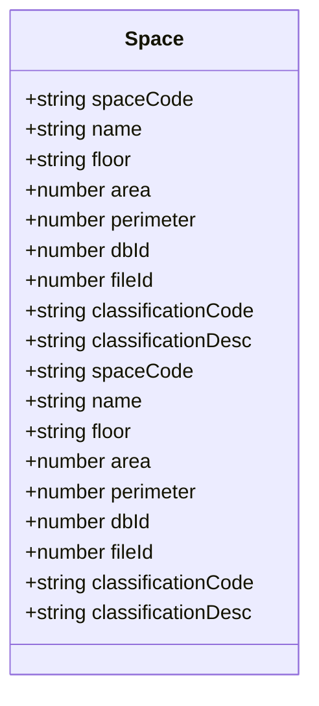
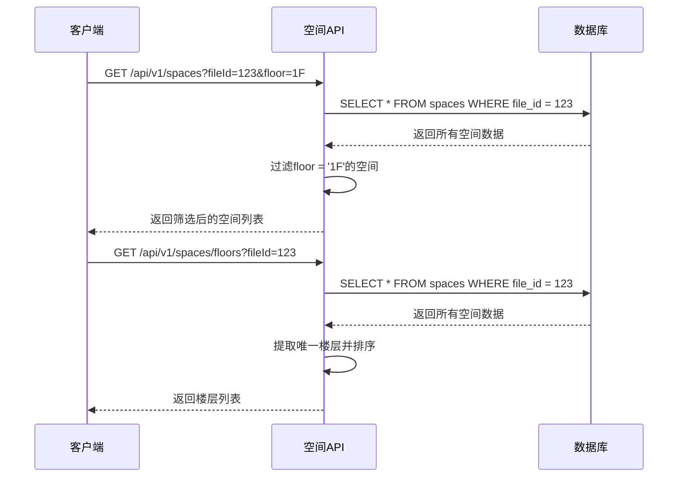
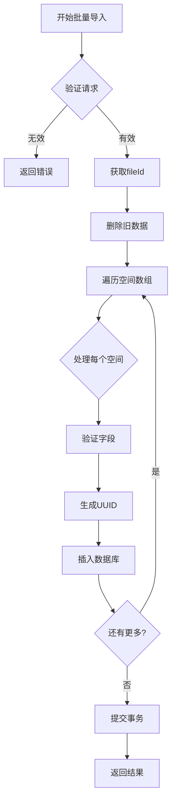
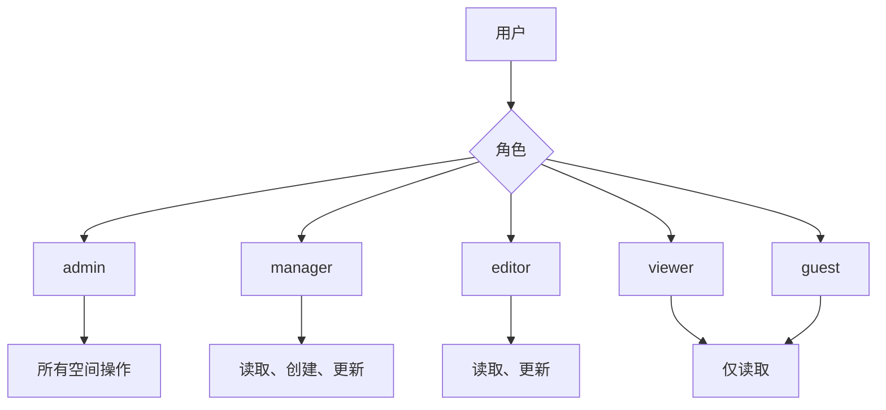

# 空间管理API

<cite>
**本文档引用文件**   
- [spaces.js](file://server/routes/v1/spaces.js)
- [space.js](file://server/models/space.js)
- [space-service.js](file://server/services/space-service.js)
- [spaces.ts](file://src/services/api/spaces.ts)
- [spaces.ts](file://src/stores/spaces.ts)
- [space.ts](file://src/types/space.ts)
- [schema.sql](file://server/db/schema.sql)
- [auth.js](file://server/config/auth.js)
- [add-file-id.sql](file://server/db/migrations/add-file-id.sql)
- [timeseries.js](file://server/routes/timeseries.js)
- [influx.ts](file://src/services/influx.ts)
</cite>

## 目录
1. [简介](#简介)
2. [核心功能](#核心功能)
3. [空间数据结构](#空间数据结构)
4. [API端点](#api端点)
5. [空间编码（spaceCode）](#空间编码spacecode)
6. [BIM模型文件关联](#bim模型文件关联)
7. [楼层筛选功能](#楼层筛选功能)
8. [批量导入功能](#批量导入功能)
9. [时序数据集成](#时序数据集成)
10. [使用示例](#使用示例)
11. [权限控制](#权限控制)
12. [数据验证规则](#数据验证规则)

## 简介
空间管理API提供了对建筑信息模型（BIM）中空间数据的完整管理功能。该API支持空间的增删改查操作，包括批量导入和楼层列表查询等高级功能。系统通过空间编码（spaceCode）作为唯一标识符来管理空间数据，并支持与BIM模型文件的关联。此外，API还集成了时序数据功能，允许将空间数据与实时传感器数据进行关联。

**Section sources**
- [spaces.js](file://server/routes/v1/spaces.js#L1-L221)
- [space.js](file://server/models/space.js#L1-L224)

## 核心功能
空间管理API提供以下核心功能：
- 空间数据的增删改查（CRUD）操作
- 批量导入空间数据
- 按BIM模型文件ID查询空间
- 按楼层筛选空间
- 获取所有楼层列表
- 空间数据与BIM模型文件的关联
- 与时序数据系统的集成

这些功能通过RESTful API提供，支持JSON格式的数据交换，并通过JWT进行身份验证和权限控制。

**Section sources**
- [spaces.js](file://server/routes/v1/spaces.js#L1-L221)
- [space-service.js](file://server/services/space-service.js#L1-L244)

## 空间数据结构
空间数据在数据库中以`spaces`表的形式存储，包含以下字段：

| 字段名 | 类型 | 描述 |
|-------|------|------|
| id | SERIAL | 主键，自增ID |
| uuid | UUID | 唯一标识符 |
| file_id | INTEGER | 关联的模型文件ID |
| space_code | VARCHAR(100) | 空间编码，唯一标识 |
| name | VARCHAR(200) | 空间名称 |
| classification_code | VARCHAR(100) | 分类编码 |
| classification_desc | VARCHAR(500) | 分类描述 |
| floor | VARCHAR(100) | 楼层 |
| area | DECIMAL(15, 4) | 面积 |
| perimeter | DECIMAL(15, 4) | 周长 |
| db_id | INTEGER | Viewer中的dbId，用于关联 |
| created_at | TIMESTAMP | 创建时间 |
| updated_at | TIMESTAMP | 更新时间 |

**Section sources**
- [schema.sql](file://server/db/schema.sql#L56-L73)
- [space.ts](file://src/types/space.ts#L5-L21)

## API端点
空间管理API提供以下RESTful端点：

```mermaid
flowchart TD
A[空间管理API] --> B[GET /api/v1/spaces]
A --> C[GET /api/v1/spaces/{code}]
A --> D[POST /api/v1/spaces]
A --> E[PUT /api/v1/spaces/{code}]
A --> F[DELETE /api/v1/spaces/{code}]
A --> G[POST /api/v1/spaces/batch]
A --> H[GET /api/v1/spaces/floors]
B --> I[获取空间列表]
C --> J[根据编码获取空间]
D --> K[创建空间]
E --> L[更新空间]
F --> M[删除空间]
G --> N[批量导入空间]
H --> O[获取楼层列表]
```

**Diagram sources **
- [spaces.js](file://server/routes/v1/spaces.js#L14-L218)

**Section sources**
- [spaces.js](file://server/routes/v1/spaces.js#L14-L218)

## 空间编码（spaceCode）
空间编码（spaceCode）是空间数据的唯一标识符，在系统中具有以下特性：

- **唯一性**：在同一个BIM模型文件中，每个空间编码必须唯一
- **不可变性**：空间创建后，其编码不能修改
- **业务意义**：通常取自BIM模型中的"编号"属性
- **查询主键**：作为API查询的主要标识符

空间编码在创建时必须提供，且不能为空。系统通过`space_code`字段在数据库中建立唯一约束，确保数据的完整性。



**Diagram sources **
- [space.ts](file://src/types/space.ts#L5-L21)
- [schema.sql](file://server/db/schema.sql#L62-L69)

**Section sources**
- [space.js](file://server/models/space.js#L85-L88)
- [spaces.ts](file://src/services/api/spaces.ts#L21-L24)

## BIM模型文件关联
空间数据与BIM模型文件通过`file_id`字段进行关联，实现多模型数据隔离。这种设计允许系统同时管理多个BIM模型的空间数据。

### 关联机制
- 每个空间记录包含`file_id`外键，指向`model_files`表
- 通过`file_id`可以查询特定BIM模型的所有空间
- 批量导入时，会先删除该文件ID对应的所有旧空间，再插入新数据
- 数据库层面通过外键约束确保引用完整性

### 数据库迁移
系统通过迁移脚本为`spaces`表添加`file_id`字段：

```sql
-- 为spaces表添加file_id
ALTER TABLE spaces ADD COLUMN IF NOT EXISTS file_id INTEGER REFERENCES model_files(id) ON DELETE CASCADE;

-- 修改唯一约束（space_code + file_id 组合唯一）
ALTER TABLE spaces DROP CONSTRAINT IF EXISTS spaces_space_code_key CASCADE;
ALTER TABLE spaces DROP CONSTRAINT IF EXISTS spaces_file_space_unique;
ALTER TABLE spaces ADD CONSTRAINT spaces_file_space_unique UNIQUE (file_id, space_code);
```

**Section sources**
- [add-file-id.sql](file://server/db/migrations/add-file-id.sql#L10-L27)
- [space.js](file://server/models/space.js#L121-L124)
- [schema.sql](file://server/db/schema.sql#L61-L62)

## 楼层筛选功能
系统提供灵活的楼层筛选功能，支持以下查询方式：

### 单一条件查询
- 按文件ID查询：`GET /api/v1/spaces?fileId=123`
- 按楼层查询：`GET /api/v1/spaces?floor=1F`
- 按文件ID和楼层查询：`GET /api/v1/spaces?fileId=123&floor=1F`

### 楼层列表查询
获取所有唯一楼层列表：
- `GET /api/v1/spaces/floors`：获取所有模型的楼层
- `GET /api/v1/spaces/floors?fileId=123`：获取指定模型的楼层



**Diagram sources **
- [spaces.js](file://server/routes/v1/spaces.js#L21-L48)
- [spaces.js](file://server/routes/v1/spaces.js#L194-L217)

**Section sources**
- [spaces.js](file://server/routes/v1/spaces.js#L21-L48)
- [spaces.js](file://server/routes/v1/spaces.js#L194-L217)
- [space-service.js](file://server/services/space-service.js#L38-L54)

## 批量导入功能
批量导入功能允许一次性导入大量空间数据，适用于BIM模型更新后的数据同步场景。

### 批量导入流程
1. 客户端发送包含多个空间对象的数组
2. 服务端验证每个空间对象的必要字段
3. 删除目标文件ID对应的所有旧空间数据
4. 批量插入新的空间数据
5. 返回导入统计结果

### API响应
批量导入成功后，返回包含以下信息的响应：
- `total`：总导入数量
- `inserted`：新增数量
- `updated`：更新数量
- `failed`：失败数量
- `errors`：失败详情列表



**Diagram sources **
- [spaces.js](file://server/routes/v1/spaces.js#L157-L184)
- [space.js](file://server/models/space.js#L130-L171)

**Section sources**
- [spaces.js](file://server/routes/v1/spaces.js#L157-L184)
- [space.js](file://server/models/space.js#L130-L171)
- [space-service.js](file://server/services/space-service.js#L114-L139)

## 时序数据集成
空间管理API与时序数据系统深度集成，支持将空间数据与实时传感器数据关联。

### 集成机制
- 每个空间对应一个时序数据流
- 使用空间编码（spaceCode）作为数据流标识
- 通过API Key进行安全认证
- 支持实时数据写入和历史数据查询

### API端点
```mermaid
flowchart TD
A[时序数据API] --> B[POST /api/v1/timeseries/streams/{spaceCode}]
A --> C[GET /api/v1/timeseries/query/room]
A --> D[POST /api/v1/timeseries/query/latest]
A --> E[GET /api/v1/timeseries/stream-url/{spaceCode}]
B --> F[写入实时数据]
C --> G[查询历史数据]
D --> H[查询最新值]
E --> I[获取Stream URL]
```

**Diagram sources **
- [timeseries.js](file://server/routes/timeseries.js#L267-L562)

**Section sources**
- [timeseries.js](file://server/routes/timeseries.js#L18-L562)
- [influx.ts](file://src/services/influx.ts#L28-L164)

## 使用示例
以下是一些常见的API使用示例：

### 创建空间
```javascript
// 创建单个空间
const newSpace = {
  spaceCode: 'RM-101',
  name: '会议室101',
  floor: '1F',
  area: 50.5,
  fileId: 123,
  classificationCode: '11-11-11'
};

const response = await fetch('/api/v1/spaces', {
  method: 'POST',
  headers: { 'Content-Type': 'application/json' },
  body: JSON.stringify(newSpace)
});
```

### 查询特定楼层空间
```javascript
// 查询1F楼层的所有空间
const response = await fetch('/api/v1/spaces?fileId=123&floor=1F');
const spaces = await response.json();
```

### 批量导入空间
```javascript
// 批量导入多个空间
const spacesData = [
  { spaceCode: 'RM-101', name: '会议室101', floor: '1F', area: 50.5 },
  { spaceCode: 'RM-102', name: '办公室102', floor: '1F', area: 30.2 },
  { spaceCode: 'RM-201', name: '会议室201', floor: '2F', area: 60.0 }
];

const response = await fetch('/api/v1/spaces/batch', {
  method: 'POST',
  headers: { 'Content-Type': 'application/json' },
  body: JSON.stringify({ spaces: spacesData })
});
```

**Section sources**
- [spaces.ts](file://src/services/api/spaces.ts#L37-L76)
- [spaces.js](file://server/routes/v1/spaces.js#L82-L101)
- [spaces.js](file://server/routes/v1/spaces.js#L164-L184)

## 权限控制
系统通过基于角色的访问控制（RBAC）机制管理空间数据的访问权限。

### 权限定义
| 权限 | 描述 |
|------|------|
| space:read | 查看空间数据 |
| space:create | 创建空间 |
| space:update | 更新空间 |
| space:delete | 删除空间 |

### 角色权限映射
| 角色 | 权限 |
|------|------|
| admin | 所有权限 |
| manager | 读取、创建、更新 |
| editor | 读取、更新 |
| viewer | 仅读取 |
| guest | 仅读取 |



**Diagram sources **
- [auth.js](file://server/config/auth.js#L8-L52)

**Section sources**
- [auth.js](file://server/config/auth.js#L8-L52)
- [spaces.js](file://server/routes/v1/spaces.js#L23-L24)

## 数据验证规则
系统对空间数据实施严格的验证规则，确保数据质量和完整性。

### 字段验证
| 字段 | 验证规则 |
|------|---------|
| spaceCode | 必填，非空，字符串 |
| name | 可选，字符串 |
| floor | 可选，字符串 |
| area | 可选，浮点数 |
| dbId | 可选，整数 |
| fileId | 可选，整数 |
| classificationCode | 可选，字符串 |

### 业务规则
- 空间编码在同一个文件中必须唯一
- 创建和更新操作需要相应的权限
- 删除不存在的空间会返回404错误
- 批量导入时，空数组会被拒绝

**Section sources**
- [spaces.js](file://server/routes/v1/spaces.js#L85-L92)
- [spaces.js](file://server/routes/v1/spaces.js#L167-L169)
- [space.js](file://server/models/space.js#L179-L196)