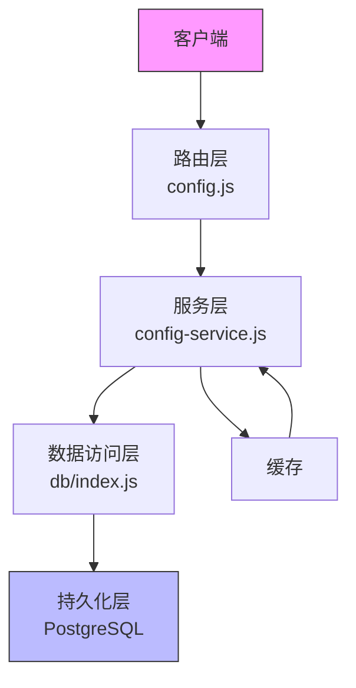
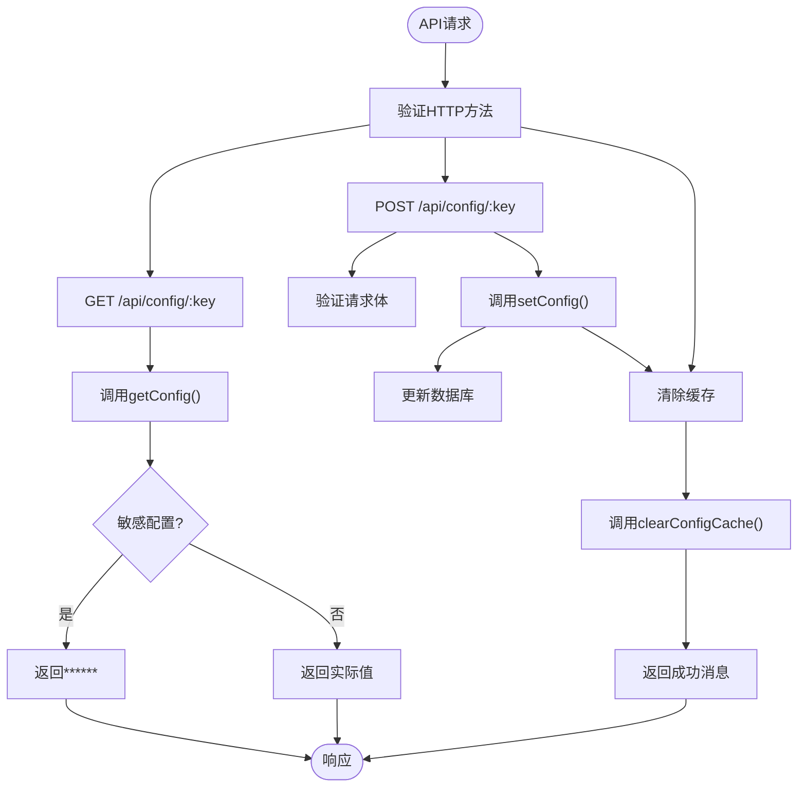
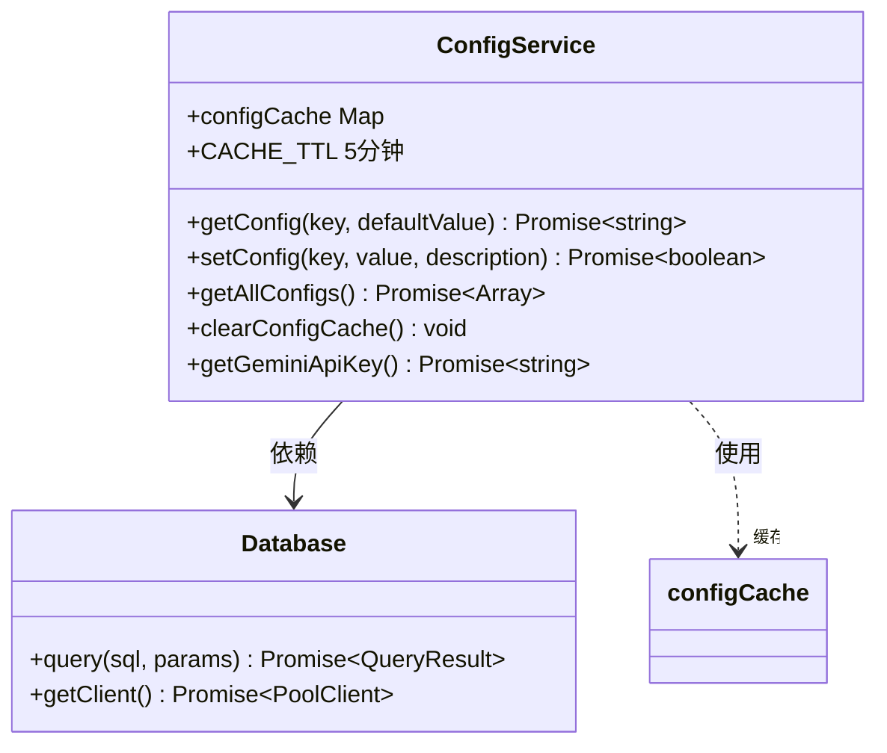
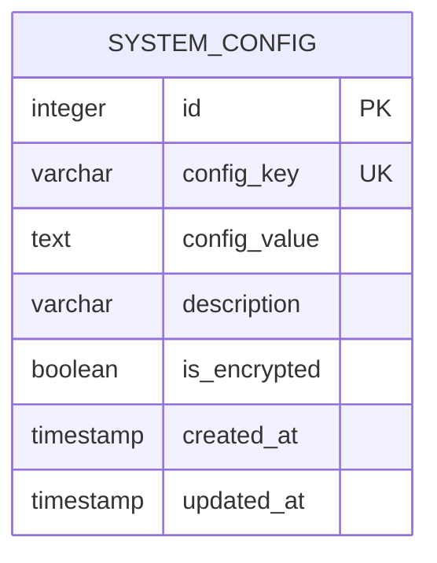
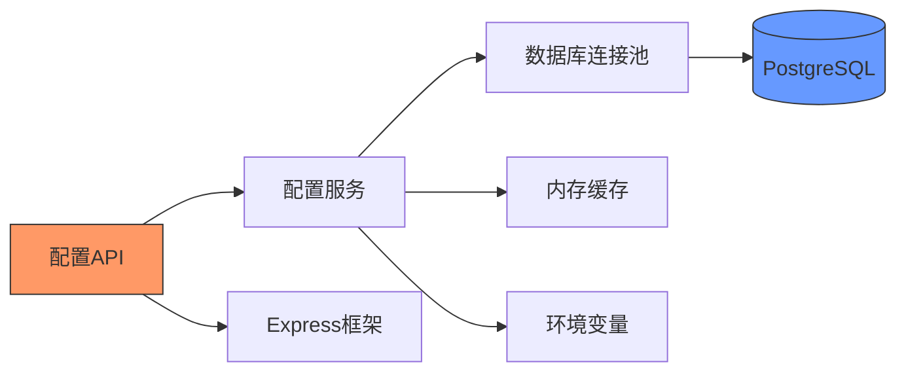

# 系统配置API

<cite>
**本文档中引用的文件**  
- [config.js](file://server/routes/config.js)
- [config-service.js](file://server/services/config-service.js)
- [004_system_config.sql](file://server/migrations/004_system_config.sql)
- [index.js](file://server/db/index.js)
- [index.js](file://server/config/index.js)
</cite>

## 目录
1. [简介](#简介)
2. [项目结构](#项目结构)
3. [核心组件](#核心组件)
4. [架构概述](#架构概述)
5. [详细组件分析](#详细组件分析)
6. [依赖分析](#依赖分析)
7. [性能考虑](#性能考虑)
8. [故障排除指南](#故障排除指南)
9. [结论](#结论)

## 简介
本系统配置API提供了一套完整的配置管理机制，支持配置的获取、设置和缓存清除功能。系统特别关注敏感配置值（如密钥、密码）的安全处理，通过隐藏显示机制保护敏感信息。配置数据存储在PostgreSQL数据库中，并通过内存缓存提高访问性能。API设计遵循RESTful原则，提供清晰的端点用于管理各种系统配置。

## 项目结构
系统配置功能主要分布在服务器端的特定目录中，包括路由、服务、数据库迁移和配置管理模块。

```mermaid
graph TD
subgraph "Server"
Routes[路由<br>server/routes]
Services[服务<br>server/services]
DB[数据库<br>server/db]
Migrations[迁移<br>server/migrations]
Config[配置<br>server/config]
end
Routes --> Services : 调用
Services --> DB : 查询
Migrations --> DB : 初始化
Config --> Services : 提供默认值
```

**Diagram sources**
- [config.js](file://server/routes/config.js#L1-L89)
- [config-service.js](file://server/services/config-service.js#L1-L111)
- [004_system_config.sql](file://server/migrations/004_system_config.sql#L1-L21)

**Section sources**
- [config.js](file://server/routes/config.js#L1-L89)
- [config-service.js](file://server/services/config-service.js#L1-L111)

## 核心组件
系统配置API的核心组件包括配置路由、配置服务、数据库表结构和缓存机制。路由层定义了API端点，服务层实现了业务逻辑，数据库层存储配置数据，缓存层提高性能。这些组件协同工作，提供安全、高效的配置管理功能。

**Section sources**
- [config.js](file://server/routes/config.js#L1-L89)
- [config-service.js](file://server/services/config-service.js#L1-L111)
- [004_system_config.sql](file://server/migrations/004_system_config.sql#L1-L21)

## 架构概述
系统配置API采用分层架构设计，从上到下分为路由层、服务层、数据访问层和持久化层。这种设计实现了关注点分离，提高了代码的可维护性和可测试性。



**Diagram sources**
- [config.js](file://server/routes/config.js#L1-L89)
- [config-service.js](file://server/services/config-service.js#L1-L111)
- [index.js](file://server/db/index.js#L1-L93)

## 详细组件分析
### 配置获取与设置分析
系统配置API提供了全面的配置管理功能，包括获取、设置和缓存清除操作。

#### 配置路由实现


**Diagram sources**
- [config.js](file://server/routes/config.js#L1-L89)

**Section sources**
- [config.js](file://server/routes/config.js#L1-L89)

#### 配置服务逻辑


**Diagram sources**
- [config-service.js](file://server/services/config-service.js#L1-L111)

**Section sources**
- [config-service.js](file://server/services/config-service.js#L1-L111)

#### 配置数据模型


**Diagram sources**
- [004_system_config.sql](file://server/migrations/004_system_config.sql#L1-L21)

**Section sources**
- [004_system_config.sql](file://server/migrations/004_system_config.sql#L1-L21)

## 依赖分析
系统配置功能依赖于多个核心组件，包括数据库连接、环境配置和API路由系统。



**Diagram sources**
- [config.js](file://server/routes/config.js#L1-L89)
- [config-service.js](file://server/services/config-service.js#L1-L111)
- [index.js](file://server/db/index.js#L1-L93)

**Section sources**
- [config.js](file://server/routes/config.js#L1-L89)
- [config-service.js](file://server/services/config-service.js#L1-L111)
- [index.js](file://server/db/index.js#L1-L93)

## 性能考虑
系统配置API通过缓存机制显著提高了性能。配置值在内存中缓存5分钟，避免了频繁的数据库查询。当配置被更新时，相关缓存会自动清除，确保数据一致性。这种缓存策略在保证数据新鲜度的同时，大幅减少了数据库负载。

**Section sources**
- [config-service.js](file://server/services/config-service.js#L8-L11)
- [config-service.js](file://server/services/config-service.js#L19-L37)

## 故障排除指南
当配置API出现问题时，可以检查以下几个方面：数据库连接状态、环境变量配置、缓存一致性。服务日志记录了关键操作，如配置更新和查询错误，有助于诊断问题。如果遇到缓存相关问题，可以通过调用清除缓存端点来重置状态。

**Section sources**
- [config-service.js](file://server/services/config-service.js#L37-L40)
- [config-service.js](file://server/services/config-service.js#L65-L68)
- [config.js](file://server/routes/config.js#L18-L21)

## 结论
系统配置API提供了一套安全、高效、易用的配置管理解决方案。通过合理的架构设计和安全机制，它能够有效管理系统的各种配置，特别是敏感信息。API的缓存机制提高了性能，而清晰的端点设计使得集成变得简单。这套系统为应用程序的灵活配置和安全运行提供了坚实的基础。