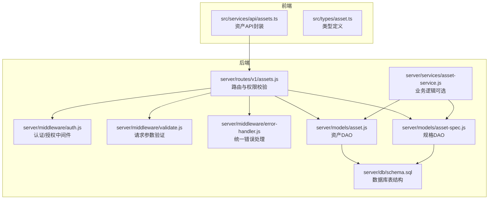
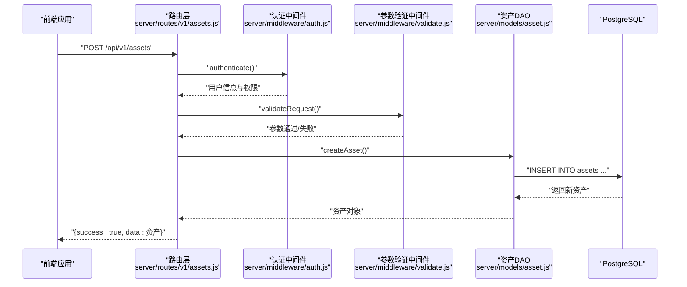
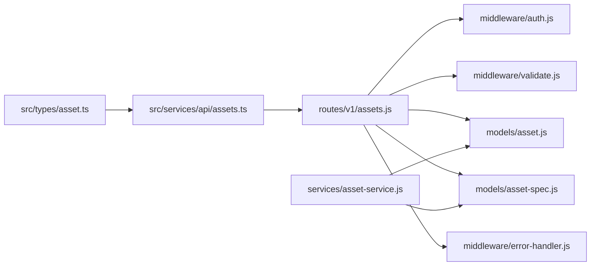

# 资产CRUD操作

<cite>
**本文引用的文件**
- [server/routes/v1/assets.js](file://server/routes/v1/assets.js)
- [server/models/asset.js](file://server/models/asset.js)
- [server/models/asset-spec.js](file://server/models/asset-spec.js)
- [server/services/asset-service.js](file://server/services/asset-service.js)
- [server/middleware/auth.js](file://server/middleware/auth.js)
- [server/config/auth.js](file://server/config/auth.js)
- [server/middleware/error-handler.js](file://server/middleware/error-handler.js)
- [server/middleware/validate.js](file://server/middleware/validate.js)
- [src/services/api/assets.ts](file://src/services/api/assets.ts)
- [src/types/asset.ts](file://src/types/asset.ts)
- [server/db/schema.sql](file://server/db/schema.sql)
</cite>

## 目录
1. [简介](#简介)
2. [项目结构](#项目结构)
3. [核心组件](#核心组件)
4. [架构总览](#架构总览)
5. [详细组件分析](#详细组件分析)
6. [依赖分析](#依赖分析)
7. [性能考虑](#性能考虑)
8. [故障排查指南](#故障排查指南)
9. [结论](#结论)
10. [附录](#附录)

## 简介
本文件面向后端与前端开发者，系统性梳理资产（Assets）的 CRUD 操作，覆盖以下端点：
- 创建资产：POST /api/v1/assets
- 查询资产列表：GET /api/v1/assets
- 查询单个资产：GET /api/v1/assets/{code}
- 更新资产：PUT /api/v1/assets/{code}
- 删除资产：DELETE /api/v1/assets/{code}

同时说明权限控制（ASSET_READ、ASSET_CREATE、ASSET_UPDATE、ASSET_DELETE）的实现方式，解释资产与资产规格（asset-spec）的关联关系及查询时的自动关联机制，并给出常见错误（如 404、400）的处理策略与实际代码示例路径。

## 项目结构
资产相关能力由“路由层 → 服务层/模型层 → 数据库”三层构成，前端通过统一的 API 服务封装调用。

图表来源
- [server/routes/v1/assets.js](file://server/routes/v1/assets.js#L1-L164)
- [server/middleware/auth.js](file://server/middleware/auth.js#L1-L86)
- [server/middleware/validate.js](file://server/middleware/validate.js#L1-L27)
- [server/services/asset-service.js](file://server/services/asset-service.js#L1-L216)
- [server/models/asset.js](file://server/models/asset.js#L1-L257)
- [server/models/asset-spec.js](file://server/models/asset-spec.js#L1-L170)
- [server/db/schema.sql](file://server/db/schema.sql#L1-L101)

章节来源
- [server/routes/v1/assets.js](file://server/routes/v1/assets.js#L1-L164)
- [src/services/api/assets.ts](file://src/services/api/assets.ts#L1-L108)

## 核心组件
- 路由层：定义资产与规格的 REST 接口，串联认证、授权与参数校验，并调用模型层执行数据库操作。
- 模型层（DAO）：封装 SQL 查询与更新，负责资产与规格的增删改查。
- 服务层：封装业务逻辑（可选），在本仓库中部分查询逻辑也直接由路由层调用模型层实现。
- 中间件：认证（JWT）、授权（权限位）、参数验证、统一错误处理。
- 前端 API 封装：对后端接口进行轻量封装，便于在前端工程中使用。

章节来源
- [server/models/asset.js](file://server/models/asset.js#L63-L158)
- [server/models/asset-spec.js](file://server/models/asset-spec.js#L77-L104)
- [server/services/asset-service.js](file://server/services/asset-service.js#L1-L120)
- [server/middleware/auth.js](file://server/middleware/auth.js#L1-L86)
- [server/middleware/validate.js](file://server/middleware/validate.js#L1-L27)
- [server/middleware/error-handler.js](file://server/middleware/error-handler.js#L1-L115)
- [src/services/api/assets.ts](file://src/services/api/assets.ts#L1-L108)

## 架构总览
下面的序列图展示了“创建资产”的完整流程，其他 CRUD 操作与此类似，区别在于 HTTP 方法与路由路径。

图表来源
- [server/routes/v1/assets.js](file://server/routes/v1/assets.js#L84-L110)
- [server/middleware/auth.js](file://server/middleware/auth.js#L12-L54)
- [server/middleware/validate.js](file://server/middleware/validate.js#L11-L27)
- [server/models/asset.js](file://server/models/asset.js#L71-L90)

## 详细组件分析

### 路由与权限控制
- 认证中间件：从 Authorization 头解析 Bearer Token，开发模式下可跳过认证并赋予管理员角色。
- 授权中间件：基于权限常量（如 ASSET_READ、ASSET_CREATE、ASSET_UPDATE、ASSET_DELETE）进行校验。
- 参数验证：使用 express-validator 对路径参数、查询参数、请求体进行校验，失败返回 400。
- 统一错误处理：捕获 ApiError、数据库约束错误、JSON 解析错误等，返回标准化响应。

章节来源
- [server/middleware/auth.js](file://server/middleware/auth.js#L12-L86)
- [server/config/auth.js](file://server/config/auth.js#L8-L53)
- [server/middleware/validate.js](file://server/middleware/validate.js#L11-L27)
- [server/middleware/error-handler.js](file://server/middleware/error-handler.js#L1-L115)
- [server/routes/v1/assets.js](file://server/routes/v1/assets.js#L33-L164)

### 资产模型与规格关联
- 资产表（assets）与资产规格表（asset_specs）通过 spec_code 关联。
- 查询资产时，路由层会通过 LEFT JOIN 自动关联规格信息（spec_name、classification_code、classification_desc、category、family、type、manufacturer、address、phone 等）。
- 文件维度：资产与规格均可按 file_id 进行文件级隔离；路由层在按文件 ID 查询时，会同时匹配 file_id 以确保跨表一致性。

章节来源
- [server/models/asset.js](file://server/models/asset.js#L63-L104)
- [server/models/asset.js](file://server/models/asset.js#L147-L158)
- [server/models/asset-spec.js](file://server/models/asset-spec.js#L108-L140)
- [server/db/schema.sql](file://server/db/schema.sql#L18-L55)

### 端点定义与行为

#### 1) 创建资产（POST /api/v1/assets）
- HTTP 方法：POST
- URL 路径：/api/v1/assets
- 权限：ASSET_CREATE
- 请求体字段（来自前端类型定义）：
  - assetCode（必填）
  - name（可选）
  - specCode（可选）
  - floor（可选）
  - room（可选）
  - dbId（可选）
  - fileId（可选）
  - properties（可选）
- 成功响应：201 Created，返回 { success: true, data: 资产对象 }
- 常见错误：
  - 400：请求参数验证失败（如 assetCode 为空）
  - 401：未提供或无效的认证令牌
  - 403：无权限执行创建
  - 409：数据冲突（如唯一约束冲突）

实际示例路径
- 路由与权限校验：[server/routes/v1/assets.js](file://server/routes/v1/assets.js#L84-L110)
- 参数验证规则：[server/routes/v1/assets.js](file://server/routes/v1/assets.js#L92-L101)
- 前端调用封装：[src/services/api/assets.ts](file://src/services/api/assets.ts#L34-L43)
- 后端模型写入：[server/models/asset.js](file://server/models/asset.js#L11-L26)

章节来源
- [server/routes/v1/assets.js](file://server/routes/v1/assets.js#L84-L110)
- [src/types/asset.ts](file://src/types/asset.ts#L47-L56)
- [src/services/api/assets.ts](file://src/services/api/assets.ts#L34-L43)
- [server/models/asset.js](file://server/models/asset.js#L11-L26)

#### 2) 查询资产列表（GET /api/v1/assets）
- HTTP 方法：GET
- URL 路径：/api/v1/assets
- 权限：ASSET_READ
- 查询参数：
  - fileId（可选，整数）
  - specCode（可选，字符串）
- 返回：{ success: true, data: 资产数组 }
- 行为说明：
  - 若提供 fileId：按文件 ID 过滤
  - 若提供 specCode：按规格编码过滤
  - 否则返回全部资产，并自动关联规格信息
- 常见错误：
  - 400：参数类型不合法
  - 401：未认证
  - 403：无权限

实际示例路径
- 路由与权限校验：[server/routes/v1/assets.js](file://server/routes/v1/assets.js#L33-L57)
- 参数验证规则：[server/routes/v1/assets.js](file://server/routes/v1/assets.js#L36-L38)
- 模型查询（按文件 ID/规格编码/全量）：[server/models/asset.js](file://server/models/asset.js#L63-L104)
- 前端调用封装：[src/services/api/assets.ts](file://src/services/api/assets.ts#L13-L16)

章节来源
- [server/routes/v1/assets.js](file://server/routes/v1/assets.js#L33-L57)
- [server/models/asset.js](file://server/models/asset.js#L63-L104)
- [src/services/api/assets.ts](file://src/services/api/assets.ts#L13-L16)

#### 3) 查询单个资产（GET /api/v1/assets/{code}）
- HTTP 方法：GET
- URL 路径：/api/v1/assets/{code}
- 权限：ASSET_READ
- 路径参数：
  - code（必填，非空）
- 返回：{ success: true, data: 资产对象 }
- 常见错误：
  - 404：资产不存在
  - 400：参数验证失败
  - 401：未认证
  - 403：无权限

实际示例路径
- 路由与权限校验：[server/routes/v1/assets.js](file://server/routes/v1/assets.js#L66-L82)
- 参数验证规则：[server/routes/v1/assets.js](file://server/routes/v1/assets.js#L69-L70)
- 模型查询（按编码）：[server/models/asset.js](file://server/models/asset.js#L77-L89)
- 前端调用封装：[src/services/api/assets.ts](file://src/services/api/assets.ts#L19-L24)

章节来源
- [server/routes/v1/assets.js](file://server/routes/v1/assets.js#L66-L82)
- [server/models/asset.js](file://server/models/asset.js#L77-L89)
- [src/services/api/assets.ts](file://src/services/api/assets.ts#L19-L24)

#### 4) 更新资产（PUT /api/v1/assets/{code}）
- HTTP 方法：PUT
- URL 路径：/api/v1/assets/{code}
- 权限：ASSET_UPDATE
- 路径参数：
  - code（必填，非空）
- 请求体字段（来自前端类型定义）：
  - name（可选）
  - floor（可选）
  - room（可选）
  - specCode（可选）
  - properties（可选）
- 返回：{ success: true, data: 资产对象 }
- 常见错误：
  - 404：资产不存在
  - 400：参数验证失败
  - 401：未认证
  - 403：无权限

实际示例路径
- 路由与权限校验：[server/routes/v1/assets.js](file://server/routes/v1/assets.js#L112-L139)
- 参数验证规则：[server/routes/v1/assets.js](file://server/routes/v1/assets.js#L122-L127)
- 模型更新（允许字段：spec_code、name、floor、room）：[server/models/asset.js](file://server/models/asset.js#L206-L242)
- 前端调用封装：[src/services/api/assets.ts](file://src/services/api/assets.ts#L45-L54)

章节来源
- [server/routes/v1/assets.js](file://server/routes/v1/assets.js#L112-L139)
- [server/models/asset.js](file://server/models/asset.js#L206-L242)
- [src/services/api/assets.ts](file://src/services/api/assets.ts#L45-L54)

#### 5) 删除资产（DELETE /api/v1/assets/{code}）
- HTTP 方法：DELETE
- URL 路径：/api/v1/assets/{code}
- 权限：ASSET_DELETE
- 路径参数：
  - code（必填，非空）
- 返回：{ success: true, message: '删除成功' }
- 常见错误：
  - 404：资产不存在
  - 400：参数验证失败
  - 401：未认证
  - 403：无权限

实际示例路径
- 路由与权限校验：[server/routes/v1/assets.js](file://server/routes/v1/assets.js#L141-L164)
- 参数验证规则：[server/routes/v1/assets.js](file://server/routes/v1/assets.js#L151-L152)
- 模型删除：[server/models/asset.js](file://server/models/asset.js#L244-L257)
- 前端调用封装：[src/services/api/assets.ts](file://src/services/api/assets.ts#L59-L64)

章节来源
- [server/routes/v1/assets.js](file://server/routes/v1/assets.js#L141-L164)
- [server/models/asset.js](file://server/models/asset.js#L244-L257)
- [src/services/api/assets.ts](file://src/services/api/assets.ts#L59-L64)

### 资产规格（Asset Spec）关联查询
- 路由层提供资产规格的查询接口，支持按 fileId 或按编码查询。
- 查询资产时，会通过 LEFT JOIN 自动携带规格字段，形成“资产+规格”的复合结果。
- 规格表与资产表均支持 file_id 字段，用于按文件维度隔离数据。

章节来源
- [server/routes/v1/assets.js](file://server/routes/v1/assets.js#L196-L251)
- [server/models/asset.js](file://server/models/asset.js#L63-L104)
- [server/models/asset-spec.js](file://server/models/asset-spec.js#L77-L104)
- [server/db/schema.sql](file://server/db/schema.sql#L18-L55)

## 依赖分析
- 路由层依赖认证、授权、参数验证与错误处理中间件，并调用模型层执行数据库操作。
- 模型层依赖数据库连接与事务客户端，负责 SQL 执行与结果返回。
- 服务层可选地封装复杂业务逻辑，当前仓库中部分查询逻辑直接由路由层调用模型层。
- 前端 API 封装仅做轻量包装，便于统一调用与类型提示。

图表来源
- [server/routes/v1/assets.js](file://server/routes/v1/assets.js#L1-L164)
- [server/middleware/auth.js](file://server/middleware/auth.js#L1-L86)
- [server/middleware/validate.js](file://server/middleware/validate.js#L1-L27)
- [server/middleware/error-handler.js](file://server/middleware/error-handler.js#L1-L115)
- [server/models/asset.js](file://server/models/asset.js#L1-L257)
- [server/models/asset-spec.js](file://server/models/asset-spec.js#L1-L170)
- [server/services/asset-service.js](file://server/services/asset-service.js#L1-L216)
- [src/services/api/assets.ts](file://src/services/api/assets.ts#L1-L108)
- [src/types/asset.ts](file://src/types/asset.ts#L1-L65)

## 性能考虑
- 索引优化：资产表与规格表均建立多列索引，有助于按 spec_code、楼层、房间、db_id 等条件快速检索。
- 连接查询：查询资产列表时使用 LEFT JOIN 规格表，建议在高频查询场景下关注 JOIN 性能与结果集大小。
- 批量导入：提供批量 Upsert 能力，使用事务包裹以保证一致性与性能。
- 建议：
  - 在高频筛选字段上保持索引有效。
  - 控制单次批量导入规模，避免长时间持有事务锁。
  - 对大结果集分页查询（当前路由层未内置分页，可在前端或后续扩展中增加）。

章节来源
- [server/db/schema.sql](file://server/db/schema.sql#L75-L101)
- [server/models/asset.js](file://server/models/asset.js#L160-L204)

## 故障排查指南
- 400 参数验证失败
  - 现象：请求体或路径/查询参数不符合要求。
  - 排查：检查字段类型、必填项、长度限制等。
  - 参考路径：[server/middleware/validate.js](file://server/middleware/validate.js#L11-L27)
- 401 未认证
  - 现象：缺少或无效的 Authorization 头。
  - 排查：确认 Bearer Token 是否正确传递，是否过期。
  - 参考路径：[server/middleware/auth.js](file://server/middleware/auth.js#L24-L54)
- 403 无权限
  - 现象：当前用户不具备所需权限位。
  - 排查：确认用户权限集合是否包含 ASSET_* 对应权限。
  - 参考路径：[server/middleware/auth.js](file://server/middleware/auth.js#L60-L86)，[server/config/auth.js](file://server/config/auth.js#L8-L53)
- 404 资产/规格不存在
  - 现象：按编码查询返回空或删除/更新目标不存在。
  - 排查：确认编码是否正确，是否存在跨文件隔离导致的可见性问题。
  - 参考路径：[server/routes/v1/assets.js](file://server/routes/v1/assets.js#L74-L76)，[server/routes/v1/assets.js](file://server/routes/v1/assets.js#L131-L133)，[server/routes/v1/assets.js](file://server/routes/v1/assets.js#L156-L158)
- 409 数据冲突
  - 现象：唯一约束冲突（如重复的 file_id+asset_code）。
  - 排查：检查唯一键组合是否被占用。
  - 参考路径：[server/middleware/error-handler.js](file://server/middleware/error-handler.js#L69-L75)
- 500 服务器内部错误
  - 现象：未知异常。
  - 排查：查看服务端日志，定位具体异常堆栈。
  - 参考路径：[server/middleware/error-handler.js](file://server/middleware/error-handler.js#L95-L108)

章节来源
- [server/middleware/validate.js](file://server/middleware/validate.js#L11-L27)
- [server/middleware/auth.js](file://server/middleware/auth.js#L24-L86)
- [server/config/auth.js](file://server/config/auth.js#L8-L53)
- [server/middleware/error-handler.js](file://server/middleware/error-handler.js#L69-L108)
- [server/routes/v1/assets.js](file://server/routes/v1/assets.js#L74-L76)

## 结论
本仓库实现了完整的资产 CRUD 能力，具备完善的认证授权、参数验证与错误处理机制。资产与资产规格通过 spec_code 实现强关联，查询时自动拼接规格信息，满足多数业务场景需求。建议在生产环境中结合索引与分页策略进一步提升性能，并持续完善权限与审计日志。

## 附录

### 权限常量与角色映射
- 权限常量（节选）：ASSET_READ、ASSET_CREATE、ASSET_UPDATE、ASSET_DELETE
- 角色到权限映射：ADMIN 拥有全部权限；MANAGER/EDITOR/VIEWER/GUEST 拥有不同的子集权限
- 参考路径：[server/config/auth.js](file://server/config/auth.js#L8-L53)，[server/config/auth.js](file://server/config/auth.js#L64-L117)

### 前端类型定义（节选）
- Asset、AssetSpec、AssetCreateRequest、AssetUpdateRequest
- 参考路径：[src/types/asset.ts](file://src/types/asset.ts#L1-L65)

### 数据库表结构要点
- 资产表（assets）与资产规格表（asset_specs）均支持 file_id 与 uuid 字段，用于文件级隔离与唯一标识。
- 索引覆盖了常用查询字段，有助于提升查询性能。
- 参考路径：[server/db/schema.sql](file://server/db/schema.sql#L18-L55)，[server/db/schema.sql](file://server/db/schema.sql#L75-L101)