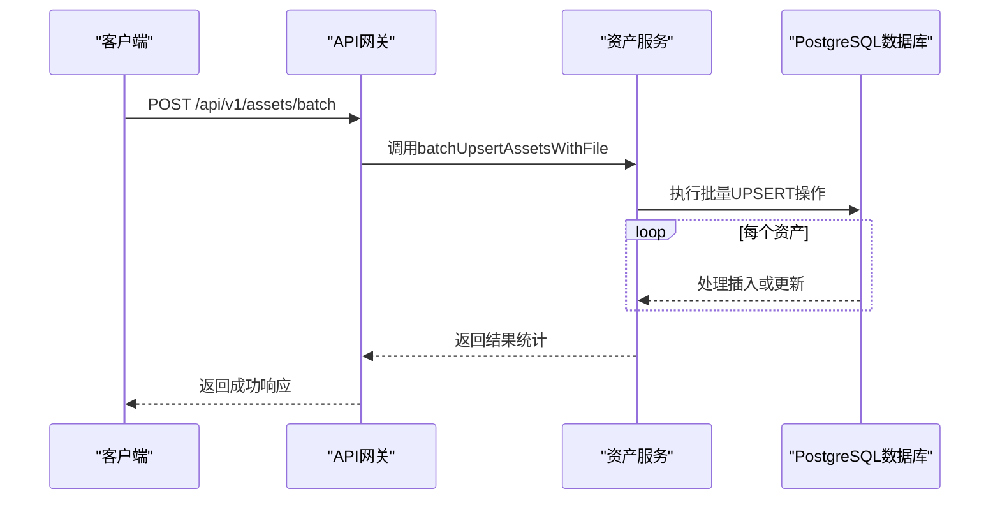
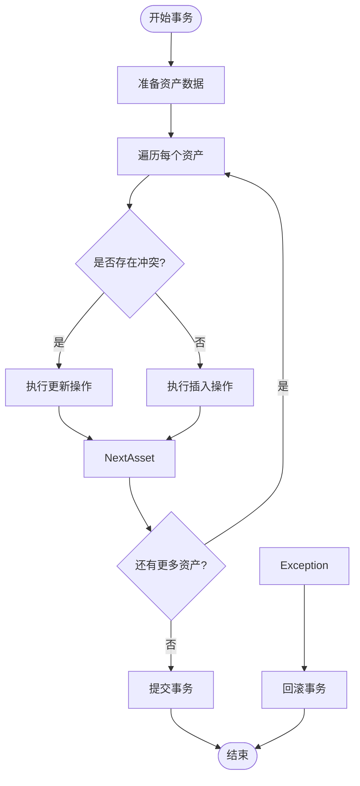
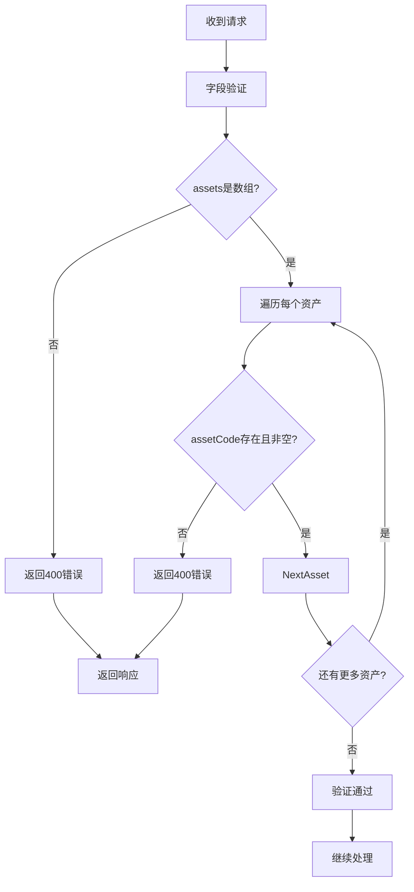
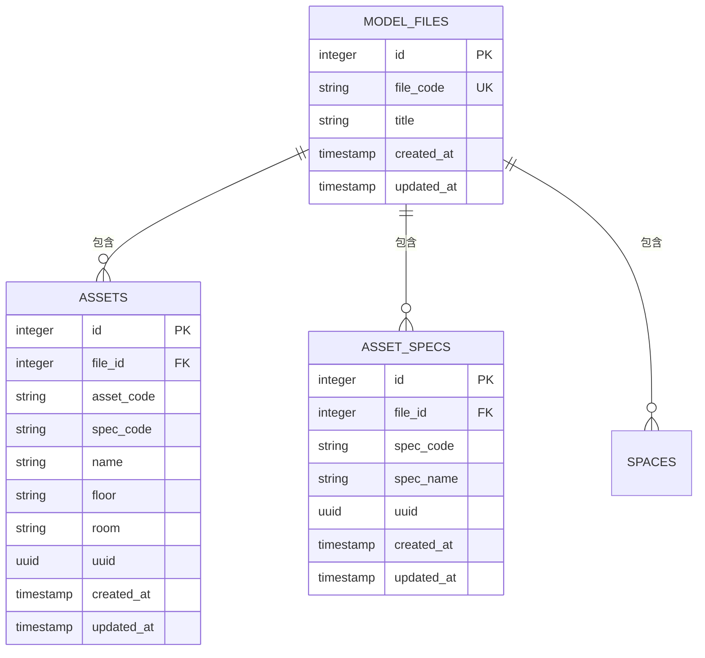

# 资产批量导入

<cite>
**本文档引用的文件**  
- [assets.js](file://server/routes/v1/assets.js)
- [asset-service.js](file://server/services/asset-service.js)
- [asset.js](file://server/models/asset.js)
- [assets.ts](file://src/services/api/assets.ts)
- [add-file-id.sql](file://server/db/migrations/add-file-id.sql)
- [init-all.sql](file://server/db/init-all.sql)
- [error-handler.js](file://server/middleware/error-handler.js)
</cite>

## 目录
1. [简介](#简介)
2. [批量导入API使用方法](#批量导入api使用方法)
3. [事务处理与数据一致性](#事务处理与数据一致性)
4. [字段验证规则](#字段验证规则)
5. [代码示例](#代码示例)
6. [文件关联机制](#文件关联机制)
7. [常见问题解决方案](#常见问题解决方案)
8. [性能优化建议](#性能优化建议)
9. [结论](#结论)

## 简介
资产批量导入功能允许用户通过单个API请求导入大量资产数据。该功能设计用于高效处理建筑信息模型（BIM）系统中的资产数据同步，支持插入或更新（upsert）操作，并确保数据的一致性和完整性。本功能通过`POST /api/v1/assets/batch`端点实现，能够处理包含多个资产对象的数组，每个对象包含资产的基本信息和关联属性。

**Section sources**
- [assets.js](file://server/routes/v1/assets.js#L166-L194)

## 批量导入API使用方法
批量导入API通过`POST /api/v1/assets/batch`端点提供服务，接收一个包含资产数组的JSON请求体。每个资产对象必须包含`assetCode`字段，其他字段如`name`、`specCode`、`floor`、`room`等为可选。API会根据`fileId`参数将资产与特定的BIM模型文件进行关联。

请求体结构如下：
- `assets`: 资产对象数组
  - `assetCode`: 资产编码（必填）
  - `name`: 资产名称（可选）
  - `specCode`: 规格编码（可选）
  - `floor`: 所在楼层（可选）
  - `room`: 所在房间（可选）
  - `dbId`: 数据库ID（可选）

响应包含导入统计信息，包括成功插入、更新和失败的数量。



**Diagram sources**
- [assets.js](file://server/routes/v1/assets.js#L173-L194)
- [asset.js](file://server/models/asset.js#L163-L204)

**Section sources**
- [assets.js](file://server/routes/v1/assets.js#L173-L194)
- [assets.ts](file://src/services/api/assets.ts#L69-L77)

## 事务处理与数据一致性
批量导入功能通过PostgreSQL的`ON CONFLICT`机制实现原子性的插入或更新操作。`batchUpsertAssetsWithFile`方法在事务中执行，确保所有操作要么全部成功，要么全部回滚，从而维护数据的一致性。

当插入新资产时，如果`file_id`和`asset_code`的组合已存在，则执行更新操作；否则执行插入操作。此机制避免了重复数据的产生，并确保了数据的唯一性约束。



**Diagram sources**
- [asset.js](file://server/models/asset.js#L163-L204)
- [init-all.sql](file://server/db/init-all.sql#L70-L83)

**Section sources**
- [asset.js](file://server/models/asset.js#L163-L204)

## 字段验证规则
批量导入API实施严格的字段验证规则，确保数据的完整性和正确性。主要验证规则包括：
- `assets`字段必须是数组
- 每个资产对象的`assetCode`不能为空
- `fileId`必须是有效的整数
- 资产编码在特定文件上下文中必须唯一

这些验证规则在请求到达业务逻辑层之前由`express-validator`中间件处理，确保只有符合要求的数据才能进入数据库操作阶段。



**Diagram sources**
- [assets.js](file://server/routes/v1/assets.js#L176-L178)
- [error-handler.js](file://server/middleware/error-handler.js#L68-L75)

**Section sources**
- [assets.js](file://server/routes/v1/assets.js#L176-L178)

## 代码示例
以下是一个使用JavaScript进行资产批量导入的实际代码示例：

```javascript
import { batchImportAssets } from '@/services/api/assets';

const assets = [
  {
    assetCode: 'A-001',
    name: '空调机组',
    specCode: 'HVAC-001',
    floor: '1F',
    room: '设备间101'
  },
  {
    assetCode: 'A-002',
    name: '水泵',
    specCode: 'PUMP-001',
    floor: 'B1',
    room: '水泵房'
  }
];

try {
  const result = await batchImportAssets(assets);
  console.log('导入成功:', result);
} catch (error) {
  console.error('导入失败:', error.message);
}
```

**Section sources**
- [assets.ts](file://src/services/api/assets.ts#L69-L77)

## 文件关联机制
资产批量导入过程中，通过`fileId`参数实现资产与BIM模型文件的绑定。`fileId`作为外键引用`model_files`表的主键，确保每个资产都与特定的模型文件相关联。这种设计支持多文件环境下的数据隔离，允许同一资产编码在不同文件中存在而不会产生冲突。

数据库层面通过`ON DELETE CASCADE`约束确保当模型文件被删除时，关联的所有资产也会被自动清除，维护了数据的完整性。



**Diagram sources**
- [add-file-id.sql](file://server/db/migrations/add-file-id.sql#L5-L8)
- [init-all.sql](file://server/db/init-all.sql#L21-L33)

**Section sources**
- [add-file-id.sql](file://server/db/migrations/add-file-id.sql#L5-L8)

## 常见问题解决方案
### 部分失败处理
当批量导入过程中某些资产导入失败时，系统会记录失败的索引和错误信息，但不会中断整个导入过程。客户端可以根据返回的错误数组定位具体失败的资产并进行修正。

### UUID生成策略
系统使用`uuidv4`库为每个新创建的资产生成全局唯一标识符。这确保了即使在分布式环境中也能避免ID冲突，同时为前端提供了稳定的引用标识。

### 数据库约束冲突
当遇到唯一性约束冲突时，PostgreSQL会返回错误码`23505`，系统会将其转换为409状态码并返回"数据已存在"的友好提示。对于外键约束冲突（错误码`23503`），系统会返回400状态码和"关联数据不存在"的提示。

**Section sources**
- [error-handler.js](file://server/middleware/error-handler.js#L68-L84)
- [asset.js](file://server/models/asset.js#L171-L172)

## 性能优化建议
为提高批量导入性能，建议采取以下措施：
1. 批量操作应在单个事务中完成，减少数据库连接开销
2. 使用`ON CONFLICT`语句而非先查询后插入的模式
3. 合理设置数据库索引，特别是`file_id`和`asset_code`的组合索引
4. 控制单次导入的资产数量，避免内存溢出
5. 在高并发场景下考虑使用连接池优化

**Section sources**
- [asset.js](file://server/models/asset.js#L164-L166)
- [init-all.sql](file://server/db/init-all.sql#L85-L90)

## 结论
资产批量导入功能通过精心设计的API接口和数据库机制，实现了高效、可靠的数据导入能力。该功能不仅支持基本的插入和更新操作，还通过事务管理和约束检查确保了数据的一致性和完整性。结合合理的错误处理和性能优化策略，该功能能够满足大规模BIM项目中资产数据管理的需求。