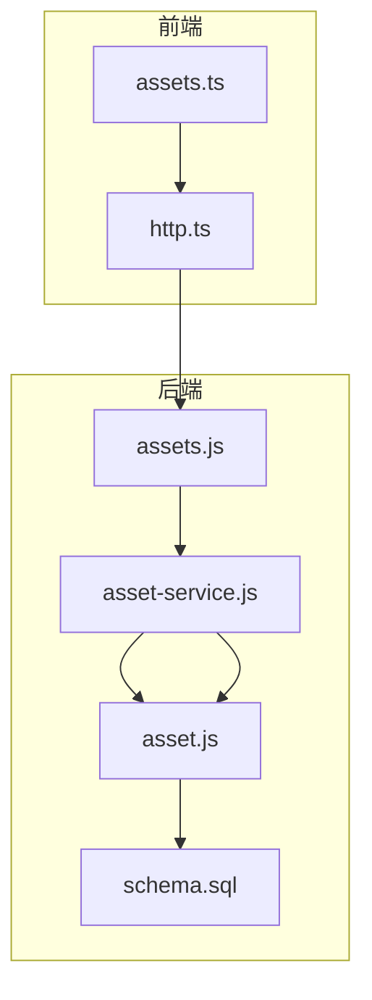
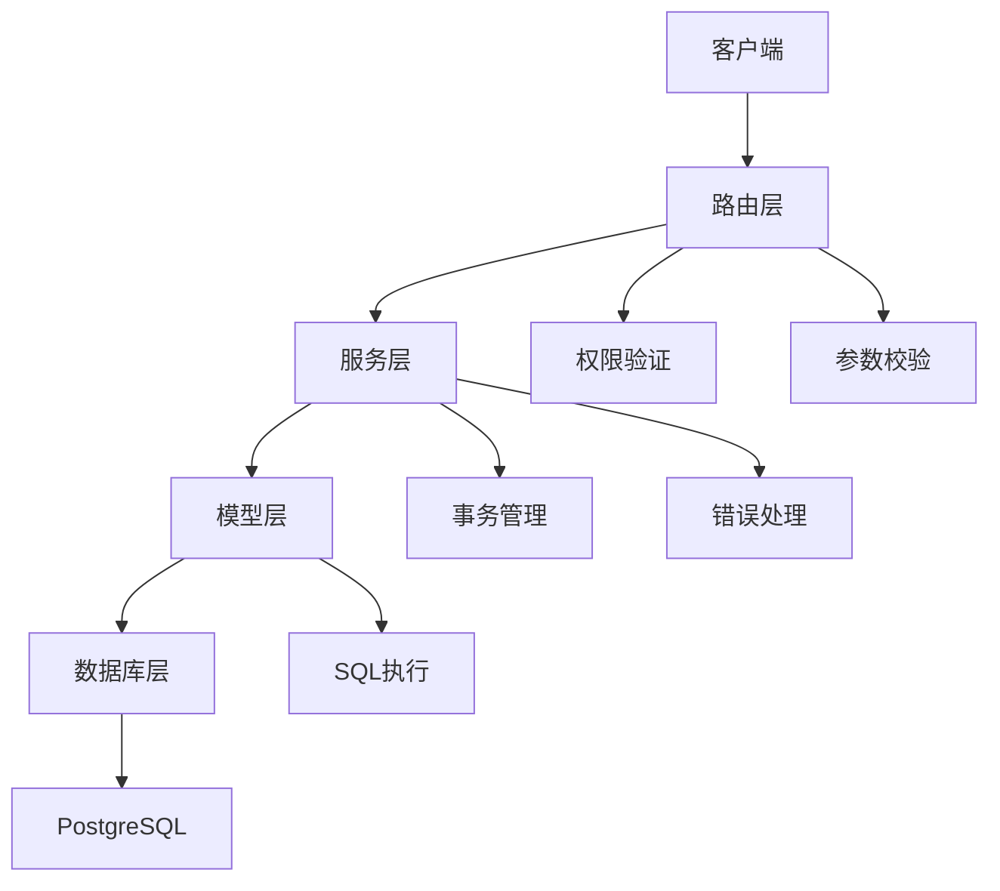
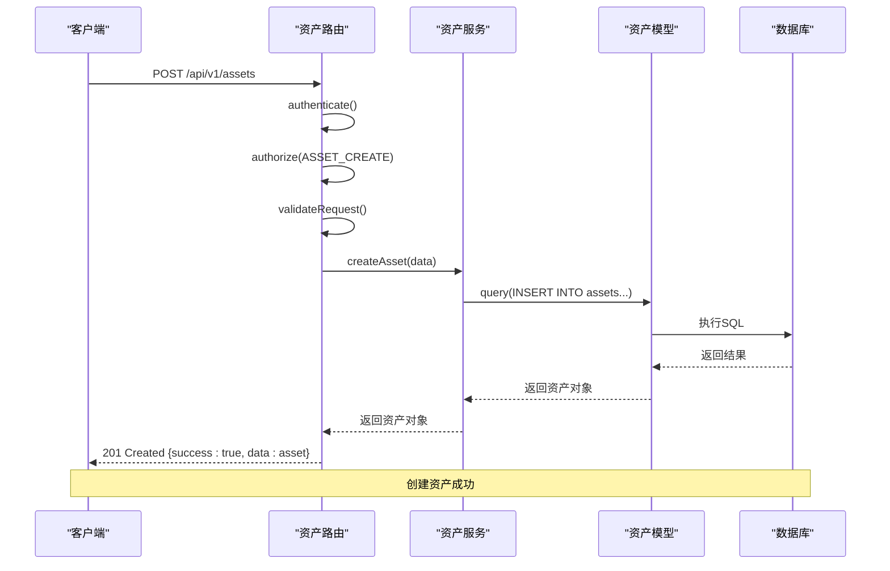
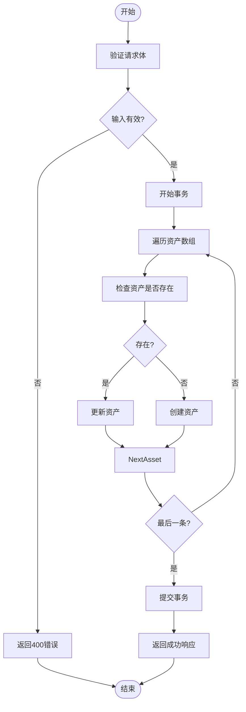
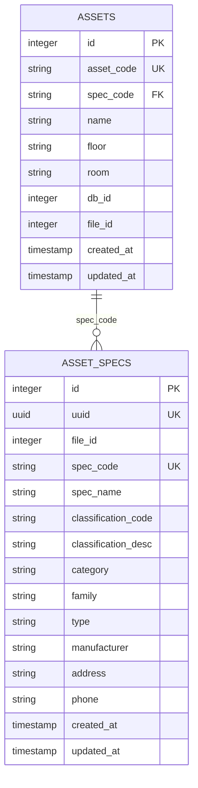
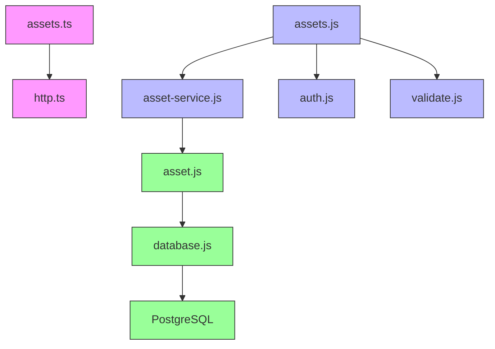

# 资产管理API

<cite>
**本文档引用的文件**
- [assets.js](file://server/routes/v1/assets.js)
- [asset.js](file://server/models/asset.js)
- [asset-service.js](file://server/services/asset-service.js)
- [asset-spec.js](file://server/models/asset-spec.js)
- [assets.ts](file://src/services/api/assets.ts)
- [auth.js](file://server/config/auth.js)
- [schema.sql](file://server/db/schema.sql)
- [error-handler.js](file://server/middleware/error-handler.js)
- [api.ts](file://src/types/api.ts)
</cite>

## 目录
1. [简介](#简介)
2. [项目结构](#项目结构)
3. [核心组件](#核心组件)
4. [架构概述](#架构概述)
5. [详细组件分析](#详细组件分析)
6. [依赖分析](#依赖分析)
7. [性能考虑](#性能考虑)
8. [故障排除指南](#故障排除指南)
9. [结论](#结论)

## 简介
资产管理API提供了一套完整的资产生命周期管理功能，包括资产的增删改查操作和批量导入功能。该API基于RESTful设计原则，通过HTTP端点提供对资产数据的访问和操作。系统实现了基于角色的权限控制，确保不同用户对资产数据的访问权限得到严格管理。资产与资产规格（asset-spec）之间存在关联关系，允许用户通过规格编码查询相关资产。API还提供了详细的错误处理机制，帮助开发者快速定位和解决问题。

## 项目结构
资产管理API的代码结构遵循分层架构设计，主要分为路由、模型、服务和前端API四个层次。路由层定义了所有API端点及其权限要求；模型层负责与数据库交互，执行具体的SQL操作；服务层封装了业务逻辑，提供更高层次的API；前端API层则为客户端提供了类型安全的接口调用方法。



**图示来源**
- [assets.js](file://server/routes/v1/assets.js#L1-L254)
- [asset-service.js](file://server/services/asset-service.js#L1-L216)
- [asset.js](file://server/models/asset.js#L1-L257)
- [assets.ts](file://src/services/api/assets.ts#L1-L108)

**本节来源**
- [assets.js](file://server/routes/v1/assets.js#L1-L254)
- [asset-service.js](file://server/services/asset-service.js#L1-L216)
- [asset.js](file://server/models/asset.js#L1-L257)

## 核心组件
资产管理API的核心组件包括资产路由、资产模型、资产服务和前端API。资产路由定义了所有API端点，包括获取资产列表、创建资产、更新资产、删除资产和批量导入资产等操作。每个端点都配置了相应的权限控制，确保只有授权用户才能执行特定操作。资产模型负责与数据库交互，执行具体的增删改查操作。资产服务层封装了业务逻辑，提供了更高层次的API调用方法。前端API为客户端提供了类型安全的接口调用方式，简化了前端开发工作。

**本节来源**
- [assets.js](file://server/routes/v1/assets.js#L1-L254)
- [asset.js](file://server/models/asset.js#L1-L257)
- [asset-service.js](file://server/services/asset-service.js#L1-L216)
- [assets.ts](file://src/services/api/assets.ts#L1-L108)

## 架构概述
资产管理API采用分层架构设计，从上到下依次为路由层、服务层、模型层和数据库层。路由层负责接收HTTP请求，进行权限验证和参数校验，然后调用服务层的方法。服务层封装了业务逻辑，协调模型层的操作，处理事务和错误。模型层直接与数据库交互，执行具体的SQL语句。数据库层使用PostgreSQL存储资产数据，通过外键约束和索引优化查询性能。



**图示来源**
- [assets.js](file://server/routes/v1/assets.js#L1-L254)
- [asset-service.js](file://server/services/asset-service.js#L1-L216)
- [asset.js](file://server/models/asset.js#L1-L257)
- [schema.sql](file://server/db/schema.sql#L1-L202)

## 详细组件分析

### 资产管理组件分析
资产管理组件提供了完整的资产生命周期管理功能，包括增删改查和批量导入操作。每个API端点都有明确的HTTP方法、URL路径、请求参数和响应格式定义。系统实现了基于角色的权限控制，确保不同用户对资产数据的访问权限得到严格管理。

#### API端点分析
```mermaid
classDiagram
class AssetApi {
+getAssets(fileId : number) Promise~Asset[]~
+getAssetByCode(code : string) Promise~Asset | null~
+createAsset(data : AssetCreateRequest) Promise~Asset~
+updateAsset(code : string, data : AssetUpdateRequest) Promise~Asset~
+deleteAsset(code : string) Promise~void~
+batchImportAssets(assets : AssetCreateRequest[]) Promise~BatchOperationResponse~
}
class Asset {
+id : number
+assetCode : string
+specCode? : string
+name : string
+floor? : string
+room? : string
+dbId? : number
+fileId? : number
}
class AssetCreateRequest {
+assetCode : string
+specCode? : string
+name : string
+floor? : string
+room? : string
+dbId? : number
+fileId? : number
}
class AssetUpdateRequest {
+name? : string
+floor? : string
+room? : string
+specCode? : string
}
class BatchOperationResponse {
+success : boolean
+total : number
+succeeded : number
+failed : number
+errors? : { index : number; error : string }[]
}
AssetApi --> Asset : "返回"
AssetApi --> AssetCreateRequest : "接收"
AssetApi --> AssetUpdateRequest : "接收"
AssetApi --> BatchOperationResponse : "返回"
```

**图示来源**
- [assets.ts](file://src/services/api/assets.ts#L1-L108)
- [asset.ts](file://src/types/asset.ts#L1-L65)
- [api.ts](file://src/types/api.ts#L1-L58)

#### 资产创建流程


**图示来源**
- [assets.js](file://server/routes/v1/assets.js#L84-L110)
- [asset-service.js](file://server/services/asset-service.js#L74-L96)
- [asset.js](file://server/models/asset.js#L11-L26)

#### 批量导入流程


**图示来源**
- [assets.js](file://server/routes/v1/assets.js#L166-L193)
- [asset-service.js](file://server/services/asset-service.js#L131-L156)
- [asset.js](file://server/models/asset.js#L163-L204)

**本节来源**
- [assets.js](file://server/routes/v1/assets.js#L1-L254)
- [asset.js](file://server/models/asset.js#L1-L257)
- [asset-service.js](file://server/services/asset-service.js#L1-L216)
- [assets.ts](file://src/services/api/assets.ts#L1-L108)

### 资产规格组件分析
资产规格组件管理资产的类型和规格信息，与资产实体形成关联关系。通过资产规格，系统可以对相同类型的资产进行统一管理和查询。

#### 资产与规格关系


**图示来源**
- [schema.sql](file://server/db/schema.sql#L18-L54)
- [asset-spec.js](file://server/models/asset-spec.js#L1-L170)

**本节来源**
- [asset-spec.js](file://server/models/asset-spec.js#L1-L170)
- [schema.sql](file://server/db/schema.sql#L18-L54)

## 依赖分析
资产管理API的各个组件之间存在明确的依赖关系。前端API依赖于HTTP服务进行网络请求；路由层依赖于服务层和认证中间件；服务层依赖于模型层；模型层直接依赖于数据库。这种分层依赖结构确保了代码的可维护性和可测试性。



**图示来源**
- [assets.ts](file://src/services/api/assets.ts#L1-L108)
- [assets.js](file://server/routes/v1/assets.js#L1-L254)
- [asset-service.js](file://server/services/asset-service.js#L1-L216)
- [asset.js](file://server/models/asset.js#L1-L257)
- [auth.js](file://server/config/auth.js#L1-L142)

**本节来源**
- [assets.ts](file://src/services/api/assets.ts#L1-L108)
- [assets.js](file://server/routes/v1/assets.js#L1-L254)
- [asset-service.js](file://server/services/asset-service.js#L1-L216)
- [asset.js](file://server/models/asset.js#L1-L257)

## 性能考虑
资产管理API在设计时考虑了性能优化。数据库表建立了适当的索引以提高查询效率，特别是在资产编码、规格编码、楼层和房间等常用查询字段上。批量操作使用数据库事务确保数据一致性，同时通过批量插入减少数据库往返次数。API响应采用JSON格式，数据结构经过优化以减少网络传输量。对于大量数据的查询，建议使用分页参数限制返回结果数量。

## 故障排除指南
当使用资产管理API时，可能会遇到各种错误情况。系统提供了详细的错误处理机制，帮助开发者快速定位和解决问题。常见的错误包括权限不足、数据验证失败、资源不存在和服务器内部错误等。开发者应检查请求的认证令牌、请求参数的格式和值范围，以及网络连接状态。对于批量操作，系统会返回详细的错误信息，包括失败的条目索引和错误原因，便于进行错误修复和重试。

**本节来源**
- [error-handler.js](file://server/middleware/error-handler.js#L1-L115)
- [assets.js](file://server/routes/v1/assets.js#L1-L254)
- [asset-service.js](file://server/services/asset-service.js#L1-L216)

## 结论
资产管理API提供了一套完整、安全且高效的资产生命周期管理解决方案。通过清晰的分层架构和严格的权限控制，系统确保了数据的安全性和一致性。API设计遵循RESTful原则，提供了丰富的操作接口，满足了资产增删改查和批量导入的需求。资产与资产规格的关联设计，使得系统能够灵活地管理不同类型的资产。详细的错误处理机制和完善的文档支持，降低了开发和维护成本。总体而言，该API为资产管理应用提供了坚实的基础。