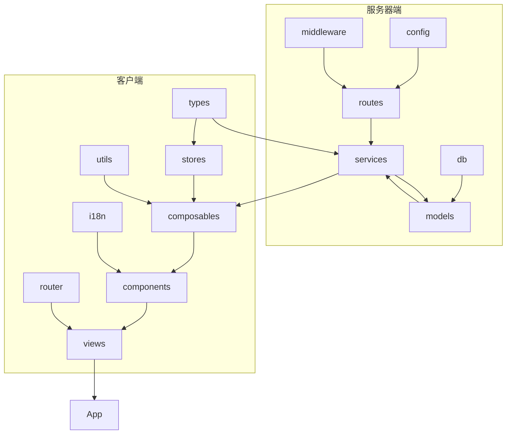
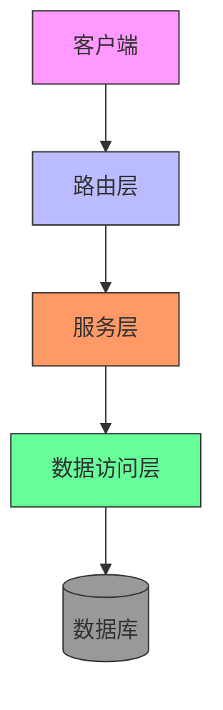
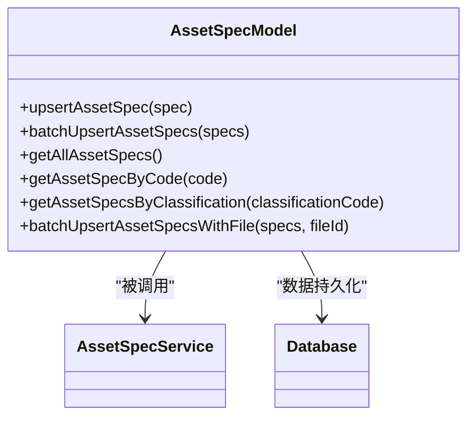
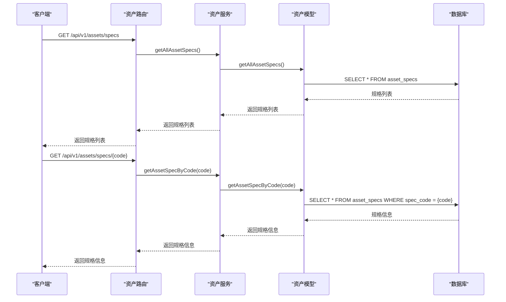
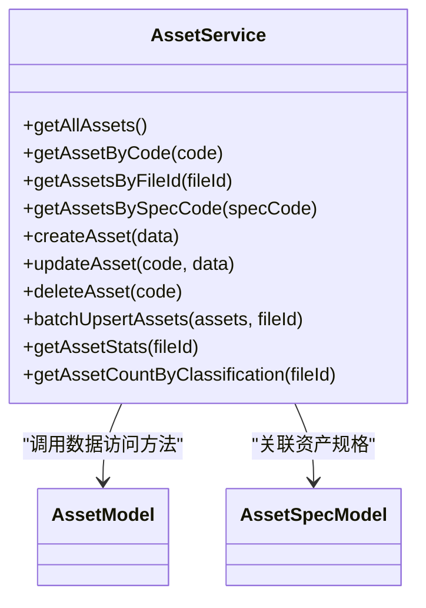
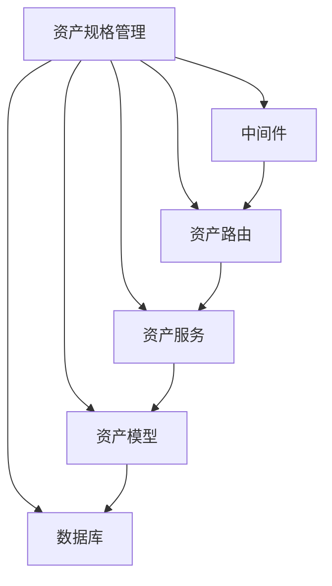

# 资产规格管理

<cite>
**本文档引用的文件**  
- [asset-spec.js](file://server/models/asset-spec.js)
- [assets.js](file://server/routes/v1/assets.js)
- [asset-service.js](file://server/services/asset-service.js)
- [asset.js](file://server/models/asset.js)
- [schema.sql](file://server/db/schema.sql)
- [error-handler.js](file://server/middleware/error-handler.js)
- [assets.ts](file://src/services/api/assets.ts)
- [asset.ts](file://src/types/asset.ts)
- [api.js](file://server/routes/api.js)
</cite>

## 目录
1. [简介](#简介)
2. [项目结构](#项目结构)
3. [核心组件](#核心组件)
4. [架构概述](#架构概述)
5. [详细组件分析](#详细组件分析)
6. [依赖分析](#依赖分析)
7. [性能考虑](#性能考虑)
8. [故障排除指南](#故障排除指南)
9. [结论](#结论)

## 简介
本文档详细介绍了资产规格管理功能，涵盖资产规格的查询操作，包括获取所有规格（GET /api/v1/assets/specs）和根据编码获取单个规格（GET /api/v1/assets/specs/{code}）。文档解释了资产规格（asset-spec）与资产（asset）之间的关系：资产规格存储设备的通用属性（如制造商、型号），而资产实例存储具体位置信息（如楼层、房间）。同时说明了如何通过fileId参数筛选特定文件关联的规格数据，提供了查询资产规格列表和详情的实际代码示例，描述了资产规格数据模型中的字段定义及其业务含义，并包括错误处理机制，如规格不存在（404）的处理方式。

## 项目结构
项目结构清晰地组织了服务器端和客户端代码，其中服务器端代码位于`server`目录下，包含配置、数据库、中间件、模型、路由和服务等子目录。客户端代码位于`src`目录下，包含组件、组合式API、国际化、路由、服务、状态管理、类型定义、工具函数、视图和主应用文件。这种分层结构有助于维护和扩展应用程序。

**图表来源**  
- [server](file://server)
- [src](file://src)

## 核心组件
资产规格管理的核心组件包括资产规格模型（asset-spec.js）、资产路由（assets.js）、资产服务（asset-service.js）和资产模型（asset.js）。这些组件协同工作，实现了资产规格的增删改查功能，以及与资产实例的关联管理。

**章节来源**  
- [asset-spec.js](file://server/models/asset-spec.js#L1-L170)
- [assets.js](file://server/routes/v1/assets.js#L1-L254)
- [asset-service.js](file://server/services/asset-service.js#L1-L216)
- [asset.js](file://server/models/asset.js#L1-L257)

## 架构概述
系统采用典型的分层架构，包括路由层、服务层和数据访问层。路由层负责处理HTTP请求和响应，服务层封装业务逻辑，数据访问层负责与数据库交互。这种分层设计提高了代码的可维护性和可测试性。

**图表来源**  
- [assets.js](file://server/routes/v1/assets.js#L1-L254)
- [asset-service.js](file://server/services/asset-service.js#L1-L216)
- [asset-spec.js](file://server/models/asset-spec.js#L1-L170)

## 详细组件分析

### 资产规格模型分析
资产规格模型（asset-spec.js）定义了资产规格的数据访问方法，包括插入或更新资产规格、批量插入资产规格、获取所有资产规格、根据规格编码获取规格、根据分类编码获取规格列表和批量插入或更新资产规格（关联文件）。

**图表来源**  
- [asset-spec.js](file://server/models/asset-spec.js#L1-L170)

**章节来源**  
- [asset-spec.js](file://server/models/asset-spec.js#L1-L170)

### 资产路由分析
资产路由（assets.js）定义了资产相关的API端点，包括获取资产列表、根据编码获取资产、创建资产、更新资产、删除资产、批量导入资产和获取资产规格列表。

**图表来源**  
- [assets.js](file://server/routes/v1/assets.js#L1-L254)

**章节来源**  
- [assets.js](file://server/routes/v1/assets.js#L1-L254)

### 资产服务分析
资产服务（asset-service.js）封装了资产相关的业务逻辑，包括获取所有资产、根据编码获取资产、根据文件ID获取资产、根据规格编码获取资产、创建资产、更新资产、删除资产、批量插入/更新资产、获取资产统计信息和按分类统计资产数量。

**图表来源**  
- [asset-service.js](file://server/services/asset-service.js#L1-L216)

**章节来源**  
- [asset-service.js](file://server/services/asset-service.js#L1-L216)

## 依赖分析
资产规格管理功能依赖于多个组件和外部服务，包括数据库、中间件、模型、服务和路由。这些依赖关系确保了功能的完整性和可靠性。

**图表来源**  
- [asset-spec.js](file://server/models/asset-spec.js#L1-L170)
- [assets.js](file://server/routes/v1/assets.js#L1-L254)
- [asset-service.js](file://server/services/asset-service.js#L1-L216)
- [asset.js](file://server/models/asset.js#L1-L257)

**章节来源**  
- [asset-spec.js](file://server/models/asset-spec.js#L1-L170)
- [assets.js](file://server/routes/v1/assets.js#L1-L254)
- [asset-service.js](file://server/services/asset-service.js#L1-L216)
- [asset.js](file://server/models/asset.js#L1-L257)

## 性能考虑
为了提高查询性能，数据库表上创建了多个索引，包括资产规格表的规格名称、分类编码、类别和族索引，以及资产表的规格编码、楼层、房间和dbId索引。这些索引有助于加快查询速度，特别是在大数据量的情况下。

**章节来源**  
- [schema.sql](file://server/db/schema.sql#L75-L102)

## 故障排除指南
当遇到资产规格不存在的错误时，系统会返回404状态码，并附带错误信息“资产规格不存在”。开发者可以通过检查请求的规格编码是否正确，以及数据库中是否存在对应的记录来排查问题。

**章节来源**  
- [error-handler.js](file://server/middleware/error-handler.js#L1-L115)
- [assets.js](file://server/routes/v1/assets.js#L244-L245)

## 结论
本文档详细介绍了资产规格管理功能的设计和实现，涵盖了从数据模型到API接口的各个方面。通过分层架构和清晰的组件划分，系统实现了高效、可靠的资产规格管理功能。未来可以进一步优化查询性能，增加更多的业务逻辑验证，以提升系统的整体质量和用户体验。