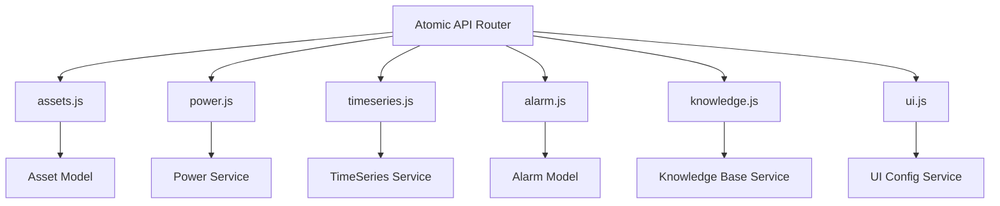

# Atomic API v1

<cite>
**本文档引用的文件**  
- [routes/atomic/index.js](file://server/routes/atomic/index.js)
- [routes/atomic/v1/index.js](file://server/routes/atomic/v1/index.js)
- [routes/atomic/v1/assets.js](file://server/routes/atomic/v1/assets.js)
- [routes/atomic/v1/power.js](file://server/routes/atomic/v1/power.js)
- [routes/atomic/v1/timeseries.js](file://server/routes/atomic/v1/timeseries.js)
- [routes/atomic/v1/alarm.js](file://server/routes/atomic/v1/alarm.js)
- [routes/atomic/v1/knowledge.js](file://server/routes/atomic/v1/knowledge.js)
- [routes/atomic/v1/ui.js](file://server/routes/atomic/v1/ui.js)
- [docs/api/atomic-v1.openapi.yaml](file://docs/api/atomic-v1.openapi.yaml)
</cite>

## 概述

Atomic API v1 是系统新引入的原子化API设计，采用RESTful风格，专注于单一资源的高效操作。该API设计遵循以下原则：

- **原子性** - 每个接口操作单一资源
- **幂等性** - 相同操作多次执行结果一致
- **规范性** - 统一的URL结构和响应格式
- **可扩展性** - 模块化设计，易于扩展新资源

## 目录

1. [架构设计](#架构设计)
2. [通用规范](#通用规范)
3. [资产管理 (assets)](#资产管理-assets)
4. [功率数据 (power)](#功率数据-power)
5. [时序数据 (timeseries)](#时序数据-timeseries)
6. [告警管理 (alarm)](#告警管理-alarm)
7. [知识库 (knowledge)](#知识库-knowledge)
8. [UI配置 (ui)](#ui配置-ui)
9. [错误处理](#错误处理)
10. [认证与授权](#认证与授权)

## 架构设计



**图表来源**  
- [routes/atomic/index.js](file://server/routes/atomic/index.js)

## 通用规范

### 基础URL
```
/api/atomic/v1
```

### 响应格式
所有API返回统一的JSON格式：

```json
{
  "success": true,
  "data": { ... },
  "message": "操作成功",
  "timestamp": "2025-03-10T12:00:00Z"
}
```

### HTTP状态码
- `200 OK` - 请求成功
- `201 Created` - 资源创建成功
- `400 Bad Request` - 请求参数错误
- `401 Unauthorized` - 未认证
- `403 Forbidden` - 无权限
- `404 Not Found` - 资源不存在
- `500 Internal Server Error` - 服务器内部错误

## 资产管理 (assets)

资产管理接口提供设备资产的CRUD操作。

### 接口列表

| 方法 | 路径 | 描述 |
|------|------|------|
| GET | `/assets` | 获取资产列表 |
| GET | `/assets/:id` | 获取单个资产详情 |
| POST | `/assets` | 创建新资产 |
| PUT | `/assets/:id` | 更新资产信息 |
| DELETE | `/assets/:id` | 删除资产 |

### 请求示例

**获取资产列表**
```bash
GET /api/atomic/v1/assets?page=1&limit=20
```

**创建资产**
```bash
POST /api/atomic/v1/assets
Content-Type: application/json

{
  "name": "温度传感器 A1",
  "type": "sensor",
  "location": "机房1",
  "metadata": {
    "model": "DHT22",
    "manufacturer": "Example Corp"
  }
}
```

**章节来源**  
- [routes/atomic/v1/assets.js](file://server/routes/atomic/v1/assets.js)

## 功率数据 (power)

功率数据接口提供实时功率查询和历史功率数据统计。

### 接口列表

| 方法 | 路径 | 描述 |
|------|------|------|
| GET | `/power/realtime` | 获取实时功率数据 |
| GET | `/power/history` | 获取历史功率数据 |
| GET | `/power/stats` | 获取功率统计信息 |
| GET | `/power/:assetId` | 获取指定资产的功率数据 |

### 请求示例

**获取实时功率**
```bash
GET /api/atomic/v1/power/realtime?assetIds=1,2,3
```

**获取历史功率**
```bash
GET /api/atomic/v1/power/history?assetId=1&start=2025-03-01&end=2025-03-10&interval=1h
```

**章节来源**  
- [routes/atomic/v1/power.js](file://server/routes/atomic/v1/power.js)

## 时序数据 (timeseries)

时序数据接口提供传感器数据的存储和查询，基于InfluxDB实现。

### 接口列表

| 方法 | 路径 | 描述 |
|------|------|------|
| GET | `/timeseries/query` | 查询时序数据 |
| POST | `/timeseries/write` | 写入时序数据 |
| GET | `/timeseries/aggregations` | 获取聚合数据 |
| GET | `/timeseries/latest` | 获取最新数据点 |

### 请求示例

**查询时序数据**
```bash
GET /api/atomic/v1/timeseries/query?measurement=temperature&assetId=1&start=-1h
```

**写入时序数据**
```bash
POST /api/atomic/v1/timeseries/write
Content-Type: application/json

{
  "measurement": "temperature",
  "assetId": "1",
  "value": 23.5,
  "timestamp": "2025-03-10T12:00:00Z",
  "tags": {
    "location": "room1",
    "sensor": "DHT22"
  }
}
```

**章节来源**  
- [routes/atomic/v1/timeseries.js](file://server/routes/atomic/v1/timeseries.js)

## 告警管理 (alarm)

告警管理接口提供告警规则的创建、查询和处理功能。

### 接口列表

| 方法 | 路径 | 描述 |
|------|------|------|
| GET | `/alarms` | 获取告警列表 |
| GET | `/alarms/:id` | 获取告警详情 |
| POST | `/alarms` | 创建告警规则 |
| PUT | `/alarms/:id` | 更新告警规则 |
| DELETE | `/alarms/:id` | 删除告警规则 |
| POST | `/alarms/:id/acknowledge` | 确认告警 |
| POST | `/alarms/:id/resolve` | 解决告警 |

### 请求示例

**创建告警规则**
```bash
POST /api/atomic/v1/alarms
Content-Type: application/json

{
  "name": "高温告警",
  "condition": {
    "metric": "temperature",
    "operator": "greater_than",
    "threshold": 30
  },
  "severity": "warning",
  "assetIds": ["1", "2"],
  "notificationChannels": ["email", "sms"]
}
```

**章节来源**  
- [routes/atomic/v1/alarm.js](file://server/routes/atomic/v1/alarm.js)

## 知识库 (knowledge)

知识库接口提供AI知识库的管理功能，与Open WebUI集成。

### 接口列表

| 方法 | 路径 | 描述 |
|------|------|------|
| GET | `/knowledge/bases` | 获取知识库列表 |
| GET | `/knowledge/bases/:id` | 获取知识库详情 |
| POST | `/knowledge/bases` | 创建知识库 |
| DELETE | `/knowledge/bases/:id` | 删除知识库 |
| GET | `/knowledge/bases/:id/documents` | 获取知识库文档 |
| POST | `/knowledge/bases/:id/documents` | 上传文档到知识库 |
| DELETE | `/knowledge/bases/:id/documents/:docId` | 删除知识库文档 |

### 请求示例

**创建知识库**
```bash
POST /api/atomic/v1/knowledge/bases
Content-Type: application/json

{
  "name": "设备维护手册",
  "description": "包含所有设备的维护文档和故障排除指南"
}
```

**上传文档**
```bash
POST /api/atomic/v1/knowledge/bases/1/documents
Content-Type: multipart/form-data

file: @manual.pdf
```

**章节来源**  
- [routes/atomic/v1/knowledge.js](file://server/routes/atomic/v1/knowledge.js)

## UI配置 (ui)

UI配置接口提供前端界面配置的存储和查询。

### 接口列表

| 方法 | 路径 | 描述 |
|------|------|------|
| GET | `/ui/config` | 获取UI配置 |
| GET | `/ui/config/:key` | 获取指定配置项 |
| PUT | `/ui/config` | 更新UI配置 |
| PUT | `/ui/config/:key` | 更新指定配置项 |
| DELETE | `/ui/config/:key` | 删除配置项 |

### 请求示例

**获取UI配置**
```bash
GET /api/atomic/v1/ui/config
```

**更新配置**
```bash
PUT /api/atomic/v1/ui/config/theme
Content-Type: application/json

{
  "primaryColor": "#1890ff",
  "layout": "sidebar",
  "language": "zh-CN"
}
```

**章节来源**  
- [routes/atomic/v1/ui.js](file://server/routes/atomic/v1/ui.js)

## 错误处理

Atomic API 使用统一的错误处理机制，返回结构化的错误信息：

```json
{
  "success": false,
  "error": {
    "code": "ASSET_NOT_FOUND",
    "message": "指定的资产不存在",
    "details": {
      "assetId": "12345"
    }
  },
  "timestamp": "2025-03-10T12:00:00Z"
}
```

### 常见错误码

| 错误码 | HTTP状态码 | 描述 |
|--------|-----------|------|
| `INVALID_REQUEST` | 400 | 请求参数无效 |
| `UNAUTHORIZED` | 401 | 未提供有效的认证信息 |
| `FORBIDDEN` | 403 | 没有权限执行此操作 |
| `RESOURCE_NOT_FOUND` | 404 | 请求的资源不存在 |
| `CONFLICT` | 409 | 资源冲突（如重复创建） |
| `INTERNAL_ERROR` | 500 | 服务器内部错误 |

## 认证与授权

Atomic API 使用 JWT Token 进行认证，支持两种认证方式：

### 1. Bearer Token
```bash
Authorization: Bearer <jwt_token>
```

### 2. API Key
```bash
X-API-Key: <api_key>
```

### Scope 权限控制

Atomic API 支持基于 scope 的细粒度权限控制：

- `atomic:assets:read` - 读取资产
- `atomic:assets:write` - 写入资产
- `atomic:power:read` - 读取功率数据
- `atomic:alarms:manage` - 管理告警
- `atomic:knowledge:admin` - 知识库管理

**章节来源**  
- [middleware/auth.js](file://server/middleware/auth.js)
- [middleware/scope-guard.js](file://server/middleware/scope-guard.js)

---

**相关文档**:
- [OpenAPI 规范](../docs/api/atomic-v1.openapi.yaml)
- [测试脚本](../../../scripts/smoke/atomic-week1.sh)

**最后更新**: 2025-03-10
