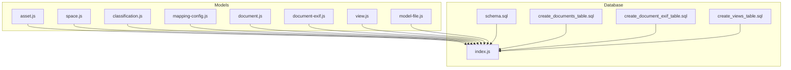
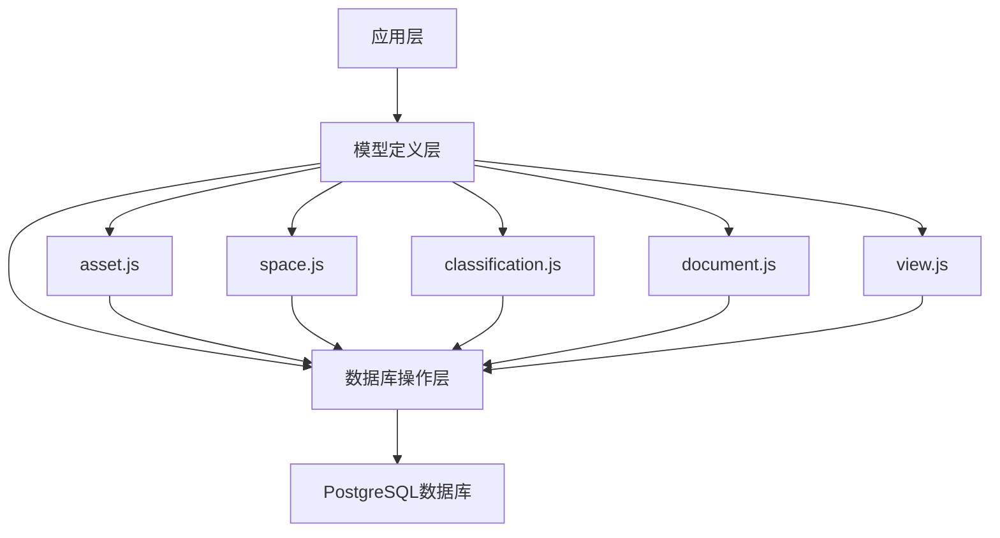
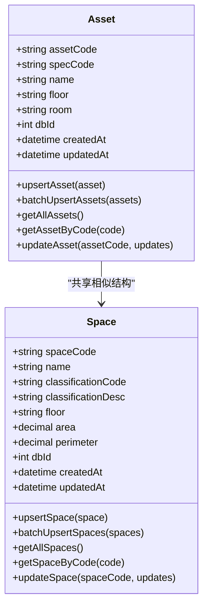
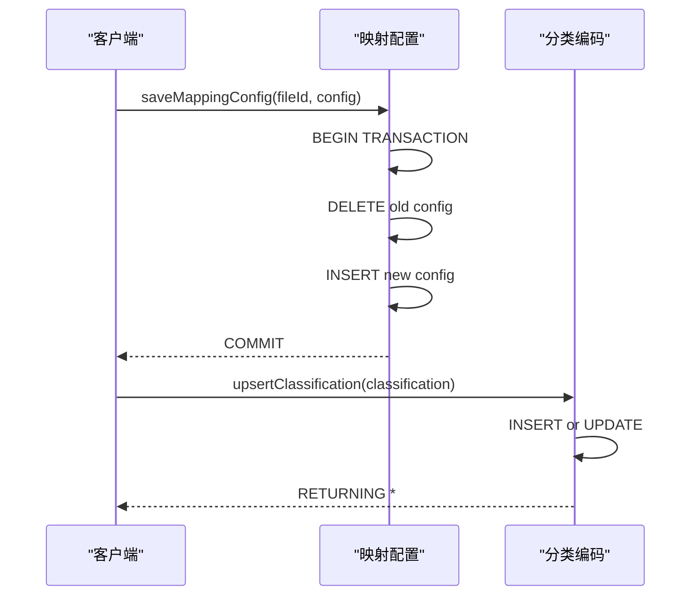
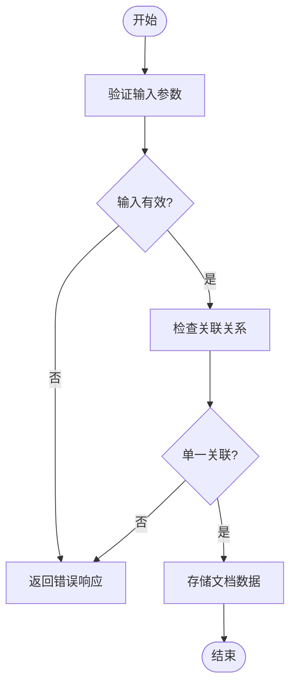
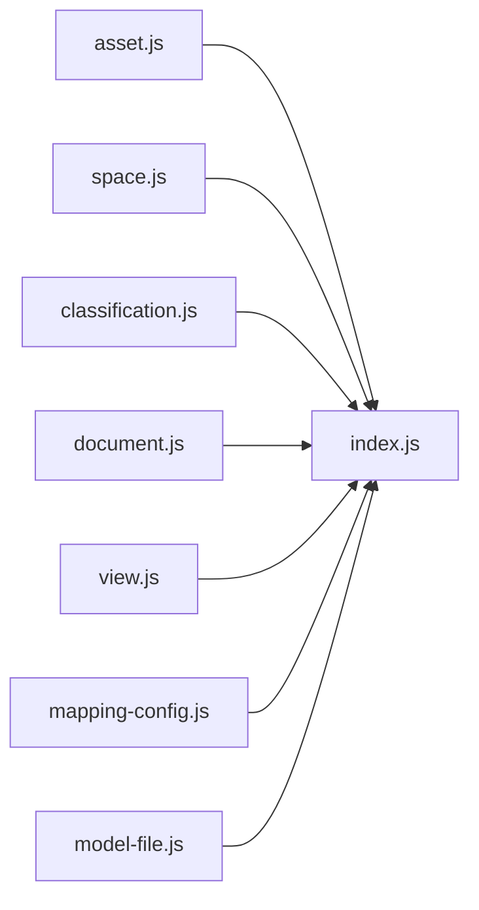

# ORM模型

<cite>
**本文档引用的文件**  
- [asset.js](file://server/models/asset.js)
- [space.js](file://server/models/space.js)
- [classification.js](file://server/models/classification.js)
- [mapping-config.js](file://server/models/mapping-config.js)
- [document.js](file://server/models/document.js)
- [document-exif.js](file://server/models/document-exif.js)
- [view.js](file://server/models/view.js)
- [model-file.js](file://server/models/model-file.js)
- [schema.sql](file://server/db/schema.sql)
- [create_documents_table.sql](file://server/db/create_documents_table.sql)
- [create_document_exif_table.sql](file://server/db/create_document_exif_table.sql)
- [create_views_table.sql](file://server/db/create_views_table.sql)
- [index.js](file://server/db/index.js)
</cite>

## 目录
1. [简介](#简介)
2. [项目结构](#项目结构)
3. [核心组件](#核心组件)
4. [架构概述](#架构概述)
5. [详细组件分析](#详细组件分析)
6. [依赖分析](#依赖分析)
7. [性能考虑](#性能考虑)
8. [故障排除指南](#故障排除指南)
9. [结论](#结论)

## 简介
本项目实现了一套基于Sequelize风格的ORM模型系统，用于管理建筑信息模型（BIM）相关的资产、空间、文档和视图数据。系统采用PostgreSQL作为后端数据库，通过JavaScript模块封装了数据访问逻辑，实现了实体属性定义、主外键约束、表关联关系以及时间戳自动管理等核心功能。特别地，系统设计了file_id字段在多个模型中的级联删除行为，确保数据一致性。同时，通过classification.js实现了分类编码的统一管理，mapping-config.js实现了空间-属性映射配置逻辑，document.js与document-exif.js提供了完整的文档元数据处理能力，view.js则负责用户视图状态的存储与管理。

## 项目结构
项目结构清晰地分离了数据库操作、模型定义和业务逻辑。`server/models`目录下包含了各个数据模型的定义文件，每个文件对应一个数据库表，提供了CRUD操作的封装。`server/db`目录包含了数据库连接配置和表结构定义脚本。这种分层结构使得数据访问逻辑与业务逻辑分离，提高了代码的可维护性和可测试性。

**图示来源**
- [asset.js](file://server/models/asset.js)
- [space.js](file://server/models/space.js)
- [classification.js](file://server/models/classification.js)
- [mapping-config.js](file://server/models/mapping-config.js)
- [document.js](file://server/models/document.js)
- [document-exif.js](file://server/models/document-exif.js)
- [view.js](file://server/models/view.js)
- [model-file.js](file://server/models/model-file.js)
- [schema.sql](file://server/db/schema.sql)
- [create_documents_table.sql](file://server/db/create_documents_table.sql)
- [create_document_exif_table.sql](file://server/db/create_document_exif_table.sql)
- [create_views_table.sql](file://server/db/create_views_table.sql)
- [index.js](file://server/db/index.js)

**本节来源**
- [server/models](file://server/models)
- [server/db](file://server/db)

## 核心组件
系统的核心组件包括资产模型、空间模型、分类模型、文档模型和视图模型。这些组件通过file_id字段相互关联，形成了一个完整的数据管理体系。每个模型都定义了相应的实体属性、数据类型和约束条件，并通过数据库触发器实现了created_at和updated_at时间戳的自动管理。特别地，系统通过ON DELETE CASCADE约束确保了当模型文件被删除时，所有相关的资产、空间、文档和视图数据也会被自动清除，维护了数据的一致性。

**本节来源**
- [asset.js](file://server/models/asset.js)
- [space.js](file://server/models/space.js)
- [classification.js](file://server/models/classification.js)
- [document.js](file://server/models/document.js)
- [view.js](file://server/models/view.js)
- [schema.sql](file://server/db/schema.sql)

## 架构概述
系统采用分层架构设计，上层为模型定义层，下层为数据库操作层。模型定义层通过JavaScript模块封装了对数据库表的CRUD操作，提供了类型安全的接口。数据库操作层通过连接池管理数据库连接，提供了高效的查询执行能力。各模型之间通过外键约束建立关联关系，形成了一个完整的数据网络。这种架构设计使得系统具有良好的可扩展性和可维护性，同时也保证了数据的一致性和完整性。

**图示来源**
- [asset.js](file://server/models/asset.js)
- [space.js](file://server/models/space.js)
- [classification.js](file://server/models/classification.js)
- [document.js](file://server/models/document.js)
- [view.js](file://server/models/view.js)
- [index.js](file://server/db/index.js)

## 详细组件分析
### 资产与空间模型分析
资产模型和空间模型是系统的核心数据实体，它们都通过file_id字段与模型文件建立关联。这两个模型定义了类似的属性结构，包括编码、名称、分类信息、楼层等。通过LEFT JOIN操作，可以将资产/空间与其对应的规格信息进行关联查询，提供了丰富的数据视图。批量插入操作通过事务管理确保了数据的一致性，而更新操作则通过动态构建SET子句实现了灵活的字段更新。

#### 类图

**图示来源**
- [asset.js](file://server/models/asset.js#L10-L252)
- [space.js](file://server/models/space.js#L10-L219)

**本节来源**
- [asset.js](file://server/models/asset.js)
- [space.js](file://server/models/space.js)

### 分类与映射配置模型分析
分类模型实现了资产和空间分类编码的统一管理，通过classification_type字段区分不同类型的分类。映射配置模型则实现了灵活的空间-属性映射逻辑，允许用户自定义字段映射关系。这两个模型共同构成了系统的元数据管理核心，为数据的标准化和规范化提供了基础支持。

#### 序列图

**图示来源**
- [classification.js](file://server/models/classification.js#L13-L118)
- [mapping-config.js](file://server/models/mapping-config.js#L17-L114)

**本节来源**
- [classification.js](file://server/models/classification.js)
- [mapping-config.js](file://server/models/mapping-config.js)

### 文档与视图模型分析
文档模型和视图模型分别管理文档元数据和用户视图状态。文档模型支持与资产、空间或规格的关联，并通过CHECK约束确保了单一关联关系。视图模型则存储了Forge Viewer的显示状态快照，包括相机位置、构件隐藏状态、选中状态等，为用户提供了一致的查看体验。这两个模型都采用了JSONB字段来存储复杂的状态数据，提供了灵活的数据结构。

#### 流程图

**图示来源**
- [document.js](file://server/models/document.js#L12-L162)
- [view.js](file://server/models/view.js#L14-L198)

**本节来源**
- [document.js](file://server/models/document.js)
- [view.js](file://server/models/view.js)

## 依赖分析
系统各组件之间存在明确的依赖关系。模型定义层依赖于数据库操作层提供的查询接口，而具体的模型文件则依赖于通用的数据库连接池。通过外键约束，各个数据表之间建立了强关联关系，确保了数据的一致性。同时，系统通过事务管理确保了批量操作的原子性，避免了部分更新导致的数据不一致问题。

**图示来源**
- [asset.js](file://server/models/asset.js#L4)
- [space.js](file://server/models/space.js#L4)
- [classification.js](file://server/models/classification.js#L4)
- [document.js](file://server/models/document.js#L1)
- [view.js](file://server/models/view.js#L5)
- [mapping-config.js](file://server/models/mapping-config.js#L1)
- [model-file.js](file://server/models/model-file.js#L4)
- [index.js](file://server/db/index.js)

**本节来源**
- [server/models](file://server/models)
- [server/db/index.js](file://server/db/index.js)

## 性能考虑
系统在性能方面做了多项优化。首先，通过连接池管理数据库连接，减少了连接建立的开销。其次，为常用的查询字段创建了索引，提高了查询效率。再者，批量操作通过事务管理减少了数据库交互次数。最后，通过LEFT JOIN操作减少了查询次数，提高了数据获取的效率。这些优化措施共同保证了系统在处理大量数据时的性能表现。

## 故障排除指南
当遇到数据不一致问题时，应首先检查外键约束是否正确设置，特别是file_id字段的级联删除行为。当遇到性能问题时，应检查相关查询是否使用了适当的索引。当遇到事务问题时，应确保BEGIN/COMMIT/ROLLBACK语句的正确使用。此外，还应定期检查数据库触发器的执行情况，确保时间戳字段的自动更新功能正常工作。

**本节来源**
- [schema.sql](file://server/db/schema.sql)
- [index.js](file://server/db/index.js)
- [asset.js](file://server/models/asset.js)
- [space.js](file://server/models/space.js)

## 结论
本ORM模型系统通过合理的架构设计和严谨的约束定义，实现了对建筑信息模型数据的高效管理。系统不仅提供了基本的CRUD操作，还通过级联删除、时间戳自动管理、事务支持等特性，确保了数据的一致性和完整性。同时，灵活的映射配置和丰富的元数据管理功能，为系统的可扩展性和适应性提供了保障。未来可以考虑引入更高级的查询优化技术，进一步提升系统的性能表现。