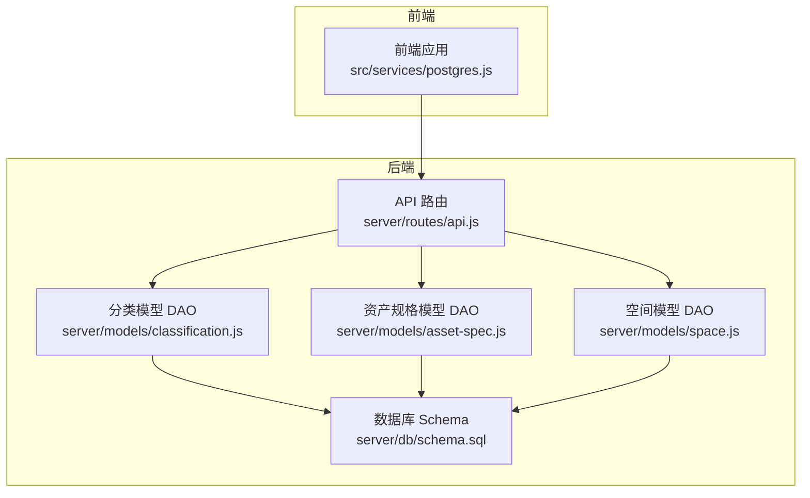
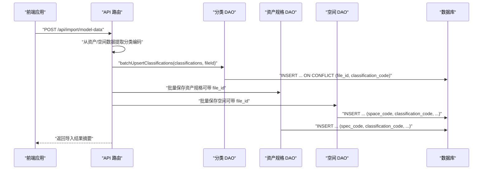
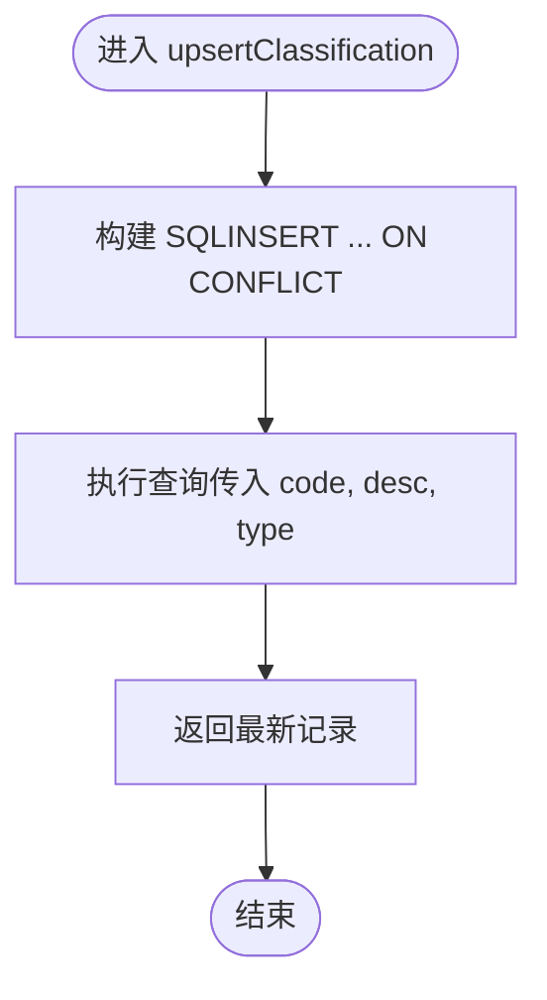
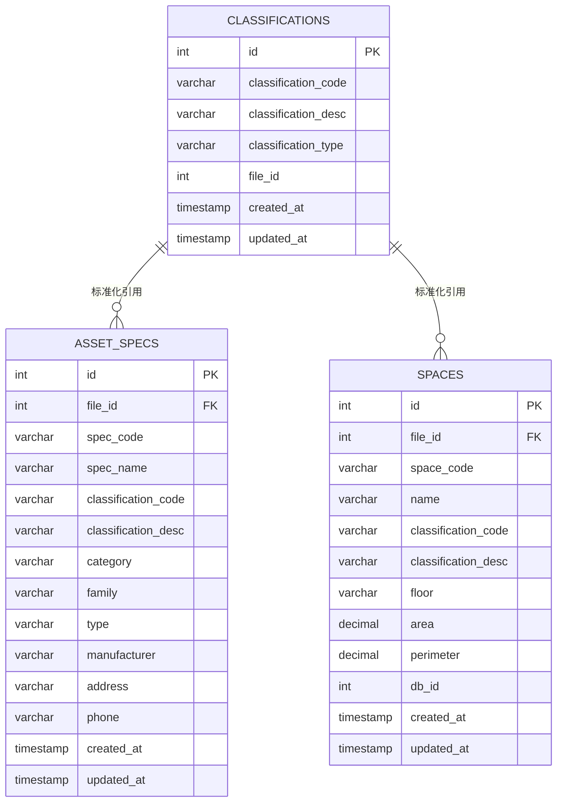
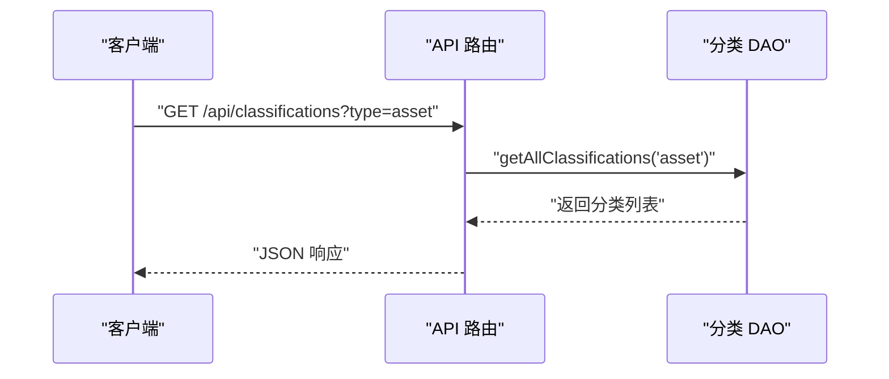
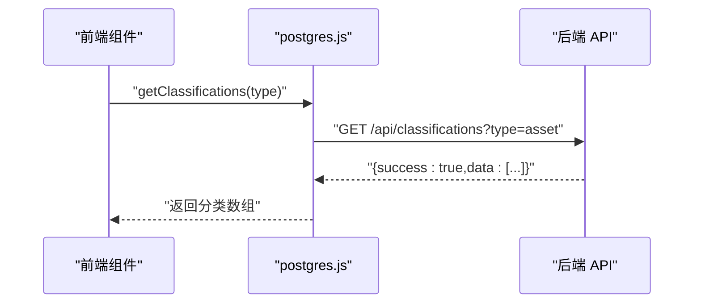
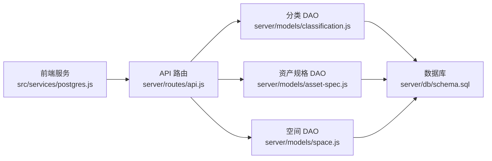

# 分类模型 (Classification)

<cite>
**本文引用的文件**
- [server/models/classification.js](file://server/models/classification.js)
- [server/db/schema.sql](file://server/db/schema.sql)
- [server/db/migrations/add-file-id.sql](file://server/db/migrations/add-file-id.sql)
- [server/models/asset-spec.js](file://server/models/asset-spec.js)
- [server/models/space.js](file://server/models/space.js)
- [server/routes/api.js](file://server/routes/api.js)
- [src/services/postgres.js](file://src/services/postgres.js)
</cite>

## 目录
1. [简介](#简介)
2. [项目结构](#项目结构)
3. [核心组件](#核心组件)
4. [架构总览](#架构总览)
5. [详细组件分析](#详细组件分析)
6. [依赖分析](#依赖分析)
7. [性能考虑](#性能考虑)
8. [故障排查指南](#故障排查指南)
9. [结论](#结论)
10. [附录](#附录)

## 简介
本文件围绕 OmniClass 分类体系的统一管理机制展开，系统性阐述分类模型（Classification）的设计与实现，重点包括：
- classification_code 作为主键的设计思路与约束策略
- classification_desc 描述字段的用途与来源
- classification_type 字段如何区分 'asset' 与 'space' 两类分类，实现资产与空间分类的统一存储
- 分类数据如何为 asset_specs 与 spaces 表提供标准化的分类编码引用
- 分类数据的查询与维护方法，以及在系统中作为“数据字典”的核心作用
- 分类信息检索的代码示例路径，以及在资产规格与空间实体中的引用方式

## 项目结构
分类模型位于后端服务层，通过数据访问对象（DAO）封装对数据库的操作，并由 API 路由暴露 REST 接口；前端通过服务层封装的 HTTP 客户端进行调用。

图表来源
- [server/routes/api.js](file://server/routes/api.js#L1-L120)
- [server/models/classification.js](file://server/models/classification.js#L1-L119)
- [server/models/asset-spec.js](file://server/models/asset-spec.js#L1-L166)
- [server/models/space.js](file://server/models/space.js#L1-L220)
- [server/db/schema.sql](file://server/db/schema.sql#L1-L160)

章节来源
- [server/routes/api.js](file://server/routes/api.js#L1-L120)
- [server/db/schema.sql](file://server/db/schema.sql#L1-L160)

## 核心组件
- 分类模型 DAO（classification.js）
  - 提供 upsert、批量 upsert、查询全部、按编码查询等能力
  - 支持带 file_id 的唯一约束与事务批量写入
- 数据库 Schema（schema.sql）
  - 定义 classifications、asset_specs、spaces 等表结构及索引
  - 通过唯一约束与索引保障分类编码的唯一性与查询效率
- API 路由（api.js）
  - 对外暴露分类编码的查询与批量导入接口
  - 在综合导入流程中自动抽取并保存分类编码
- 前端服务（postgres.js）
  - 封装分类编码获取与批量导入的 HTTP 调用

章节来源
- [server/models/classification.js](file://server/models/classification.js#L1-L119)
- [server/db/schema.sql](file://server/db/schema.sql#L1-L160)
- [server/routes/api.js](file://server/routes/api.js#L1-L120)
- [src/services/postgres.js](file://src/services/postgres.js#L1-L165)

## 架构总览
OmniClass 分类体系通过统一的分类编码表实现资产与空间的分类统一管理。导入流程中，系统从模型数据中提取 OmniClass 21 编号与描述（资产侧），以及空间分类编码与描述（空间侧），统一写入分类表，并在资产规格与空间表中以 classification_code 与 classification_desc 形成标准化引用。

图表来源
- [server/routes/api.js](file://server/routes/api.js#L297-L464)
- [server/models/classification.js](file://server/models/classification.js#L35-L81)
- [server/models/asset-spec.js](file://server/models/asset-spec.js#L107-L156)
- [server/models/space.js](file://server/models/space.js#L129-L168)

## 详细组件分析

### 分类模型 DAO（classification.js）
- 主键设计
  - classification_code 作为主键的一部分，结合 classification_type 或 file_id 实现唯一性
  - 在 schema 中定义了 (classification_code, classification_type) 唯一约束，确保同一分类类型下的编码唯一
  - 在迁移脚本中新增 file_id 并改为 (file_id, classification_code) 唯一约束，支持多文件隔离
- upsert 与批量 upsert
  - upsertClassification：按 (classification_code, classification_type) 冲突时更新描述与时间戳
  - batchUpsertClassifications：支持带 file_id 的批量写入，使用事务保证一致性
- 查询接口
  - getAllClassifications(type)：可按分类类型过滤
  - getClassificationByCode(code, type)：按编码与类型精确查询

图表来源
- [server/models/classification.js](file://server/models/classification.js#L13-L29)

章节来源
- [server/models/classification.js](file://server/models/classification.js#L1-L119)
- [server/db/migrations/add-file-id.sql](file://server/db/migrations/add-file-id.sql#L34-L39)

### 数据库 Schema（schema.sql）
- 表结构要点
  - classifications：存储分类编码、描述与类型；新增 file_id 支持按文件隔离
  - asset_specs：存储资产规格，包含 classification_code 与 classification_desc 的标准化引用
  - spaces：存储空间实体，包含 classification_code 与 classification_desc 的标准化引用
- 索引与触发器
  - 为 classification_code、classification_type、file_id 等关键列建立索引
  - 通过触发器自动更新 updated_at 时间戳

图表来源
- [server/db/schema.sql](file://server/db/schema.sql#L1-L160)

章节来源
- [server/db/schema.sql](file://server/db/schema.sql#L1-L160)

### API 路由（api.js）
- 分类编码接口
  - GET /api/classifications?type=asset|space：按类型过滤查询
  - POST /api/classifications/batch：批量导入分类编码
- 综合导入流程
  - 从资产提取 OmniClass 21 编号与描述，从空间提取空间分类编码与描述
  - 调用分类 DAO 批量写入分类编码，并在资产规格与空间表中写入标准化引用

图表来源
- [server/routes/api.js](file://server/routes/api.js#L18-L31)
- [server/models/classification.js](file://server/models/classification.js#L83-L99)

章节来源
- [server/routes/api.js](file://server/routes/api.js#L1-L120)

### 前端服务（postgres.js）
- 提供分类编码获取与批量导入的 HTTP 封装
- 通过环境变量 VITE_API_URL 指向后端 API

图表来源
- [src/services/postgres.js](file://src/services/postgres.js#L21-L38)
- [server/routes/api.js](file://server/routes/api.js#L18-L31)

章节来源
- [src/services/postgres.js](file://src/services/postgres.js#L1-L165)

## 依赖分析
- 组件耦合
  - 分类 DAO 仅依赖数据库访问层（query、getClient），保持低耦合
  - API 路由同时依赖多个 DAO，承担编排职责
  - 前端服务仅依赖 API 路由，解耦业务逻辑
- 外部依赖
  - PostgreSQL 数据库与索引、触发器
  - Express 路由框架

图表来源
- [src/services/postgres.js](file://src/services/postgres.js#L1-L165)
- [server/routes/api.js](file://server/routes/api.js#L1-L120)
- [server/models/classification.js](file://server/models/classification.js#L1-L119)
- [server/models/asset-spec.js](file://server/models/asset-spec.js#L1-L166)
- [server/models/space.js](file://server/models/space.js#L1-L220)
- [server/db/schema.sql](file://server/db/schema.sql#L1-L160)

章节来源
- [server/routes/api.js](file://server/routes/api.js#L1-L120)
- [server/models/classification.js](file://server/models/classification.js#L1-L119)
- [server/models/asset-spec.js](file://server/models/asset-spec.js#L1-L166)
- [server/models/space.js](file://server/models/space.js#L1-L220)
- [server/db/schema.sql](file://server/db/schema.sql#L1-L160)

## 性能考虑
- 唯一性与索引
  - classification_code 与 classification_type 的组合唯一约束，以及 file_id 的唯一约束，确保数据一致性
  - 为 classification_code、classification_type、file_id 等关键列建立索引，提升查询性能
- 事务与批量写入
  - 分类与资产规格、空间的批量写入均采用事务，保证原子性与一致性
- 触发器自动更新
  - 通过触发器自动更新 updated_at，减少重复逻辑

章节来源
- [server/db/schema.sql](file://server/db/schema.sql#L72-L133)
- [server/db/migrations/add-file-id.sql](file://server/db/migrations/add-file-id.sql#L34-L51)
- [server/models/classification.js](file://server/models/classification.js#L35-L81)
- [server/models/asset-spec.js](file://server/models/asset-spec.js#L107-L156)
- [server/models/space.js](file://server/models/space.js#L129-L168)

## 故障排查指南
- 导入失败或重复数据
  - 检查分类编码是否提供 classificationType（'asset' 或 'space'），否则 upsert 可能无法命中唯一约束
  - 若未提供 file_id，批量 upsert 会降级为直接插入，可能导致重复数据
- 查询不到分类
  - 确认查询时是否同时提供了 classification_code 与 classification_type
  - 检查分类类型过滤参数是否正确传递
- 更新失败
  - 确认更新字段是否在允许列表内（分类 DAO 不允许任意字段更新）

章节来源
- [server/models/classification.js](file://server/models/classification.js#L35-L81)
- [server/routes/api.js](file://server/routes/api.js#L18-L31)

## 结论
本分类模型通过统一的 classification_code、classification_desc 与 classification_type 设计，实现了资产与空间分类的标准化与一体化管理。配合 file_id 的引入，进一步支持多文件场景下的分类隔离。系统在导入流程中自动抽取并维护分类字典，为资产规格与空间实体提供稳定的分类编码引用，显著提升了数据一致性与查询效率。

## 附录

### 分类数据的查询与维护方法
- 查询全部分类（可按类型过滤）
  - 路径参考：[server/routes/api.js](file://server/routes/api.js#L18-L31)
  - 前端调用参考：[src/services/postgres.js](file://src/services/postgres.js#L21-L38)
- 按编码与类型查询分类
  - 路径参考：[server/models/classification.js](file://server/models/classification.js#L101-L111)
- 批量导入分类编码（支持 file_id）
  - 路径参考：[server/models/classification.js](file://server/models/classification.js#L35-L81)
  - 路径参考：[server/routes/api.js](file://server/routes/api.js#L32-L47)

### 在资产规格与空间实体中的引用方式
- 资产规格（asset_specs）
  - 引用字段：classification_code、classification_desc
  - 路径参考：[server/db/schema.sql](file://server/db/schema.sql#L19-L36)，[server/models/asset-spec.js](file://server/models/asset-spec.js#L1-L166)
- 空间（spaces）
  - 引用字段：classification_code、classification_desc
  - 路径参考：[server/db/schema.sql](file://server/db/schema.sql#L54-L70)，[server/models/space.js](file://server/models/space.js#L1-L220)