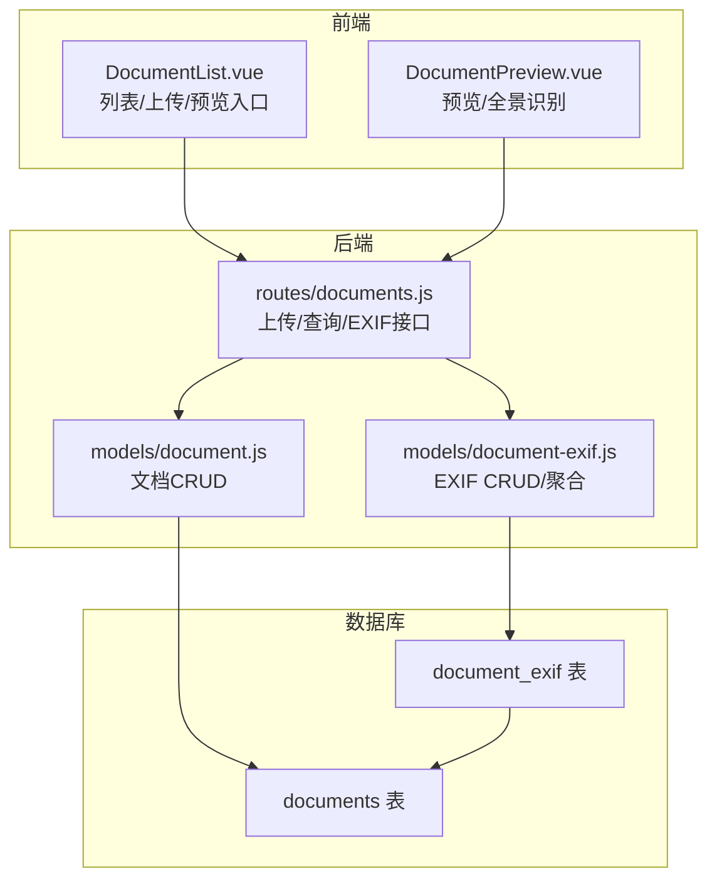
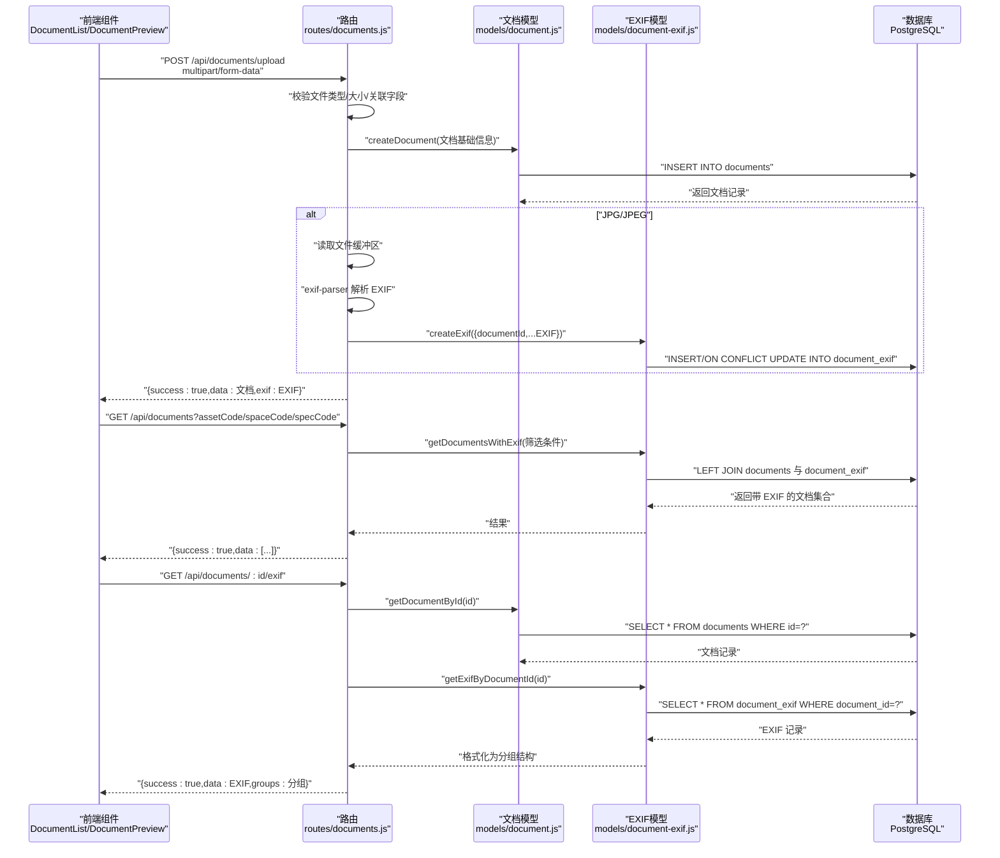
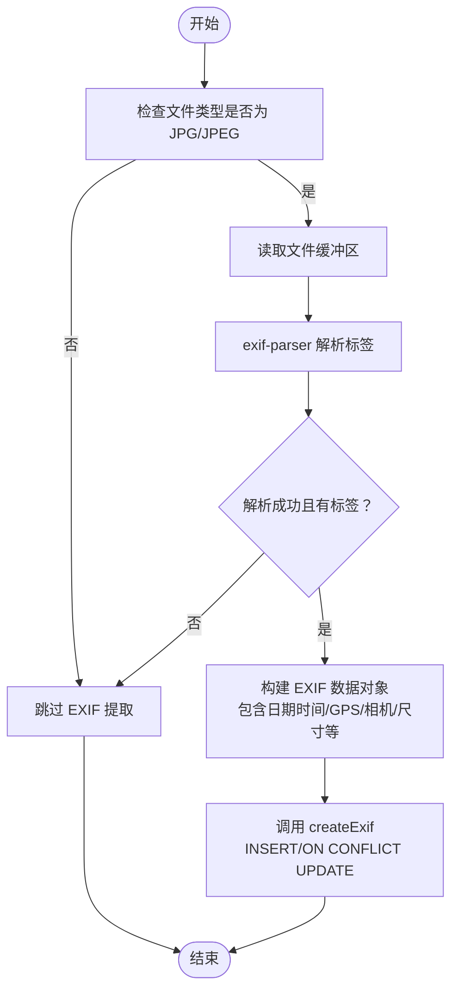
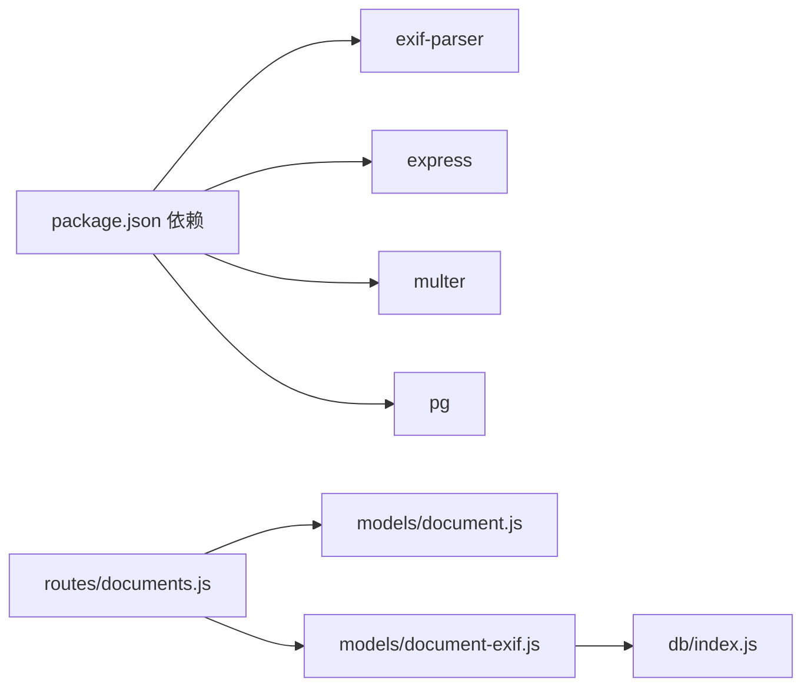

# 文档EXIF模型（Document EXIF）

<cite>
**本文引用的文件**
- [server/db/create_document_exif_table.sql](file://server/db/create_document_exif_table.sql)
- [server/db/create_documents_table.sql](file://server/db/create_documents_table.sql)
- [server/models/document-exif.js](file://server/models/document-exif.js)
- [server/models/document.js](file://server/models/document.js)
- [server/routes/documents.js](file://server/routes/documents.js)
- [package.json](file://package.json)
- [src/components/DocumentList.vue](file://src/components/DocumentList.vue)
- [src/components/DocumentPreview.vue](file://src/components/DocumentPreview.vue)
</cite>

## 目录
1. [简介](#简介)
2. [项目结构](#项目结构)
3. [核心组件](#核心组件)
4. [架构总览](#架构总览)
5. [详细组件分析](#详细组件分析)
6. [依赖分析](#依赖分析)
7. [性能考量](#性能考量)
8. [故障排查指南](#故障排查指南)
9. [结论](#结论)
10. [附录](#附录)

## 简介
本文件系统性阐述“文档EXIF模型”的设计与实现，重点说明：
- document_id 作为外键与 documents 表的关联关系；
- document_exif 表作为 documents 表的垂直扩展，承载图像文件的 EXIF 元数据；
- EXIF 字段来源与用途（拍摄时间、相机型号、光圈、曝光时间、ISO、焦距、GPS 经纬度与海拔）；
- 通过 exif-parser 工具从图像文件中提取元数据并持久化；
- 在文档管理中的典型应用场景（如现场照片的地理标记追溯）；
- 提供 EXIF 数据提取与查询的调用流程与代码片段路径，说明与主文档记录的关联查询方法。

## 项目结构
围绕 EXIF 模型的关键文件分布如下：
- 数据库层：创建 documents 与 document_exif 表及索引、注释
- 业务模型层：document-exif.js 与 document.js
- 接口路由层：documents.js（上传、查询、EXIF 获取）
- 前端组件：DocumentList.vue、DocumentPreview.vue（展示图像尺寸、全景识别等，间接体现 EXIF 字段的使用）
- 依赖声明：package.json 中引入 exif-parser

图表来源
- [server/db/create_documents_table.sql](file://server/db/create_documents_table.sql#L1-L49)
- [server/db/create_document_exif_table.sql](file://server/db/create_document_exif_table.sql#L1-L48)
- [server/routes/documents.js](file://server/routes/documents.js#L1-L386)
- [server/models/document.js](file://server/models/document.js#L1-L163)
- [server/models/document-exif.js](file://server/models/document-exif.js#L1-L169)
- [src/components/DocumentList.vue](file://src/components/DocumentList.vue#L1-L849)
- [src/components/DocumentPreview.vue](file://src/components/DocumentPreview.vue#L1-L676)

章节来源
- [server/db/create_documents_table.sql](file://server/db/create_documents_table.sql#L1-L49)
- [server/db/create_document_exif_table.sql](file://server/db/create_document_exif_table.sql#L1-L48)
- [server/routes/documents.js](file://server/routes/documents.js#L1-L386)
- [server/models/document.js](file://server/models/document.js#L1-L163)
- [server/models/document-exif.js](file://server/models/document-exif.js#L1-L169)
- [package.json](file://package.json#L1-L30)
- [src/components/DocumentList.vue](file://src/components/DocumentList.vue#L1-L849)
- [src/components/DocumentPreview.vue](file://src/components/DocumentPreview.vue#L1-L676)

## 核心组件
- 数据库表结构
  - documents：存储文档基础信息，含与资产/空间/规格的关联字段（三选一），并建立索引以优化查询。
  - document_exif：以 document_id 为外键，指向 documents.id，并通过唯一约束保证一对一扩展；包含文件组、相机组、GPS 组字段，以及时间戳字段。
- 后端模型
  - document-exif.js：封装 EXIF 的创建、按文档 ID 查询、删除、带 EXIF 的文档列表聚合查询，以及将数据库记录格式化为“文件/相机/GPS”三组结构。
  - document.js：封装文档的增删改查与统计。
- 路由接口
  - documents.js：负责文件上传、EXIF 提取与保存、按条件获取文档列表（含 EXIF）、按文档 ID 获取 EXIF、下载等。
- 前端组件
  - DocumentList.vue：触发上传、展示文档列表、预览入口；利用 image_width/image_height 判断全景图。
  - DocumentPreview.vue：根据文件类型与尺寸进行预览与交互，间接体现 EXIF 字段在前端的使用。

章节来源
- [server/db/create_documents_table.sql](file://server/db/create_documents_table.sql#L1-L49)
- [server/db/create_document_exif_table.sql](file://server/db/create_document_exif_table.sql#L1-L48)
- [server/models/document-exif.js](file://server/models/document-exif.js#L1-L169)
- [server/models/document.js](file://server/models/document.js#L1-L163)
- [server/routes/documents.js](file://server/routes/documents.js#L1-L386)
- [src/components/DocumentList.vue](file://src/components/DocumentList.vue#L1-L849)
- [src/components/DocumentPreview.vue](file://src/components/DocumentPreview.vue#L1-L676)

## 架构总览
下图展示从上传到查询 EXIF 的完整流程，以及与主文档记录的关联查询。

图表来源
- [server/routes/documents.js](file://server/routes/documents.js#L146-L215)
- [server/routes/documents.js](file://server/routes/documents.js#L217-L237)
- [server/routes/documents.js](file://server/routes/documents.js#L259-L292)
- [server/models/document.js](file://server/models/document.js#L55-L78)
- [server/models/document-exif.js](file://server/models/document-exif.js#L12-L69)
- [server/models/document-exif.js](file://server/models/document-exif.js#L71-L93)
- [server/models/document-exif.js](file://server/models/document-exif.js#L95-L128)

## 详细组件分析

### 数据库表结构与外键关系
- documents 表
  - 主键 id，以及标题、文件名、路径、大小、类型、MIME、资产/空间/规格三选一关联字段。
  - 约束 chk_single_relation 确保三者仅能填一项，避免重复关联。
  - 为 asset_code/space_code/spec_code、created_at 建立索引，提升查询效率。
- document_exif 表
  - 主键 id，外键 document_id 引用 documents(id)，ON DELETE CASCADE。
  - 唯一约束 UNIQUE(document_id) 保证每个文档仅有一条 EXIF 记录，实现对 documents 的垂直扩展。
  - 字段分组：
    - 文件组：拍摄时间、图像宽高
    - 相机组：相机型号、光圈、曝光时间、ISO、焦距
    - GPS 组：经度、纬度、海拔
  - 为 document_id、date_time 建立索引，便于按拍摄时间排序与检索。

章节来源
- [server/db/create_documents_table.sql](file://server/db/create_documents_table.sql#L1-L49)
- [server/db/create_document_exif_table.sql](file://server/db/create_document_exif_table.sql#L1-L48)

### EXIF 提取与持久化流程
- 上传接口
  - 仅对 JPG/JPEG 文件提取 EXIF；PNG/SVG/MP4 等不提取。
  - 使用 exif-parser 读取文件缓冲区并解析标签，提取日期时间、GPS、相机参数、图像尺寸等。
  - 成功解析后，调用 EXIF 模型的 createExif 方法，写入数据库；若已存在则更新。
- EXIF 查询
  - 单条查询：按文档 ID 查询 EXIF 记录。
  - 聚合查询：在 getDocumentsWithExif 中，通过 LEFT JOIN 将 documents 与 document_exif 关联，返回带 EXIF 的文档集合。
  - 格式化输出：formatExifGroups 将数据库记录按“文件/相机/GPS”三组组织，便于前端展示。

图表来源
- [server/routes/documents.js](file://server/routes/documents.js#L72-L139)
- [server/models/document-exif.js](file://server/models/document-exif.js#L12-L69)

章节来源
- [server/routes/documents.js](file://server/routes/documents.js#L146-L215)
- [server/routes/documents.js](file://server/routes/documents.js#L217-L237)
- [server/routes/documents.js](file://server/routes/documents.js#L259-L292)
- [server/models/document-exif.js](file://server/models/document-exif.js#L12-L69)
- [server/models/document-exif.js](file://server/models/document-exif.js#L95-L128)
- [server/models/document-exif.js](file://server/models/document-exif.js#L130-L165)

### 前端展示与 EXIF 字段使用
- DocumentList.vue
  - 列表项图标根据文件类型区分；当文件类型为图片且 image_width/image_height 存在时，通过宽高比粗略判断是否为全景图（约 2:1），用于 UI 展示。
  - 上传队列与进度条、下载、删除等操作均通过后端接口完成。
- DocumentPreview.vue
  - 根据文件类型渲染 PDF、图片、视频或全景图；全景图通过第三方库初始化；下载按钮直接调用后端下载接口。

章节来源
- [src/components/DocumentList.vue](file://src/components/DocumentList.vue#L180-L210)
- [src/components/DocumentList.vue](file://src/components/DocumentList.vue#L262-L283)
- [src/components/DocumentPreview.vue](file://src/components/DocumentPreview.vue#L163-L181)

### EXIF 字段来源与用途
- 文件组
  - 拍摄时间：来源于 EXIF 标签 DateTimeOriginal 或 CreateDate（单位为秒，需转换为毫秒时间戳）。
  - 图像宽高：来源于解析结果的 imageSize 或 ImageWidth/ImageHeight/ExifImageWidth/ExifImageHeight。
- 相机组
  - 相机型号：Model 或 Make。
  - 光圈值：FNumber；曝光时间：ExposureTime，内部转换为分数形式（如 1/125s）。
  - ISO：ISO；焦距：FocalLength。
- GPS 组
  - 经度/纬度：GPSLongitude/GPSLatitude；海拔：GPSAltitude。

章节来源
- [server/routes/documents.js](file://server/routes/documents.js#L72-L139)

## 依赖分析
- 外部依赖
  - exif-parser：用于从图像文件中提取 EXIF 元数据。
  - express、multer：提供上传接口与文件处理能力。
  - pg：PostgreSQL 客户端，用于数据库访问。
- 内部模块依赖
  - routes/documents.js 依赖 models/document.js 与 models/document-exif.js。
  - models/document-exif.js 依赖 db/index.js（数据库连接）。
  - 前端组件通过 API_BASE 调用后端接口。

图表来源
- [package.json](file://package.json#L1-L30)
- [server/routes/documents.js](file://server/routes/documents.js#L1-L30)
- [server/models/document-exif.js](file://server/models/document-exif.js#L1-L10)

章节来源
- [package.json](file://package.json#L1-L30)
- [server/routes/documents.js](file://server/routes/documents.js#L1-L30)
- [server/models/document-exif.js](file://server/models/document-exif.js#L1-L10)

## 性能考量
- 索引策略
  - documents 表对 asset_code/space_code/spec_code、created_at 建立索引，有利于按关联对象与时间排序的查询。
  - document_exif 表对 document_id、date_time 建立索引，有利于按文档关联与拍摄时间检索。
- 查询优化
  - getDocumentsWithExif 使用 LEFT JOIN，避免遗漏无 EXIF 的文档；建议在高频筛选场景下结合应用层缓存。
- IO 与解析
  - EXIF 解析仅针对 JPG/JPEG，避免对其他格式的无效解析。
  - 上传文件大小限制为 200MB，防止大文件占用过多内存与磁盘。

章节来源
- [server/db/create_documents_table.sql](file://server/db/create_documents_table.sql#L32-L37)
- [server/db/create_document_exif_table.sql](file://server/db/create_document_exif_table.sql#L31-L34)
- [server/routes/documents.js](file://server/routes/documents.js#L58-L64)
- [server/routes/documents.js](file://server/routes/documents.js#L146-L215)

## 故障排查指南
- 上传失败
  - 检查文件类型是否在允许列表内；确认关联字段（assetCode/spaceCode/specCode）至少填写一项。
  - 查看后端日志中“文档上传失败”与“删除文件失败”的错误信息。
- EXIF 为空
  - 确认上传的是 JPG/JPEG；部分设备生成的 EXIF 可能缺失关键字段（如 GPS）。
  - 若解析异常，后端会记录“提取 EXIF 信息失败”，可检查文件完整性与 exif-parser 版本。
- 查询不到 EXIF
  - 确认文档确实存在；检查 document_exif 是否已为该文档插入记录。
  - 使用 getDocumentsWithExif 接口验证是否返回了 EXIF 字段；若无，可能是解析阶段未成功或未写入数据库。

章节来源
- [server/routes/documents.js](file://server/routes/documents.js#L146-L215)
- [server/routes/documents.js](file://server/routes/documents.js#L259-L292)
- [server/models/document-exif.js](file://server/models/document-exif.js#L71-L93)

## 结论
- document_exif 通过 document_id 与 documents 形成一对一的垂直扩展，有效承载图像 EXIF 元数据，避免在主表中冗余存储。
- 通过 exif-parser 实现对 JPG/JPEG 的 EXIF 提取，并在上传流程中自动持久化，简化了前端展示与检索逻辑。
- 前端组件利用 image_width/image_height 粗略识别全景图，体现了 EXIF 字段在 UI 上的应用价值。
- 在文档管理中，EXIF 的拍摄时间、相机参数与 GPS 信息可用于现场照片的溯源与质量评估，提升工程文档的可信度与可追溯性。

## 附录

### EXIF 字段与用途对照
- 文件组
  - 拍摄时间：用于排序与时间轴展示
  - 图像宽高：用于预览适配与全景识别
- 相机组
  - 相机型号：辅助识别拍摄设备
  - 光圈/曝光时间/ISO/焦距：辅助判断拍摄环境与技术参数
- GPS 组
  - 经度/纬度/海拔：用于地理标记与定位追溯

章节来源
- [server/db/create_document_exif_table.sql](file://server/db/create_document_exif_table.sql#L8-L29)
- [server/routes/documents.js](file://server/routes/documents.js#L72-L139)

### 代码示例路径（不含具体代码内容）
- 上传并提取 EXIF
  - 路由入口：[server/routes/documents.js](file://server/routes/documents.js#L146-L215)
  - EXIF 解析与保存：[server/routes/documents.js](file://server/routes/documents.js#L72-L139)
  - EXIF 写入数据库：[server/models/document-exif.js](file://server/models/document-exif.js#L12-L69)
- 查询文档列表（含 EXIF）
  - 聚合查询：[server/models/document-exif.js](file://server/models/document-exif.js#L95-L128)
  - 接口实现：[server/routes/documents.js](file://server/routes/documents.js#L217-L237)
- 查询单条 EXIF
  - 单条查询：[server/models/document-exif.js](file://server/models/document-exif.js#L71-L93)
  - 接口实现：[server/routes/documents.js](file://server/routes/documents.js#L259-L292)
- EXIF 格式化输出
  - 分组格式化：[server/models/document-exif.js](file://server/models/document-exif.js#L130-L165)