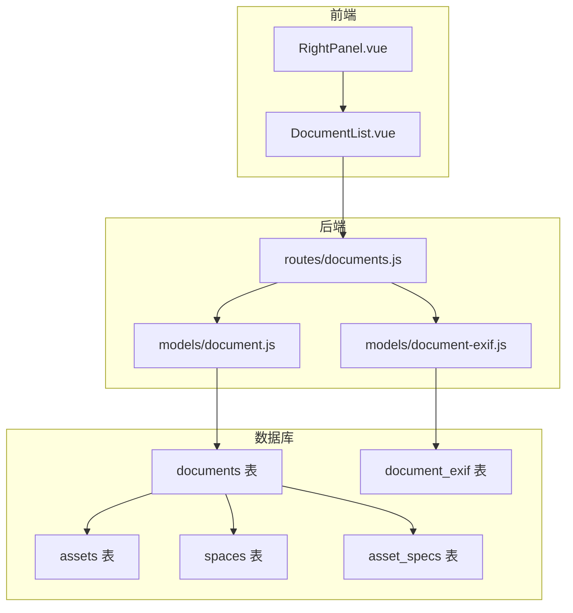
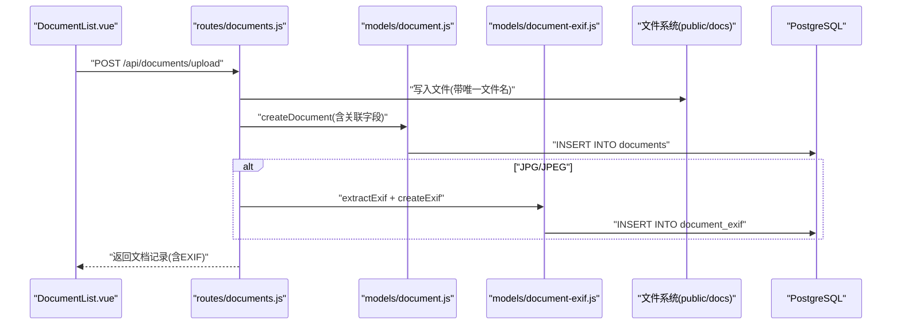
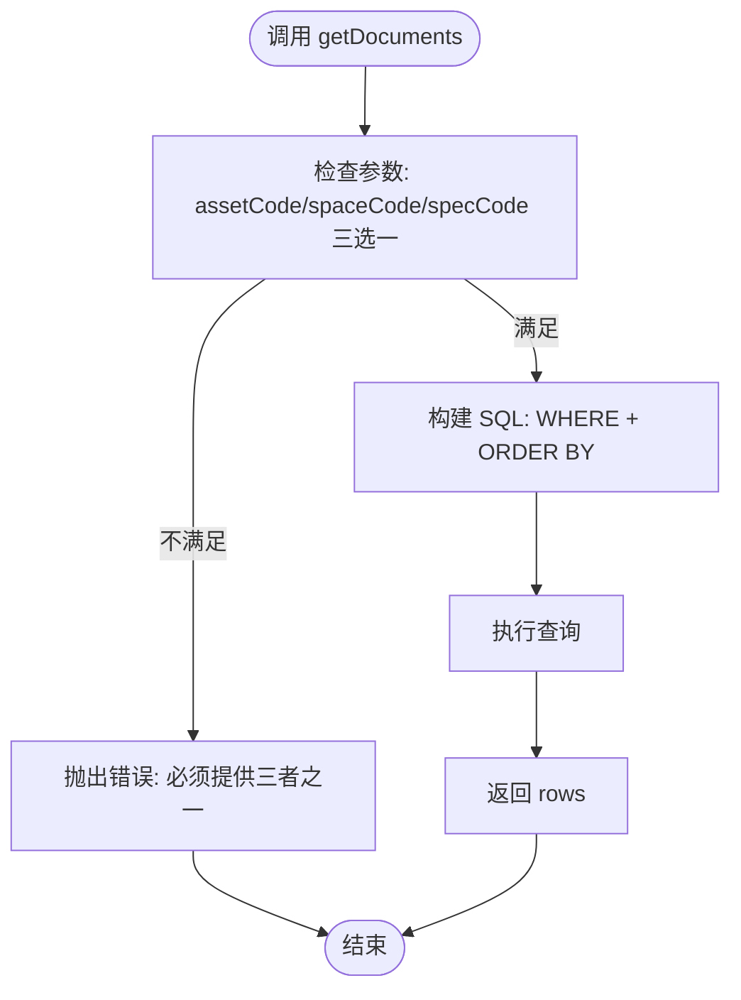
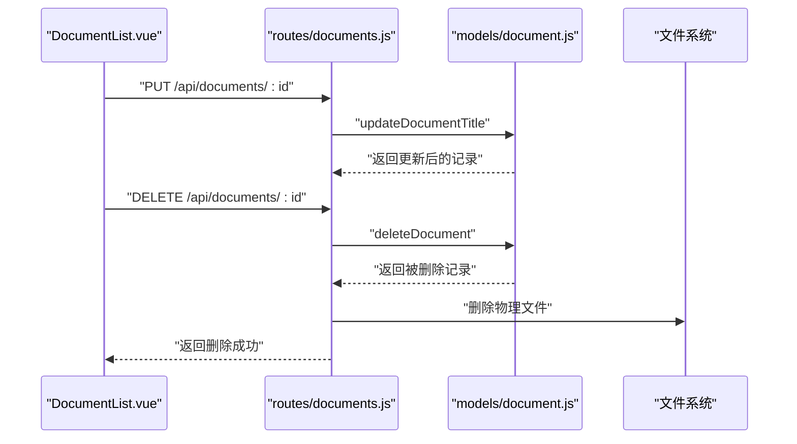
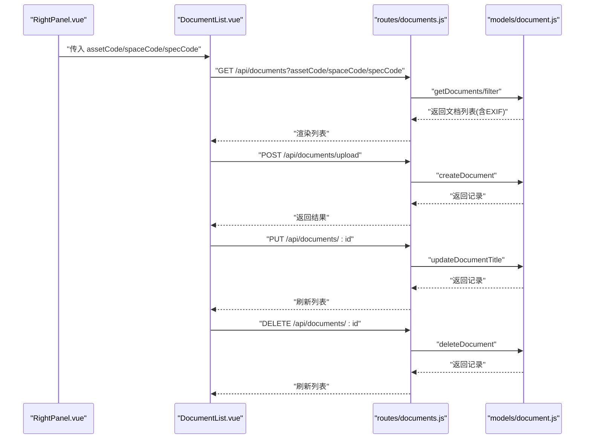

# 文档模型 (Document)

<cite>
**本文引用的文件**
- [server/models/document.js](file://server/models/document.js)
- [server/db/create_documents_table.sql](file://server/db/create_documents_table.sql)
- [server/routes/documents.js](file://server/routes/documents.js)
- [server/models/document-exif.js](file://server/models/document-exif.js)
- [server/db/create_document_exif_table.sql](file://server/db/create_document_exif_table.sql)
- [DOCUMENT_MANAGEMENT_PLAN.md](file://DOCUMENT_MANAGEMENT_PLAN.md)
- [src/components/DocumentList.vue](file://src/components/DocumentList.vue)
- [src/components/RightPanel.vue](file://src/components/RightPanel.vue)
- [server/db/schema.sql](file://server/db/schema.sql)
</cite>

## 目录
1. [简介](#简介)
2. [项目结构](#项目结构)
3. [核心组件](#核心组件)
4. [架构总览](#架构总览)
5. [详细组件分析](#详细组件分析)
6. [依赖分析](#依赖分析)
7. [性能考虑](#性能考虑)
8. [故障排查指南](#故障排查指南)
9. [结论](#结论)
10. [附录](#附录)

## 简介
本文件系统性地解析文档模型（Document）与 documents 表的三元关联设计，围绕以下关键点展开：
- 文件元数据字段（title、file_name、file_path）与技术属性（file_size、file_type、mime_type）的语义与用途
- asset_code、space_code、spec_code 三者互斥的 CHECK 约束及各自关联对象的级联删除行为
- getDocuments、createDocument 等核心方法如何按不同关联对象进行检索与创建
- updateDocumentTitle、deleteDocument 的业务逻辑
- 结合 DOCUMENT_MANAGEMENT_PLAN.md 解释文档与资产、空间、规格的关联机制
- 提供文档全生命周期管理的代码示例（上传、查询、重命名、删除）

## 项目结构
文档模型涉及后端数据访问层、路由层、EXIF 元数据模型，以及前端集成组件。核心文件如下：
- 数据访问层：server/models/document.js
- 数据库表定义：server/db/create_documents_table.sql
- 路由与上传流程：server/routes/documents.js
- EXIF 元数据模型：server/models/document-exif.js
- EXIF 表定义：server/db/create_document_exif_table.sql
- 前端文档列表组件：src/components/DocumentList.vue
- 右侧面板集成：src/components/RightPanel.vue
- 相关实体表（资产、空间、规格）：server/db/schema.sql
- 文档管理计划：DOCUMENT_MANAGEMENT_PLAN.md

图表来源
- [server/routes/documents.js](file://server/routes/documents.js#L146-L215)
- [server/models/document.js](file://server/models/document.js#L12-L35)
- [server/models/document-exif.js](file://server/models/document-exif.js#L99-L128)
- [server/db/create_documents_table.sql](file://server/db/create_documents_table.sql#L4-L30)
- [server/db/create_document_exif_table.sql](file://server/db/create_document_exif_table.sql#L4-L29)
- [server/db/schema.sql](file://server/db/schema.sql#L38-L70)
- [src/components/RightPanel.vue](file://src/components/RightPanel.vue#L67-L103)
- [src/components/DocumentList.vue](file://src/components/DocumentList.vue#L262-L283)

章节来源
- [server/models/document.js](file://server/models/document.js#L12-L35)
- [server/db/create_documents_table.sql](file://server/db/create_documents_table.sql#L4-L30)
- [server/routes/documents.js](file://server/routes/documents.js#L146-L215)
- [server/models/document-exif.js](file://server/models/document-exif.js#L99-L128)
- [server/db/create_document_exif_table.sql](file://server/db/create_document_exif_table.sql#L4-L29)
- [src/components/DocumentList.vue](file://src/components/DocumentList.vue#L262-L283)
- [src/components/RightPanel.vue](file://src/components/RightPanel.vue#L67-L103)
- [server/db/schema.sql](file://server/db/schema.sql#L38-L70)
- [DOCUMENT_MANAGEMENT_PLAN.md](file://DOCUMENT_MANAGEMENT_PLAN.md#L12-L49)

## 核心组件
- 文档数据访问层（getDocuments、createDocument、updateDocumentTitle、deleteDocument、getDocumentById、getDocumentStats）
- 文档路由（上传、查询、下载、删除、EXIF 查询）
- EXIF 元数据模型（创建、查询、删除、聚合查询、分组格式化）
- 前端文档列表组件（上传、预览、重命名、删除、下载）
- 右侧面板集成（根据当前选中对象传递关联参数）

章节来源
- [server/models/document.js](file://server/models/document.js#L12-L162)
- [server/routes/documents.js](file://server/routes/documents.js#L146-L383)
- [server/models/document-exif.js](file://server/models/document-exif.js#L1-L169)
- [src/components/DocumentList.vue](file://src/components/DocumentList.vue#L262-L531)
- [src/components/RightPanel.vue](file://src/components/RightPanel.vue#L67-L103)

## 架构总览
文档模型采用“三元关联 + 应用层一致性保障”的设计：
- 三元关联字段：asset_code、space_code、spec_code
- 互斥约束：CHECK 约束确保三者只能有一个非空
- 级联删除：应用层通过路由删除文档时，同时删除物理文件；EXIF 表通过 ON DELETE CASCADE 自动清理
- 文件元数据：title、file_name、file_path、file_size、file_type、mime_type
- 前端通过 RightPanel.vue 传递 assetCode/spaceCode/specCode，DocumentList.vue 发起上传与查询

图表来源
- [server/routes/documents.js](file://server/routes/documents.js#L146-L215)
- [server/models/document.js](file://server/models/document.js#L55-L78)
- [server/models/document-exif.js](file://server/models/document-exif.js#L12-L69)
- [server/db/create_document_exif_table.sql](file://server/db/create_document_exif_table.sql#L4-L29)

## 详细组件分析

### 数据模型与字段语义
- 文件元数据
  - title：文档标题（可编辑）
  - file_name：原始文件名
  - file_path：服务器存储路径（相对 public/docs）
- 技术属性
  - file_size：文件大小（字节）
  - file_type：文件扩展名（如 pdf、jpg、png、mp4、svg）
  - mime_type：MIME 类型（如 application/pdf、image/jpeg、video/mp4）
- 三元关联字段
  - asset_code：关联资产编码
  - space_code：关联空间编码
  - spec_code：关联规格编码
- 约束与索引
  - CHECK 约束：三者互斥
  - 索引：对三类关联字段分别建立索引，提升查询性能

章节来源
- [server/db/create_documents_table.sql](file://server/db/create_documents_table.sql#L4-L30)
- [server/db/create_documents_table.sql](file://server/db/create_documents_table.sql#L33-L36)
- [server/db/create_documents_table.sql](file://server/db/create_documents_table.sql#L39-L49)
- [DOCUMENT_MANAGEMENT_PLAN.md](file://DOCUMENT_MANAGEMENT_PLAN.md#L12-L49)

### 三元关联设计与级联删除
- 互斥性
  - 应用层通过 CHECK 约束确保仅能设置 asset_code、space_code、spec_code 之一
- 级联删除
  - 文档删除：后端路由在删除数据库记录后，尝试删除物理文件
  - EXIF 删除：document_exif 表对 documents(id) 使用 ON DELETE CASCADE，自动清理 EXIF 记录
- 实体表
  - assets、spaces、asset_specs 分别提供关联对象的主键（mc_code、space_code、spec_code）

章节来源
- [server/db/create_documents_table.sql](file://server/db/create_documents_table.sql#L24-L30)
- [server/db/create_document_exif_table.sql](file://server/db/create_document_exif_table.sql#L4-L7)
- [server/db/schema.sql](file://server/db/schema.sql#L38-L70)
- [server/routes/documents.js](file://server/routes/documents.js#L321-L353)

### 核心方法：检索与创建
- getDocuments(params)
  - 接收 { assetCode, spaceCode, specCode } 之一
  - 生成对应 WHERE 条件，按 created_at 降序返回
- createDocument(doc)
  - 插入 title、file_name、file_path、file_size、file_type、mime_type、asset_code、space_code、spec_code
  - 返回新插入的文档记录
- getDocumentById(id)
  - 按 id 查询单条记录
- getDocumentStats(params)
  - 统计总数、总大小、文件类型数，同样要求三选一

图表来源
- [server/models/document.js](file://server/models/document.js#L12-L35)
- [server/models/document.js](file://server/models/document.js#L112-L144)

章节来源
- [server/models/document.js](file://server/models/document.js#L12-L35)
- [server/models/document.js](file://server/models/document.js#L55-L78)
- [server/models/document.js](file://server/models/document.js#L112-L144)

### 核心方法：更新标题与删除
- updateDocumentTitle(id, title)
  - 更新 title 并设置 updated_at
  - 返回更新后的记录
- deleteDocument(id)
  - 删除数据库记录并返回被删除记录
  - 路由层额外删除物理文件（若存在）

图表来源
- [server/routes/documents.js](file://server/routes/documents.js#L294-L353)
- [server/models/document.js](file://server/models/document.js#L80-L110)

章节来源
- [server/models/document.js](file://server/models/document.js#L80-L110)
- [server/routes/documents.js](file://server/routes/documents.js#L294-L353)

### EXIF 元数据模型
- createExif(exifData)
  - 插入或更新 document_exif 记录（ON CONFLICT DO UPDATE）
- getExifByDocumentId(documentId)
  - 查询单条 EXIF 记录
- deleteExifByDocumentId(documentId)
  - 删除 EXIF 记录（通常随文档删除自动完成）
- getDocumentsWithExif(filter)
  - 左连接 documents 与 document_exif，返回带 EXIF 的文档列表
- formatExifGroups(exif)
  - 将原始 EXIF 数据按文件、照相机、GPS 分组展示

章节来源
- [server/models/document-exif.js](file://server/models/document-exif.js#L1-L169)
- [server/db/create_document_exif_table.sql](file://server/db/create_document_exif_table.sql#L4-L29)

### 前端集成与工作流
- RightPanel.vue
  - 在 ELEMENT 标签下展示“关系”区域，在 TYPE 标签下展示“设计属性”区域
  - 根据当前选中对象向 DocumentList 传递 assetCode/spaceCode/specCode
- DocumentList.vue
  - 上传：multipart/form-data，支持多文件，自动过滤超限文件
  - 查询：GET /api/documents?assetCode/spaceCode/specCode
  - 预览：双击标题进入预览
  - 重命名：PUT /api/documents/:id
  - 删除：DELETE /api/documents/:id
  - 下载：GET /api/documents/:id/download

图表来源
- [src/components/RightPanel.vue](file://src/components/RightPanel.vue#L67-L103)
- [src/components/DocumentList.vue](file://src/components/DocumentList.vue#L262-L531)
- [server/routes/documents.js](file://server/routes/documents.js#L146-L383)
- [server/models/document.js](file://server/models/document.js#L12-L35)

章节来源
- [src/components/RightPanel.vue](file://src/components/RightPanel.vue#L67-L103)
- [src/components/DocumentList.vue](file://src/components/DocumentList.vue#L262-L531)
- [server/routes/documents.js](file://server/routes/documents.js#L146-L383)
- [server/models/document.js](file://server/models/document.js#L12-L35)

## 依赖分析
- 模块耦合
  - routes/documents.js 依赖 models/document.js 与 models/document-exif.js
  - models/document.js 依赖数据库查询封装（query）
  - models/document-exif.js 依赖数据库查询封装（db.query）
- 外部依赖
  - multer：文件上传与过滤
  - exif-parser：JPG/JPEG EXIF 提取
  - fs/promises：文件系统操作
- 约束与外键
  - DOCUMENT_MANAGEMENT_PLAN.md 中曾规划外键约束与级联删除
  - 当前 create_documents_table.sql 未显式声明外键约束，而是通过应用层保证一致性，并保留 CHECK 互斥约束
  - EXIF 表对 documents(id) 使用 ON DELETE CASCADE

章节来源
- [server/routes/documents.js](file://server/routes/documents.js#L1-L65)
- [server/models/document.js](file://server/models/document.js#L1-L10)
- [server/models/document-exif.js](file://server/models/document-exif.js#L1-L10)
- [DOCUMENT_MANAGEMENT_PLAN.md](file://DOCUMENT_MANAGEMENT_PLAN.md#L12-L49)
- [server/db/create_documents_table.sql](file://server/db/create_documents_table.sql#L18-L20)
- [server/db/create_document_exif_table.sql](file://server/db/create_document_exif_table.sql#L4-L7)

## 性能考虑
- 索引策略
  - 对三类关联字段分别建立索引，提升按资产/空间/规格维度的查询性能
- 查询优化
  - getDocuments 与 getDocumentStats 均按三选一条件构造 WHERE，避免全表扫描
- EXIF 聚合
  - getDocumentsWithExif 使用 LEFT JOIN，注意在大表场景下控制返回数量或分页
- 文件存储
  - 上传文件名采用时间戳+随机串，避免冲突；建议对 public/docs 建立独立挂载点以提升 IO 性能

章节来源
- [server/db/create_documents_table.sql](file://server/db/create_documents_table.sql#L33-L36)
- [server/models/document-exif.js](file://server/models/document-exif.js#L99-L128)

## 故障排查指南
- 上传失败
  - 检查文件类型与扩展名是否受支持（PDF、JPG/JPEG、PNG、SVG、MP4）
  - 检查文件大小是否超过限制（200MB）
  - 检查路由层是否正确接收 assetCode/spaceCode/specCode 三选一
- 查询无结果
  - 确认传入的关联参数与实际数据一致
  - 确认索引是否存在且生效
- 删除异常
  - 若物理文件不存在，路由层会记录错误但不会影响数据库删除
  - 确认 EXIF 记录是否随文档删除自动清理（ON DELETE CASCADE）
- EXIF 提取失败
  - 仅对 JPG/JPEG 有效；其他格式不会提取 EXIF
  - 检查文件读取权限与 buffer 解析

章节来源
- [server/routes/documents.js](file://server/routes/documents.js#L38-L65)
- [server/routes/documents.js](file://server/routes/documents.js#L146-L215)
- [server/routes/documents.js](file://server/routes/documents.js#L217-L292)
- [server/models/document-exif.js](file://server/models/document-exif.js#L71-L93)

## 结论
文档模型通过三元关联设计实现了与资产、空间、规格的灵活绑定，并以 CHECK 约束确保数据一致性。应用层负责外键一致性与级联删除，EXIF 表通过 ON DELETE CASCADE 自动清理，形成完整的文档生命周期管理闭环。前后端协作清晰，路由层承担上传、查询、下载、删除等核心职责，数据访问层提供简洁的 CRUD 方法，前端组件负责用户交互与参数传递。

## 附录

### 字段与用途对照
- title：文档标题（可编辑）
- file_name：原始文件名
- file_path：服务器存储路径（相对 public/docs）
- file_size：文件大小（字节）
- file_type：文件扩展名（如 pdf、jpg、png、mp4、svg）
- mime_type：MIME 类型（如 application/pdf、image/jpeg、video/mp4）
- asset_code：关联资产编码
- space_code：关联空间编码
- spec_code：关联规格编码

章节来源
- [server/db/create_documents_table.sql](file://server/db/create_documents_table.sql#L39-L49)
- [server/db/create_document_exif_table.sql](file://server/db/create_document_exif_table.sql#L36-L48)

### 全生命周期管理示例（路径引用）
- 上传文档
  - 路由：POST /api/documents/upload
  - 参数：multipart/form-data（file）、assetCode/spaceCode/specCode、title（可选）
  - 参考路径：[server/routes/documents.js](file://server/routes/documents.js#L146-L215)
- 查询文档列表
  - 路由：GET /api/documents?assetCode=xxx 或 ?spaceCode=xxx 或 ?specCode=xxx
  - 参考路径：[server/routes/documents.js](file://server/routes/documents.js#L217-L237)
- 获取文档详情
  - 路由：GET /api/documents/:id
  - 参考路径：[server/routes/documents.js](file://server/routes/documents.js#L239-L257)
- 获取 EXIF 信息
  - 路由：GET /api/documents/:id/exif
  - 参考路径：[server/routes/documents.js](file://server/routes/documents.js#L259-L292)
- 更新文档标题
  - 路由：PUT /api/documents/:id
  - 参数：{ title }
  - 参考路径：[server/routes/documents.js](file://server/routes/documents.js#L294-L320)
- 删除文档
  - 路由：DELETE /api/documents/:id
  - 参考路径：[server/routes/documents.js](file://server/routes/documents.js#L321-L353)
- 下载文档
  - 路由：GET /api/documents/:id/download
  - 参考路径：[server/routes/documents.js](file://server/routes/documents.js#L355-L383)