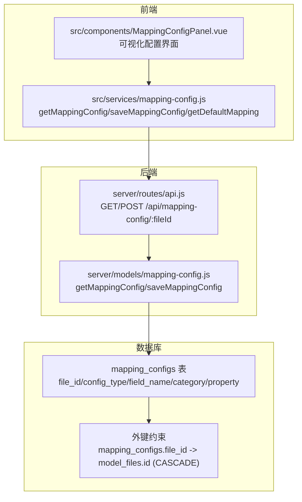
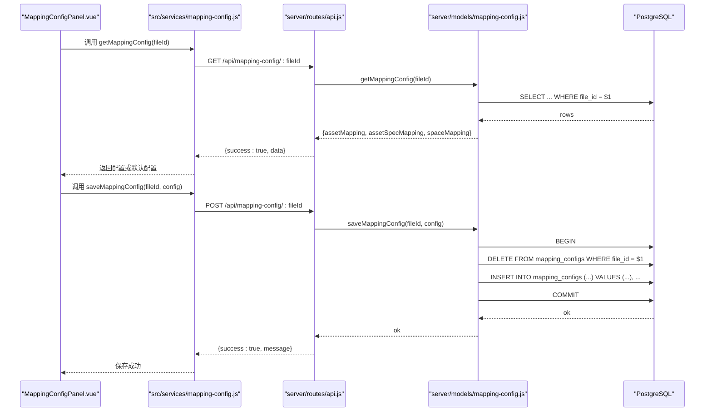
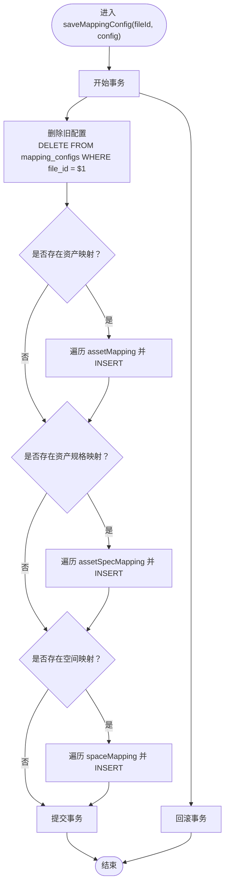
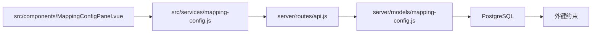

# 映射配置模型 (Mapping Config)

<cite>
**本文引用的文件**
- [server/models/mapping-config.js](file://server/models/mapping-config.js)
- [src/services/mapping-config.js](file://src/services/mapping-config.js)
- [server/routes/api.js](file://server/routes/api.js)
- [MAPPING_CONFIG_COMPLETE.md](file://MAPPING_CONFIG_COMPLETE.md)
- [MAPPING_UI_COMPLETE.md](file://MAPPING_UI_COMPLETE.md)
- [server/db/migrations/create_mapping_config.sql](file://server/db/migrations/create_mapping_config.sql)
- [server/db/migrations/add_mapping_config_fk.sql](file://server/db/migrations/add_mapping_config_fk.sql)
- [server/db/schema.sql](file://server/db/schema.sql)
- [src/components/MappingConfigPanel.vue](file://src/components/MappingConfigPanel.vue)
- [server/models/model-file.js](file://server/models/model-file.js)
</cite>

## 目录
1. [简介](#简介)
2. [项目结构](#项目结构)
3. [核心组件](#核心组件)
4. [架构总览](#架构总览)
5. [详细组件分析](#详细组件分析)
6. [依赖分析](#依赖分析)
7. [性能考虑](#性能考虑)
8. [故障排查指南](#故障排查指南)
9. [结论](#结论)
10. [附录](#附录)

## 简介
本文件围绕“映射配置模型”进行系统化文档化，重点阐述：
- file_id 作为外键与模型文件的关联机制
- config_json 字段在当前实现中通过多列（config_type、field_name、category、property）表达映射规则
- 基于 MAPPING_UI_COMPLETE.md 的资产映射、规格映射、空间映射示例，解释 JSON 结构如何定义 BIM 模型原始属性到系统字段的映射关系
- 模型提供的 upsertMappingConfig、getMappingConfigByFileId 等方法的实现与使用方式
- 该模型在数据导入流程中的关键作用，支持不同 BIM 模型间字段命名差异的灵活适配
- 提供映射配置管理的完整代码示例路径

## 项目结构
映射配置模型横跨前端服务层、后端路由层与数据库层，形成完整的读写闭环：
- 前端服务层负责调用后端 API 并提供默认映射配置
- 后端路由层提供 RESTful 接口，封装数据访问
- 数据库层通过 mapping_configs 表存储每文件的映射规则，并通过外键与 model_files 关联

图表来源
- [src/services/mapping-config.js](file://src/services/mapping-config.js#L1-L102)
- [server/routes/api.js](file://server/routes/api.js#L470-L517)
- [server/models/mapping-config.js](file://server/models/mapping-config.js#L1-L115)
- [server/db/migrations/create_mapping_config.sql](file://server/db/migrations/create_mapping_config.sql#L1-L29)
- [server/db/migrations/add_mapping_config_fk.sql](file://server/db/migrations/add_mapping_config_fk.sql#L1-L26)

章节来源
- [MAPPING_CONFIG_COMPLETE.md](file://MAPPING_CONFIG_COMPLETE.md#L1-L120)
- [server/db/migrations/create_mapping_config.sql](file://server/db/migrations/create_mapping_config.sql#L1-L29)
- [server/db/migrations/add_mapping_config_fk.sql](file://server/db/migrations/add_mapping_config_fk.sql#L1-L26)

## 核心组件
- 前端 API 服务：提供 getMappingConfig、saveMappingConfig、getDefaultMapping，负责与后端交互及错误降级
- 后端路由：暴露 GET/POST /api/mapping-config/:fileId，校验参数并调用数据模型
- 数据模型：封装数据库读写，实现按 file_id 查询与批量 upsert
- 数据库表：mapping_configs，包含 file_id、config_type、field_name、category、property 等列
- 外键约束：mapping_configs.file_id 引用 model_files.id，启用级联删除
- UI 组件：MappingConfigPanel.vue 提供三类映射的可视化配置界面

章节来源
- [src/services/mapping-config.js](file://src/services/mapping-config.js#L1-L102)
- [server/routes/api.js](file://server/routes/api.js#L470-L517)
- [server/models/mapping-config.js](file://server/models/mapping-config.js#L1-L115)
- [server/db/migrations/create_mapping_config.sql](file://server/db/migrations/create_mapping_config.sql#L1-L29)
- [server/db/migrations/add_mapping_config_fk.sql](file://server/db/migrations/add_mapping_config_fk.sql#L1-L26)
- [src/components/MappingConfigPanel.vue](file://src/components/MappingConfigPanel.vue#L1-L200)

## 架构总览
映射配置的读写流程如下：

图表来源
- [src/services/mapping-config.js](file://src/services/mapping-config.js#L1-L102)
- [server/routes/api.js](file://server/routes/api.js#L470-L517)
- [server/models/mapping-config.js](file://server/models/mapping-config.js#L1-L115)

## 详细组件分析

### 数据库表结构与外键关联
- 表名：mapping_configs
- 关键列：
  - file_id：外键，指向 model_files.id
  - config_type：枚举值，'asset'、'asset_spec'、'space'
  - field_name：目标系统字段名（如 assetCode、specCode、spaceCode 等）
  - category：模型属性分类
  - property：模型属性名称
- 约束与索引：
  - 唯一索引：(file_id, config_type, field_name)
  - 外键约束：mapping_configs.file_id -> model_files.id (ON DELETE CASCADE)
  - 索引：file_id、config_type
- schema 注释与迁移脚本明确说明了字段含义与约束

章节来源
- [server/db/migrations/create_mapping_config.sql](file://server/db/migrations/create_mapping_config.sql#L1-L29)
- [server/db/migrations/add_mapping_config_fk.sql](file://server/db/migrations/add_mapping_config_fk.sql#L1-L26)
- [server/db/schema.sql](file://server/db/schema.sql#L1-L160)

### 前端 API 服务（src/services/mapping-config.js）
- getMappingConfig(fileId)：向后端请求映射配置；若网络异常或后端返回失败，则返回空配置对象，交由调用方使用默认映射
- saveMappingConfig(fileId, config)：将配置对象提交至后端；若后端返回失败则抛出错误
- getDefaultMapping()：提供默认映射配置，覆盖资产、规格、空间三类映射

章节来源
- [src/services/mapping-config.js](file://src/services/mapping-config.js#L1-L102)

### 后端路由（server/routes/api.js）
- GET /api/mapping-config/:fileId：校验 file_id 参数，调用数据模型读取配置并返回
- POST /api/mapping-config/:fileId：校验 file_id 参数，接收请求体中的三类映射配置，调用数据模型保存并返回结果

章节来源
- [server/routes/api.js](file://server/routes/api.js#L470-L517)

### 数据模型（server/models/mapping-config.js）
- getMappingConfig(fileId)：按 file_id 查询 mapping_configs，将结果转换为 { assetMapping, assetSpecMapping, spaceMapping } 的结构
- saveMappingConfig(fileId, config)：事务内先删除旧配置，再批量插入新配置，最后提交事务；异常时回滚并抛出错误

图表来源
- [server/models/mapping-config.js](file://server/models/mapping-config.js#L1-L115)

### UI 组件（src/components/MappingConfigPanel.vue）
- 提供三类映射的可视化配置界面：资产映射、规格映射、空间映射
- 使用 SearchableSelect 组件实现可搜索的分类与属性选择
- 支持字段重置、保存、帮助说明、国际化等

章节来源
- [src/components/MappingConfigPanel.vue](file://src/components/MappingConfigPanel.vue#L1-L200)

### JSON 映射结构与示例
根据 MAPPING_UI_COMPLETE.md，映射 JSON 结构形如：
- 资产映射（Asset Mapping）：键为目标系统字段名（如 assetCode、specCode、name、floor、room），值为 { category, property }
- 规格映射（Asset Spec Mapping）：键为目标系统字段名（如 specCode、specName、classificationCode、classificationDesc、category、family、type、manufacturer、address、phone），值为 { category, property }
- 空间映射（Space Mapping）：键为目标系统字段名（如 spaceCode、name、area、perimeter、floor、classificationCode、classificationDesc），值为 { category, property }

这些键值对定义了 BIM 模型原始属性（分类 + 属性名）到系统字段的映射关系。

章节来源
- [MAPPING_UI_COMPLETE.md](file://MAPPING_UI_COMPLETE.md#L54-L89)

### 方法与流程说明
- getMappingConfigByFileId（对应后端接口 GET /api/mapping-config/:fileId）：
  - 输入：fileId
  - 输出：包含三类映射的配置对象
  - 实现：按 file_id 查询 mapping_configs，组装为 { assetMapping, assetSpecMapping, spaceMapping }
- upsertMappingConfig（对应后端接口 POST /api/mapping-config/:fileId）：
  - 输入：fileId + 配置对象（三类映射）
  - 输出：保存成功消息
  - 实现：事务内删除旧记录，批量插入新记录，提交事务；异常回滚

章节来源
- [server/routes/api.js](file://server/routes/api.js#L470-L517)
- [server/models/mapping-config.js](file://server/models/mapping-config.js#L1-L115)

### 数据导入流程中的关键作用
- 文件隔离：每个 file_id 对应一组独立映射配置，不同文件之间互不影响
- 持久化存储：配置保存在数据库中，不受浏览器缓存影响，支持跨浏览器、跨设备同步
- 级联删除：删除模型文件时，相关映射配置自动删除，保证数据一致性
- 默认值处理：当 API 异常或首次打开文件时，使用默认映射配置，提供降级保障

章节来源
- [MAPPING_CONFIG_COMPLETE.md](file://MAPPING_CONFIG_COMPLETE.md#L60-L120)
- [server/db/migrations/add_mapping_config_fk.sql](file://server/db/migrations/add_mapping_config_fk.sql#L1-L26)

## 依赖分析
- 前端服务依赖后端路由，后端路由依赖数据模型，数据模型依赖数据库
- 外键约束确保 mapping_configs 与 model_files 的一致性
- UI 组件依赖前端服务与可搜索下拉组件

图表来源
- [src/services/mapping-config.js](file://src/services/mapping-config.js#L1-L102)
- [server/routes/api.js](file://server/routes/api.js#L470-L517)
- [server/models/mapping-config.js](file://server/models/mapping-config.js#L1-L115)
- [server/db/migrations/add_mapping_config_fk.sql](file://server/db/migrations/add_mapping_config_fk.sql#L1-L26)

章节来源
- [src/services/mapping-config.js](file://src/services/mapping-config.js#L1-L102)
- [server/routes/api.js](file://server/routes/api.js#L470-L517)
- [server/models/mapping-config.js](file://server/models/mapping-config.js#L1-L115)
- [server/db/migrations/add_mapping_config_fk.sql](file://server/db/migrations/add_mapping_config_fk.sql#L1-L26)

## 性能考虑
- 批量 upsert：saveMappingConfig 使用事务与批量插入，减少多次往返
- 索引优化：mapping_configs 上针对 file_id 与 config_type 的索引有助于查询与去重
- 唯一约束：(file_id, config_type, field_name) 避免重复插入，提升一致性
- 建议：在高频保存场景可考虑前端缓存与批量保存策略，降低 API 调用频率

章节来源
- [server/models/mapping-config.js](file://server/models/mapping-config.js#L1-L115)
- [server/db/migrations/create_mapping_config.sql](file://server/db/migrations/create_mapping_config.sql#L1-L29)

## 故障排查指南
- 前端获取失败：getMappingConfig 返回空配置，调用方应使用 getDefaultMapping 作为降级方案
- 后端保存失败：saveMappingConfig 抛出错误，需检查 file_id 是否有效、请求体格式是否正确
- 数据库约束冲突：若出现唯一约束冲突，检查 mapping_configs 中是否已有相同 (file_id, config_type, field_name)
- 外键失效：确认 mapping_configs.file_id 是否指向存在的 model_files.id
- 级联删除：删除模型文件后，确认 mapping_configs 中对应记录是否被清理

章节来源
- [src/services/mapping-config.js](file://src/services/mapping-config.js#L1-L102)
- [server/routes/api.js](file://server/routes/api.js#L470-L517)
- [server/db/migrations/add_mapping_config_fk.sql](file://server/db/migrations/add_mapping_config_fk.sql#L1-L26)

## 结论
映射配置模型通过 file_id 与模型文件建立稳定关联，借助 mapping_configs 表的多列结构清晰表达映射规则，并通过事务化的 upsert 保障一致性。该模型在数据导入流程中发挥关键作用，支持不同 BIM 模型间的字段命名差异适配，提供文件隔离、持久化存储与级联删除等特性，显著提升了系统的可靠性与用户体验。

## 附录

### 完整代码示例（路径）
- 获取映射配置（前端）
  - 调用路径：[src/services/mapping-config.js](file://src/services/mapping-config.js#L1-L102)
- 保存映射配置（前端）
  - 调用路径：[src/services/mapping-config.js](file://src/services/mapping-config.js#L1-L102)
- 获取映射配置（后端）
  - 路由路径：[server/routes/api.js](file://server/routes/api.js#L470-L517)
- 保存映射配置（后端）
  - 路由路径：[server/routes/api.js](file://server/routes/api.js#L470-L517)
- 数据模型读写
  - 路径：[server/models/mapping-config.js](file://server/models/mapping-config.js#L1-L115)
- 默认映射配置
  - 路径：[src/services/mapping-config.js](file://src/services/mapping-config.js#L1-L102)
- UI 配置面板
  - 路径：[src/components/MappingConfigPanel.vue](file://src/components/MappingConfigPanel.vue#L1-L200)
- 外键与迁移
  - 创建表：[server/db/migrations/create_mapping_config.sql](file://server/db/migrations/create_mapping_config.sql#L1-L29)
  - 添加外键：[server/db/migrations/add_mapping_config_fk.sql](file://server/db/migrations/add_mapping_config_fk.sql#L1-L26)
- 模型文件 DAO
  - 路径：[server/models/model-file.js](file://server/models/model-file.js#L1-L179)