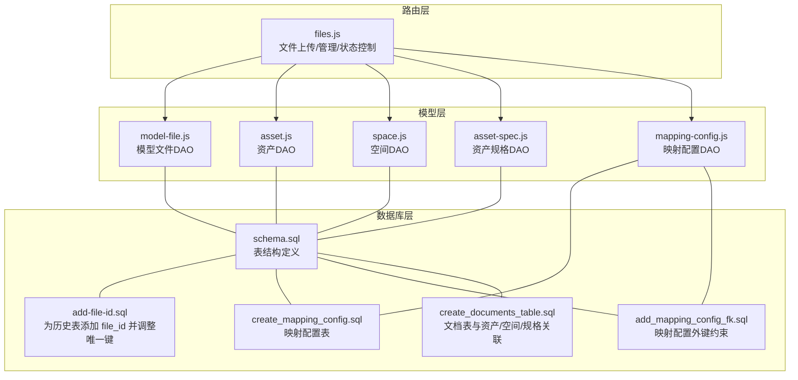
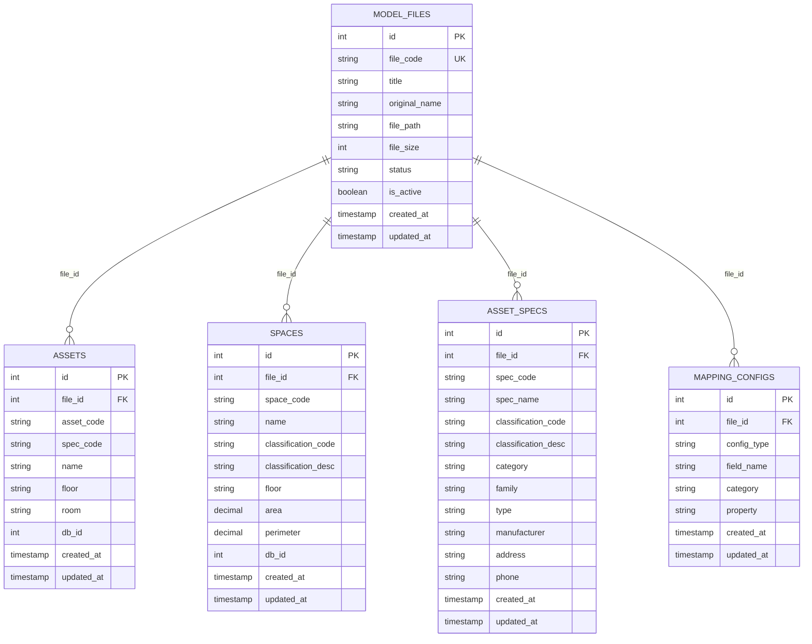
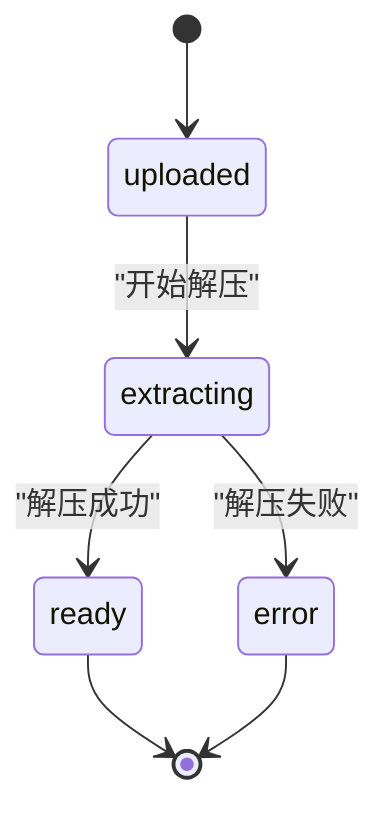
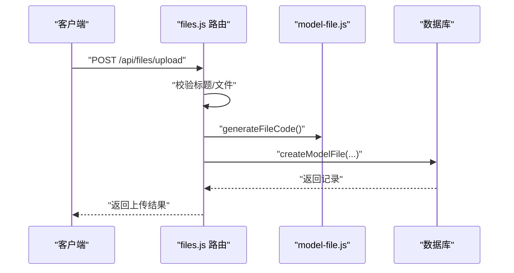
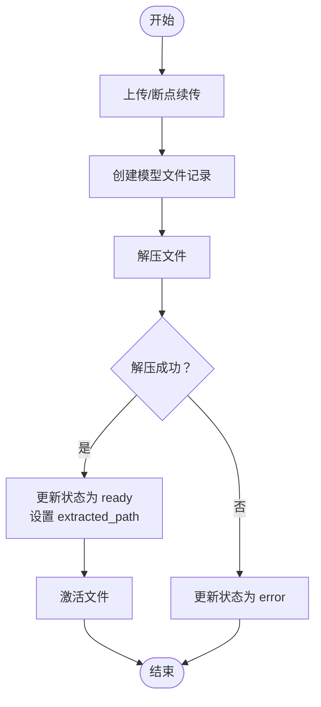
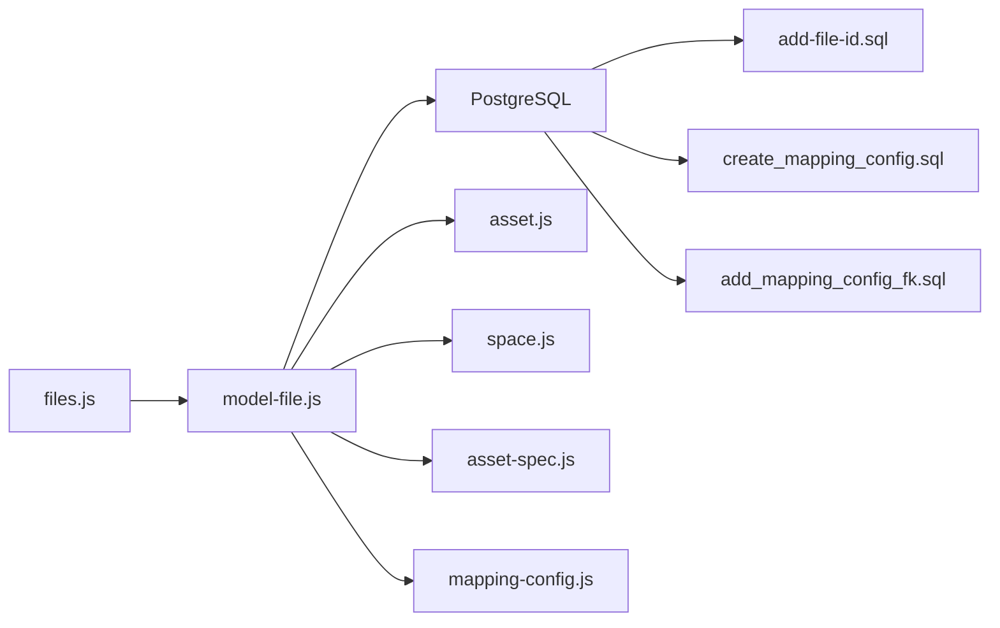

# 模型文件模型 (Model File)

<cite>
**本文引用的文件**
- [server/models/model-file.js](file://server/models/model-file.js)
- [server/routes/files.js](file://server/routes/files.js)
- [server/db/schema.sql](file://server/db/schema.sql)
- [server/db/migrations/add-file-id.sql](file://server/db/migrations/add-file-id.sql)
- [server/db/migrations/create_mapping_config.sql](file://server/db/migrations/create_mapping_config.sql)
- [server/db/migrations/add_mapping_config_fk.sql](file://server/db/migrations/add_mapping_config_fk.sql)
- [server/models/asset.js](file://server/models/asset.js)
- [server/models/space.js](file://server/models/space.js)
- [server/models/asset-spec.js](file://server/models/asset-spec.js)
- [server/models/mapping-config.js](file://server/models/mapping-config.js)
- [server/db/create_documents_table.sql](file://server/db/create_documents_table.sql)
</cite>

## 目录
1. [简介](#简介)
2. [项目结构](#项目结构)
3. [核心组件](#核心组件)
4. [架构总览](#架构总览)
5. [详细组件分析](#详细组件分析)
6. [依赖关系分析](#依赖关系分析)
7. [性能考量](#性能考量)
8. [故障排查指南](#故障排查指南)
9. [结论](#结论)
10. [附录](#附录)

## 简介
本文件围绕“模型文件模型”展开，系统性阐述BIM模型文件元数据的管理机制，重点包括：
- 主键设计：file_id 与 file_code 的角色与关系
- 文件标识字段：file_name、file_path、original_name 等的用途与来源
- 生命周期字段：status、updated_at、created_at 的语义与流转
- 多实体关联锚点：通过 file_id 将 assets、spaces、asset_specs、mapping-config 等实体与特定模型版本绑定
- 模型文件记录的创建、查询、状态更新与激活流程
- 在多模型管理场景下的核心作用与最佳实践

## 项目结构
模型文件模型位于服务端，采用“路由-模型-数据库”的分层组织：
- 路由层负责接收请求、参数校验与调用模型层
- 模型层封装数据库操作，提供统一的 CRUD 与状态管理接口
- 数据库层包含表结构定义与迁移脚本，确保多实体与模型文件的关联一致性

图表来源
- [server/routes/files.js](file://server/routes/files.js#L1-L436)
- [server/models/model-file.js](file://server/models/model-file.js#L1-L179)
- [server/models/asset.js](file://server/models/asset.js#L1-L253)
- [server/models/space.js](file://server/models/space.js#L1-L220)
- [server/models/asset-spec.js](file://server/models/asset-spec.js#L1-L166)
- [server/models/mapping-config.js](file://server/models/mapping-config.js#L1-L115)
- [server/db/schema.sql](file://server/db/schema.sql#L1-L160)
- [server/db/migrations/add-file-id.sql](file://server/db/migrations/add-file-id.sql#L1-L51)
- [server/db/migrations/create_mapping_config.sql](file://server/db/migrations/create_mapping_config.sql#L1-L29)
- [server/db/migrations/add_mapping_config_fk.sql](file://server/db/migrations/add_mapping_config_fk.sql#L1-L26)
- [server/db/create_documents_table.sql](file://server/db/create_documents_table.sql#L1-L49)

章节来源
- [server/routes/files.js](file://server/routes/files.js#L1-L436)
- [server/models/model-file.js](file://server/models/model-file.js#L1-L179)
- [server/db/schema.sql](file://server/db/schema.sql#L1-L160)

## 核心组件
- 模型文件 DAO（model-file.js）
  - 提供生成唯一文件编码、创建记录、查询列表/详情、获取激活文件、更新状态/路径/标题、激活切换、删除等能力
- 路由控制器（files.js）
  - 实现上传、断点续传、解压、激活、查询关联资产/空间等 API
- 数据库结构与迁移
  - schema.sql 定义了 model_files 与资产/空间/规格等表的结构及索引、触发器
  - add-file-id.sql 为历史表添加 file_id 并调整唯一键，确保按文件维度隔离数据
  - create_mapping_config.sql 与 add_mapping_config_fk.sql 定义并约束映射配置表与模型文件的关联

章节来源
- [server/models/model-file.js](file://server/models/model-file.js#L1-L179)
- [server/routes/files.js](file://server/routes/files.js#L1-L436)
- [server/db/schema.sql](file://server/db/schema.sql#L1-L160)
- [server/db/migrations/add-file-id.sql](file://server/db/migrations/add-file-id.sql#L1-L51)
- [server/db/migrations/create_mapping_config.sql](file://server/db/migrations/create_mapping_config.sql#L1-L29)
- [server/db/migrations/add_mapping_config_fk.sql](file://server/db/migrations/add_mapping_config_fk.sql#L1-L26)

## 架构总览
模型文件作为“关联锚点”，通过 file_id 将以下实体与具体模型版本绑定：
- 资产（assets）：file_id + asset_code 唯一
- 空间（spaces）：file_id + space_code 唯一
- 资产规格（asset_specs）：file_id + spec_code 唯一
- 映射配置（mapping_configs）：file_id 外键约束到 model_files

图表来源
- [server/db/schema.sql](file://server/db/schema.sql#L1-L160)
- [server/db/migrations/add-file-id.sql](file://server/db/migrations/add-file-id.sql#L1-L51)
- [server/db/migrations/create_mapping_config.sql](file://server/db/migrations/create_mapping_config.sql#L1-L29)
- [server/db/migrations/add_mapping_config_fk.sql](file://server/db/migrations/add_mapping_config_fk.sql#L1-L26)

## 详细组件分析

### 1) 主键与标识字段设计
- 主键与唯一标识
  - 主键：id（自增整数）
  - 唯一标识：file_code（唯一编码），用于外部引用与展示
- 文件标识字段
  - original_name：原始文件名（保留上传时的名称）
  - file_path：服务器存储路径（相对 public 目录）
  - file_size：文件大小（字节）
- 生成策略
  - 生成唯一文件编码：结合时间戳与 UUID 片段，形成前缀为“MF”的稳定编码

章节来源
- [server/models/model-file.js](file://server/models/model-file.js#L1-L179)
- [server/routes/files.js](file://server/routes/files.js#L1-L436)

### 2) 生命周期字段与状态机
- 状态字段：status
  - 可能值：uploaded（已上传）、extracting（解压中）、ready（已就绪）、error（错误）
  - 通过 updateModelFileStatus 动态更新；解压流程中会设置 extracted_path
- 时间戳：created_at、updated_at
  - 由 schema.sql 中的触发器自动维护，无需业务层手动更新
- 激活状态：is_active
  - 通过 activateModelFile 将某文件设为激活状态，同时取消其他文件的激活标记
  - 激活条件：仅当 status 为 ready 时允许激活

图表来源
- [server/models/model-file.js](file://server/models/model-file.js#L76-L127)
- [server/routes/files.js](file://server/routes/files.js#L333-L405)

章节来源
- [server/models/model-file.js](file://server/models/model-file.js#L76-L127)
- [server/db/schema.sql](file://server/db/schema.sql#L101-L133)
- [server/routes/files.js](file://server/routes/files.js#L333-L405)

### 3) 作为关联锚点的绑定机制
- 多实体通过 file_id 与 model_files 绑定
  - 资产、空间、资产规格：file_id + 对应编码构成唯一键，确保同文件内唯一
  - 映射配置：file_id 外键约束到 model_files，按文件维度保存字段映射
- 迁移脚本保障历史数据兼容
  - 为历史表添加 file_id 并重建唯一键，避免跨文件冲突
  - 为映射配置表添加外键约束，确保删除模型文件时级联清理映射配置

图表来源
- [server/routes/files.js](file://server/routes/files.js#L72-L116)
- [server/models/model-file.js](file://server/models/model-file.js#L19-L35)

章节来源
- [server/db/migrations/add-file-id.sql](file://server/db/migrations/add-file-id.sql#L1-L51)
- [server/db/migrations/add_mapping_config_fk.sql](file://server/db/migrations/add_mapping_config_fk.sql#L1-L26)
- [server/models/asset.js](file://server/models/asset.js#L144-L157)
- [server/models/space.js](file://server/models/space.js#L117-L124)
- [server/models/asset-spec.js](file://server/models/asset-spec.js#L104-L156)

### 4) 创建、查询与状态更新方法
- 创建模型文件
  - 路由层接收上传请求，生成 file_code，移动文件至目标目录，创建数据库记录
- 查询
  - 获取全部：按 created_at 倒序
  - 按 id/编码查询：支持精确定位
  - 获取激活文件：is_active = true
- 状态更新
  - updateModelFileStatus：支持更新状态与 extracted_path
  - updateModelFileTitle：更新标题
  - updateModelFilePath：更新文件路径
- 激活切换
  - activateModelFile：事务内取消其他文件激活，设置当前文件为激活
- 删除
  - 删除物理文件与解压目录，再删除数据库记录（外键级联删除资产/空间/规格）

图表来源
- [server/routes/files.js](file://server/routes/files.js#L118-L219)
- [server/routes/files.js](file://server/routes/files.js#L333-L378)
- [server/models/model-file.js](file://server/models/model-file.js#L76-L127)

章节来源
- [server/routes/files.js](file://server/routes/files.js#L118-L219)
- [server/routes/files.js](file://server/routes/files.js#L229-L331)
- [server/models/model-file.js](file://server/models/model-file.js#L76-L127)

### 5) 与其他实体的关联关系
- 资产（assets）
  - 通过 file_id + asset_code 唯一，支持按文件维度批量导入与更新
- 空间（spaces）
  - 通过 file_id + space_code 唯一，支持按文件维度批量导入与更新
- 资产规格（asset_specs）
  - 通过 file_id + spec_code 唯一，支持按文件维度批量导入与更新
- 映射配置（mapping-configs）
  - 通过 file_id 外键约束，按文件维度保存字段映射，便于多模型场景下差异化配置

章节来源
- [server/models/asset.js](file://server/models/asset.js#L144-L157)
- [server/models/space.js](file://server/models/space.js#L117-L124)
- [server/models/asset-spec.js](file://server/models/asset-spec.js#L104-L156)
- [server/models/mapping-config.js](file://server/models/mapping-config.js#L1-L115)
- [server/db/migrations/add_mapping_config_fk.sql](file://server/db/migrations/add_mapping_config_fk.sql#L1-L26)

### 6) 多模型管理场景的核心作用
- 按文件隔离数据
  - file_id 将不同模型版本的数据完全隔离，避免跨版本污染
- 多模型并存与切换
  - 通过激活机制选择当前生效的模型版本
- 文档与模型关联
  - 文档表通过 asset_code/space_code/spec_code 与模型中的对象关联，但不强制外键，需应用层保证一致性

章节来源
- [server/db/schema.sql](file://server/db/schema.sql#L1-L160)
- [server/db/create_documents_table.sql](file://server/db/create_documents_table.sql#L1-L49)

## 依赖关系分析
- 路由层依赖模型层
  - files.js 调用 model-file.js 的接口进行文件管理
- 模型层依赖数据库层
  - model-file.js 通过 query/getClient 访问数据库
- 数据库层依赖迁移脚本
  - add-file-id.sql 为历史表添加 file_id 并调整唯一键
  - create_mapping_config.sql 与 add_mapping_config_fk.sql 定义并约束映射配置表
- 多实体与模型文件的关联
  - assets/spaces/asset_specs 通过 file_id 与 model_files 关联
  - mapping_configs 通过 file_id 与 model_files 关联

图表来源
- [server/routes/files.js](file://server/routes/files.js#L1-L436)
- [server/models/model-file.js](file://server/models/model-file.js#L1-L179)
- [server/db/migrations/add-file-id.sql](file://server/db/migrations/add-file-id.sql#L1-L51)
- [server/db/migrations/create_mapping_config.sql](file://server/db/migrations/create_mapping_config.sql#L1-L29)
- [server/db/migrations/add_mapping_config_fk.sql](file://server/db/migrations/add_mapping_config_fk.sql#L1-L26)

章节来源
- [server/routes/files.js](file://server/routes/files.js#L1-L436)
- [server/models/model-file.js](file://server/models/model-file.js#L1-L179)

## 性能考量
- 索引与触发器
  - schema.sql 为关键列创建索引，提升查询性能
  - 触发器自动维护 updated_at，减少业务层冗余逻辑
- 批量操作
  - 资产/空间/规格提供批量插入与更新接口，配合事务提交，降低网络往返与锁竞争
- 文件解压与状态更新
  - 解压过程异步进行，状态及时更新，避免阻塞主线程

章节来源
- [server/db/schema.sql](file://server/db/schema.sql#L72-L133)
- [server/models/asset.js](file://server/models/asset.js#L160-L200)
- [server/models/space.js](file://server/models/space.js#L126-L168)
- [server/models/asset-spec.js](file://server/models/asset-spec.js#L104-L156)

## 故障排查指南
- 上传失败
  - 检查标题与文件参数是否缺失
  - 确认文件类型与大小限制
- 解压失败
  - 状态更新为 error，检查压缩包完整性与磁盘权限
- 激活失败
  - 确认文件状态为 ready，否则提示先解压
- 删除失败
  - 确认物理文件与解压目录是否存在，删除后检查数据库记录是否清理

章节来源
- [server/routes/files.js](file://server/routes/files.js#L72-L116)
- [server/routes/files.js](file://server/routes/files.js#L333-L378)
- [server/routes/files.js](file://server/routes/files.js#L380-L405)
- [server/routes/files.js](file://server/routes/files.js#L300-L331)

## 结论
模型文件模型通过 file_id 将资产、空间、资产规格与映射配置等实体与具体模型版本绑定，实现了多模型并存与隔离管理。配合完善的生命周期状态机、事务化的激活与批量导入机制，系统能够在复杂场景下保持数据一致性与可维护性。建议在生产环境中：
- 严格遵循状态机流转，避免跳过解压直接激活
- 使用批量导入接口与事务，确保大体量数据的一致性
- 为关键查询建立索引，持续监控数据库性能

## 附录
- 常用接口与职责
  - 上传/断点续传：files.js
  - 文件管理：files.js
  - 模型文件 DAO：model-file.js
  - 资产/空间/规格 DAO：asset.js、space.js、asset-spec.js
  - 映射配置 DAO：mapping-config.js
- 关键 SQL 与迁移
  - schema.sql：表结构与索引、触发器
  - add-file-id.sql：为历史表添加 file_id 并调整唯一键
  - create_mapping_config.sql / add_mapping_config_fk.sql：映射配置表与外键约束
  - create_documents_table.sql：文档表（与资产/空间/规格关联）