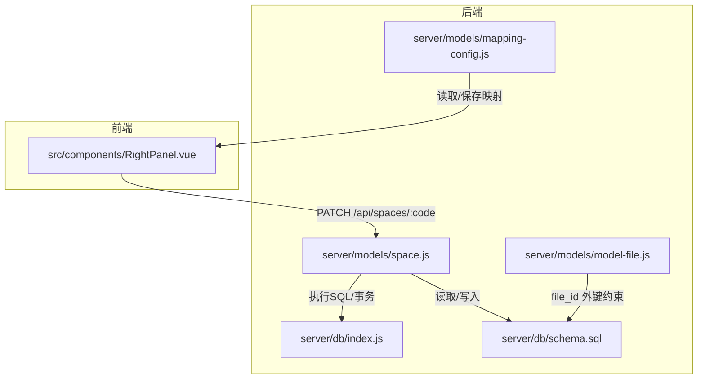
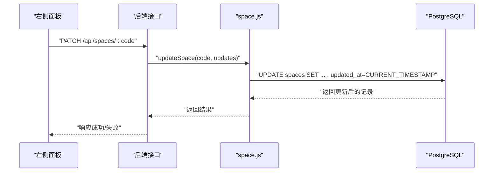
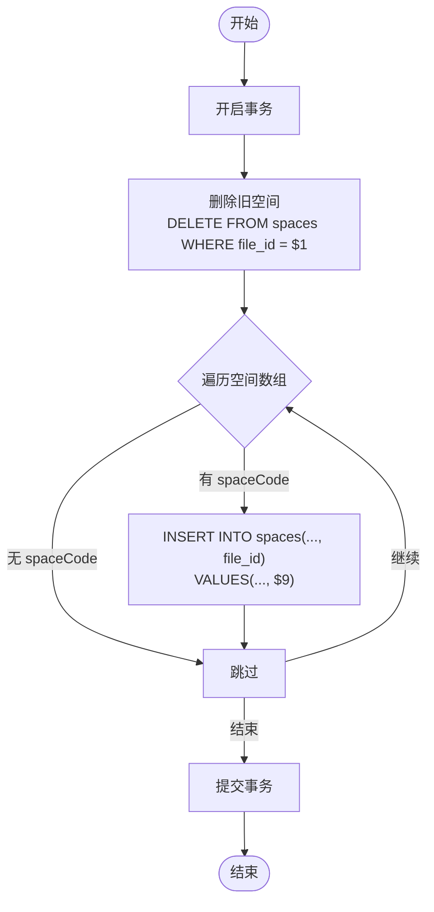
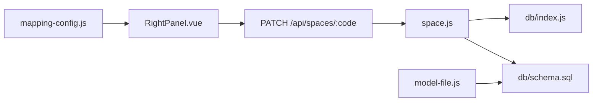

# 空间模型 (Space)

<cite>
**本文引用的文件**
- [server/models/space.js](file://server/models/space.js)
- [server/db/schema.sql](file://server/db/schema.sql)
- [server/db/index.js](file://server/db/index.js)
- [PROPERTY_EDIT_FEATURE.md](file://PROPERTY_EDIT_FEATURE.md)
- [src/components/RightPanel.vue](file://src/components/RightPanel.vue)
- [server/models/mapping-config.js](file://server/models/mapping-config.js)
- [add_missing_space_fields.sql](file://add_missing_space_fields.sql)
- [server/models/model-file.js](file://server/models/model-file.js)
</cite>

## 目录
1. [简介](#简介)
2. [项目结构](#项目结构)
3. [核心组件](#核心组件)
4. [架构总览](#架构总览)
5. [详细组件分析](#详细组件分析)
6. [依赖分析](#依赖分析)
7. [性能考虑](#性能考虑)
8. [故障排查指南](#故障排查指南)
9. [结论](#结论)
10. [附录](#附录)

## 简介
本文件系统化阐述空间模型（Space）在数据库中的实体设计与几何属性管理，覆盖以下关键点：
- spaces 表的主键与外键约束、字段语义与索引策略
- geometry 字段（面积、周长）的数据来源与前端映射
- db_id 在 2D/3D 视图中与模型元素的绑定机制
- upsertSpace、batchUpsertSpacesWithFile 等数据操作方法的实现与事务保障
- 查询方法 getAllSpaces、getSpacesByFloor 等的使用场景
- 结合 PROPERTY_EDIT_FEATURE.md 的字段映射，明确前端属性与数据库列的对应关系
- 提供空间数据管理的完整代码示例路径与 created_at/updated_at 时间戳自动更新策略

## 项目结构
空间模型位于后端服务的 models 层，配合数据库 schema 定义与前端右侧面板组件共同完成空间数据的增删改查与可视化联动。

图表来源
- [server/models/space.js](file://server/models/space.js#L1-L220)
- [server/db/schema.sql](file://server/db/schema.sql#L54-L70)
- [server/db/index.js](file://server/db/index.js#L1-L70)
- [src/components/RightPanel.vue](file://src/components/RightPanel.vue#L195-L364)
- [server/models/mapping-config.js](file://server/models/mapping-config.js#L17-L48)
- [server/models/model-file.js](file://server/models/model-file.js#L19-L35)

章节来源
- [server/models/space.js](file://server/models/space.js#L1-L220)
- [server/db/schema.sql](file://server/db/schema.sql#L54-L70)
- [server/db/index.js](file://server/db/index.js#L1-L70)
- [src/components/RightPanel.vue](file://src/components/RightPanel.vue#L195-L364)
- [server/models/mapping-config.js](file://server/models/mapping-config.js#L17-L48)
- [server/models/model-file.js](file://server/models/model-file.js#L19-L35)

## 核心组件
- 空间数据访问对象：提供 upsert、批量 upsert、查询、更新、删除等方法
- 数据库 schema：定义 spaces 表结构、索引与触发器
- 数据库连接池：统一查询与事务客户端获取
- 前端右侧面板：提供空间属性编辑与 PATCH 接口调用
- 映射配置模型：维护 file_id -> 空间字段的映射关系
- 模型文件模型：提供 file_id 的来源与生命周期管理

章节来源
- [server/models/space.js](file://server/models/space.js#L1-L220)
- [server/db/schema.sql](file://server/db/schema.sql#L54-L70)
- [server/db/index.js](file://server/db/index.js#L1-L70)
- [src/components/RightPanel.vue](file://src/components/RightPanel.vue#L195-L364)
- [server/models/mapping-config.js](file://server/models/mapping-config.js#L17-L48)
- [server/models/model-file.js](file://server/models/model-file.js#L19-L35)

## 架构总览
空间模型的典型工作流如下：
- 前端通过右侧面板发起 PATCH 请求更新空间属性
- 后端 space.js 的 updateSpace 方法构建动态 UPDATE 语句，仅允许白名单字段
- 更新时自动设置 updated_at，触发器保证时间戳一致性
- 批量导入时通过 batchUpsertSpacesWithFile 清空旧空间并插入新空间，确保 file_id 与模型文件的一致性

图表来源
- [src/components/RightPanel.vue](file://src/components/RightPanel.vue#L195-L364)
- [server/models/space.js](file://server/models/space.js#L170-L206)
- [server/db/schema.sql](file://server/db/schema.sql#L128-L133)

## 详细组件分析

### 数据库表设计（spaces）
- 主键与唯一性
  - 主键：id（自增）
  - 唯一性约束：(file_id, space_code)，确保同一模型文件内的空间编码唯一
- 外键关系
  - file_id 引用 model_files(id)，级联删除，保证模型文件删除时空间数据清理
- 关键字段语义
  - space_code：空间编码（主键的一部分，唯一性由 file_id + space_code 保证）
  - name：空间名称
  - classification_code/classification_desc：OmniClass 空间分类编码与描述
  - floor：楼层（标高）
  - area/perimeter：面积与周长（几何测量）
  - db_id：Viewer 中的 dbId，用于 2D/3D 视图与模型元素绑定
  - created_at/updated_at：时间戳，自动更新
- 索引
  - idx_spaces_classification、idx_spaces_floor、idx_spaces_db_id 提升查询性能
- 触发器
  - update_spaces_updated_at：每次 UPDATE 自动刷新 updated_at

章节来源
- [server/db/schema.sql](file://server/db/schema.sql#L54-L70)
- [server/db/schema.sql](file://server/db/schema.sql#L92-L96)
- [server/db/schema.sql](file://server/db/schema.sql#L128-L133)

### 几何属性与数据来源
- area、perimeter 字段
  - 字段类型为 DECIMAL(15,4)，支持高精度几何计算
  - 数据来源：前端 PROPERTY_EDIT_FEATURE.md 中“空间”字段列表明确 area、perimeter 为可编辑的数字字段
- 与模型文件的关联
  - file_id 外键确保空间数据与具体模型文件绑定，便于批量导入与清理
- 与映射配置的关系
  - add_missing_space_fields.sql 为 mapping_configs 中缺失的空间字段（area、perimeter、floor）进行补齐，保证前端展示与编辑的完整性

章节来源
- [server/db/schema.sql](file://server/db/schema.sql#L60-L69)
- [PROPERTY_EDIT_FEATURE.md](file://PROPERTY_EDIT_FEATURE.md#L81-L91)
- [add_missing_space_fields.sql](file://add_missing_space_fields.sql#L1-L94)

### db_id 的 2D/3D 视图绑定机制
- db_id 字段
  - 用于与 Viewer 中的模型元素（构件/空间）建立绑定
  - schema 中为 spaces.db_id 建立索引，提升匹配效率
- 绑定策略
  - 导入阶段：将模型解析出的空间元素的 dbId 写入 db_id 字段
  - 查询阶段：通过 db_id 快速定位空间与模型元素的对应关系
  - 交互阶段：在 2D/3D 视图中选中元素时，后端可通过 db_id 查询对应空间记录，驱动右侧面板展示

章节来源
- [server/db/schema.sql](file://server/db/schema.sql#L64-L69)
- [server/db/schema.sql](file://server/db/schema.sql#L92-L96)

### 数据操作方法

#### upsertSpace
- 功能：插入或更新空间记录（基于 space_code）
- 实现要点：
  - 使用 INSERT INTO ... RETURNING 返回最新记录
  - 参数顺序与列顺序严格对应
- 适用场景：单条空间记录的幂等写入

章节来源
- [server/models/space.js](file://server/models/space.js#L10-L30)

#### batchUpsertSpaces
- 功能：批量插入空间（事务包裹）
- 实现要点：
  - 使用 getClient() 获取连接，手动 BEGIN/COMMIT/ROLLBACK
  - 循环插入，参数与列一一对应
- 适用场景：小规模批量导入，无需 file_id 关联

章节来源
- [server/models/space.js](file://server/models/space.js#L36-L70)

#### batchUpsertSpacesWithFile
- 功能：批量插入空间并绑定 file_id（事务包裹）
- 实现要点：
  - 先删除该 file_id 下的旧空间，再批量插入新空间
  - 在 INSERT 中包含 file_id，确保与模型文件强关联
- 适用场景：模型文件重新解析后，整体替换空间数据

图表来源
- [server/models/space.js](file://server/models/space.js#L129-L168)

章节来源
- [server/models/space.js](file://server/models/space.js#L129-L168)

#### 查询方法
- getAllSpaces：按 space_code 排序返回全部空间
- getSpaceByCode：按 space_code 精确查询
- getSpacesByFloor：按 floor 查询
- getSpacesByClassification：按 classification_code 查询
- getSpacesByFileId：按 file_id 查询（用于模型文件维度的空间筛选）

章节来源
- [server/models/space.js](file://server/models/space.js#L72-L124)

#### 更新方法 updateSpace
- 功能：动态更新空间属性（白名单字段）
- 实现要点：
  - 允许字段：name、classification_code、classification_desc、floor、area、perimeter
  - 自动更新 updated_at
  - 通过 WHERE space_code 精确定位
- 适用场景：右侧面板在线编辑保存

章节来源
- [server/models/space.js](file://server/models/space.js#L170-L206)

### 前后端字段映射（PROPERTY_EDIT_FEATURE.md）
- 前端空间字段与数据库列的对应关系
  - code -> space_code
  - name -> name
  - area -> area
  - perimeter -> perimeter
  - level -> floor
  - spaceNumber -> classification_code
  - spaceDescription -> classification_desc
- 右侧面板逻辑
  - handleFieldChange 根据字段名映射到数据库列，构造 PATCH 请求
  - 支持单选与多选模式，多选时批量更新

章节来源
- [PROPERTY_EDIT_FEATURE.md](file://PROPERTY_EDIT_FEATURE.md#L81-L91)
- [src/components/RightPanel.vue](file://src/components/RightPanel.vue#L195-L364)

### 时间戳自动更新策略
- created_at/updated_at
  - 默认 CURRENT_TIMESTAMP
  - 触发器 update_spaces_updated_at 在每次 UPDATE 前自动刷新 updated_at
- 业务影响
  - updateSpace 显式设置 updated_at，与触发器共同保证时间戳一致性

章节来源
- [server/db/schema.sql](file://server/db/schema.sql#L64-L69)
- [server/db/schema.sql](file://server/db/schema.sql#L128-L133)
- [server/models/space.js](file://server/models/space.js#L194-L205)

## 依赖分析
- 组件耦合
  - space.js 依赖 db/index.js 的 query 与 getClient
  - schema.sql 定义表结构、索引与触发器
  - RightPanel.vue 依赖 space.js 的更新接口
  - mapping-config.js 与 add_missing_space_fields.sql 保证字段映射完整性
  - model-file.js 提供 file_id 的来源与生命周期管理

图表来源
- [src/components/RightPanel.vue](file://src/components/RightPanel.vue#L195-L364)
- [server/models/space.js](file://server/models/space.js#L170-L206)
- [server/db/index.js](file://server/db/index.js#L1-L70)
- [server/db/schema.sql](file://server/db/schema.sql#L54-L70)
- [server/models/mapping-config.js](file://server/models/mapping-config.js#L17-L48)
- [server/models/model-file.js](file://server/models/model-file.js#L19-L35)

章节来源
- [server/models/space.js](file://server/models/space.js#L1-L220)
- [server/db/schema.sql](file://server/db/schema.sql#L54-L70)
- [server/db/index.js](file://server/db/index.js#L1-L70)
- [src/components/RightPanel.vue](file://src/components/RightPanel.vue#L195-L364)
- [server/models/mapping-config.js](file://server/models/mapping-config.js#L17-L48)
- [server/models/model-file.js](file://server/models/model-file.js#L19-L35)

## 性能考虑
- 索引优化
  - idx_spaces_classification、idx_spaces_floor、idx_spaces_db_id 提升过滤与关联查询性能
- 事务批处理
  - batchUpsertSpacesWithFile 使用事务减少往返开销，避免中间态
- 数值精度
  - area/perimeter 使用 DECIMAL(15,4)，兼顾精度与存储成本
- 查询排序
  - 按 space_code 排序，有利于前端列表渲染与一致性

章节来源
- [server/db/schema.sql](file://server/db/schema.sql#L92-L96)
- [server/models/space.js](file://server/models/space.js#L129-L168)

## 故障排查指南
- 批量导入失败
  - 确认 file_id 是否正确传入，检查 batchUpsertSpacesWithFile 的事务日志
  - 若某条记录失败，事务会回滚，需检查单条记录的必填字段与唯一性约束
- 更新失败
  - 确认字段是否在白名单内；若为空或不在白名单，updateSpace 会抛错
  - 检查 space_code 是否存在
- 时间戳异常
  - 确认触发器 update_spaces_updated_at 是否存在且启用
- 字段映射缺失
  - 使用 add_missing_space_fields.sql 为 mapping_configs 补齐 area、perimeter、floor 字段

章节来源
- [server/models/space.js](file://server/models/space.js#L170-L206)
- [server/models/space.js](file://server/models/space.js#L129-L168)
- [server/db/schema.sql](file://server/db/schema.sql#L128-L133)
- [add_missing_space_fields.sql](file://add_missing_space_fields.sql#L1-L94)

## 结论
空间模型（Space）围绕 spaces 表实现了：
- 唯一键约束与外键关联，确保数据一致性与模型文件维度的隔离
- 几何字段 area、perimeter 的高精度存储与前端映射
- db_id 的 2D/3D 视图绑定能力
- 完整的数据操作方法族（upsert、批量 upsert、查询、更新、删除）
- 前后端字段映射清晰，支持在线编辑与批量更新
- 自动时间戳更新策略，保证审计与版本追踪

## 附录

### 完整代码示例（路径）
- 单条 upsert：参见 [upsertSpace](file://server/models/space.js#L10-L30)
- 批量 upsert（无 file_id）：参见 [batchUpsertSpaces](file://server/models/space.js#L36-L70)
- 批量 upsert（含 file_id）：参见 [batchUpsertSpacesWithFile](file://server/models/space.js#L129-L168)
- 查询集合：参见 [getAllSpaces/getSpacesByFloor/getSpacesByClassification/getSpacesByFileId](file://server/models/space.js#L72-L124)
- 更新属性：参见 [updateSpace](file://server/models/space.js#L170-L206)
- 前端字段映射与调用：参见 [RightPanel.handleFieldChange](file://src/components/RightPanel.vue#L195-L364)
- 字段映射配置：参见 [mapping-config.getMappingConfig/saveMappingConfig](file://server/models/mapping-config.js#L17-L48)
- 字段补齐脚本：参见 [add_missing_space_fields.sql](file://add_missing_space_fields.sql#L1-L94)