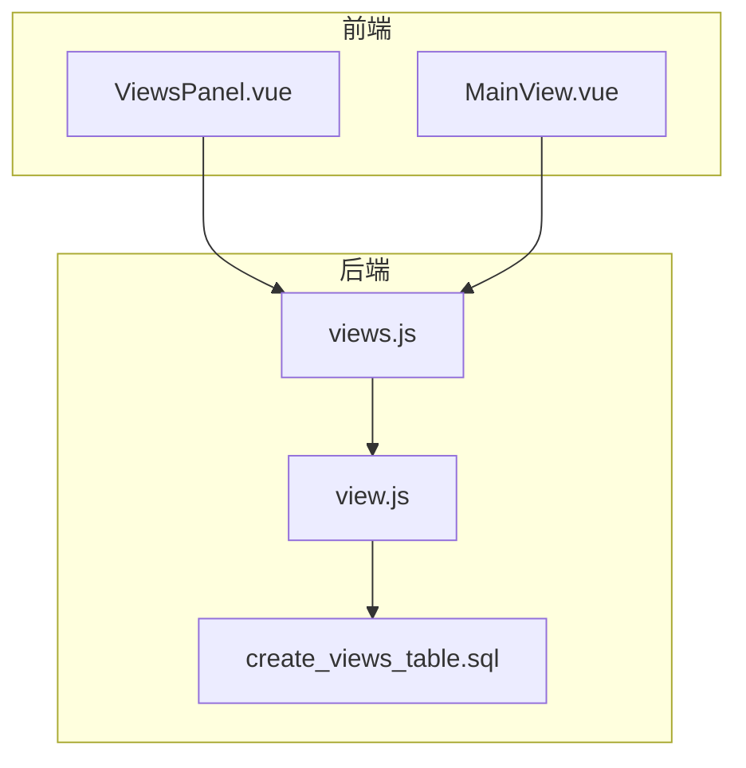
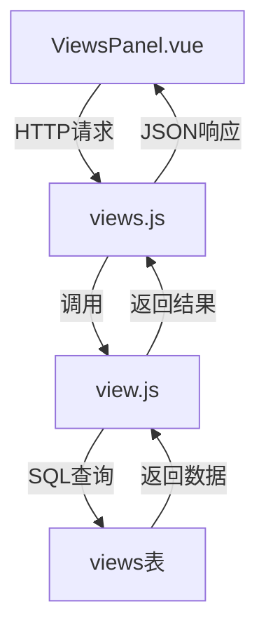
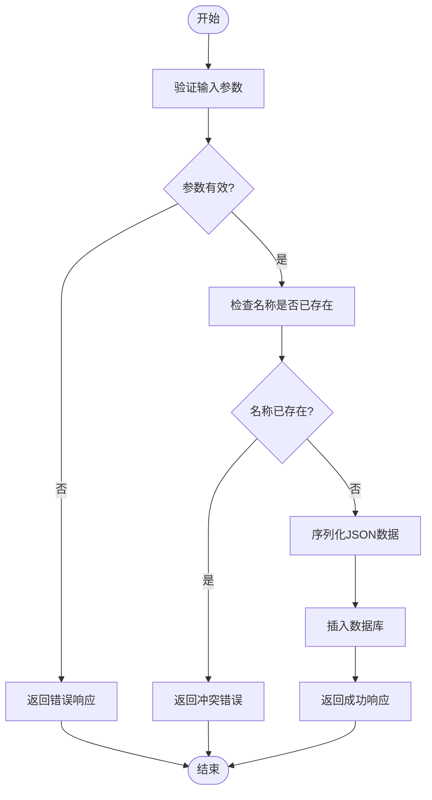
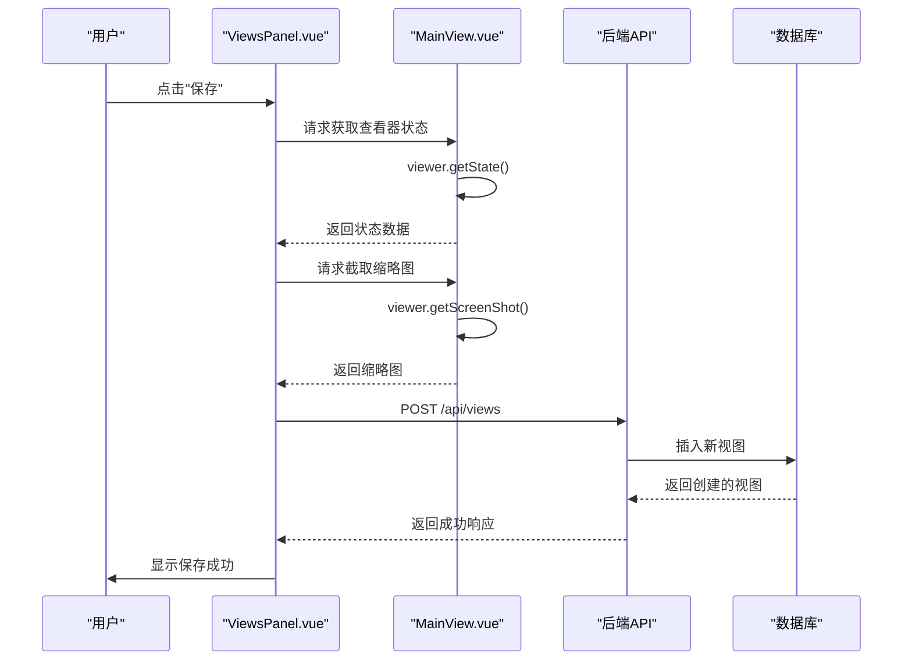
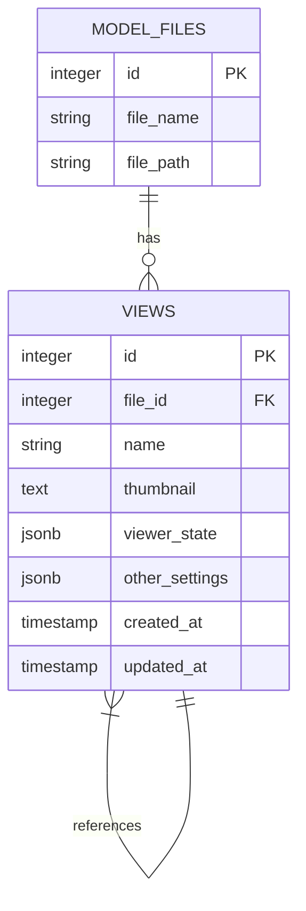

# 视图模型 (View)

<cite>
**本文档引用的文件**
- [view.js](file://server/models/view.js)
- [views.js](file://server/routes/views.js)
- [create_views_table.sql](file://server/db/create_views_table.sql)
- [ViewsPanel.vue](file://src/components/ViewsPanel.vue)
- [MainView.vue](file://src/components/MainView.vue)
- [VIEWS_FEATURE_PLAN.md](file://VIEWS_FEATURE_PLAN.md)
- [add-viewer-state-column.js](file://server/add-viewer-state-column.js)
- [create-views-table.js](file://server/create-views-table.js)
</cite>

## 目录
1. [简介](#简介)
2. [项目结构](#项目结构)
3. [核心组件](#核心组件)
4. [架构概述](#架构概述)
5. [详细组件分析](#详细组件分析)
6. [依赖分析](#依赖分析)
7. [性能考虑](#性能考虑)
8. [故障排除指南](#故障排除指南)
9. [结论](#结论)

## 简介
视图模型(View)是本系统中用于管理BIM模型查看器状态的核心组件。它允许用户保存、查询、更新和删除特定的3D/2D查看器状态快照，从而实现工作场景的持久化和恢复。该模型通过将复杂的查看器状态序列化存储在数据库中，支持用户个性化配置管理，提升工作效率。本文档详细说明了视图模型的设计、实现和使用方法。

## 项目结构
视图功能的实现涉及前端、后端和数据库三个层面的协同工作。后端模型和路由处理数据的CRUD操作，数据库表存储视图状态，前端组件提供用户交互界面。

**图示来源**
- [ViewsPanel.vue](file://src/components/ViewsPanel.vue)
- [MainView.vue](file://src/components/MainView.vue)
- [views.js](file://server/routes/views.js)
- [view.js](file://server/models/view.js)
- [create_views_table.sql](file://server/db/create_views_table.sql)

**本节来源**
- [src/components/ViewsPanel.vue](file://src/components/ViewsPanel.vue)
- [server/routes/views.js](file://server/routes/views.js)
- [server/db/create_views_table.sql](file://server/db/create_views_table.sql)

## 核心组件
视图模型的核心功能由后端的`view.js`模型文件实现，它提供了对视图数据的完整CRUD操作。`getViewsByFileId`和`searchViews`方法用于查询视图列表，`getViewById`用于获取单个视图的完整状态。`createView`和`updateView`方法处理视图的创建和更新，其中`updateView`方法实现了驼峰命名到下划线命名的自动转换，确保了API的兼容性。`deleteView`方法用于删除视图，`isNameExists`方法用于检查视图名称的唯一性。

**本节来源**
- [view.js](file://server/models/view.js)

## 架构概述
视图管理功能的架构遵循典型的MVC模式。前端组件`ViewsPanel.vue`作为视图层，负责用户界面的展示和交互。后端路由`views.js`作为控制器，接收HTTP请求并调用模型层的方法。`view.js`作为模型层，封装了与数据库交互的业务逻辑。数据库表`views`作为数据存储层，持久化保存视图状态。这种分层架构确保了代码的可维护性和可扩展性。

**图示来源**
- [ViewsPanel.vue](file://src/components/ViewsPanel.vue)
- [views.js](file://server/routes/views.js)
- [view.js](file://server/models/view.js)
- [create_views_table.sql](file://server/db/create_views_table.sql)

## 详细组件分析

### 视图模型分析
视图模型的实现充分考虑了用户体验和数据完整性。在创建和更新视图时，系统会自动将JSON对象序列化为字符串存储在数据库中，并在读取时反序列化，简化了数据处理流程。`updateView`方法通过动态构建SQL语句，支持部分字段更新，提高了灵活性。`isNameExists`方法确保了同一文件下的视图名称唯一性，防止了数据冲突。

#### 视图创建流程

**图示来源**
- [view.js](file://server/models/view.js#L66-L96)
- [views.js](file://server/routes/views.js#L70-L106)

**本节来源**
- [view.js](file://server/models/view.js)
- [views.js](file://server/routes/views.js)

### 前端组件分析
前端`ViewsPanel.vue`组件实现了完整的用户交互功能。它提供了列表和缩略图两种显示模式，支持按名称搜索和排序。用户可以通过"保存"按钮快速保存当前视图，或通过"另存为"按钮创建新视图。上下文菜单支持重命名、更新和删除视图操作。组件通过`fetch` API与后端进行通信，实现了视图的加载、创建、更新和删除。

#### 视图保存与恢复流程

**图示来源**
- [ViewsPanel.vue](file://src/components/ViewsPanel.vue)
- [MainView.vue](file://src/components/MainView.vue)
- [views.js](file://server/routes/views.js)

**本节来源**
- [ViewsPanel.vue](file://src/components/ViewsPanel.vue)
- [MainView.vue](file://src/components/MainView.vue)

## 依赖分析
视图模型与其他系统组件存在紧密的依赖关系。它依赖于`model_files`表，通过`file_id`外键关联特定的BIM模型文件。前端组件`ViewsPanel.vue`依赖于`MainView.vue`提供的`getViewerState`和`captureScreenshot`方法来获取查看器状态和截取缩略图。后端路由`views.js`依赖于`view.js`模型提供的业务逻辑方法。这些依赖关系确保了视图功能的完整性和一致性。

**图示来源**
- [create_views_table.sql](file://server/db/create_views_table.sql)
- [view.js](file://server/models/view.js)

**本节来源**
- [create_views_table.sql](file://server/db/create_views_table.sql)
- [view.js](file://server/models/view.js)

## 性能考虑
视图模型在设计时考虑了性能优化。数据库表`views`在`file_id`和`name`字段上创建了索引，确保了查询效率。`getViewsByFileId`方法支持按名称和创建时间排序，满足了用户的多样化需求。`searchViews`方法使用`ILIKE`操作符进行模糊搜索，提高了搜索的灵活性。前端组件实现了防抖搜索，避免了频繁的API调用，提升了用户体验。

## 故障排除指南
在使用视图功能时，可能会遇到一些常见问题。如果无法保存视图，首先检查`fileId`参数是否正确传递。如果视图状态无法正确恢复，检查`viewer_state`字段是否包含有效的JSON数据。如果缩略图显示异常，确认`thumbnail`字段是否为有效的Base64编码字符串。在开发环境中，可以通过查看浏览器控制台和服务器日志来获取详细的错误信息。

**本节来源**
- [view.js](file://server/models/view.js)
- [views.js](file://server/routes/views.js)
- [ViewsPanel.vue](file://src/components/ViewsPanel.vue)

## 结论
视图模型成功实现了BIM模型查看器状态的持久化存储和管理。通过将复杂的查看器状态序列化存储在数据库中，用户可以轻松保存和恢复工作场景，极大地提升了工作效率。该模型的设计充分考虑了数据完整性、用户体验和系统性能，为用户个性化配置管理提供了坚实的基础。结合`VIEWS_FEATURE_PLAN.md`中的规划，该功能已完整实现了保存、另存为、恢复、搜索排序等核心功能，为系统的进一步扩展奠定了良好基础。