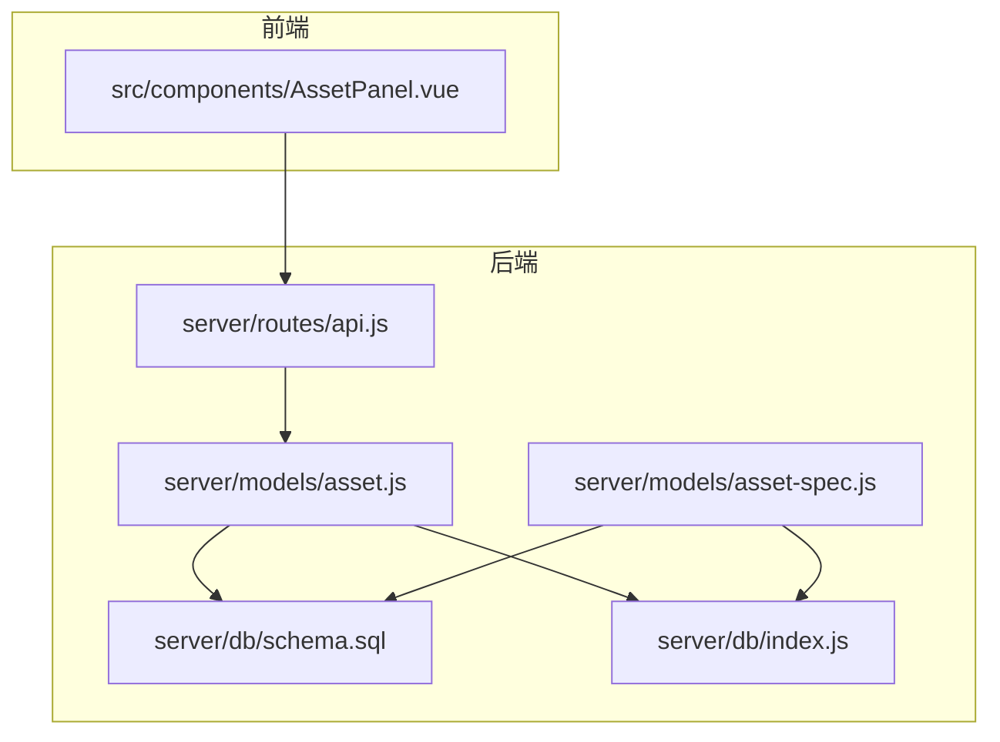
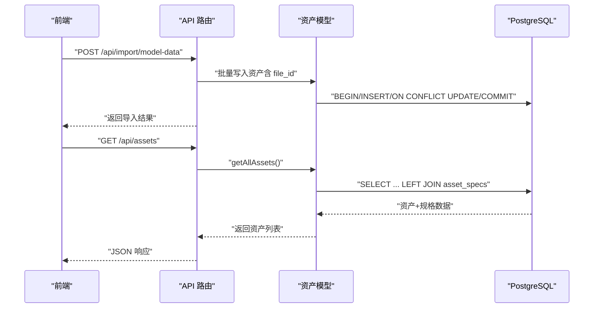
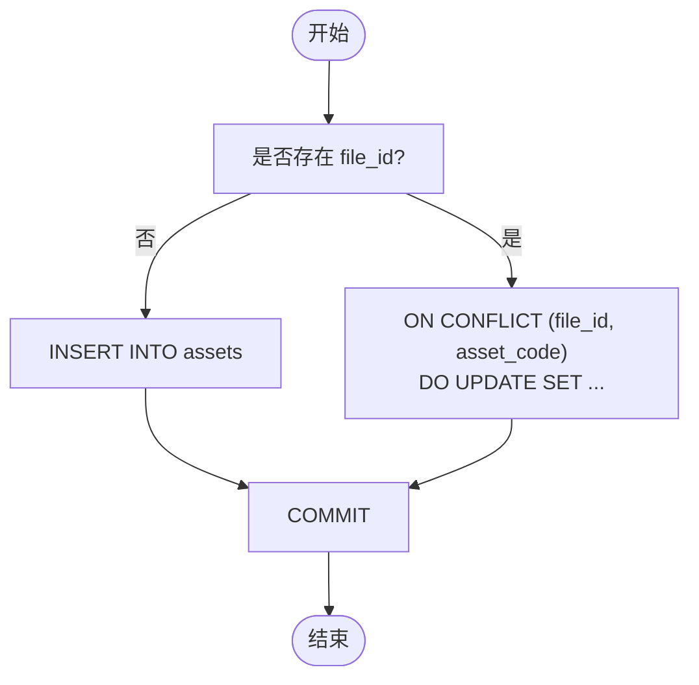
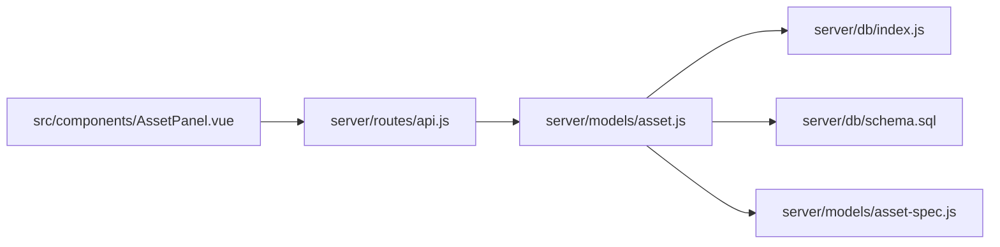

# 资产模型 (Asset)

<cite>
**本文引用的文件**
- [server/models/asset.js](file://server/models/asset.js)
- [server/db/schema.sql](file://server/db/schema.sql)
- [PROPERTY_EDIT_FEATURE.md](file://PROPERTY_EDIT_FEATURE.md)
- [server/routes/api.js](file://server/routes/api.js)
- [server/db/index.js](file://server/db/index.js)
- [server/models/asset-spec.js](file://server/models/asset-spec.js)
- [src/components/AssetPanel.vue](file://src/components/AssetPanel.vue)
</cite>

## 目录
1. [简介](#简介)
2. [项目结构](#项目结构)
3. [核心组件](#核心组件)
4. [架构总览](#架构总览)
5. [详细组件分析](#详细组件分析)
6. [依赖分析](#依赖分析)
7. [性能考虑](#性能考虑)
8. [故障排查指南](#故障排查指南)
9. [结论](#结论)
10. [附录](#附录)

## 简介
本文件围绕资产模型（Asset）进行系统化文档化，重点阐述：
- assets 表的结构设计与业务逻辑
- asset_code 作为主键的唯一性约束
- spec_code 外键与 asset_specs 表的关联关系
- floor、room 等空间定位字段的用途
- db_id 在 3D 模型可视化中的关键作用
- upsertAsset、batchUpsertAssets、batchUpsertAssetsWithFile 等数据操作方法
- 文件关联（file_id）的批量插入逻辑
- getAllAssets、getAssetByCode 等查询方法如何通过 LEFT JOIN 自动关联资产规格信息
- 结合 PROPERTY_EDIT_FEATURE.md 的字段映射，说明 mcCode、typeComments 等前端属性与数据库字段的对应关系
- 资产数据增删改查的代码示例路径与 created_at/updated_at 时间戳的自动管理机制

## 项目结构
资产模型位于后端 server/models 目录，数据库结构定义于 server/db/schema.sql，API 路由位于 server/routes/api.js，数据库连接池封装在 server/db/index.js；前端资产面板组件位于 src/components/AssetPanel.vue。

图表来源
- [server/models/asset.js](file://server/models/asset.js#L1-L253)
- [server/db/schema.sql](file://server/db/schema.sql#L38-L52)
- [server/routes/api.js](file://server/routes/api.js#L100-L201)
- [server/db/index.js](file://server/db/index.js#L1-L70)
- [server/models/asset-spec.js](file://server/models/asset-spec.js#L1-L166)
- [src/components/AssetPanel.vue](file://src/components/AssetPanel.vue#L1-L387)

章节来源
- [server/models/asset.js](file://server/models/asset.js#L1-L253)
- [server/db/schema.sql](file://server/db/schema.sql#L38-L52)
- [server/routes/api.js](file://server/routes/api.js#L100-L201)
- [server/db/index.js](file://server/db/index.js#L1-L70)
- [server/models/asset-spec.js](file://server/models/asset-spec.js#L1-L166)
- [src/components/AssetPanel.vue](file://src/components/AssetPanel.vue#L1-L387)

## 核心组件
- 资产数据访问对象（DAO）
  - 提供 upsertAsset、batchUpsertAssets、batchUpsertAssetsWithFile、getAllAssets、getAssetByCode、getAssetsBySpecCode、getAssetsByFloor、getAssetsByRoom、getAssetsByFileId、deleteAllAssets、updateAsset 等方法
- 数据库结构
  - assets 表：包含 asset_code（主键）、spec_code（外键）、name、floor、room、db_id、file_id 等字段
  - asset_specs 表：包含 spec_code（主键之一）、spec_name、classification_code、classification_desc、category、family、type、manufacturer、address、phone 等字段
- API 路由
  - 提供 /api/assets、/api/assets/:code、/api/assets/batch、/api/assets/:code（PATCH）等接口
- 数据库连接池
  - 封装 query、getClient、closePool，支持事务与日志输出

章节来源
- [server/models/asset.js](file://server/models/asset.js#L1-L253)
- [server/db/schema.sql](file://server/db/schema.sql#L38-L52)
- [server/routes/api.js](file://server/routes/api.js#L100-L201)
- [server/db/index.js](file://server/db/index.js#L1-L70)

## 架构总览
资产模型的典型工作流：
- 导入流程：前端提交模型数据，后端路由解析并调用资产模型批量写入，同时联动资产规格与分类编码写入
- 查询流程：前端通过 API 获取资产列表，后端通过 LEFT JOIN 返回资产及规格信息
- 更新流程：前端 PATCH 调用 /api/assets/:code，后端校验字段白名单并执行动态 UPDATE，自动更新 updated_at

图表来源
- [server/routes/api.js](file://server/routes/api.js#L297-L464)
- [server/models/asset.js](file://server/models/asset.js#L160-L200)
- [server/db/schema.sql](file://server/db/schema.sql#L38-L52)

## 详细组件分析

### 数据表结构与约束
- assets 表
  - 主键：(file_id, asset_code)，确保同一文件内的资产编码唯一
  - 外键：spec_code 引用 asset_specs.spec_code
  - 关键字段：asset_code（mcCode）、spec_code（typeComments）、name（名称）、floor（楼层）、room（房间）、db_id（Viewer dbId）、file_id（模型文件关联）
- asset_specs 表
  - 主键：(file_id, spec_code)，确保同一文件内的规格编码唯一
  - 关键字段：spec_code（类型注释）、spec_name（类型名称）、classification_code（OmniClass 21 编号）、classification_desc（OmniClass 21 描述）、category、family、type、manufacturer、address、phone
- 索引与触发器
  - 为 assets 的 spec_code、floor、room、db_id 等常用查询字段建立索引
  - 为各表创建 updated_at 触发器，自动维护 updated_at

章节来源
- [server/db/schema.sql](file://server/db/schema.sql#L38-L52)
- [server/db/schema.sql](file://server/db/schema.sql#L18-L36)
- [server/db/schema.sql](file://server/db/schema.sql#L72-L96)
- [server/db/schema.sql](file://server/db/schema.sql#L98-L133)

### 字段映射与前端对应关系
- PROPERTY_EDIT_FEATURE.md 明确了前端属性与数据库字段的映射：
  - mcCode ↔ asset_code（资产编码，主键）
  - typeComments ↔ spec_code（规格编码，外键）
  - specName ↔ asset_specs.spec_name
  - typeComments（前端）与 spec_code（数据库）一一对应
  - name ↔ name
  - level ↔ floor
  - room ↔ room
  - omniClass21Number ↔ classification_code
  - omniClass21Description ↔ classification_desc
  - category ↔ category
  - family ↔ family
  - type ↔ type
  - manufacturer ↔ manufacturer
  - address ↔ address
  - phone ↔ phone

章节来源
- [PROPERTY_EDIT_FEATURE.md](file://PROPERTY_EDIT_FEATURE.md#L63-L80)

### 空间定位字段与 3D 可视化
- floor、room 字段用于表达资产的空间定位，便于前端筛选与展示
- db_id 字段用于与 3D Viewer 的构件 dbId 关联，实现点击列表项与模型构件的双向联动

章节来源
- [server/db/schema.sql](file://server/db/schema.sql#L38-L52)
- [src/components/AssetPanel.vue](file://src/components/AssetPanel.vue#L200-L216)

### 查询方法与 LEFT JOIN 关联
- getAllAssets、getAssetByCode、getAssetsBySpecCode、getAssetsByFloor、getAssetsByRoom、getAssetsByFileId 均通过 LEFT JOIN 关联 asset_specs，返回资产及其规格信息
- LEFT JOIN 的好处在于即使资产未设置规格，仍可返回资产基础信息，避免遗漏

章节来源
- [server/models/asset.js](file://server/models/asset.js#L65-L157)
- [server/db/schema.sql](file://server/db/schema.sql#L38-L52)

### 数据操作方法与事务控制
- upsertAsset
  - 单条插入资产，返回新记录
- batchUpsertAssets
  - 批量插入资产，使用事务包裹，提升一致性与性能
- batchUpsertAssetsWithFile
  - 带 file_id 的批量插入，使用 ON CONFLICT (file_id, asset_code) DO UPDATE，自动更新 updated_at
- updateAsset
  - 动态构建 SET 子句，仅允许白名单字段更新，自动更新 updated_at

图表来源
- [server/models/asset.js](file://server/models/asset.js#L160-L200)
- [server/models/asset.js](file://server/models/asset.js#L31-L60)
- [server/models/asset.js](file://server/models/asset.js#L207-L238)

章节来源
- [server/models/asset.js](file://server/models/asset.js#L1-L253)

### API 路由与字段白名单
- /api/assets（GET）：返回资产列表，内部调用 getAllAssets
- /api/assets/:code（GET）：按资产编码查询
- /api/assets/batch（POST）：批量导入资产
- /api/assets/:code（PATCH）：更新资产属性，后端对字段进行白名单校验，仅允许 spec_code、spec_name、name、floor、room、classification_code、classification_desc、category、family、type、manufacturer、address、phone 等字段更新

章节来源
- [server/routes/api.js](file://server/routes/api.js#L100-L201)

### 时间戳自动管理
- 表结构默认 created_at、updated_at
- 通过触发器 update_updated_at_column 在每次 UPDATE 前更新 updated_at
- 模型层在批量插入与更新时显式设置 updated_at=CURRENT_TIMESTAMP，确保一致性

章节来源
- [server/db/schema.sql](file://server/db/schema.sql#L98-L133)
- [server/models/asset.js](file://server/models/asset.js#L170-L180)
- [server/models/asset.js](file://server/models/asset.js#L230-L238)

### 文件关联与批量导入流程
- 导入流程（/api/import/model-data）：
  - 提取资产与空间的分类与规格信息，先写入分类与规格表
  - 若存在 file_id，则资产与规格写入时均携带 file_id，并使用 ON CONFLICT 更新
  - 资产写入时同样使用 file_id 与 asset_code 的联合唯一约束
- 资产规格与资产的 file_id 关联：
  - asset_specs 与 assets 均包含 file_id，确保同一模型文件内的数据隔离与可清理

章节来源
- [server/routes/api.js](file://server/routes/api.js#L297-L464)
- [server/models/asset-spec.js](file://server/models/asset-spec.js#L107-L156)
- [server/db/schema.sql](file://server/db/schema.sql#L18-L36)
- [server/db/schema.sql](file://server/db/schema.sql#L38-L52)

## 依赖分析
- 资产模型依赖数据库连接池（query、getClient），用于执行 SQL 与事务控制
- 资产模型依赖资产规格模型（通过 LEFT JOIN）返回完整资产信息
- API 路由依赖资产模型，提供 RESTful 接口
- 前端资产面板组件通过 API 获取资产列表并展示

图表来源
- [server/routes/api.js](file://server/routes/api.js#L100-L201)
- [server/models/asset.js](file://server/models/asset.js#L1-L253)
- [server/db/index.js](file://server/db/index.js#L1-L70)
- [server/db/schema.sql](file://server/db/schema.sql#L38-L52)
- [server/models/asset-spec.js](file://server/models/asset-spec.js#L1-L166)
- [src/components/AssetPanel.vue](file://src/components/AssetPanel.vue#L1-L387)

章节来源
- [server/models/asset.js](file://server/models/asset.js#L1-L253)
- [server/db/index.js](file://server/db/index.js#L1-L70)
- [server/models/asset-spec.js](file://server/models/asset-spec.js#L1-L166)
- [server/routes/api.js](file://server/routes/api.js#L100-L201)
- [src/components/AssetPanel.vue](file://src/components/AssetPanel.vue#L1-L387)

## 性能考虑
- 索引优化：为 assets 的 spec_code、floor、room、db_id 建立索引，提升查询性能
- 事务批处理：批量插入使用 BEGIN/COMMIT 包裹，减少往返与锁竞争
- LEFT JOIN：查询时一次性返回资产与规格信息，避免 N+1 查询
- 触发器：统一维护 updated_at，避免重复逻辑

章节来源
- [server/db/schema.sql](file://server/db/schema.sql#L72-L96)
- [server/models/asset.js](file://server/models/asset.js#L31-L60)
- [server/models/asset.js](file://server/models/asset.js#L160-L200)

## 故障排查指南
- 主键冲突
  - 症状：插入失败，提示 asset_code 或 (file_id, asset_code) 冲突
  - 原因：重复的资产编码或同文件内重复
  - 解决：确保 asset_code 唯一，或使用 batchUpsertAssetsWithFile 的 ON CONFLICT 更新
- 外键约束
  - 症状：插入资产时报错 spec_code 不存在
  - 原因：资产规格未提前导入或 file_id 不匹配
  - 解决：先导入资产规格（含 file_id），再导入资产
- 更新字段白名单
  - 症状：PATCH /api/assets/:code 返回“没有有效的更新字段”
  - 原因：提交字段不在白名单内
  - 解决：仅提交允许字段（如 spec_code、name、floor、room 等）

章节来源
- [server/models/asset.js](file://server/models/asset.js#L207-L238)
- [server/routes/api.js](file://server/routes/api.js#L175-L201)

## 结论
资产模型围绕 assets 与 asset_specs 的关系设计，通过 file_id 实现模型文件级数据隔离，借助 ON CONFLICT 与事务保障批量导入的一致性与性能。LEFT JOIN 使查询天然关联规格信息，简化前端展示。时间戳触发器与显式更新确保数据变更的可追踪性。字段映射清晰地将前端属性与数据库字段对应，便于维护与扩展。

## 附录

### 增删改查示例（代码片段路径）
- 插入或更新单条资产
  - [server/models/asset.js](file://server/models/asset.js#L10-L25)
- 批量插入资产（无 file_id）
  - [server/models/asset.js](file://server/models/asset.js#L31-L60)
- 带 file_id 的批量插入与更新
  - [server/models/asset.js](file://server/models/asset.js#L160-L200)
- 查询所有资产（含规格）
  - [server/models/asset.js](file://server/models/asset.js#L65-L74)
- 按资产编码查询（含规格）
  - [server/models/asset.js](file://server/models/asset.js#L76-L88)
- 按楼层/房间/规格查询（含规格）
  - [server/models/asset.js](file://server/models/asset.js#L105-L133)
- 按 file_id 查询（含规格）
  - [server/models/asset.js](file://server/models/asset.js#L144-L157)
- 更新资产属性（自动更新 updated_at）
  - [server/models/asset.js](file://server/models/asset.js#L207-L238)
- API 路由：批量导入资产
  - [server/routes/api.js](file://server/routes/api.js#L158-L173)
- API 路由：更新资产属性
  - [server/routes/api.js](file://server/routes/api.js#L175-L201)