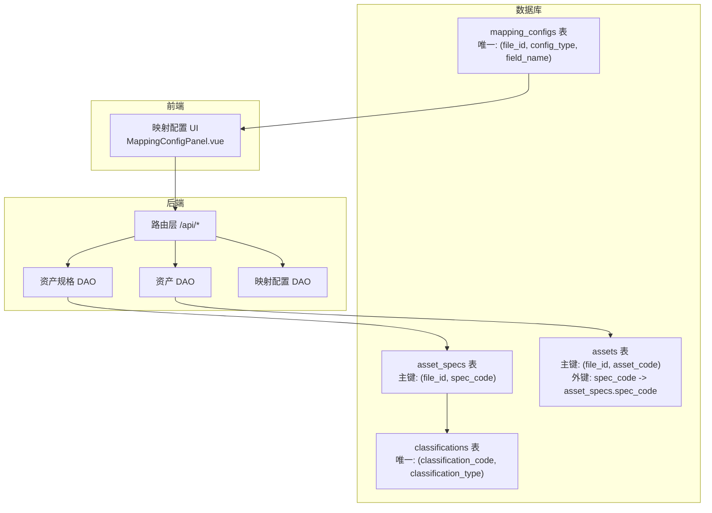
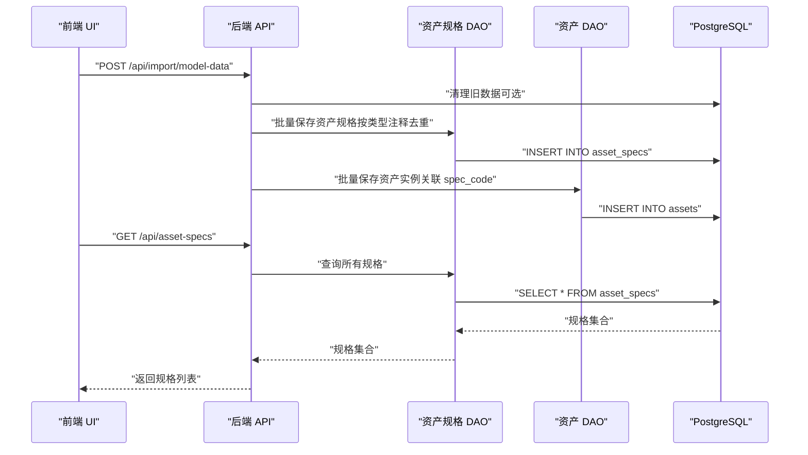
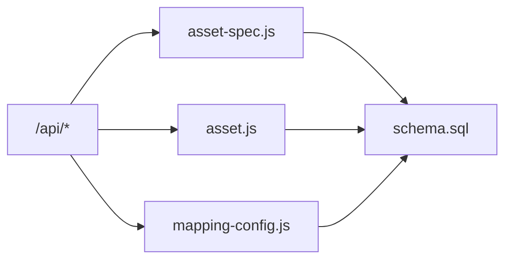

# 资产规格模型 (Asset Spec)

<cite>
**本文引用的文件**
- [server/models/asset-spec.js](file://server/models/asset-spec.js)
- [server/models/asset.js](file://server/models/asset.js)
- [server/db/schema.sql](file://server/db/schema.sql)
- [MAPPING_UI_COMPLETE.md](file://MAPPING_UI_COMPLETE.md)
- [MAPPING_CONFIG_COMPLETE.md](file://MAPPING_CONFIG_COMPLETE.md)
- [server/routes/api.js](file://server/routes/api.js)
- [server/models/mapping-config.js](file://server/models/mapping-config.js)
- [server/db/migrations/create_mapping_config.sql](file://server/db/migrations/create_mapping_config.sql)
</cite>

## 目录
1. [简介](#简介)
2. [项目结构](#项目结构)
3. [核心组件](#核心组件)
4. [架构总览](#架构总览)
5. [详细组件分析](#详细组件分析)
6. [依赖分析](#依赖分析)
7. [性能考虑](#性能考虑)
8. [故障排查指南](#故障排查指南)
9. [结论](#结论)
10. [附录](#附录)

## 简介
本文件系统性阐述资产规格模型（Asset Spec）的设计与实现，聚焦以下目标：
- 规格主键 spec_code 的唯一性约束及其与资产实例的关联关系
- classification_code 与 classification_desc 的分类继承语义
- BIM 构件属性 category、family、type 的语义与用途
- 制造商信息 manufacturer、address、phone 的存储与用途
- 结合映射配置（MAPPING_UI_COMPLETE.md）说明规格属性与 BIM 模型原始字段的映射关系
- 解释如何通过 spec_code 实现“一型多例”的资产实例管理范式
- 提供规格数据查询与维护的接口与代码路径示例

## 项目结构
围绕资产规格模型的关键文件分布如下：
- 数据库层：PostgreSQL 表结构定义与索引、触发器注释
- 模型层：资产规格与资产的数据访问对象（DAO）
- 路由层：REST API，提供规格与资产的查询、导入、更新能力
- 映射配置：前端映射 UI 与数据库持久化配置

图表来源
- [server/db/schema.sql](file://server/db/schema.sql#L1-L160)
- [server/models/asset-spec.js](file://server/models/asset-spec.js#L1-L166)
- [server/models/asset.js](file://server/models/asset.js#L1-L253)
- [server/routes/api.js](file://server/routes/api.js#L1-L517)
- [server/models/mapping-config.js](file://server/models/mapping-config.js#L1-L115)
- [server/db/migrations/create_mapping_config.sql](file://server/db/migrations/create_mapping_config.sql#L1-L29)

章节来源
- [server/db/schema.sql](file://server/db/schema.sql#L1-L160)
- [server/models/asset-spec.js](file://server/models/asset-spec.js#L1-L166)
- [server/models/asset.js](file://server/models/asset.js#L1-L253)
- [server/routes/api.js](file://server/routes/api.js#L1-L517)
- [server/models/mapping-config.js](file://server/models/mapping-config.js#L1-L115)
- [server/db/migrations/create_mapping_config.sql](file://server/db/migrations/create_mapping_config.sql#L1-L29)

## 核心组件
- 资产规格 DAO：提供 upsert、批量 upsert、按分类查询、按编码查询、全量查询等方法
- 资产 DAO：提供资产 upsert、批量 upsert、按规格查询、按楼层/房间查询、全量查询、更新等方法
- 数据库表结构：定义 asset_specs、assets、classifications、mapping_configs 的字段、唯一性与索引
- 路由 API：提供 /api/asset-specs 与 /api/assets 的查询、导入、更新接口
- 映射配置：前端映射 UI 与后端持久化，支撑从 BIM 模型字段到规格字段的映射

章节来源
- [server/models/asset-spec.js](file://server/models/asset-spec.js#L1-L166)
- [server/models/asset.js](file://server/models/asset.js#L1-L253)
- [server/db/schema.sql](file://server/db/schema.sql#L1-L160)
- [server/routes/api.js](file://server/routes/api.js#L1-L517)
- [MAPPING_UI_COMPLETE.md](file://MAPPING_UI_COMPLETE.md#L52-L80)
- [MAPPING_CONFIG_COMPLETE.md](file://MAPPING_CONFIG_COMPLETE.md#L88-L108)

## 架构总览
资产规格模型通过“规格”与“实例”分离的方式实现“一型多例”管理：
- 规格（asset_specs）：描述构件类型（如某个品牌型号的风机盘管），以 spec_code 为全局唯一键（在文件维度上也保持唯一）
- 实例（assets）：具体构件对象，通过 spec_code 关联到规格，形成一对多关系

图表来源
- [server/routes/api.js](file://server/routes/api.js#L297-L464)
- [server/models/asset-spec.js](file://server/models/asset-spec.js#L34-L74)
- [server/models/asset.js](file://server/models/asset.js#L27-L60)

章节来源
- [server/routes/api.js](file://server/routes/api.js#L297-L464)
- [server/models/asset-spec.js](file://server/models/asset-spec.js#L34-L74)
- [server/models/asset.js](file://server/models/asset.js#L27-L60)

## 详细组件分析

### 资产规格表（asset_specs）与主键约束
- 主键与唯一性
  - 主键：(file_id, spec_code)，确保同一文件内的规格编码唯一
  - 全局唯一性：在业务层面，spec_code 作为全局共享的规格标识，跨文件共享；但在 DAO 层的批量 upsert with file 仍以 file_id 作为唯一键的一部分，避免跨文件冲突
- 字段语义
  - spec_code：规格编码，来自构件的类型注释属性
  - spec_name：规格名称，来自构件的类型名称属性
  - classification_code / classification_desc：OmniClass 21 编号与描述，用于分类继承
  - category / family / type：BIM 构件的类别、族、类型语义
  - manufacturer / address / phone：制造商信息，便于溯源与维保
- 索引与注释
  - 为 spec_name、classification_code、category、family 建立索引，提升查询性能
  - 表与列均配有注释，明确字段来源与用途

章节来源
- [server/db/schema.sql](file://server/db/schema.sql#L18-L52)
- [server/db/schema.sql](file://server/db/schema.sql#L72-L96)
- [server/db/schema.sql](file://server/db/schema.sql#L138-L160)

### 资产表（assets）与外键关联
- 外键关系
  - assets.spec_code 引用 asset_specs.spec_code，建立“一型多例”的关联
  - assets.file_id 与 asset_specs.file_id 保持一致，确保文件内数据隔离
- 查询与更新
  - 资产查询时通过 LEFT JOIN 合并规格字段，便于前端展示
  - 支持按楼层、房间、规格编码等维度检索
  - 支持 PATCH 更新资产属性，包括规格相关字段

章节来源
- [server/db/schema.sql](file://server/db/schema.sql#L38-L52)
- [server/models/asset.js](file://server/models/asset.js#L62-L103)
- [server/models/asset.js](file://server/models/asset.js#L144-L179)
- [server/routes/api.js](file://server/routes/api.js#L175-L201)

### 分类信息继承（classification_code 与 classification_desc）
- 来源与用途
  - classification_code 与 classification_desc 来自 OmniClass 21 编号与描述
  - 通过分类表（classifications）进行统一管理，资产与规格均可引用
- 设计要点
  - 分类表的唯一性约束为 (classification_code, classification_type)，支持资产与空间两类分类
  - 规格表保留 classification_code 与 classification_desc 字段，便于在规格层面复用分类信息

章节来源
- [server/db/schema.sql](file://server/db/schema.sql#L6-L17)
- [server/db/schema.sql](file://server/db/schema.sql#L138-L151)

### BIM 构件属性语义（category、family、type）
- 语义说明
  - category：构件类别（如 HVAC、Electrical 等）
  - family：族（如 AirTerminalFamily）
  - type：类型（如 AHU-2000）
- 存储用途
  - 与 spec_code 协同工作，形成“类型注释 + 类别/族/类型”的组合标识，便于筛选与归档

章节来源
- [MAPPING_UI_COMPLETE.md](file://MAPPING_UI_COMPLETE.md#L65-L79)
- [server/db/schema.sql](file://server/db/schema.sql#L27-L32)

### 制造商信息（manufacturer、address、phone）
- 存储用途
  - manufacturer：制造商名称，便于溯源与维保
  - address / phone：联系信息，支持快速对接供应商或维保单位
- 数据来源
  - 通过映射配置 UI 将 BIM 模型中的制造商、地址、电话等属性映射到规格字段

章节来源
- [MAPPING_UI_COMPLETE.md](file://MAPPING_UI_COMPLETE.md#L65-L79)
- [server/db/schema.sql](file://server/db/schema.sql#L30-L32)

### 规格与 BIM 原始字段的映射关系
- 映射配置 UI
  - 资产映射：MC 编码、规格编码、名称、楼层、房间
  - 规格映射：specCode、specName、classificationCode、classificationDesc、category、family、type、manufacturer、address、phone
- 特殊匹配规则
  - 对于包含点号的属性（如 OmniClass.21.Number），仅匹配属性名，忽略分类
- 数据持久化
  - 映射配置保存在 mapping_configs 表，按 file_id、config_type、field_name 唯一

章节来源
- [MAPPING_UI_COMPLETE.md](file://MAPPING_UI_COMPLETE.md#L52-L80)
- [MAPPING_UI_COMPLETE.md](file://MAPPING_UI_COMPLETE.md#L105-L113)
- [MAPPING_CONFIG_COMPLETE.md](file://MAPPING_CONFIG_COMPLETE.md#L88-L108)
- [server/db/migrations/create_mapping_config.sql](file://server/db/migrations/create_mapping_config.sql#L1-L29)
- [server/models/mapping-config.js](file://server/models/mapping-config.js#L1-L115)

### “一型多例”的实现范式
- 规格（一）：以 spec_code 为键，描述构件类型
- 实例（多）：以 asset_code 为键，描述具体构件对象
- 关联方式：assets.spec_code -> asset_specs.spec_code
- 文件隔离：通过 file_id 保障不同模型文件之间的数据隔离与互不影响

章节来源
- [server/db/schema.sql](file://server/db/schema.sql#L18-L52)
- [server/models/asset-spec.js](file://server/models/asset-spec.js#L103-L156)
- [server/models/asset.js](file://server/models/asset.js#L144-L179)

### 规格数据查询与维护（接口与代码路径）
- 查询
  - 获取所有规格：GET /api/asset-specs
  - 按编码获取规格：GET /api/asset-specs/:code
  - 按分类编码获取规格列表：GET /api/asset-specs?classificationCode=...
- 导入
  - 批量导入规格：POST /api/asset-specs/batch
  - 从模型导入综合数据（含规格与资产）：POST /api/import/model-data
- 维护
  - 更新资产属性（可同时更新规格相关字段）：PATCH /api/assets/:code
  - 映射配置读写：GET/POST /api/mapping-config/:fileId

章节来源
- [server/routes/api.js](file://server/routes/api.js#L53-L97)
- [server/routes/api.js](file://server/routes/api.js#L297-L464)
- [server/routes/api.js](file://server/routes/api.js#L175-L201)
- [server/routes/api.js](file://server/routes/api.js#L468-L515)
- [server/models/asset-spec.js](file://server/models/asset-spec.js#L76-L101)
- [server/models/asset.js](file://server/models/asset.js#L62-L103)

## 依赖分析
- 表间依赖
  - assets.spec_code -> asset_specs.spec_code
  - assets.file_id、asset_specs.file_id -> model_files(id)（外键约束）
  - mapping_configs.file_id -> model_files(id)（外键约束）
- 模块依赖
  - 路由层依赖资产规格与资产 DAO
  - 资产规格 DAO 依赖数据库连接工具
  - 映射配置 DAO 依赖数据库连接池

图表来源
- [server/routes/api.js](file://server/routes/api.js#L1-L517)
- [server/models/asset-spec.js](file://server/models/asset-spec.js#L1-L166)
- [server/models/asset.js](file://server/models/asset.js#L1-L253)
- [server/models/mapping-config.js](file://server/models/mapping-config.js#L1-L115)
- [server/db/schema.sql](file://server/db/schema.sql#L1-L160)

章节来源
- [server/routes/api.js](file://server/routes/api.js#L1-L517)
- [server/models/asset-spec.js](file://server/models/asset-spec.js#L1-L166)
- [server/models/asset.js](file://server/models/asset.js#L1-L253)
- [server/models/mapping-config.js](file://server/models/mapping-config.js#L1-L115)
- [server/db/schema.sql](file://server/db/schema.sql#L1-L160)

## 性能考虑
- 索引策略
  - 为 asset_specs 的 spec_name、classification_code、category、family 建立索引，提升筛选与排序性能
  - 为 assets 的 spec_code、floor、room、db_id 建立索引，优化查询效率
- 批量操作
  - DAO 提供批量 upsert，使用事务包裹，减少往返次数，提升导入性能
- 文件隔离
  - 通过 file_id 限定查询范围，避免跨文件扫描，降低查询成本

章节来源
- [server/db/schema.sql](file://server/db/schema.sql#L72-L96)
- [server/models/asset-spec.js](file://server/models/asset-spec.js#L34-L74)
- [server/models/asset.js](file://server/models/asset.js#L27-L60)

## 故障排查指南
- 规格导入失败
  - 检查请求体是否为数组，确认字段映射正确
  - 查看后端日志与错误响应，定位重复键或字段缺失问题
- 资产更新报错
  - 确认 PATCH 请求体中的字段是否在允许列表内
  - 若更新涉及规格字段，确保对应规格已存在
- 映射配置异常
  - 确认 file_id 是否有效
  - 检查 mapping_configs 表是否存在重复键（file_id, config_type, field_name）

章节来源
- [server/routes/api.js](file://server/routes/api.js#L82-L97)
- [server/routes/api.js](file://server/routes/api.js#L175-L201)
- [server/models/mapping-config.js](file://server/models/mapping-config.js#L56-L115)
- [server/db/migrations/create_mapping_config.sql](file://server/db/migrations/create_mapping_config.sql#L1-L29)

## 结论
资产规格模型通过规范化的表结构、严格的唯一性约束与清晰的外键关系，实现了“一型多例”的高效管理。配合映射配置体系，能够稳定地将 BIM 模型中的原始字段映射到规格字段，支撑后续的查询、筛选与维护工作。建议在生产环境中持续关注索引与批量导入的性能表现，并完善映射配置的校验与回退机制。

## 附录
- 代码示例路径（不展示具体代码内容）
  - 获取所有规格：[server/routes/api.js](file://server/routes/api.js#L53-L64) -> [server/models/asset-spec.js](file://server/models/asset-spec.js#L76-L83)
  - 按编码获取规格：[server/routes/api.js](file://server/routes/api.js#L66-L80) -> [server/models/asset-spec.js](file://server/models/asset-spec.js#L88-L92)
  - 批量导入规格：[server/routes/api.js](file://server/routes/api.js#L82-L97) -> [server/models/asset-spec.js](file://server/models/asset-spec.js#L34-L74)
  - 从模型导入综合数据（含规格与资产）：[server/routes/api.js](file://server/routes/api.js#L297-L464) -> [server/models/asset-spec.js](file://server/models/asset-spec.js#L103-L156), [server/models/asset.js](file://server/models/asset.js#L144-L200)
  - 更新资产属性（含规格字段）：[server/routes/api.js](file://server/routes/api.js#L175-L201) -> [server/models/asset.js](file://server/models/asset.js#L202-L239)
  - 映射配置读写：[server/routes/api.js](file://server/routes/api.js#L468-L515) -> [server/models/mapping-config.js](file://server/models/mapping-config.js#L1-L115)