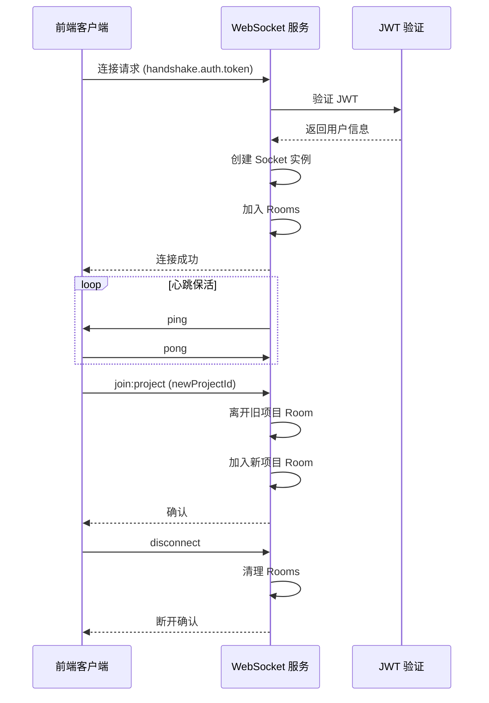

# WebSocket 控制通道服务

<cite>
**本文档引用文件**
- [server/services/ws-control-channel.js](../../../../../../server/services/ws-control-channel.js)
- [server/routes/atomic/v1/ui.js](../../../../../../server/routes/atomic/v1/ui.js)
- [server/index.js](../../../../../../server/index.js)
</cite>

## 目录
1. [概述](#概述)
2. [架构设计](#架构设计)
3. [握手鉴权](#握手鉴权)
4. [Room 机制](#room-机制)
5. [消息协议](#消息协议)
6. [服务端 API](#服务端-api)
7. [客户端集成](#客户端集成)
8. [安全配置](#安全配置)

## 概述

WebSocket 控制通道服务是 TwinSight 平台实现 AI Hub 到前端定向 UI 指令推送的核心组件。它基于 Socket.IO 构建，提供双向实时通信能力，使 AI Agent 能够直接控制前端 3D 查看器的行为（如导航、高亮、隔离等）。

```mermaid
graph TB
    subgraph "AI Hub"
        A[AI Agent]
    end
    subgraph "TwinSight 后端"
        B[Atomic API]
        C[WebSocket<br/>控制通道]
    end
    subgraph "前端"
        D[Vue 3 App]
        E[Forge Viewer]
    end
    A -->|POST /ui/command| B
    B -->|io.to(room).emit| C
    C -->|ui:command| D
    D -->|执行指令| E
```

**核心特性：**
- **JWT 握手鉴权**：连接时验证用户身份
- **Room 隔离**：基于用户、项目、会话的多维度隔离
- **禁止全局广播**：仅允许定向 Room 推送，确保安全
- **动态项目切换**：支持运行时切换项目 Room

**Section sources**
- [server/services/ws-control-channel.js](../../../../../../server/services/ws-control-channel.js)

## 架构设计

### 路径与配置

| 属性 | 值 | 说明 |
|------|-----|------|
| 路径 | `/ws/control` | WebSocket 连接端点 |
| 协议 | Socket.IO | 基于 WebSocket 的实时通信库 |
| Ping 超时 | 60秒 | 连接保活检测 |
| Ping 间隔 | 25秒 | 心跳包发送频率 |

### 连接生命周期



**Section sources**
- [server/services/ws-control-channel.js](../../../../../../server/services/ws-control-channel.js)

## 握手鉴权

### 连接参数

客户端连接时需要提供以下认证信息：

```javascript
const socket = io('ws://api.twinsight.local', {
    path: '/ws/control',
    auth: {
        token: 'user_jwt_token',     // JWT 令牌（生产环境必填）
        projectId: 'project_123'     // 项目 ID（可选）
    }
});
```

### 鉴权流程

1. **提取 Token**：从 `socket.handshake.auth.token` 获取 JWT
2. **验证 Token**：使用 `config.jwt.secret` 验证签名
3. **开发模式**：未提供 Token 时允许匿名连接（仅开发环境）
4. **挂载用户信息**：将解码后的用户信息挂载到 `socket.user`

### 开发模式行为

```javascript
if (!token) {
    if (config.server.env === 'development') {
        socket.user = { id: 0, username: 'dev-guest' };
        socket.projectId = projectId || 'dev-project';
        console.warn('⚠️  [ws-control] 开发模式：匿名连接已允许');
        return next();
    }
    return next(new Error('Authentication required: token missing'));
}
```

**Section sources**
- [server/services/ws-control-channel.js](../../../../../../server/services/ws-control-channel.js)

## Room 机制

### Room 类型

每个连接会自动加入以下 Room：

| Room 名称 | 格式 | 说明 |
|-----------|------|------|
| 用户 Room | `user:{userId}` | 基于用户 ID，用于定向推送给特定用户 |
| 会话 Room | `session:{socketId}` | 基于 Socket ID，用于定向推送给特定会话 |
| 项目 Room | `project:{projectId}` | 基于项目 ID，用于广播给项目内所有用户 |

### Room 加入逻辑

```javascript
socket.join(`user:${userId}`);
socket.join(`session:${socket.id}`);
if (projectId) {
    socket.join(`project:${projectId}`);
}
```

### 项目切换

客户端可以动态切换项目 Room：

```javascript
// 客户端发送
socket.emit('join:project', 'new_project_id');

// 服务端处理
socket.on('join:project', (newProjectId) => {
    if (socket.projectId) {
        socket.leave(`project:${socket.projectId}`);
    }
    socket.projectId = newProjectId;
    socket.join(`project:${newProjectId}`);
});
```

### 安全限制

⚠️ **禁止全局广播**：服务端代码禁止直接使用 `io.emit()`，必须使用 `io.to(room).emit()` 进行定向推送。

```javascript
// ❌ 禁止：全局广播
io.emit('ui:command', command);

// ✅ 允许：定向 Room 推送
io.to(`project:${projectId}`).emit('ui:command', command);
io.to(`session:${sessionId}`).emit('ui:command', command);
```

**Section sources**
- [server/services/ws-control-channel.js](../../../../../../server/services/ws-control-channel.js)

## 消息协议

### 服务端推送事件

#### `ui:command` - UI 控制指令

由 Atomic API 的 UI 端点触发，推送到前端执行。

**消息格式：**
```json
{
  "type": "highlight",
  "target": "=A1.FAN01",
  "sessionId": "socket_xxx",
  "params": {
    "color": "red",
    "duration": 5000
  },
  "scope": {
    "projectId": "project_123",
    "fileId": 456
  },
  "actor": {
    "userId": 1,
    "username": "admin"
  },
  "timestamp": "2024-01-15T10:30:00Z"
}
```

**指令类型：**

| 类型 | 说明 | 参数 |
|------|------|------|
| `navigate` | 导航到指定对象 | `target`: RDS 编码 |
| `highlight` | 高亮显示对象 | `target`: RDS 编码, `params.color`: 颜色 |
| `isolate` | 隔离显示对象 | `target`: RDS 编码 |
| `reset` | 重置视图 | 无 |

### 客户端发送事件

#### `join:project` - 切换项目

```javascript
socket.emit('join:project', 'new_project_id');
```

## 服务端 API

### 初始化控制通道

```javascript
import { initControlChannel } from './services/ws-control-channel.js';

// 在 HTTP 服务器启动后初始化
const io = await initControlChannel(httpServer);

// 将 io 实例挂载到 app，供路由使用
app.set('io', io);
```

### 在路由中推送消息

```javascript
router.post('/command', async (req, res) => {
    const io = req.app.get('io');
    if (io) {
        const targetRoom = sessionId
            ? `session:${sessionId}`
            : `project:${req.scope.projectId}`;

        io.to(targetRoom).emit('ui:command', command);
        console.log(`📡 [ui-command] Pushed to room: ${targetRoom}`);
    }
});
```

**Section sources**
- [server/routes/atomic/v1/ui.js](../../../../../../server/routes/atomic/v1/ui.js)

## 客户端集成

### 安装依赖

```bash
npm install socket.io-client
```

### Vue 3 集成示例

```typescript
// composables/useControlChannel.ts
import { ref, onMounted, onUnmounted } from 'vue';
import { io, Socket } from 'socket.io-client';
import { useAuthStore } from '@/stores/auth';

export function useControlChannel() {
    const socket = ref<Socket | null>(null);
    const connected = ref(false);
    const authStore = useAuthStore();

    const connect = (projectId: string) => {
        socket.value = io(import.meta.env.VITE_API_URL, {
            path: '/ws/control',
            auth: {
                token: authStore.token,
                projectId
            }
        });

        socket.value.on('connect', () => {
            connected.value = true;
            console.log('[ws-control] 已连接');
        });

        socket.value.on('disconnect', () => {
            connected.value = false;
            console.log('[ws-control] 已断开');
        });

        // 监听 UI 控制指令
        socket.value.on('ui:command', (command) => {
            handleUICommand(command);
        });
    };

    const disconnect = () => {
        socket.value?.disconnect();
    };

    const switchProject = (projectId: string) => {
        socket.value?.emit('join:project', projectId);
    };

    const handleUICommand = (command: any) => {
        switch (command.type) {
            case 'navigate':
                navigateToObject(command.target);
                break;
            case 'highlight':
                highlightObject(command.target, command.params);
                break;
            case 'isolate':
                isolateObject(command.target);
                break;
            case 'reset':
                resetView();
                break;
        }
    };

    onUnmounted(() => {
        disconnect();
    });

    return {
        socket,
        connected,
        connect,
        disconnect,
        switchProject
    };
}
```

### Forge Viewer 指令处理

```typescript
// 导航到对象
function navigateToObject(dbId: number) {
    const viewer = getViewer();
    viewer.select(dbId);
    viewer.fitToView([dbId]);
}

// 高亮对象
function highlightObject(dbId: number, params?: { color?: string }) {
    const viewer = getViewer();
    const color = params?.color || 'red';

    // 设置高亮颜色
    viewer.setColorMaterial([dbId], new THREE.Color(color));

    // 5秒后恢复
    setTimeout(() => {
        viewer.clearHighlight();
    }, 5000);
}

// 隔离对象
function isolateObject(dbId: number) {
    const viewer = getViewer();
    viewer.isolate([dbId]);
}

// 重置视图
function resetView() {
    const viewer = getViewer();
    viewer.isolate([]);
    viewer.clearSelection();
    viewer.navigation.setView(new THREE.Vector3(0, 0, 0), new THREE.Vector3(1, 1, 1));
}
```

**Section sources**
- [server/services/ws-control-channel.js](../../../../../../server/services/ws-control-channel.js)

## 安全配置

### CORS 配置

```javascript
const io = new Server(httpServer, {
    path: '/ws/control',
    cors: {
        origin: '*', // 生产环境应限制为具体域名
        methods: ['GET', 'POST']
    }
});
```

### 生产环境建议

1. **限制 CORS 域名**：
   ```javascript
   cors: {
       origin: ['https://app.twinsight.com', 'https://admin.twinsight.com'],
       methods: ['GET', 'POST'],
       credentials: true
   }
   ```

2. **启用传输加密**：
   - 使用 WSS（WebSocket Secure）而非 WS
   - 配置 SSL/TLS 证书

3. **连接限流**：
   - 限制每个用户的并发连接数
   - 实施 IP 级别的速率限制

4. **监控与告警**：
   - 监控异常连接模式
   - 设置连接数阈值告警

### 环境变量

| 变量名 | 说明 | 默认值 |
|--------|------|--------|
| `JWT_SECRET` | JWT 签名密钥 | 必填 |
| `NODE_ENV` | 环境模式 | `development` |

**Section sources**
- [server/services/ws-control-channel.js](../../../../../../server/services/ws-control-channel.js)
- [server/index.js](../../../../../../server/index.js)
