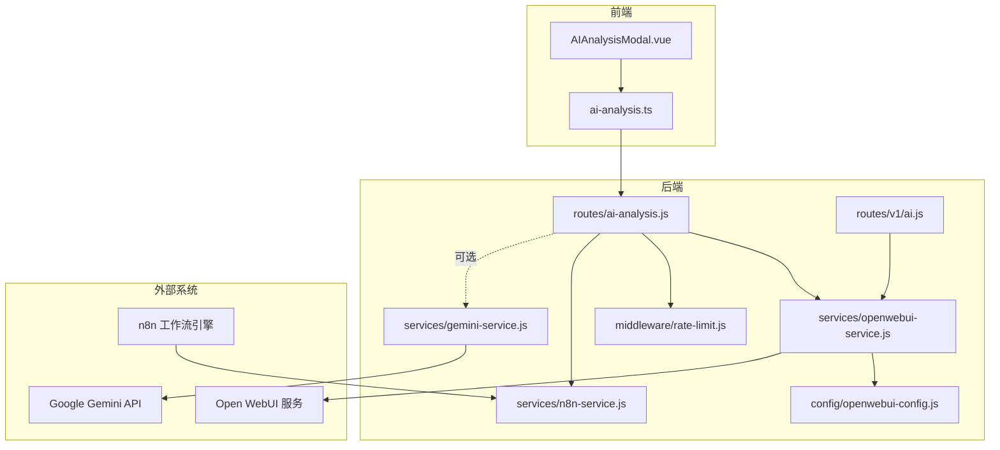
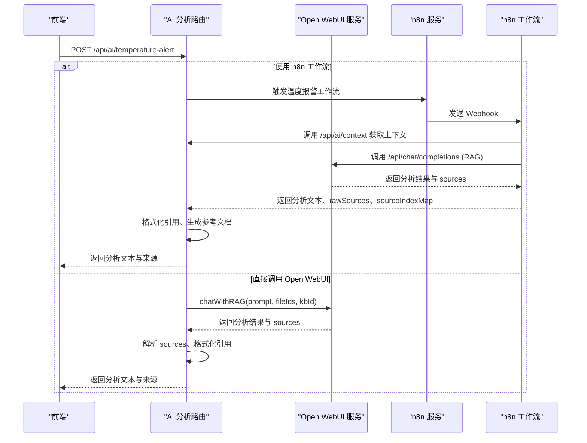
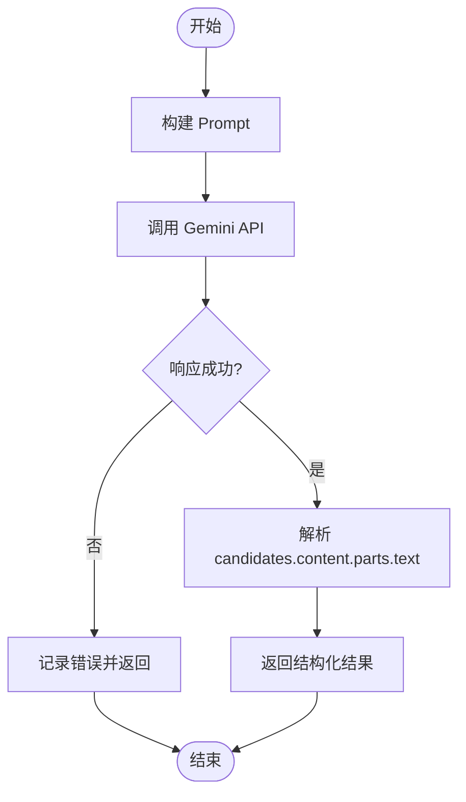
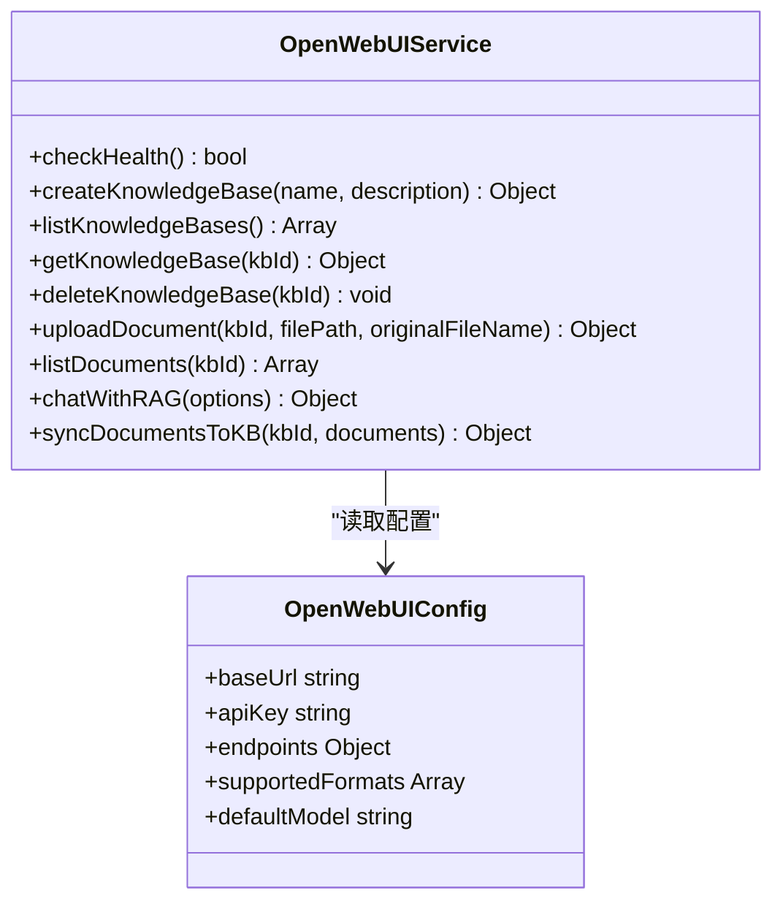
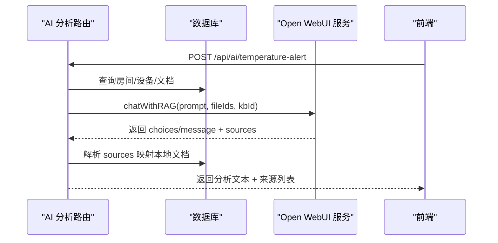
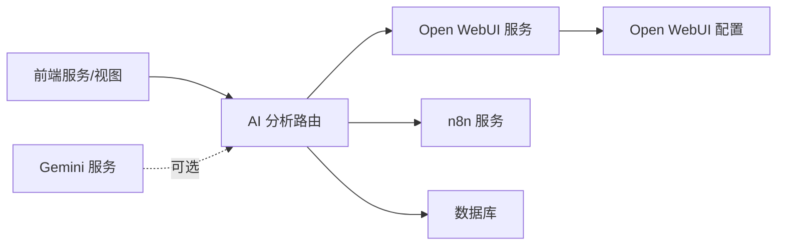

# Gemini AI 服务

<cite>
**本文引用的文件**
- [gemini-service.js](file://server/services/gemini-service.js)
- [openwebui-service.js](file://server/services/openwebui-service.js)
- [openwebui-config.js](file://server/config/openwebui-config.js)
- [ai.js（v1 路由）](file://server/routes/v1/ai.js)
- [ai-analysis.js（AI 分析路由）](file://server/routes/ai-analysis.js)
- [n8n-service.js](file://server/services/n8n-service.js)
- [temperature-alert-workflow.json](file://n8n-workflows/temperature-alert-workflow.json)
- [ai-analysis.ts（前端服务）](file://src/services/ai-analysis.ts)
- [AIAnalysisModal.vue（前端组件）](file://src/components/viewer/AIAnalysisModal.vue)
- [rate-limit.js（限流中间件）](file://server/middleware/rate-limit.js)
- [schema.sql（数据库模式）](file://server/db/schema.sql)
- [create_documents_table.sql（文档表）](file://server/db/create_documents_table.sql)
</cite>

## 目录
1. [简介](#简介)
2. [项目结构](#项目结构)
3. [核心组件](#核心组件)
4. [架构总览](#架构总览)
5. [详细组件分析](#详细组件分析)
6. [依赖关系分析](#依赖关系分析)
7. [性能与成本考虑](#性能与成本考虑)
8. [安全与合规](#安全与合规)
9. [故障排查指南](#故障排查指南)
10. [结论](#结论)

## 简介
本文件面向 TwinSight 平台的 Gemini AI 服务集成，系统性说明以下内容：
- gemini-service.js 如何封装对 Gemini 模型的 API 调用，包括请求构造、响应解析与错误处理；
- 提示词（prompt）工程的设计原则及动态生成机制；
- 与 Open WebUI 知识库的协同工作模式，支持智能问答与文档摘要功能；
- 结合 n8n 工作流示例说明 AI 分析任务的触发与结果传递流程；
- 敏感信息过滤与输出内容校验的安全实践；
- API 调用限流、缓存策略及成本控制方案。

## 项目结构
围绕 AI 服务的关键目录与文件：
- 后端服务层：gemini-service.js、openwebui-service.js、openwebui-config.js、ai-analysis.js、ai.js（v1）、n8n-service.js、rate-limit.js
- 前端服务与视图：ai-analysis.ts、AIAnalysisModal.vue
- 数据库：schema.sql、create_documents_table.sql
- n8n 工作流：temperature-alert-workflow.json

图表来源
- [ai-analysis.js（AI 分析路由）](file://server/routes/ai-analysis.js#L1-L120)
- [openwebui-service.js](file://server/services/openwebui-service.js#L1-L120)
- [openwebui-config.js](file://server/config/openwebui-config.js#L1-L56)
- [gemini-service.js](file://server/services/gemini-service.js#L1-L111)
- [ai.js（v1 路由）](file://server/routes/v1/ai.js#L1-L120)
- [n8n-service.js](file://server/services/n8n-service.js#L1-L150)

章节来源
- [ai-analysis.js（AI 分析路由）](file://server/routes/ai-analysis.js#L1-L120)
- [openwebui-service.js](file://server/services/openwebui-service.js#L1-L120)
- [openwebui-config.js](file://server/config/openwebui-config.js#L1-L56)
- [gemini-service.js](file://server/services/gemini-service.js#L1-L111)
- [ai.js（v1 路由）](file://server/routes/v1/ai.js#L1-L120)
- [n8n-service.js](file://server/services/n8n-service.js#L1-L150)

## 核心组件
- Gemini 直接调用服务：封装 Google Gemini API，构造 Prompt 并解析响应，返回结构化分析结果。
- Open WebUI 服务：统一管理知识库、文件上传与 RAG 查询，屏蔽底层 API 差异。
- AI 分析路由：统一对外提供温度报警分析、手动分析、上下文查询、来源格式化等能力；支持直连 Open WebUI 或通过 n8n 工作流。
- 前端服务与视图：触发分析、展示结果、点击引用文档打开预览。
- 限流中间件：保护后端 API，防止滥用。
- n8n 服务：触发工作流，便于编排复杂分析链路。

章节来源
- [gemini-service.js](file://server/services/gemini-service.js#L1-L111)
- [openwebui-service.js](file://server/services/openwebui-service.js#L1-L120)
- [ai-analysis.js（AI 分析路由）](file://server/routes/ai-analysis.js#L1-L200)
- [ai.js（v1 路由）](file://server/routes/v1/ai.js#L1-L120)
- [ai-analysis.ts（前端服务）](file://src/services/ai-analysis.ts#L1-L120)
- [AIAnalysisModal.vue（前端组件）](file://src/components/viewer/AIAnalysisModal.vue#L1-L120)
- [rate-limit.js（限流中间件）](file://server/middleware/rate-limit.js#L1-L94)
- [n8n-service.js](file://server/services/n8n-service.js#L1-L150)

## 架构总览
AI 分析支持两种模式：
- 直接调用 Open WebUI：后端直接发起 RAG 查询，返回结构化分析与来源。
- 通过 n8n 工作流：前端触发后端转发至 n8n，n8n 内部调用 Open WebUI，再由后端进行来源格式化与引用链接生成。

图表来源
- [ai-analysis.js（AI 分析路由）](file://server/routes/ai-analysis.js#L1-L200)
- [openwebui-service.js](file://server/services/openwebui-service.js#L240-L310)
- [n8n-service.js](file://server/services/n8n-service.js#L1-L120)
- [temperature-alert-workflow.json](file://n8n-workflows/temperature-alert-workflow.json#L1-L120)

## 详细组件分析

### Gemini 直接调用服务（gemini-service.js）
- 请求构造
  - 通过配置服务获取 API Key，并拼接 Gemini API URL。
  - 构建 Prompt，包含报警类型、房间信息、阈值与时间等上下文。
  - 使用 JSON 请求体，包含 contents 与 generationConfig（温度、最大输出令牌数）。
- 响应解析
  - 校验 HTTP 状态，非 2xx 记录错误并返回结构化错误对象。
  - 从 candidates[0].content.parts[0].text 提取分析文本。
- 错误处理
  - API Key 未配置时返回明确提示。
  - 捕获异常并返回错误信息。

图表来源
- [gemini-service.js](file://server/services/gemini-service.js#L14-L111)

章节来源
- [gemini-service.js](file://server/services/gemini-service.js#L1-L111)

### Open WebUI 服务（openwebui-service.js）
- 统一请求封装
  - request 方法统一处理鉴权头、Content-Type、错误处理与 JSON 解析。
- 知识库管理
  - 健康检查、创建知识库、列出知识库、获取详情、删除知识库。
- 文档同步
  - 上传文件到 Open WebUI 文件系统，轮询等待处理完成，再添加到知识库。
  - 批量同步文档，统计成功/失败与结果明细。
- RAG 查询
  - chatWithRAG 构建消息与 files 数组（优先使用具体文件 ID，其次知识库 ID）。
  - 返回 choices[0].message.content 或 message.content，兼容字符串响应。

图表来源
- [openwebui-service.js](file://server/services/openwebui-service.js#L1-L359)
- [openwebui-config.js](file://server/config/openwebui-config.js#L1-L56)

章节来源
- [openwebui-service.js](file://server/services/openwebui-service.js#L1-L359)
- [openwebui-config.js](file://server/config/openwebui-config.js#L1-L56)

### AI 分析路由（ai-analysis.js）
- 模式切换
  - 通过环境变量控制使用 n8n 工作流或直接调用 Open WebUI。
- 温度报警分析
  - 直接调用 Open WebUI：构建 Prompt、查询上下文、准备 fileIds 与 kbId、调用 chatWithRAG、解析 sources、格式化引用、生成“参考的文档”。
  - 使用 n8n：转发到 n8n Webhook，后端再进行来源映射与引用格式化。
- 上下文查询
  - 根据 roomCode/fileId 获取房间、设备、文档与知识库信息。
- 来源格式化
  - 将 AI 文本中的 [source X]、[id: X]、[X] 等引用格式化为可点击链接，并生成“参考的文档”。

图表来源
- [ai-analysis.js（AI 分析路由）](file://server/routes/ai-analysis.js#L260-L800)
- [openwebui-service.js](file://server/services/openwebui-service.js#L240-L310)

章节来源
- [ai-analysis.js（AI 分析路由）](file://server/routes/ai-analysis.js#L1-L1200)
- [openwebui-service.js](file://server/services/openwebui-service.js#L240-L310)

### v1 AI 路由（ai.js）
- 健康检查、知识库管理、手动同步文档、RAG 查询、上下文查询、来源格式化等接口。
- 与 Open WebUI 服务配合，提供知识库与文档层面的统一入口。

章节来源
- [ai.js（v1 路由）](file://server/routes/v1/ai.js#L1-L416)
- [openwebui-service.js](file://server/services/openwebui-service.js#L1-L120)

### 前端集成（ai-analysis.ts 与 AIAnalysisModal.vue）
- ai-analysis.ts
  - 触发温度报警分析与手动分析，解析后端返回的分析文本与来源。
- AIAnalysisModal.vue
  - 展示分析结果，支持点击引用文档打开预览；将 Markdown 风格标题转换为 HTML。

章节来源
- [ai-analysis.ts（前端服务）](file://src/services/ai-analysis.ts#L1-L179)
- [AIAnalysisModal.vue（前端组件）](file://src/components/viewer/AIAnalysisModal.vue#L1-L120)

### n8n 工作流（n8n-service.js 与 temperature-alert-workflow.json）
- n8n-service.js
  - 触发温度报警与手动分析工作流，计算严重程度，检查 n8n 服务健康。
- temperature-alert-workflow.json
  - Webhook 触发 -> 查询上下文 -> 构建 Prompt -> 调用 Open WebUI RAG -> 解析回复 -> 返回结果。
  - 后端再进行来源映射与引用格式化。

章节来源
- [n8n-service.js](file://server/services/n8n-service.js#L1-L150)
- [temperature-alert-workflow.json](file://n8n-workflows/temperature-alert-workflow.json#L1-L197)

## 依赖关系分析
- 组件耦合
  - ai-analysis.js 依赖 openwebui-service.js 与 n8n-service.js；gemini-service.js 独立于 Open WebUI。
  - 前端 ai-analysis.ts 依赖后端 API；AIAnalysisModal.vue 依赖前端服务。
- 外部依赖
  - Open WebUI API、Google Gemini API、n8n Webhook。
- 数据库依赖
  - 知识库映射、文档同步状态、上下文查询依赖数据库表结构。

图表来源
- [ai-analysis.js（AI 分析路由）](file://server/routes/ai-analysis.js#L1-L200)
- [openwebui-service.js](file://server/services/openwebui-service.js#L1-L120)
- [openwebui-config.js](file://server/config/openwebui-config.js#L1-L56)
- [n8n-service.js](file://server/services/n8n-service.js#L1-L150)
- [gemini-service.js](file://server/services/gemini-service.js#L1-L111)

章节来源
- [ai-analysis.js（AI 分析路由）](file://server/routes/ai-analysis.js#L1-L200)
- [openwebui-service.js](file://server/services/openwebui-service.js#L1-L120)
- [openwebui-config.js](file://server/config/openwebui-config.js#L1-L56)
- [n8n-service.js](file://server/services/n8n-service.js#L1-L150)
- [gemini-service.js](file://server/services/gemini-service.js#L1-L111)

## 性能与成本考虑
- 限流策略
  - rate-limit.js 提供基于 IP/用户 ID 的滑动窗口限流，默认每分钟最多 100 次请求；敏感操作与登录场景提供更严格的限制。
- 缓存策略
  - 当前未实现显式缓存；可在网关或应用层引入短期缓存（如 Redis）缓存热点知识库查询与常用文档片段，降低 Open WebUI/RAG 调用频率。
- API 调用优化
  - Prompt 精简与结构化，减少 token 消耗；优先使用具体 fileIds，缩小检索范围。
  - 控制 generationConfig 的 temperature 与 maxOutputTokens，平衡质量与成本。
- 成本控制
  - 通过限流与缓存降低调用次数；在生产环境使用更经济的模型或按需调用；对高频查询建立预索引与预处理。
- 数据库性能
  - schema.sql 与 create_documents_table.sql 中的索引有助于加速上下文查询与文档匹配。

章节来源
- [rate-limit.js（限流中间件）](file://server/middleware/rate-limit.js#L1-L94)
- [openwebui-config.js](file://server/config/openwebui-config.js#L1-L56)
- [schema.sql（数据库模式）](file://server/db/schema.sql#L1-L202)
- [create_documents_table.sql（文档表）](file://server/db/create_documents_table.sql#L1-L49)

## 安全与合规
- 敏感信息过滤
  - Prompt 构建时避免泄露敏感字段（如完整地址、电话）；仅传递必要上下文（房间、设备、文档名等）。
- 输出内容校验
  - 后端对 AI 回复进行来源映射与引用格式化，确保引用可追溯；对未被 AI 明确引用的来源，采用“参考的文档”自动汇总，避免误导。
- 认证与授权
  - 前端通过 Authorization 头携带令牌；后端限流中间件区分用户与 IP，防止滥用。
- API Key 管理
  - Open WebUI 与 Gemini 的 API Key 通过环境变量注入，避免硬编码；n8n Webhook URL 亦通过环境变量配置。

章节来源
- [ai-analysis.js（AI 分析路由）](file://server/routes/ai-analysis.js#L1-L200)
- [openwebui-config.js](file://server/config/openwebui-config.js#L1-L56)
- [n8n-service.js](file://server/services/n8n-service.js#L1-L150)
- [rate-limit.js（限流中间件）](file://server/middleware/rate-limit.js#L1-L94)

## 故障排查指南
- Open WebUI 未配置或不可达
  - 检查 OPENWEBUI_URL 与 OPENWEBUI_API_KEY；使用健康检查接口验证连接。
- Gemini API 调用失败
  - 检查 GEMINI_API_KEY 是否配置；查看响应状态与错误文本；确认模型与生成参数合理。
- n8n 工作流未触发
  - 检查 N8N_WEBHOOK_URL 与 Webhook 路径；确认 n8n 服务健康；查看工作流节点日志。
- 来源格式化异常
  - 确认 sources 与本地文档映射正确；检查 AI 文本中的引用格式（[source X]、[id: X]、[X]）是否符合预期。
- 限流导致请求被拒绝
  - 检查限流配置与客户端重试策略；适当降低请求频率或增加配额。

章节来源
- [openwebui-config.js](file://server/config/openwebui-config.js#L1-L56)
- [gemini-service.js](file://server/services/gemini-service.js#L1-L111)
- [n8n-service.js](file://server/services/n8n-service.js#L1-L150)
- [ai-analysis.js（AI 分析路由）](file://server/routes/ai-analysis.js#L1-L200)
- [rate-limit.js（限流中间件）](file://server/middleware/rate-limit.js#L1-L94)

## 结论
本集成通过 Gemini 与 Open WebUI 的组合，实现了从温度报警到智能分析与来源溯源的闭环。后端提供灵活的模式切换（直连 Open WebUI 或 n8n 工作流），前端提供直观的可视化与交互体验。通过限流、来源映射与引用格式化，系统在保证安全性与可追溯性的同时，兼顾性能与成本控制。建议后续引入缓存与预索引机制，进一步提升响应速度与稳定性。