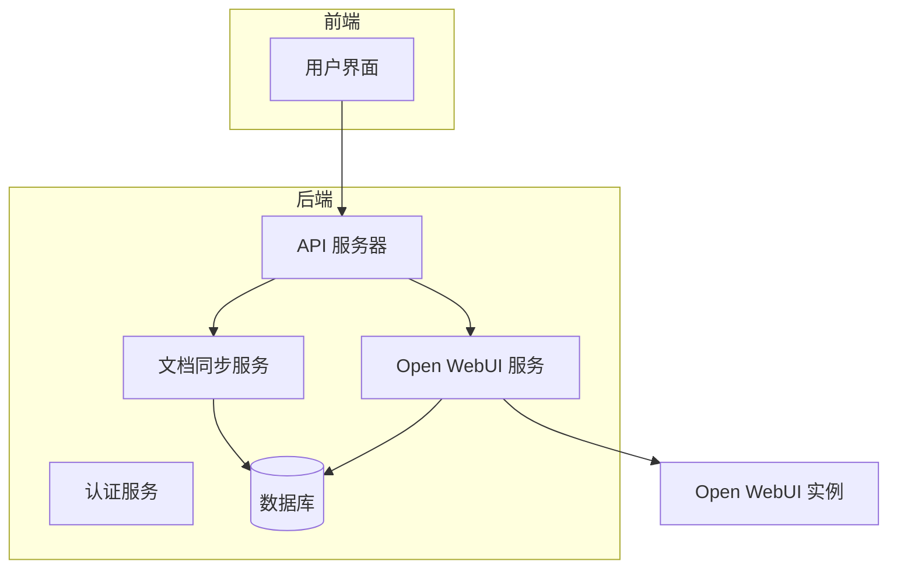
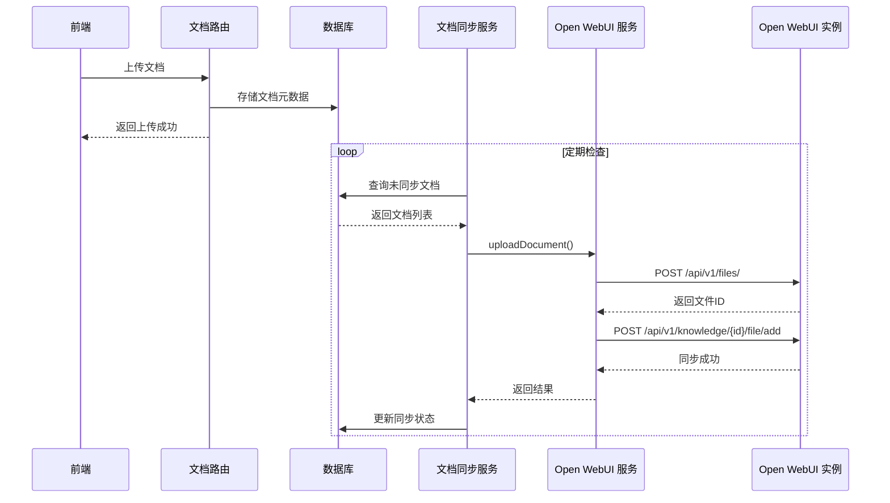
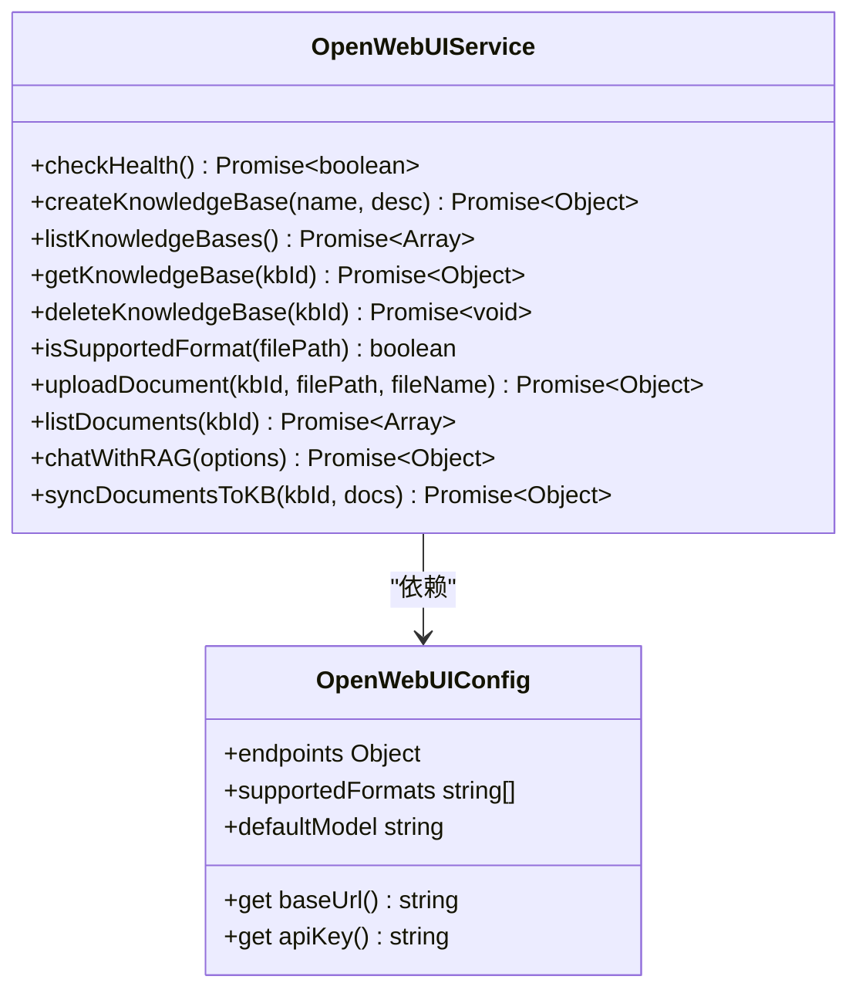
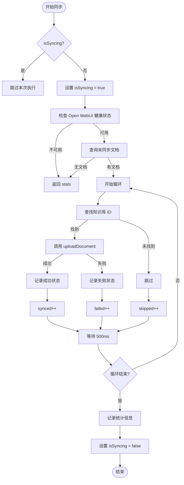
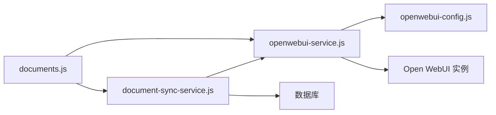

# Open WebUI 服务

<cite>
**本文档引用的文件**
- [openwebui-service.js](file://server/services/openwebui-service.js)
- [openwebui-config.js](file://server/config/openwebui-config.js)
- [document-sync-service.js](file://server/services/document-sync-service.js)
- [documents.js](file://server/routes/documents.js)
- [document.js](file://server/models/document.js)
- [document-exif.js](file://server/models/document-exif.js)
- [index.js](file://server/config/index.js)
- [create_documents_table.sql](file://server/db/create_documents_table.sql)
- [init-all.sql](file://server/db/init-all.sql)
</cite>

## 目录
1. [简介](#简介)
2. [项目结构](#项目结构)
3. [核心组件](#核心组件)
4. [架构概述](#架构概述)
5. [详细组件分析](#详细组件分析)
6. [依赖分析](#依赖分析)
7. [性能考虑](#性能考虑)
8. [故障排除指南](#故障排除指南)
9. [结论](#结论)

## 简介
本文档详细描述了 TwinSight 系统中 Open WebUI 服务的技术实现。该服务作为系统与 Open WebUI 实例之间的桥梁，实现了知识库内容的增删改查（CRUD）操作。文档重点阐述了服务如何通过 HTTP API 与 Open WebUI 通信，包括认证令牌的安全管理、文档内容的格式转换与元数据注入、批量同步任务的状态监控，以及在多环境下的配置管理。

## 项目结构
Open WebUI 服务是 TwinSight 后端服务器的一部分，其代码主要分布在 `server` 目录下。服务的核心逻辑位于 `server/services/openwebui-service.js`，配置信息由 `server/config/openwebui-config.js` 提供。文档的上传、同步和管理功能通过 `server/routes/documents.js` 路由暴露给前端，并由 `server/services/document-sync-service.js` 后台服务进行自动化处理。

**图源**
- [openwebui-service.js](file://server/services/openwebui-service.js)
- [document-sync-service.js](file://server/services/document-sync-service.js)
- [documents.js](file://server/routes/documents.js)

**节源**
- [openwebui-service.js](file://server/services/openwebui-service.js)
- [document-sync-service.js](file://server/services/document-sync-service.js)

## 核心组件
本服务的核心组件包括 `openwebui-service.js`，它封装了所有与 Open WebUI API 的交互逻辑；`document-sync-service.js`，它负责将本地文档自动同步到知识库；以及 `openwebui-config.js`，它集中管理了服务的连接配置。

**节源**
- [openwebui-service.js](file://server/services/openwebui-service.js)
- [document-sync-service.js](file://server/services/document-sync-service.js)
- [openwebui-config.js](file://server/config/openwebui-config.js)

## 架构概述
系统架构采用分层设计。前端通过 API 路由发起文档上传请求。路由层处理文件上传并存储到本地，同时创建数据库记录。文档同步服务作为后台守护进程，定期扫描数据库中未同步的文档，并调用 Open WebUI 服务将这些文档上传到对应的知识库中。Open WebUI 服务通过 HTTP API 与外部的 Open WebUI 实例通信，实现知识库的管理和 RAG 查询。

**图源**
- [documents.js](file://server/routes/documents.js)
- [document-sync-service.js](file://server/services/document-sync-service.js)
- [openwebui-service.js](file://server/services/openwebui-service.js)

## 详细组件分析

### Open WebUI 服务分析
`openwebui-service.js` 是与 Open WebUI API 交互的核心模块。它通过 `request` 函数封装了通用的 HTTP 请求逻辑，自动处理认证和错误。

#### 服务通信与认证
服务通过 `fetch` API 与 Open WebUI 实例通信。所有请求都通过 `request` 函数进行封装，该函数会自动从 `openwebui-config.js` 中获取 `baseUrl` 和 `apiKey`，并将其作为 `Bearer` 令牌添加到 `Authorization` 头中。如果 `apiKey` 未配置，服务会抛出错误，防止无效调用。

**图源**
- [openwebui-service.js](file://server/services/openwebui-service.js)
- [openwebui-config.js](file://server/config/openwebui-config.js)

#### 文档内容提取与格式转换
当上传文档时，服务会检查文件格式是否在 `supportedFormats` 列表中。目前支持的格式包括 `.docx`, `.pdf`, `.md`, `.txt` 等。对于支持的格式，服务会将文件读取为缓冲区，并使用 Node.js 原生的 `File` 和 `FormData` API 将其上传到 Open WebUI 的 `/api/v1/files/` 端点。Open WebUI 实例负责后续的文本化（如 PDF 解析）和嵌入向量生成等 RAG 处理流程。本服务不直接进行格式转换，而是依赖 Open WebUI 的后端能力。

**节源**
- [openwebui-service.js](file://server/services/openwebui-service.js#L132-L135)
- [openwebui-config.js](file://server/config/openwebui-config.js#L35-L44)

#### 元数据注入规则
在文档上传过程中，服务允许传入 `originalFileName` 参数。如果提供了此参数，上传到 Open WebUI 的文件将保留原始文件名，实现了元数据的注入。这确保了在知识库中查看文档时，能显示用户友好的原始名称，而不是系统生成的唯一文件名。

**节源**
- [openwebui-service.js](file://server/services/openwebui-service.js#L152)
- [openwebui-service.js](file://server/services/openwebui-service.js#L160-L162)

### 批量同步任务分析
`document-sync-service.js` 负责自动化文档同步。它通过 `startSyncService` 函数启动一个定时任务，定期执行 `runBatchSync`。

#### 状态监控与进度报告
同步服务通过一个状态对象 `stats` 来跟踪每次批量同步的进度，记录成功、失败和跳过的文档数量。服务通过 `isSyncing` 标志防止并发执行。同步状态被持久化存储在 `kb_documents` 数据库表中，该表记录了每个文档的 `sync_status`（如 'synced', 'failed'）和 `sync_error`。这使得系统可以监控同步历史，并避免对已失败的文档进行无限重试。

**图源**
- [document-sync-service.js](file://server/services/document-sync-service.js)

#### 异常恢复策略
服务实现了多种异常恢复策略：
- **连接失败**：在执行批量同步前，会先调用 `checkHealth` 检查 Open WebUI 服务的健康状态。如果服务不可用，则跳过本次同步，等待下一次定时任务重试。
- **权限拒绝**：如果 API 调用因权限问题失败，`request` 函数会捕获错误并抛出。同步服务会记录失败状态，避免重复尝试，直到问题被手动解决。
- **文件处理超时**：在 `uploadDocument` 过程中，服务会轮询检查文件的处理状态，最多等待 30 秒。如果超时，会尝试继续将文件添加到知识库，而不是直接失败。

**节源**
- [openwebui-service.js](file://server/services/openwebui-service.js#L66-L74)
- [document-sync-service.js](file://server/services/document-sync-service.js#L168-L172)
- [openwebui-service.js](file://server/services/openwebui-service.js#L186-L214)

### 配置管理分析
系统的配置通过 `server/config/index.js` 统一管理，而 Open WebUI 特定的配置则在 `server/config/openwebui-config.js` 中定义。

#### 多环境部署
服务通过环境变量实现多环境部署：
- **Endpoint 管理**：`OPENWEBUI_URL` 环境变量用于配置 Open WebUI 实例的 `baseUrl`。在开发、测试和生产环境中，可以设置不同的 URL。
- **密钥管理**：`OPENWEBUI_API_KEY` 环境变量用于存储认证令牌。该密钥不会硬编码在代码中，而是从环境变量动态读取，提高了安全性。配置文件使用 `getter` 方法来确保在运行时获取最新的环境变量值。

**节源**
- [openwebui-config.js](file://server/config/openwebui-config.js#L9-L14)
- [index.js](file://server/config/index.js#L13)

## 依赖分析
Open WebUI 服务依赖于多个内部和外部组件。内部依赖包括配置模块、数据库访问层和日志系统。外部依赖是 Open WebUI 实例，通过 HTTP API 进行通信。文档同步服务依赖于 Open WebUI 服务和数据库，形成了一个清晰的依赖链。

**图源**
- [document-sync-service.js](file://server/services/document-sync-service.js)
- [openwebui-service.js](file://server/services/openwebui-service.js)
- [documents.js](file://server/routes/documents.js)

**节源**
- [document-sync-service.js](file://server/services/document-sync-service.js)
- [openwebui-service.js](file://server/services/openwebui-service.js)

## 性能考虑
为了优化性能，系统采取了以下措施：
- **批量处理**：文档同步服务批量处理文档，减少了数据库查询次数。
- **限流**：在同步循环中加入了 500ms 的延迟，避免对 Open WebUI 实例造成过大的请求压力。
- **索引优化**：数据库表（如 `documents`, `kb_documents`）建立了适当的索引，以加速查询未同步文档的速度。

## 故障排除指南
- **文档未同步**：检查 `OPENWEBUI_URL` 和 `OPENWEBUI_API_KEY` 环境变量是否正确配置。查看服务日志中是否有健康检查失败或认证错误的信息。
- **文件格式不支持**：确认上传的文件扩展名在 `openwebui-config.js` 的 `supportedFormats` 列表中。
- **同步状态卡在“处理中”**：检查 Open WebUI 实例的日志，确认其文件处理服务是否正常运行。

**节源**
- [openwebui-service.js](file://server/services/openwebui-service.js)
- [document-sync-service.js](file://server/services/document-sync-service.js)

## 结论
Open WebUI 服务为 TwinSight 系统提供了强大的知识库集成能力。通过清晰的分层架构和模块化设计，它实现了安全、可靠和可监控的文档同步与 RAG 查询功能。服务通过环境变量和配置文件灵活地支持多环境部署，并具备完善的错误处理和恢复机制，确保了系统的稳定运行。