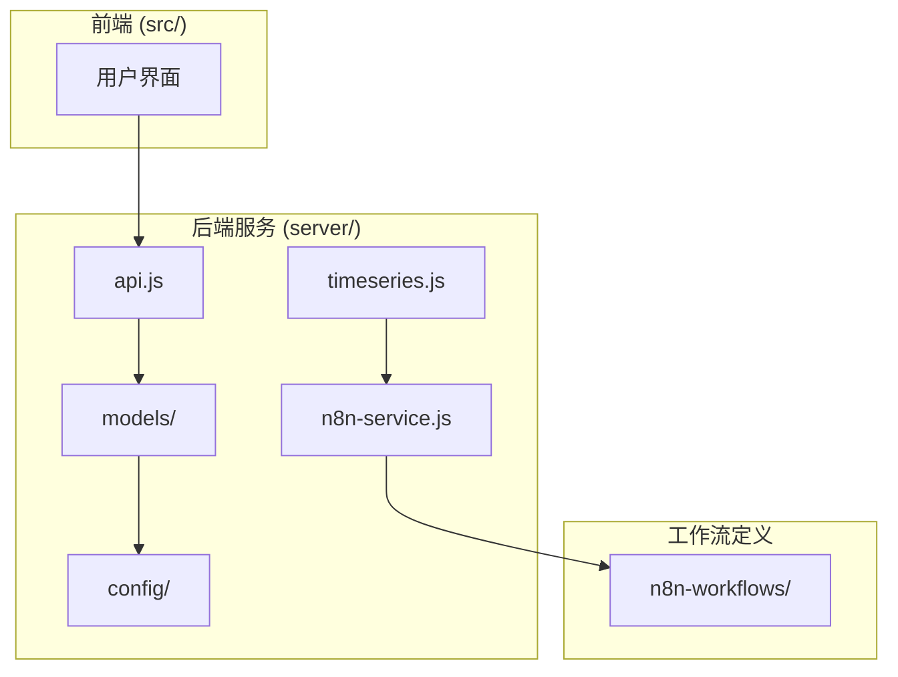
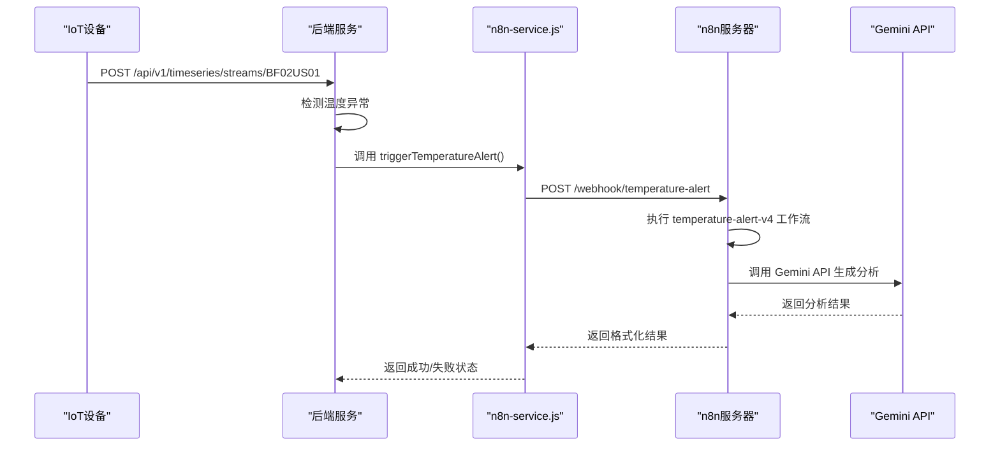
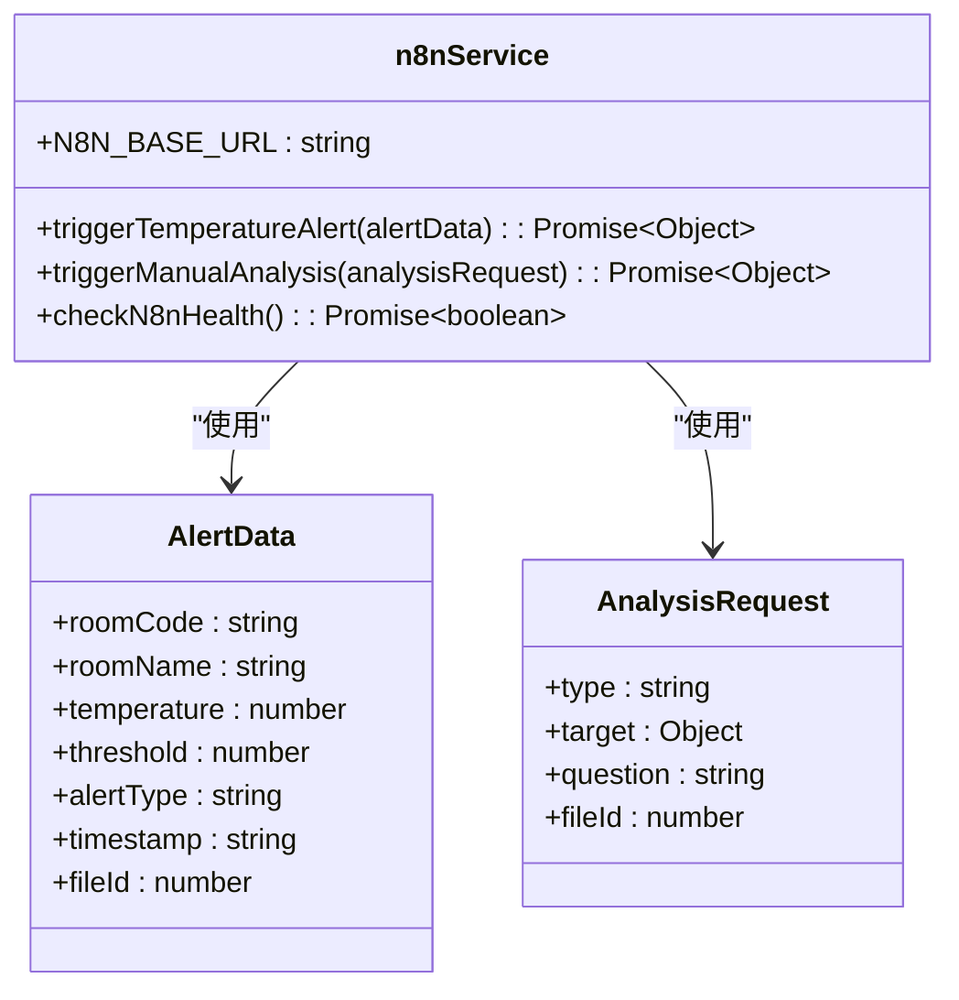
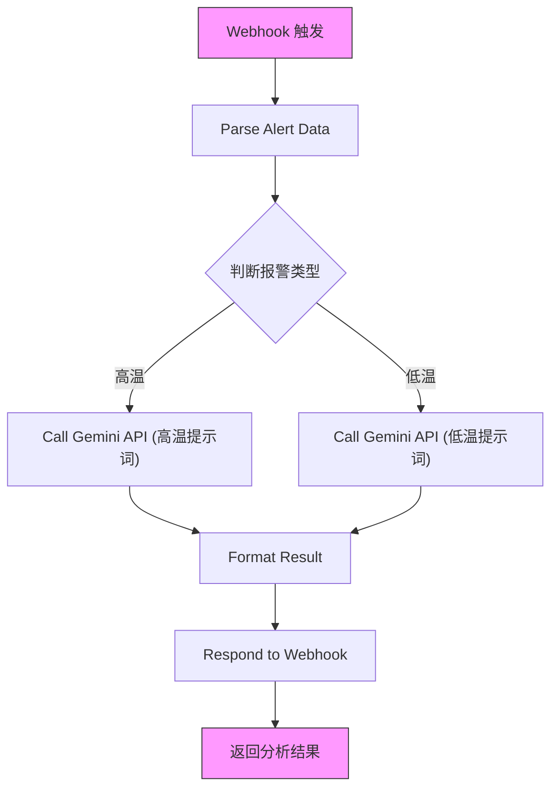
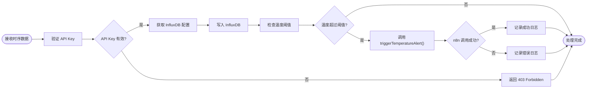
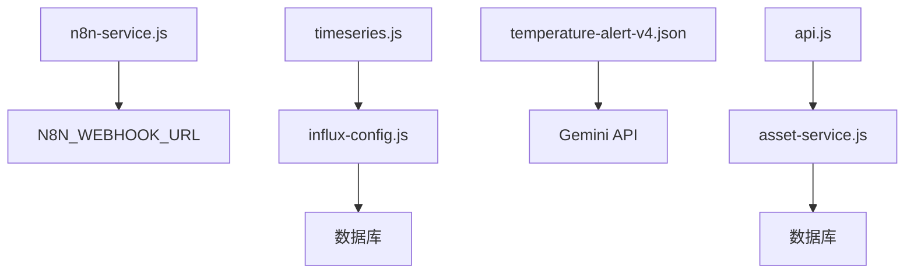

# n8n 工作流服务

<cite>
**本文档引用的文件**  
- [n8n-service.js](file://server/services/n8n-service.js)
- [temperature-alert-v4.json](file://n8n-workflows/temperature-alert-v4.json)
- [timeseries.js](file://server/routes/timeseries.js)
- [influx-config.js](file://server/models/influx-config.js)
- [api.js](file://server/routes/api.js)
- [asset-service.js](file://server/services/asset-service.js)
- [index.js](file://server/config/index.js)
- [mapping-config.js](file://server/models/mapping-config.js)
- [README.md](file://n8n-workflows/README.md)
</cite>

## 目录
1. [简介](#简介)
2. [项目结构](#项目结构)
3. [核心组件](#核心组件)
4. [架构概述](#架构概述)
5. [详细组件分析](#详细组件分析)
6. [依赖分析](#依赖分析)
7. [性能考虑](#性能考虑)
8. [故障排除指南](#故障排除指南)
9. [结论](#结论)

## 简介
本文档深入解析 TwinSight 平台中 n8n 工作流服务的集成机制。该系统通过事件驱动架构，将时序数据异常检测与自动化工作流执行紧密结合，实现了从温度告警触发到 AI 分析报告生成的端到端自动化流程。文档重点阐述了 `n8n-service.js` 如何通过 REST API 触发预定义的 `temperature-alert-v4.json` 工作流，以及 Webhook 回调处理、执行结果追踪、工作流参数动态注入和安全校验等关键机制。

## 项目结构
项目结构清晰地划分了前端、后端服务、工作流定义和配置文件。核心的 n8n 工作流服务逻辑位于 `server/services/n8n-service.js`，而工作流的定义文件（如 `temperature-alert-v4.json`）则集中存放在 `n8n-workflows/` 目录下。后端通过 `server/routes/timeseries.js` 接收和处理时序数据，并在检测到异常时调用 n8n 服务。

**Diagram sources**
- [n8n-service.js](file://server/services/n8n-service.js)
- [timeseries.js](file://server/routes/timeseries.js)
- [api.js](file://server/routes/api.js)

**Section sources**
- [n8n-service.js](file://server/services/n8n-service.js)
- [timeseries.js](file://server/routes/timeseries.js)
- [api.js](file://server/routes/api.js)

## 核心组件
核心组件包括 `n8n-service.js` 中的 `triggerTemperatureAlert` 函数，它负责将告警数据封装并发送到 n8n 的 Webhook 端点。`temperature-alert-v4.json` 定义了在 n8n 中执行的完整工作流，包括数据解析、调用 Gemini API 进行 AI 分析和结果格式化。`timeseries.js` 中的路由处理时序数据的接收和告警逻辑。

**Section sources**
- [n8n-service.js](file://server/services/n8n-service.js#L36-L81)
- [temperature-alert-v4.json](file://n8n-workflows/temperature-alert-v4.json)
- [timeseries.js](file://server/routes/timeseries.js#L267-L335)

## 架构概述
系统采用事件驱动架构。当 IoT 设备通过 `/api/v1/timeseries/streams/:spaceCode` 接口上报数据时，后端会进行处理。一旦检测到温度超过预设阈值，`timeseries.js` 中的逻辑将调用 `n8n-service.js` 的 `triggerTemperatureAlert` 函数。该函数向 n8n 服务器的特定 Webhook 发送一个包含告警详情的 HTTP POST 请求。n8n 接收到请求后，根据 `temperature-alert-v4.json` 的定义执行工作流，最终将 AI 生成的分析报告返回给后端。

**Diagram sources**
- [n8n-service.js](file://server/services/n8n-service.js#L36-L81)
- [temperature-alert-v4.json](file://n8n-workflows/temperature-alert-v4.json)
- [timeseries.js](file://server/routes/timeseries.js#L267-L335)

## 详细组件分析

### n8n 服务分析
`n8n-service.js` 是连接 TwinSight 后端与 n8n 自动化引擎的桥梁。它提供了触发不同工作流的接口。

#### 服务功能

**Diagram sources**
- [n8n-service.js](file://server/services/n8n-service.js)

**Section sources**
- [n8n-service.js](file://server/services/n8n-service.js)

### 温度告警工作流分析
`temperature-alert-v4.json` 定义了在 n8n 中执行的自动化流程，用于处理温度告警。

#### 工作流执行流程

**Diagram sources**
- [temperature-alert-v4.json](file://n8n-workflows/temperature-alert-v4.json)

**Section sources**
- [temperature-alert-v4.json](file://n8n-workflows/temperature-alert-v4.json)

### 时序数据与告警联动分析
`timeseries.js` 负责处理时序数据的接收和告警触发逻辑，是事件驱动架构的起点。

#### 数据处理与告警流程

**Diagram sources**
- [timeseries.js](file://server/routes/timeseries.js#L267-L335)
- [influx-config.js](file://server/models/influx-config.js#L18-L35)

**Section sources**
- [timeseries.js](file://server/routes/timeseries.js#L267-L335)

## 依赖分析
系统依赖关系清晰。后端服务 (`server/`) 依赖于数据库模型 (`models/`) 和配置 (`config/`)。`n8n-service.js` 依赖于环境变量中的 `N8N_WEBHOOK_URL` 来确定目标地址。`timeseries.js` 依赖于 `influx-config.js` 来获取 InfluxDB 的连接信息。n8n 工作流本身依赖于外部的 Gemini API 来提供 AI 能力。

**Diagram sources**
- [n8n-service.js](file://server/services/n8n-service.js#L7)
- [timeseries.js](file://server/routes/timeseries.js#L7)
- [influx-config.js](file://server/models/influx-config.js)
- [api.js](file://server/routes/api.js)
- [asset-service.js](file://server/services/asset-service.js)

**Section sources**
- [n8n-service.js](file://server/services/n8n-service.js)
- [timeseries.js](file://server/routes/timeseries.js)
- [influx-config.js](file://server/models/influx-config.js)

## 性能考虑
系统的性能关键在于 Webhook 调用的延迟和 InfluxDB 的写入性能。`n8n-service.js` 使用了 `fetch` 进行异步调用，避免了阻塞主请求。`timeseries.js` 在写入 InfluxDB 时对数据进行了批处理，提高了写入效率。建议对 n8n 服务器进行压力测试，确保其在高并发告警下的响应能力。

## 故障排除指南
当自动化流程失败时，应按以下步骤排查：
1.  **检查 n8n 服务健康状态**：调用 `checkN8nHealth()` 函数或直接访问 n8n 的 `/healthz` 端点。
2.  **查看后端日志**：检查 `n8n-service.js` 中的 `console.log` 输出，确认 Webhook 请求是否发出以及返回的 HTTP 状态码。
3.  **检查 n8n 工作流执行日志**：在 n8n 的 Web UI 中查看 `temperature-alert-v4` 工作流的执行历史，定位失败的节点。
4.  **验证环境变量**：确保 `N8N_WEBHOOK_URL` 和 `GEMINI_API_KEY` 等环境变量配置正确。
5.  **检查网络连接**：确认后端服务器能够访问 n8n 服务器和 Gemini API。

**Section sources**
- [n8n-service.js](file://server/services/n8n-service.js#L133-L142)
- [README.md](file://n8n-workflows/README.md)

## 结论
TwinSight 的 n8n 工作流服务成功地将时序数据监控与自动化 AI 分析相结合。通过 `n8n-service.js` 和 `temperature-alert-v4.json` 的协同工作，系统实现了从数据采集、异常检测到智能分析的无缝衔接。该架构具有良好的可扩展性，未来可以轻松添加新的工作流来处理不同类型的告警或执行其他自动化任务。